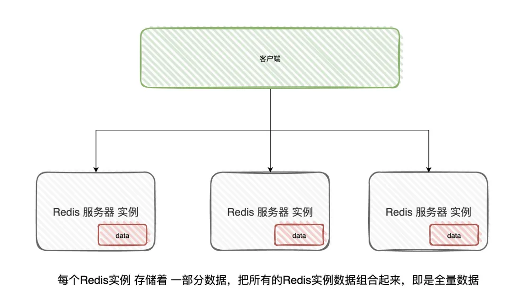
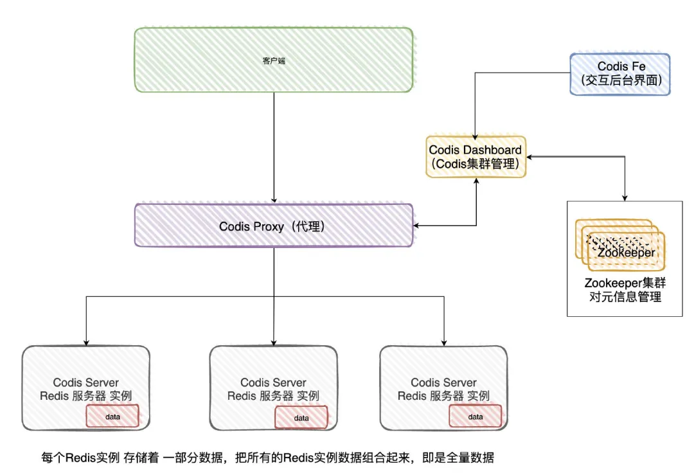

# Table of Contents

* [学习本文前提](#学习本文前提)
* [为什么要使用分片？](#为什么要使用分片)
* [哈希槽(Hash Slot)](#哈希槽hash-slot)
* [Hash tags](#hash-tags)
* [Cluster node](#cluster-node)
* [Cluster总线](#cluster总线)
* [集群拓扑](#集群拓扑)
* [节点握手](#节点握手)
* [请求重定向](#请求重定向)
  * [Mover重定向](#mover重定向)
  * [ASK重定向](#ask重定向)
* [相关问题](#相关问题)
  * [为什么Redis Cluster的Hash Slot 是16384？](#为什么redis-cluster的hash-slot-是16384)
  * [为什么Redis Cluster中不建议使用发布订阅呢？](#为什么redis-cluster中不建议使用发布订阅呢)
  * [节点扩容或收缩后，数据怎么处理](#节点扩容或收缩后数据怎么处理)
* [什么是Codis](#什么是codis)


# 学习本文前提

+ [了解一致性Hash算法](../../C.数据结构与算法/CAP/一致性Hash算法.md)


#  为什么要使用分片？

之前的两种模式数据都是在一个节点上的，单个节点存储是存在上限的。

集群模式就是把数据进行**分片存储**，当一个分片数据达到上限的时候，就分成多个分片。




客户端分片：Redis Cluster

服务端分片：codis


# 哈希槽(Hash Slot)


Redis-cluster没有使用一致性hash，而是引入了**哈希槽**的概念。Redis-cluster中有16384(即2的14次方）个哈希槽，每个key通过CRC16校验后对16383取模来决定放置哪个槽。Cluster中的每个节点负责一部分hash槽（hash slot）。

比如集群中存在三个节点，则可能存在的一种分配如下：

- 节点A包含0到5500号哈希槽；
- 节点B包含5501到11000号哈希槽；
- 节点C包含11001 到 16384号哈希槽。


> 为什么时2的14次方？


# Hash tags

分片，就是一个hash的过程：对key做md5，sha1等hash算法，根据hash值分配到不同的机器上。

为了实现将key分到相同机器，就需要相同的hash值，即相同的key（改变hash算法也行，但不简单）。

但key相同是不现实的，因为key都有不同的用途。例如user:user1:ids保存用户的tweets ID，user:user1:tweets保存tweet的具体内容，两个key不可能同名。

仔细观察user:user1:ids和user:user1:tweets，两个key其实有相同的地方，即user1。能不能拿这一部分去计算hash呢？

这就是 [Hash Tag](https://link.jianshu.com?t=https://github.com/twitter/twemproxy/blob/master/notes/recommendation.md#hash-tags) 。允许用key的部分字符串来计算hash。

**当一个key包含 {} 的时候，就不对整个key做hash，而仅对 {} 包括的字符串做hash。**

假设hash算法为sha1。对user:{user1}:ids和user:{user1}:tweets，其hash值都等同于sha1(user1)。


hash tag规则如下，如果满足如下规则，{和}之间的字符将用来计算HASH_SLOT，以保证这样的key保存在同一个slot中。

- key包含一个{字符
- 并且 如果在这个{的右面有一个}字符
- 并且 如果在{和}之间存在至少一个字符


# Cluster node


每个**节点在cluster中有一个唯一的名字**。这个名字由160bit随机十六进制数字表示，并在节点启动时第一次获得(通常通过/dev/urandom)。节点在配置文件中保留它的ID，并永远地使用这个ID，直到被管理员使用CLUSTER RESET HARD命令hard reset这个节点。

节点ID被用来在整个cluster中标识每个节点。一个节点可以修改自己的IP地址而不需要修改自己的ID。Cluster可以检测到IP /port的改动并通过运行在cluster bus上的gossip协议重新配置该节点。

节点ID不是唯一与节点绑定的信息，但是他是唯一的一个总是保持全局一致的字段。每个节点都拥有一系列相关的信息。一些信息时关于本节点在集群中配置细节，并最终在cluster内部保持一致的。而其他信息，比如节点最后被ping的时间，是节点的本地信息。

每个节点维护着集群内其他节点的以下信息：`node id`, `节点的IP和port`，`节点标签`，`master node id`（如果这是一个slave节点），`最后被挂起的ping的发送时间`(如果没有挂起的ping则为0)，`最后一次收到pong的时间`，`当前的节点configuration epoch` ，`链接状态`，以及最后是该节点服务的`hash slots`。

对节点字段更详细的描述，可以参考对命令 CLUSTER NODES的描述。

CLUSTER NODES命令可以被发送到集群内的任意节点，他会提供基于该节点视角(view)下的集群状态以及每个节点的信息。

下面是一个发送到一个拥有3个节点的小集群的master节点的CLUSTER NODES输出的例子。

```java\
$ redis-cli cluster nodes

d1861060fe6a534d42d8a19aeb36600e18785e04 127.0.0.1:6379 myself - 0 1318428930 1 connected 0-1364
3886e65cc906bfd9b1f7e7bde468726a052d1dae 127.0.0.1:6380 master - 1318428930 1318428931 2 connected 1365-2729
d289c575dcbc4bdd2931585fd4339089e461a27d 127.0.0.1:6381 master - 1318428931 1318428931 3 connected 2730-4095

```


# Cluster总线


每个Redis Cluster节点有一个额外的TCP端口用来接受其他节点的连接。

这个端口与用来接收client命令的普通TCP端口有一个固定的offset。**该端口等于普通命令端口加上10000**.例如，一个Redis街道口在端口6379坚挺客户端连接，那么它的集群总线端口16379也会被打开。

**节点到节点的通讯只使用集群总线**，同时使用集群总线协议：有不同的类型和大小的帧组成的二进制协议


# 集群拓扑

**Redis Cluster是一张全网拓扑，节点与其他每个节点之间都保持着TCP连接。**

 在一个拥有N个节点的集群中，每个节点由N-1个TCP传出连接，和N-1个TCP传入连接。

 这些TCP连接总是保持活性(be kept alive)。当一个节点在集群总线上发送了ping请求并期待对方回复pong，（如果没有得到回复）在等待足够成时间以便将对方标记为不可达之前，它将先尝试重新连接对方以刷新与对方的连接。 而在全网拓扑中的Redis Cluster节点，节点使用gossip协议和配置更新机制来避免在正常情况下节点之间交换过多的消息，因此集群内交换的消息数目(相对节点数目)不是指数级的。


# 节点握手


节点总是接受集群总线端口的链接，并且总是会回复ping请求，即使ping来自一个不可信节点。

然而，如果发送节点被认为不是当前集群的一部分，所有其他包将被抛弃。

节点认定其他节点是当前集群的一部分有两种方式：

1. 如果一个节点出现在了一条MEET消息中。一条meet消息非常像一个PING消息，但是它会强制接收者接受一个节点作为集群的一部分。节点只有在接收到系统管理员的如下命令后，才会向其他节点发送MEET消息：

```bash
CLUSTER MEET ip port
```

1. 如果一个被信任的节点gossip了某个节点，那么接收到gossip消息的节点也会那个节点标记为集群的一部分。也就是说，如果在集群中，A知道B，而B知道C，最终B会发送gossip消息到A，告诉A节点C是集群的一部分。这时，A会把C注册未网络的一部分，并尝试与C建立连接。

这意味着，一旦我们把某个节点加入了连接图(connected graph)，它们最终会自动形成一张全连接图(fully connected graph)。这意味着只要系统管理员强制加入了一条信任关系（在某个节点上通过meet命令加入了一个新节点），集群可以自动发现其他节点。


# 请求重定向


> Redis cluster采用去中心化的架构，集群的主节点各自负责一部分槽，客户端如何确定key到底会映射到哪个节点上呢？这就是我们要讲的请求重定向。

在cluster模式下，**节点对请求的处理过程**如下：

- 检查当前key是否存在当前NODE？
  - 通过crc16（key）/16384计算出slot
  - 查询负责该slot负责的节点，得到节点指针
  - 该指针与自身节点比较
- 若slot不是由自身负责，则返回MOVED重定向
- 若slot由自身负责，且key在slot中，则返回该key对应结果
- 若key不存在此slot中，检查该slot是否正在迁出（MIGRATING）？
- 若key正在迁出，返回ASK错误重定向客户端到迁移的目的服务器上
- 若Slot未迁出，检查Slot是否导入中？
- 若Slot导入中且有ASKING标记，则直接操作
- 否则返回MOVED重定向

这个过程中有两点需要具体理解下： **MOVED重定向** 和 **ASK重定向**。


## Mover重定向


- 槽命中：直接返回结果
- 槽不命中：即当前键命令所请求的键不在当前请求的节点中，则当前节点会向客户端发送一个Moved 重定向，客户端根据Moved 重定向所包含的内容找到目标节点，再一次发送命令。

从下面可以看出 php 的槽位9244不在当前节点中，所以会重定向到节点 192.168.2.23:7001中。redis-cli会帮你自动重定向（如果没有集群方式启动，即没加参数 -c，redis-cli不会自动重定向），并且编写程序时，寻找目标节点的逻辑需要交予程序员手动完成。


> move适用于数据已经完全迁移过去了


## ASK重定向 


Ask重定向发生**于集群伸缩时**，集群伸缩会**导致槽迁移**，当我们去源节点访问时，此时数据已经可能已经迁移到了目标节点，使用Ask重定向来解决此种情况。


> ASk使用数据还未完全迁移，正在迁移中


# 相关问题

> 通过几个例子，再深入理解Redis Cluster

## 为什么Redis Cluster的Hash Slot 是16384？

我们知道一致性hash算法是2的16次方，为什么hash slot是2的14次方呢？作者[原始回答  (opens new window)](https://github.com/redis/redis/issues/2576)

在redis节点发送心跳包时需要把所有的槽放到这个心跳包里，以便让节点知道当前集群信息，16384=16k，在发送心跳包时使用char进行bitmap压缩后是2k（2 * 8 (8 bit) * 1024(1k) = 16K），也就是说使用2k的空间创建了16k的槽数。

虽然使用CRC16算法最多可以分配65535（2^16-1）个槽位，65535=65k，压缩后就是8k（8 * 8 (8 bit) * 1024(1k) =65K），也就是说需要需要8k的心跳包，作者认为这样做不太值得；并且一般情况下一个redis集群不会有超过1000个master节点，所以16k的槽位是个比较合适的选择。

## 为什么Redis Cluster中不建议使用发布订阅呢？

在集群模式下，所有的publish命令都会向所有节点（包括从节点）进行广播，造成每条publish数据都会在集群内所有节点传播一次，加重了带宽负担，对于在有大量节点的集群中频繁使用pub，会严重消耗带宽，不建议使用。（虽然官网上讲有时候可以使用Bloom过滤器或其他算法进行优化的）


## 节点扩容或收缩后，数据怎么处理

会将发生变换的信息传播至集群，然后通过move和ask去解决。


# 什么是Codis

Redis Cluster是直接连Redis实例的，Codis是客户端连接Proxy,然后在进行分发。


