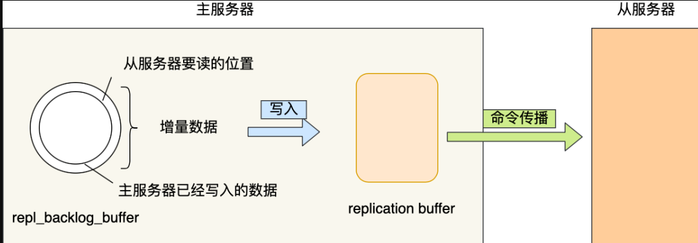

# Table of Contents

* [为什么要有哨兵机制（Redis Sentinel）](#为什么要有哨兵机制redis-sentinel)
* [哨兵机制是如何工作的？](#哨兵机制是如何工作的)
* [哨兵监控Redis库](#哨兵监控redis库)
* [主库下线的判定](#主库下线的判定)
* [如何选新主节点？](#如何选新主节点)
    * [第一轮考察：优先级最高的从节点胜出](#第一轮考察优先级最高的从节点胜出)
    * [第二轮考察：复制进度最靠前的从节点胜出](#第二轮考察复制进度最靠前的从节点胜出)
    * [第三轮考察：ID 号小的从节点胜出](#第三轮考察id-号小的从节点胜出)
* [哨兵集群的选举](#哨兵集群的选举)
* [故障的转移](#故障的转移)
* [通知客户端新主节点的信息](#通知客户端新主节点的信息)
* [哨兵集群的组建(发布-订阅)](#哨兵集群的组建发布-订阅)
* [考点](#考点)
* [问题](#问题)

主从复制的基础上，如果注节点出现故障该怎么办呢？ 

在 Redis 主从集群中，哨兵机制是实现主从库自动切换的关键机制，它有效地解决了**主从复制模式下故障转移的问题**

# 为什么要有哨兵机制（Redis Sentinel）

Redis Sentinel，即Redis哨兵，在Redis 2.8版本开始引入。哨兵的核心功能是**主节点的自动故障转移。**

下图是一个典型的哨兵集群监控的逻辑图：

- **监控（Monitoring）**：哨兵会不断地检查主节点和从节点是否运作正常。
- **自动故障转移（Automatic failover）**：当主节点不能正常工作时，哨兵会开始自动故障转移操作，它会将失效主节点的其中一个从节点升级为新的主节点，并让其他从节点改为复制新的主节点。
- **配置提供者（Configuration provider）**：客户端在初始化时，通过连接哨兵来获得当前Redis服务的主节点地址。
- **通知（Notification）**：哨兵可以将故障转移的结果发送给客户端。

其中，监控和自动故障转移功能，使得哨兵可以及时发现主节点故障并完成转移；而配置提供者和通知功能，则需要在与客户端的交互中才能体现。

# 哨兵机制是如何工作的？

哨兵其实是一个运行在特殊模式下的 Redis 进程，所以它也是一个节点。从“哨兵”这个名字也可以看得出来，它相当于是“观察者节点”，观察的对象是主从节点。

当然，它不仅仅是观察那么简单，在它观察到有异常的状况下，会做出一些“动作”，来修复异常状态。

哨兵节点主要负责三件事情：**监控、选主、通知**。

所以，我们重点要学习这三件事情：

- 哨兵节点是如何监控节点的？又是如何判断主节点是否真的故障了？
- 根据什么规则选择一个从节点切换为主节点？
- 怎么把新主节点的相关信息通知给从节点和客户端呢？

#  哨兵监控Redis库

>哨兵监控什么呢？怎么监控呢？

是由**哨兵向主库发送 INFO 命令来完成的**。就像下图所示，哨兵 2 给主库发送 INFO 命令，主库接受到这个命令后，就会把从库列表返回给哨兵。接着，哨兵就可以根据从库列表中的连接信息，和每个从库建立连接，并在这个连接上持续地对从库进行监控。哨兵 1 和 3 可以通过相同的方法和从库建立连接。

# 主库下线的判定

首先要理解两个概念：**主观下线**和**客观下线**

- **主观下线**：**任何一个哨兵都**是可以监控探测，并作出Redis节点下线的判断；

  > 如果主节点或者从节点没有在规定的时间内响应哨兵的 PING 命令，哨兵就会将它们标记为「**主观下线**」。这个「规定的时间」是配置项  `down-after-milliseconds` 参数设定的，单位是毫秒。

- **客观下线**：**有哨兵集群共同决定**Redis节点是否下线；

  > 所以，为了减少误判的情况，哨兵在部署的时候不会只部署一个节点，而是用多个节点部署成**哨兵集群**（*最少需要三台机器来部署哨兵集群*），**通过多个哨兵节点一起判断，就可以就可以避免单个哨兵因为自身网络状况不好，而误判主节点下线的情况**。同时，多个哨兵的网络同时不稳定的概率较小，由它们一起做决策，误判率也能降低。

+ 具体是怎么判定主节点为「客观下线」的呢？

  

当某个哨兵（如下图中的哨兵2）判断主库“主观下线”后，就会给其他哨兵发送 `is-master-down-by-addr` 命令。接着，其他哨兵会根据自己和主库的连接情况，做出 Y 或 N 的响应，Y 相当于赞成票，N 相当于反对票。

如果赞成票数（这里是2）是大于等于哨兵配置文件中的 `quorum` 配置项（比如这里如果是quorum=2）, 则可以判定**主库客观下线**了。

当这个哨兵的赞同票数达到哨兵配置文件中的 quorum 配置项设定的值后，这时主节点就会被该哨兵标记为「客观下线」。

例如，现在有 3 个哨兵，quorum 配置的是 2，那么一个哨兵需要 2 张赞成票，就可以标记主节点为“客观下线”了。这 2 张赞成票包括哨兵自己的一张赞成票和另外两个哨兵的赞成票。

PS：quorum 的值一般设置为哨兵个数的二分之一加1，例如 3 个哨兵就设置 2。

哨兵判断完主节点客观下线后，哨兵就要开始在多个「从节点」中，选出一个从节点来做新主节点

# 如何选新主节点？

> 主库既然判定客观下线了，那么如何从剩余的从库中选择一个新的主库呢？

那么多「从节点」，到底选择哪个从节点作为新主节点的？

随机的方式好吗？随机的方式，实现起来很简单，但是如果选到一个网络状态不好的从节点作为新主节点，那么可能在将来不久又要做一次主从故障迁移。

所以，我们首先要把网络状态不好的从节点给过滤掉。首先把已经下线的从节点过滤掉，然后把以往网络连接状态不好的从节点也给过滤掉。

怎么判断从节点之前的网络连接状态不好呢？

Redis 有个叫 down-after-milliseconds * 10 配置项，其down-after-milliseconds 是主从节点断连的最大连接超时时间。如果在 down-after-milliseconds 毫秒内，主从节点都没有通过网络联系上，我们就可以认为主从节点断连了。如果发生断连的次数超过了 10 次，就说明这个从节点的网络状况不好，不适合作为新主节点。

至此，我们就把网络状态不好的从节点过滤掉了，接下来要对所有从节点进行三轮考察：**优先级、复制进度、ID 号**。在进行每一轮考察的时候，哪个从节点优先胜出，就选择其作为新主节点。

- 第一轮考察：哨兵首先会根据从节点的优先级来进行排序，优先级越小排名越靠前，
- 第二轮考察：如果优先级相同，则查看复制的下标，哪个从「主节点」接收的复制数据多，哪个就靠前。
- 第三轮考察：如果优先级和下标都相同，就选择从节点 ID 较小的那个。

### 第一轮考察：优先级最高的从节点胜出

Redis 有个叫 slave-priority 配置项，可以给从节点设置优先级。

每一台从节点的服务器配置不一定是相同的，我们可以根据服务器性能配置来设置从节点的优先级。

比如，如果 「 A 从节点」的物理内存是所有从节点中最大的， 那么我们可以把「 A 从节点」的优先级设置成最高。这样当哨兵进行第一轮考虑的时候，优先级最高的 A 从节点就会优先胜出，于是就会成为新主节点。

### 第二轮考察：复制进度最靠前的从节点胜出

如果在第一轮考察中，发现优先级最高的从节点有两个，那么就会进行第二轮考察，比较两个从节点哪个复制进度。

什么是复制进度？主从架构中，主节点会将写操作同步给从节点，在这个过程中，主节点会用 master_repl_offset 记录当前的最新写操作在 repl_backlog_buffer 中的位置，而从节点会用 slave_repl_offset 这个值记录当前的复制进度。

如果某个从节点的 slave_repl_offset 最接近 master_repl_offset，说明它的复制进度是最靠前的，于是就可以将它选为新主节点。

### 第三轮考察：ID 号小的从节点胜出

如果在第二轮考察中，发现有两个从节点优先级和复制进度都是一样的，那么就会进行第三轮考察，比较两个从节点的 ID 号，ID 号小的从节点胜出。

什么是 ID 号？每个从节点都有一个编号，这个编号就是 ID 号，是用来唯一标识从节点的。

到这里，选主的事情终于结束了。简单给大家总结下：

- 过滤掉已经离线的从节点；
- 过滤掉历史网络连接状态不好的从节点；
- 将剩下的从节点，进行三轮考察：优先级、复制进度、ID 号。在每一轮考察过程中，如果找到了一个胜出的从节点，就将其作为新主节点。

# 哨兵集群的选举

>判断完主库下线后，由哪个哨兵节点来执行主从切换呢？这里就需要哨兵集群的选举机制了。

- **为什么必然会出现选举/共识机制**？

为了避免哨兵的单点情况发生，所以需要一个哨兵的分布式集群。作为分布式集群，必然涉及共识问题（即选举问题）；同时故障的转移和通知都只需要一个主的哨兵节点就可以了。

- **哨兵的选举机制是什么样的**？

哨兵的选举机制其实很简单，就是一个Raft选举算法： **选举的票数大于等于num(sentinels)/2+1时，将成为领导者，如果没有超过，继续选举**

Raft算法你可以参看这篇文章[分布式算法 - Raft算法]()

- 任何一个想成为 Leader 的哨兵，要满足两个条件：
  - 第一，拿到半数以上的赞成票；
  - 第二，拿到的票数同时还需要大于等于哨兵配置文件中的 quorum 值。

以 3 个哨兵为例，假设此时的 quorum 设置为 2，那么，任何一个想成为 Leader 的哨兵只要拿到 2 张赞成票，就可以了。

这是一个考点

> 更进一步理解
> 这里很多人会搞混 **判定客观下线** 和 **是否能够主从切换（用到选举机制）** 两个概念，我们再看一个例子。
> 
Redis 1主4从，5个哨兵，哨兵配置quorum为2，如果3个哨兵故障，当主库宕机时，哨兵能否判断主库“客观下线”？能否自动切换？

1、哨兵集群可以判定主库“主观下线”。由于quorum=2，所以当一个哨兵判断主库“主观下线”后，询问另外一个哨兵后也会得到同样的结果，2个哨兵都判定“主观下线”，达到了quorum的值，因此，**哨兵集群可以判定主库为“客观下线”**。

2、**但哨兵不能完成主从切换**。哨兵标记主库“客观下线后”，在选举“哨兵领导者”时，一个哨兵必须拿到超过多数的选票(5/2+1=3票)。但目前只有2个哨兵活着，无论怎么投票，一个哨兵最多只能拿到2票，永远无法达到`N/2+1`选票的结果。

# 故障的转移

>新的主库选择出来后，就可以开始进行故障的转移了。

+ 将slave-1脱离原从节点（PS: 5.0 中应该是`replicaof no one`)，升级主节点，

+ 将从节点slave-2指向新的主节点

+ 通知客户端主节点已更换

+ 将原主节点（oldMaster）变成从节点，指向新的主节点

# 通知客户端新主节点的信息

经过前面一系列的操作后，哨兵集群终于完成了主从故障迁移，那么新主节点的信息要如何通知给客户端呢？

这主要**通过 Redis 的发布者/订阅者机制来实现**的。每个哨兵节点提供发布者/订阅者机制，客户端可以从哨兵订阅消息。

比如，客户端订阅了主从切换的事件，当哨兵把新主节点选择出来后，就会发布新主节点的 IP 地址和端口信息，这个时候客户端就可以收到这条信息，然后用这里面的新主节点的 IP 地址和端口进行通信了。

#  哨兵集群的组建(发布-订阅)

哨兵实例之间可以相互发现，要归功于 Redis 提供的 pub/sub 机制，也就是发布 / 订阅机制。(publish/subscrption)

[发布订阅](./Redis发布订阅模式详解.md)

> 大家想想为什么要用哨兵集群，而不是单个哨兵节点？

在主从集群中，主库上有一个名为`__sentinel__:hello`的频道，不同哨兵就是通过它来相互发现，实现互相通信的。

在下图中，哨兵 1 把自己的 IP（172.16.19.3）和端口（26579）发布到`__sentinel__:hello`频道上，哨兵 2 和 3 订阅了该频道。

那么此时，哨兵 2 和 3 就可以从这个频道直接获取哨兵 1 的 IP 地址和端口号。然后，哨兵 2、3 可以和哨兵 1 建立网络连接。

# 考点

1.哨兵集群的主库下线和哨兵集群的选举

# 问题
1. 哨兵集群替换新Master时，由于主从同步的延迟性，导致的数据缺失怎么处理？
