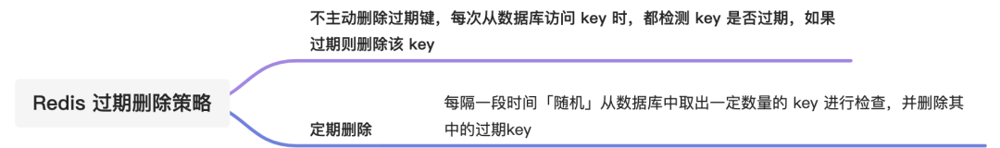
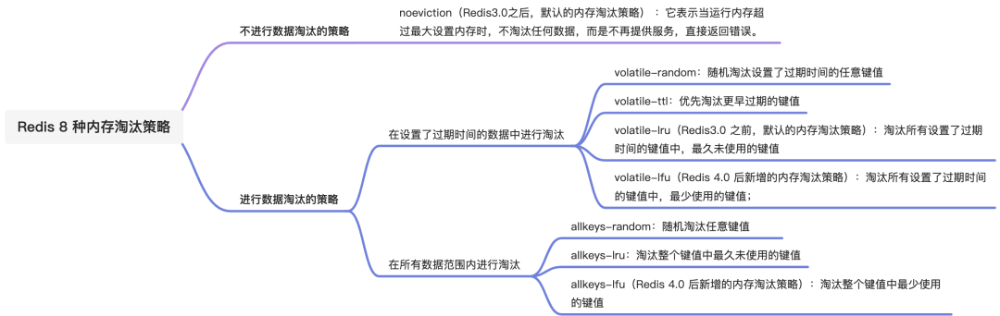

# Table of Contents

* [**过期删除策略**](#过期删除策略)
  * [**如何判定 key 已过期了？**](#如何判定-key-已过期了)
  * [**过期删除策略有哪些？**](#过期删除策略有哪些)
  * [**Redis 过期删除策略是什么？**](#redis-过期删除策略是什么)
  * [**Redis懒惰删除key的原因**](#redis懒惰删除key的原因)
  * [**从库过期策略**](#从库过期策略)
  * [**拓展问题**](#拓展问题)
* [**内存淘汰策略**](#内存淘汰策略)
  * [**如何设置 Redis 最大运行内存？**](#如何设置-redis-最大运行内存)
  * [**Redis 内存淘汰策略有哪些？**](#redis-内存淘汰策略有哪些)
  * [**LRU 算法和 LFU 算法有什么区别？**](#lru-算法和-lfu-算法有什么区别)
* [总结](#总结)
* [参考资料](#参考资料)


Redis 的「内存淘汰策略」和「过期删除策略」，很多小伙伴容易混淆，这两个机制虽然都是做删除的操作，但是触发的条件和使用的策略都是不同的。

今天就跟大家理一理，「内存淘汰策略」和「过期删除策略」。


# **过期删除策略**

Redis 是可以对 key 设置过期时间的，因此需要有相应的机制将已过期的键值对删除，而做这个工作的就是过期键值删除策略。

## **如何判定 key 已过期了？**

每当我们对一个 key 设置了过期时间时，Redis  会把该 key 带上过期时间存储到一个**过期字典**（expires dict）中，也就是说「过期字典」保存了数据库中所有 

key 的过期时间。

字典实际上是**哈希表**，哈希表的最大好处就是让我们可以用 O(1) 的时间复杂度来快速查找。当我们查询一个 key 时，Redis 首先检查该 key 是否存在于过期字典中：

- 如果不在，则正常读取键值；
- 如果存在，则会获取该 key 的过期时间，然后与当前系统时间进行比对，如果比系统时间大，那就没有过期，否则判定该 key 已过期。

## **过期删除策略有哪些？**

在说 Redis 过期删除策略之前，先跟大家介绍下，常见的三种过期删除策略：

- 定时删除；

  > 定时删除策略的做法是，**在设置 key 的过期时间时，同时创建一个定时事件，当时间到达时，由事件处理器自动执行 key 的删除操作。**
  >
  > 定时删除策略的**优点**：
  >
  > - 可以保证过期 key 会被尽快删除，也就是内存可以被尽快地释放。因此，定时删除对内存是最友好的。
  >
  > 定时删除策略的**缺点**：
  >
  > - 在过期 key 比较多的情况下，删除过期 key 可能会占用相当一部分 CPU 时间，在内存不紧张但 CPU 时间紧张的情况下，将 CPU 时间用于删除和当前任务无关的过期键上，无疑会对服务器的响应时间和吞吐量造成影响。所以，定时删除策略对 CPU 不友好。

- 惰性删除；

  > 惰性删除策略的做法是，**不主动删除过期键，每次从数据库访问 key 时，都检测 key 是否过期，如果过期则删除该 key。**
  >
  > 惰性删除策略的**优点**：
  >
  > - 因为每次访问时，才会检查 key 是否过期，所以此策略只会使用很少的系统资源，因此，惰性删除策略对 CPU 时间最友好。
  >
  > 惰性删除策略的**缺点**：
  >
  > - 如果一个 key 已经过期，而这个 key 又仍然保留在数据库中，那么只要这个过期 key 一直没有被访问，它所占用的内存就不会释放，造成了一定的内存空间浪费。所以，惰性删除策略对内存不友好。

- 定期删除；

  > 定期删除策略的做法是，**每隔一段时间「随机」从数据库中取出一定数量的 key 进行检查，并删除其中的过期key。**
  >
  > 定期删除策略的**优点**：
  >
  > - 通过限制删除操作执行的时长和频率，来减少删除操作对 CPU 的影响，同时也能删除一部分过期的数据减少了过期键对空间的无效占用。
  >
  > 定期删除策略的**缺点**：
  >
  > - 内存清理方面没有定时删除效果好，同时没有惰性删除使用的系统资源少。
  > - 难以确定删除操作执行的时长和频率。如果执行的太频繁，定期删除策略变得和定时删除策略一样，对CPU不友好；如果执行的太少，那又和惰性删除一样了，过期 key 占用的内存不会及时得到释放。

## **Redis 过期删除策略是什么？**

前面介绍了三种过期删除策略，每一种都有优缺点，仅使用某一个策略都不能满足实际需求。

所以， **Redis 选择「惰性删除+定期删除」这两种策略配和使用**，以求在合理使用 CPU 时间和避免内存浪费之间取得平衡。


**Redis不是单线程的**

Redis内部实际上不只有一个主线程，还有几个异步线程专门用来处理耗时操作

## **Redis懒惰删除key的原因**

1、普通的del指令会直接释放对象内存且非常迅速，但是如果删除的是一个非常大的对象，就会导致单线程卡顿

2、Redis4.0之后引入了unlink指令，能对删除操作进行懒处理，先断开该key，然后丢给后台线程来异步回收内存；当unlink指令发出时，相当于把大树中的一个树枝别断了，然后扔到旁边的火堆里焚烧（异步线程池）；树枝离开大树的一瞬间就再也无法被主线程中的指令访问到了，因为主线程只会沿着这颗大树来访问


> 注意！不管是过期策略还是内存淘汰策略，总是会有Key无法被删除，所以要避免使用 big key。

> 为什么不维护队列？

1. 内存占用问题
2. LRU链表删除会带来内存开销


## **从库过期策略**

1、从库不会主动进行过期扫描，从库对过期的处理是被动的；主库在key到期时会在AOF文件里增加一条del指令同步到所有的从库，从库通过执行这条del指令来删除过期的key

2、指令同步是异步进行的，**所以主库过期的key的del指令没有及时同步到从库的话会导致主从不一致的情况**。


从库可能造成的问题

+ 拉取过期数据

  + ​	跟 Redis 的版本有关系，Redis 3.2 之前版本，读从库并不会判断数据是否过期，所以有可能返回过期数据

  + 跟过期时间的设置方式有关系，我们一般采用 `EXPIRE 和 PEXPIRE`，表示从执行命令那个时刻开始，往后延长 ttl 时间。严重依赖于 `开始时间` 从什么时候算起。

    > 可以采用Redis的另外两个命令，`EXPIREAT 和 PEXPIREAT`，相对简单，表示过期时间为一个具体的时间点。避免了对`开始时间`从什么时候算起的依赖。

+ 数据一致性问题

  + 网络延迟

  + 从库已经收到主库的命令，由于是单线程执行，前面正在处理一些耗时的命令（如：pipeline批处理），无法及时同步执行。

    > 1、主从服务器尽量部署在同一个机房，并保持服务器间的网络良好通畅
    >
    > 2、监控主从库间的同步进度,超过设定的值，直接读主库，然后在同步从库

  ​	


## **拓展问题**

“过期key扫描不是有 25ms 的时间上限了么，怎么会导致卡顿呢”？这里打个比方，假如有 101 个客户端同时将请求发过来了，然后前 100 个请求的执行时间都是 25ms，那么第 101 个指令需要等待多久才能执行？2500ms，这个就是客户端的卡顿时间，是由服务器不间断的小卡顿积少成多导致的。

所以如果有大批key过期，需要给过期时间设置一个随机范围，而不要在同一时间过期


# **内存淘汰策略**

## **如何设置 Redis 最大运行内存？**

在配置文件 redis.conf 中，可以通过参数 `maxmemory <bytes>` 来设定最大运行内存，只有在 Redis 的运行内存达到了我们设置的最大运行内存，才会触发内存淘汰策略。

不同位数的操作系统，maxmemory 的默认值是不同的：

- 在 64 位操作系统中，maxmemory 的默认值是 0，表示没有内存大小限制，那么不管用户存放多少数据到 Redis 中，Redis 也不会对可用内存进行检查，直到 Redis 实例因内存不足而崩溃也无作为。
- 在 32 位操作系统中，maxmemory 的默认值是 3G，因为 32 位的机器最大只支持 4GB 的内存，而系统本身就需要一定的内存资源来支持运行，所以 32 位操作系统限制最大 3 GB 的可用内存是非常合理的，这样可以避免因为内存不足而导致 Redis 实例崩溃。

## **Redis 内存淘汰策略有哪些？**

Redis 内存淘汰策略共有八种，这八种策略大体分为「不进行数据淘汰」和「进行数据淘汰」两类策略。

*1、不进行数据淘汰的策略*

**noeviction**（Redis3.0之后，默认的内存淘汰策略） ：它表示当运行内存超过最大设置内存时，不淘汰任何数据，而是不再提供服务，直接返回错误。

*2、进行数据淘汰的策略*

针对「进行数据淘汰」这一类策略，又可以细分为「在设置了过期时间的数据中进行淘汰」和「在所有数据范围内进行淘汰」这两类策略。

在设置了过期时间的数据中进行淘汰：

- **volatile-random**：随机淘汰设置了过期时间的任意键值；
- **volatile-ttl**：优先淘汰更早过期的键值。
- **volatile-lru**（Redis3.0 之前，默认的内存淘汰策略）：淘汰所有设置了过期时间的键值中，最久未使用的键值；
- **volatile-lfu**（Redis 4.0 后新增的内存淘汰策略）：淘汰所有设置了过期时间的键值中，最少使用的键值；

在所有数据范围内进行淘汰：

- **allkeys-random**：随机淘汰任意键值;
- **allkeys-lru**：淘汰整个键值中最久未使用的键值；
- **allkeys-lfu**（Redis 4.0 后新增的内存淘汰策略）：淘汰整个键值中最少使用的键值。

> 如何查看当前 Redis 使用的内存淘汰策略？

可以使用 `config get maxmemory-policy` 命令，来查看当前 Redis 的内存淘汰策略，命令如下：

```
127.0.0.1:6379> config get maxmemory-policy
1) "maxmemory-policy"
2) "noeviction"
```

可以看出，当前 Redis 使用的是 `noeviction` 类型的内存淘汰策略，它是 Redis 3.0 之后默认使用的内存淘汰策略，表示当运行内存超过最大设置内存时，不淘汰任何数据，但新增操作会报错。

> 如何修改 Redis 内存淘汰策略？

设置内存淘汰策略有两种方法：

- 方式一：通过“`config set maxmemory-policy <策略>`”命令设置。它的优点是设置之后立即生效，不需要重启 Redis 服务，缺点是重启 Redis 之后，设置就会失效。
- 方式二：通过修改 Redis 配置文件修改，设置“`maxmemory-policy <策略>`”，它的优点是重启 Redis 服务后配置不会丢失，缺点是必须重启 Redis 服务，设置才能生效。

## **LRU 算法和 LFU 算法有什么区别？**

LFU 内存淘汰算法是 Redis  4.0 之后新增内存淘汰策略，那为什么要新增这个算法？那肯定是为了解决 LRU 算法的问题。

接下来，就看看这两个算法有什么区别？Redis 又是如何实现这两个算法的？

> 什么是 LRU 算法？

**LRU** 全称是 Least Recently Used 翻译为**最近最少使用**，会选择淘汰最近最少使用的数据。

传统 LRU 算法的实现是基于「链表」结构，链表中的元素按照操作顺序从前往后排列，最新操作的键会被移动到表头，当需要内存淘汰时，只需要删除链表尾部的元素即可，因为链表尾部的元素就代表最久未被使用的元素。

Redis 并没有使用这样的方式实现 LRU 算法，因为传统的 LRU 算法存在两个问题：

- 需要用链表管理所有的缓存数据，这会带来额外的空间开销；
- 当有数据被访问时，需要在链表上把该数据移动到头端，如果有大量数据被访问，就会带来很多链表移动操作，会很耗时，进而会降低 Redis 缓存性能。

> Redis 是如何实现 LRU 算法的？

Redis 实现的是一种**近似 LRU 算法**，目的是为了更好的节约内存，它的**实现方式是在 Redis 的对象结构体中添加一个额外的字段，用于记录此数据的最后一次访问时间**。

当 Redis 进行内存淘汰时，会使用**随机采样的方式来淘汰数据**，它是随机取 5 个值（此值可配置），然后**淘汰最久没有使用的那个**。

Redis 实现的 LRU 算法的优点：

- 不用为所有的数据维护一个大链表，节省了空间占用；
- 不用在每次数据访问时都移动链表项，提升了缓存的性能；

但是 LRU 算法有一个问题，**无法解决缓存污染问题**，比如应用一次读取了大量的数据，而这些数据只会被读取这一次，那么这些数据会留存在 Redis 缓存中很长一段时间，造成缓存污染。

因此，在 Redis 4.0 之后引入了 LFU 算法来解决这个问题。

> 什么是 LFU 算法？

LFU 全称是 Least Frequently Used 翻译为**最近最不常用的，**LFU 算法是根据数据访问次数来淘汰数据的，它的核心思想是“如果数据过去被访问多次，那么将来被访问的频率也更高”。

所以， LFU 算法会记录每个数据的访问次数。当一个数据被再次访问时，就会增加该数据的访问次数。这样就解决了偶尔被访问一次之后，数据留存在缓存中很长一段时间的问题，相比于 LRU 算法也更合理一些。

> Redis 是如何实现 LFU 算法的？

LFU 算法相比于  LRU 算法的实现，多记录了「数据的访问频次」的信息。Redis 对象的结构如下：

```
typedef struct redisObject {
    ...
      
    // 24 bits，用于记录对象的访问信息
    unsigned lru:24;  
    ...
} robj;
```

Redis 对象头中的 lru 字段，在 LRU 算法下和 LFU 算法下使用方式并不相同。

在 LRU 算法中，Redis 对象头的 24 bits 的 lru 字段是用来记录 key 的访问时间戳，因此在 LRU 模式下，Redis可以根据对象头中的 lru 字段记录的值，来比较最后一次 key 的访问时间长，从而淘汰最久未被使用的 key。

在 LFU 算法中，Redis对象头的 24 bits 的 lru 字段被分成两段来存储，高 16bit 存储 ldt(Last Decrement Time)，低 8bit 存储 logc(Logistic Counter)。


- ldt 是用来记录 key 的访问时间戳；
- logc 是用来记录 key 的访问频次，它的值越小表示使用频率越低，越容易淘汰，每个新加入的 key 的logc 初始值为 5。

注意，logc 并不是单纯的访问次数，而是访问频次（访问频率），因为 **logc  会随时间推移而衰减的**。

在每次 key 被访问时，会先对 logc 做一个衰减操作，衰减的值跟前后访问时间的差距有关系，如果上一次访问的时间与这一次访问的时间差距很大，那么衰减的值就越大，这样实现的 LFU 算法是根据**访问频率**来淘汰数据的，而不只是访问次数。访问频率需要考虑 key 的访问是多长时间段内发生的。key 的先前访问距离当前时间越长，那么这个 key 的访问频率相应地也就会降低，这样被淘汰的概率也会更大。

对 logc 做完衰减操作后，就开始对 logc  进行增加操作，增加操作并不是单纯直接 + 1，而是根据概率增加，如果 logc 越大的 key，它的 logc 就越难再增加。

所以，Redis 在访问 key 时，对于 logc  是这样变化的：

1. 先按照上次访问距离当前的时长，来对 logc 进行衰减；
2. 然后，再按照一定概率增加 logc 的值

redis.conf 提供了两个配置项，用于调整 LFU 算法从而控制 logc 的增长和衰减：

- `lfu-decay-time` 用于调整 logc 的衰减速度，它是一个以分钟为单位的数值，默认值为1，lfu-decay-time 值越大，衰减越慢；
- `lfu-log-factor` 用于调整 logc 的增长速度，lfu-log-factor 值越大，logc 增长越慢。


# 总结

Redis 使用的过期删除策略是「惰性删除+定期删除」，删除的对象是已过期的 key。




内存淘汰策略是解决内存过大的问题，当 Redis 的运行内存超过最大运行内存时，就会触发内存淘汰策略，Redis 4.0 之后共实现了 8 种内存淘汰策略，我也对这 8 种的策略进行分类，如下：




# 参考资料

https://mp.weixin.qq.com/s/rN1ZM202ZSvROo7P1rWfRQ
