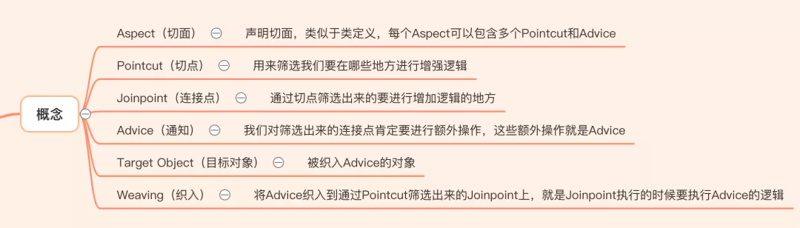
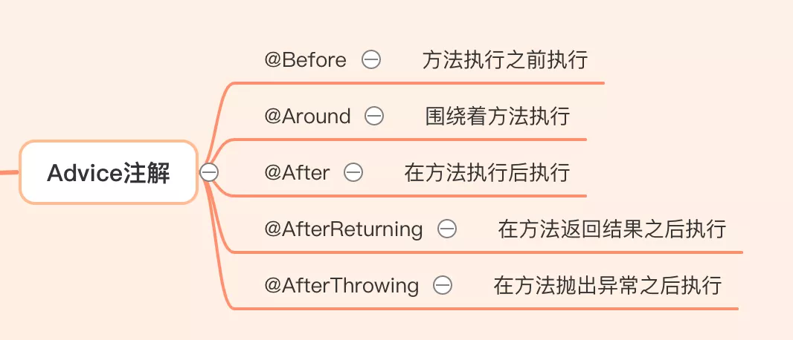
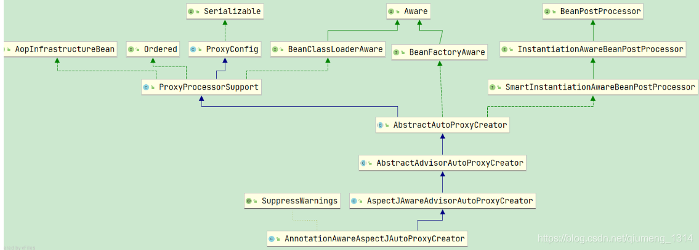
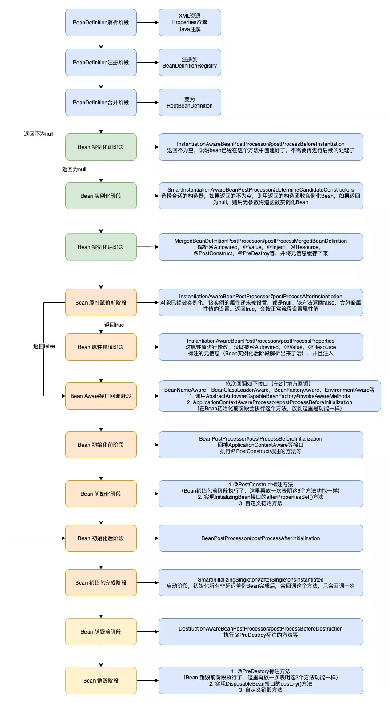
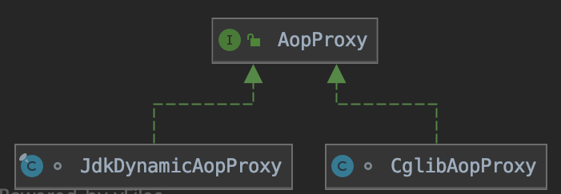
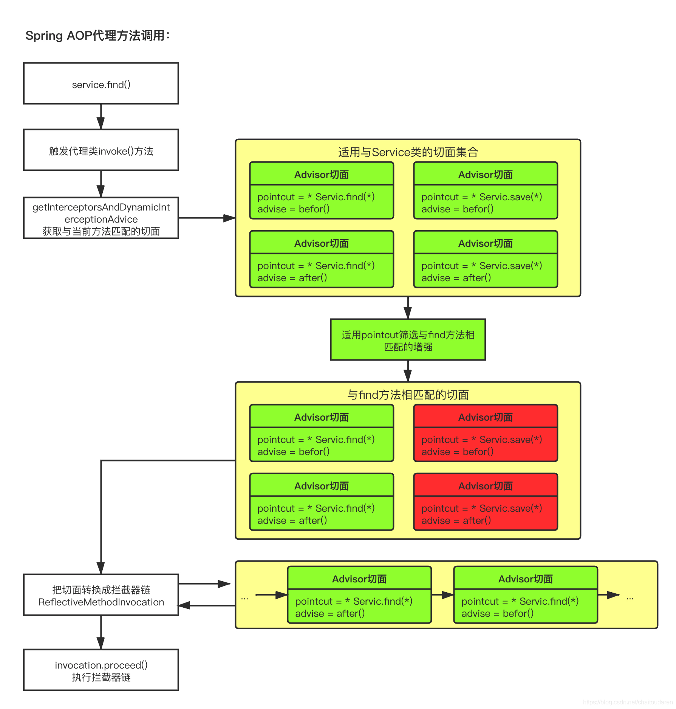
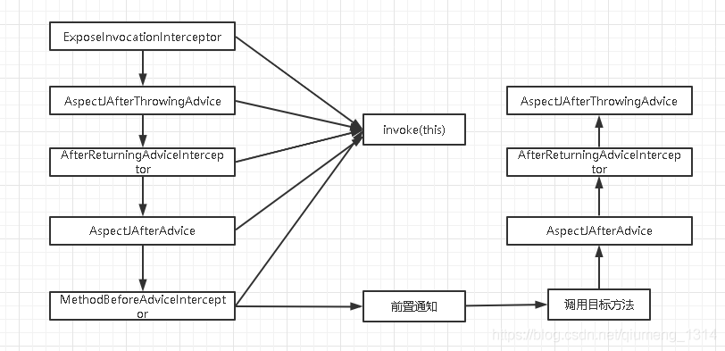
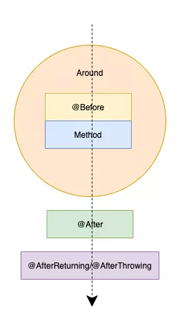
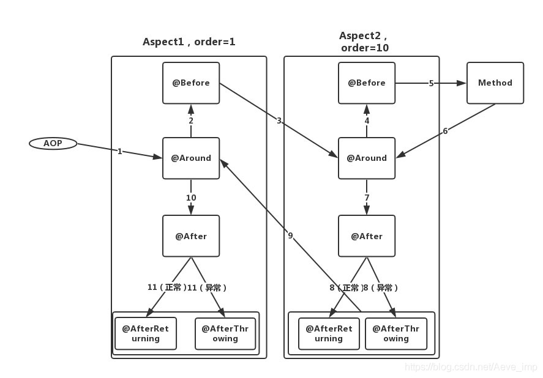
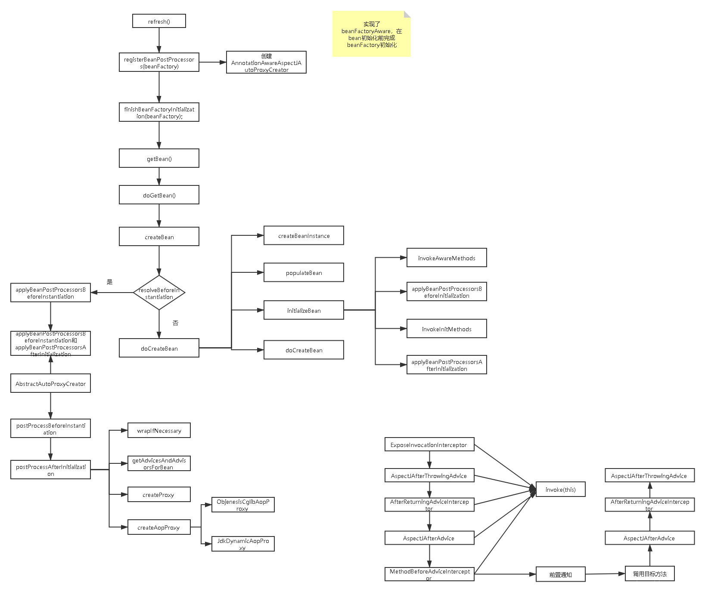

# Table of Contents

* [概念](#概念)
* [代理模式](#代理模式)
* [AOP术语](#aop术语)
* [1.入口:EnableAspectJAutoProxy](#1入口enableaspectjautoproxy)
  * [EnableAspectJAutoProxy](#enableaspectjautoproxy)
  * [AspectJAutoProxyRegistrar](#aspectjautoproxyregistrar)
  * [AnnotationAwareAspectJAutoProxyCreator](#annotationawareaspectjautoproxycreator)
* [2.代理对象生产](#2代理对象生产)
  * [**AbstractAutoProxyCreator**](#abstractautoproxycreator)
  * [postProcessBeforeInstantiation(Bean实例化前阶段执行)](#postprocessbeforeinstantiationbean实例化前阶段执行)
  * [postProcessAfterInitialization（Bean初始化后阶段执行）](#postprocessafterinitializationbean初始化后阶段执行)
* [3.AopProxy](#3aopproxy)
  * [getProxy](#getproxy)
  * [invoke](#invoke)
* [4.MethodInvocation 拦截器调用](#4methodinvocation-拦截器调用)
* [切点表达式](#切点表达式)
* [Adivce之间的顺序关系](#adivce之间的顺序关系)
* [aop流程总结](#aop流程总结)
* [参考资料](#参考资料)
* [问题](#问题)


# 概念

AOP技术，它利用一种称为“横切”的技术，剖解开封装的对象内部，并将那些影响了多个类的公共行为封装到一个可重用模块，并将其名为“Aspect”，即方面。所谓“方面”，简单地说，**就是将那些与业务无关，却为业务模块所共同调用的逻辑或责任封装起来，便于减少系统的重复代码，降低模块间的耦合度，并有利于未来的可操作性和可维护性。**


> 解决的是：【非业务代码抽取的问题】
>
> 面向切面编程：在方法前后添加非业务代码。


# 代理模式

+ 动态代理：利用截取消息的方式，对该消息进行装饰，以取代原有对象行为的执行

  + `JDK`：只能对实现了接口的类生成代理，而不能针对类。（接口代理）

    ```java
    public class InvocationHandlerImpl implements InvocationHandler {
        private Object object;
        public InvocationHandlerImpl(Object object) {
            this.object = object;
        }
        /**
         * 该方法负责集中处理动态代理类上的所有方法调用。
         * 调用处理器根据这三个参数进行预处理或分派到委托类实例上反射执行
         *
         * @param proxy  代理类实例
         * @param method 被调用的方法对象
         * @param args   调用参数
         * @return
         * @throws Throwable
         */
        @Override
        public Object invoke(Object proxy, Method method, Object[] args) throws Throwable {
            //在代理真实对象前我们可以添加一些自己的操作
            System.out.println("在调用之前，我要干点啥呢？");
            System.out.println("Method:" + method);
            //当代理对象调用真实对象的方法时，其会自动的跳转到代理对象关联的handler对象的invoke方法来进行调用
            Object returnValue = method.invoke(object, args);
            //在代理真实对象后我们也可以添加一些自己的操作
            System.out.println("在调用之后，我要干点啥呢？");
            return returnValue;
        }
    
        public static void main(String[] args) {
            //接口 以及接口实现类
            UserService userServiceImpl = new UserServiceImpl();
            ClassLoader loader = userServiceImpl.getClass().getClassLoader();
            Class[] interfaces = userServiceImpl.getClass().getInterfaces();
            UserService userService = (UserService) Proxy.newProxyInstance(loader, interfaces, new InvocationHandlerImpl(userServiceImpl));
            userService.login();
        }
    }
    ```

    

  + `CGLIB`：主要是对指定的类生成一个子类，覆盖其中的方法。（类代理）

    ```java
    public class MyMethodInterceptor implements MethodInterceptor {
        @Override
        public Object intercept(Object obj, Method method, Object[] objects, MethodProxy methodProxy) throws Throwable {
            System.out.println("cglib before");
            Object result = methodProxy.invokeSuper(obj, objects);
            System.out.println("cglib after");
            return result;
        }
    
        public static void main(String[] args) {
    
            Enhancer enhancer = new Enhancer();
    //设置父类
            enhancer.setSuperclass(Dog.class);
    //设置方法拦截处理器
            enhancer.setCallback(new MyMethodInterceptor());
            //创建代理对象
            Dog dog = (Dog) enhancer.create();
            dog.eat();
        }
    }
    ```

    

+ 静态代理：引入特定的语法创建“方面”，从而使得编译器可以在编译期间织入有关“方面”的代码。


# AOP术语






```java
public Object invoke(Object proxy, Method method, Object[] args) throws Throwable {
   Object result;
   try {
       //@Before
       result = method.invoke(target, args);
       //@After
       return result;
   } catch (InvocationTargetException e) {
       Throwable targetException = e.getTargetException();
       //@AfterThrowing
       throw targetException;
   } finally {
       //@AfterReturning
   }
}
```


# 1.入口:EnableAspectJAutoProxy

## EnableAspectJAutoProxy

```java
@Import(AspectJAutoProxyRegistrar.class)
```

aop启动类入口，进入注解，我们发现起作用的是AspectJAutoProxyRegistrar

## AspectJAutoProxyRegistrar

+ 容器注入`AnnotationAwareAspectJAutoProxyCreator`

+ `proxyTargetClass`:默认false使用`JDK`，TRUE使用`CGLIB`,

+ `exposeProxy`：是否将代理对象放入ThreadLocal中。默认为false

  ```java
  AopContext.currentProxy()).getMethod();
  //通过ApplicationContext也是可以拿到代理对象的，一般默认false就行。
  ```

+ 当`@EnableAspectJAutoProxy`注解中的`proxyTargetClass`或者`exposeProxy`属性为true的时候，将`AnnotationAwareAspectJAutoProxyCreator`中的`proxyTargetClass`或者`exposeProxy`属性改为true


  ```java
  class AspectJAutoProxyRegistrar implements ImportBeanDefinitionRegistrar {
  
  	/**
  	 * Register, escalate, and configure the AspectJ auto proxy creator based on the value
  	 * of the @{@link EnableAspectJAutoProxy#proxyTargetClass()} attribute on the importing
  	 * {@code @Configuration} class.
  	 */
  	@Override
  	public void registerBeanDefinitions(
  			AnnotationMetadata importingClassMetadata, BeanDefinitionRegistry registry) {
  
  		//注册 internalAutoProxyCreator=AnnotationAwareAspectJAutoProxyCreator 到  BeanDefinitionRegistry ----这个bean起什么作用?
  		AopConfigUtils.registerAspectJAnnotationAutoProxyCreatorIfNecessary(registry);
  
		//获取 EnableAspectJAutoProxy 注解属性 
  		AnnotationAttributes enableAspectJAutoProxy =
  				AnnotationConfigUtils.attributesFor(importingClassMetadata, EnableAspectJAutoProxy.class);

		//将属性赋值给 bean
  		if (enableAspectJAutoProxy != null) {
            //true ->cglib false->jdk   bean定义对象中设置了proxyTargetClass属性 创建代理类会根据不通值创建不同的代理类
  			if (enableAspectJAutoProxy.getBoolean("proxyTargetClass")) {
  				AopConfigUtils.forceAutoProxyCreatorToUseClassProxying(registry);
  			}
            //true 通过threadLocal保存代理 
  			if (enableAspectJAutoProxy.getBoolean("exposeProxy")) {
  				AopConfigUtils.forceAutoProxyCreatorToExposeProxy(registry);
  			}
  		}
  	}
  
  }
  
  ```

## AnnotationAwareAspectJAutoProxyCreator





关注 BeanFactoryAware 和BeanPostProcessor


AbstractAdvisorAutoProxyCreator.setBeanFactory是在bean初始化的时候,因为实现了BeanFactoryAware接口,会在初始化bean的时候赋值.

```java
	protected void initBeanFactory(ConfigurableListableBeanFactory beanFactory) {
		super.initBeanFactory(beanFactory);
		if (this.aspectJAdvisorFactory == null) {
			this.aspectJAdvisorFactory = new ReflectiveAspectJAdvisorFactory(beanFactory);
		}
		this.aspectJAdvisorsBuilder =
				new BeanFactoryAspectJAdvisorsBuilderAdapter(beanFactory, this.aspectJAdvisorFactory);
	}
```

# 2.代理对象生产

如果让你实现对象的自动代理，你会怎么做呢？

当然是通过BeanPostProcessor来干预Bean的声明周期，聪明！Spring就是这么干的

## **AbstractAutoProxyCreator**

**「AbstractAutoProxyCreator重写了如下2个重要的方法」**

+ postProcessBeforeInstantiation（Bean实例化前阶段执行） 
+ postProcessAfterInitialization（Bean初始化后阶段执行）




## postProcessBeforeInstantiation(Bean实例化前阶段执行)

+  是在创建bean实例前，调用resolveBeforeInstantiation完成的，我们具体看看做了什么?

**当用户自定义了TargetSource的实现时，会从TargetSource中获取目标对象生成代理。但是一般情况下我们很少会自定义TargetSource的实现。**

```java
//这个方法主要目的就是在不考虑通知的情况下，确认哪些bean不需要被代理

public Object postProcessBeforeInstantiation(Class<?> beanClass, String beanName) {
		Object cacheKey = getCacheKey(beanClass, beanName);

		if (!StringUtils.hasLength(beanName) || !this.targetSourcedBeans.contains(beanName)) {
			if (this.advisedBeans.containsKey(cacheKey)) {
				return null;
			}
			if (isInfrastructureClass(beanClass) || shouldSkip(beanClass, beanName)) {
				this.advisedBeans.put(cacheKey, Boolean.FALSE);
				return null;
			}
		}

		// Create proxy here if we have a custom TargetSource.
		// Suppresses unnecessary default instantiation of the target bean:
		// The TargetSource will handle target instances in a custom fashion.
		TargetSource targetSource = getCustomTargetSource(beanClass, beanName);
		if (targetSource != null) {
			if (StringUtils.hasLength(beanName)) {
				this.targetSourcedBeans.add(beanName);
			}
			Object[] specificInterceptors = getAdvicesAndAdvisorsForBean(beanClass, beanName, targetSource);
			Object proxy = createProxy(beanClass, beanName, specificInterceptors, targetSource);
			this.proxyTypes.put(cacheKey, proxy.getClass());
			return proxy;
		}

		return null;
	}

```


+ 判断当前bean是否在advisedBeans(切面bean)。

+ 判断当前bean是否使用aop增强，是放入advisedBeans。或者是否跳过shouldSkip


## postProcessAfterInitialization（Bean初始化后阶段执行）

```java
	/**
	 * Create a proxy with the configured interceptors if the bean is
	 * identified as one to proxy by the subclass.
	 * @see #getAdvicesAndAdvisorsForBean
	 */
	@Override
	public Object postProcessAfterInitialization(@Nullable Object bean, String beanName) {
		if (bean != null) {
			Object cacheKey = getCacheKey(bean.getClass(), beanName);
			if (this.earlyProxyReferences.remove(cacheKey) != bean) {
				return wrapIfNecessary(bean, beanName, cacheKey);
			}
		}
		return bean;
	}


```
+ wrapIfNecessary

```java

	/**
	 * Wrap the given bean if necessary, i.e. if it is eligible for being proxied.
	 * @param bean the raw bean instance
	 * @param beanName the name of the bean
	 * @param cacheKey the cache key for metadata access
	 * @return a proxy wrapping the bean, or the raw bean instance as-is
	 */
	protected Object wrapIfNecessary(Object bean, String beanName, Object cacheKey) {
		if (StringUtils.hasLength(beanName) && this.targetSourcedBeans.contains(beanName)) {
			return bean;
		}
		if (Boolean.FALSE.equals(this.advisedBeans.get(cacheKey))) {
			return bean;
		}
		if (isInfrastructureClass(bean.getClass()) || shouldSkip(bean.getClass(), beanName)) {
			this.advisedBeans.put(cacheKey, Boolean.FALSE);
			return bean;
		}

		// Create proxy if we have advice.
        //获取当前bean所有增强器 哪些方法是需要切入的
		//找到bean可用的增强器 进行排序
		Object[] specificInterceptors = getAdvicesAndAdvisorsForBean(bean.getClass(), beanName, null);
		if (specificInterceptors != DO_NOT_PROXY) {
			this.advisedBeans.put(cacheKey, Boolean.TRUE);
            //创建代理对象
			Object proxy = createProxy(
					bean.getClass(), beanName, specificInterceptors, new SingletonTargetSource(bean));
			this.proxyTypes.put(cacheKey, proxy.getClass());
			return proxy;
		}

		this.advisedBeans.put(cacheKey, Boolean.FALSE);
		return bean;
	}
```

+ createProxy()

```java

protected Object createProxy(Class<?> beanClass, @Nullable String beanName,
			@Nullable Object[] specificInterceptors, TargetSource targetSource) {

		if (this.beanFactory instanceof ConfigurableListableBeanFactory) {
			AutoProxyUtils.exposeTargetClass((ConfigurableListableBeanFactory) this.beanFactory, beanName, beanClass);
		}
		//代理工厂
		ProxyFactory proxyFactory = new ProxyFactory();
		proxyFactory.copyFrom(this);

		if (!proxyFactory.isProxyTargetClass()) {
			if (shouldProxyTargetClass(beanClass, beanName)) {
				proxyFactory.setProxyTargetClass(true);
			}
			else {
				evaluateProxyInterfaces(beanClass, proxyFactory);
			}
		}
		//获取所有增强器 并放入代理工厂中
		Advisor[] advisors = buildAdvisors(beanName, specificInterceptors);
		proxyFactory.addAdvisors(advisors);
		proxyFactory.setTargetSource(targetSource);
		customizeProxyFactory(proxyFactory);

		proxyFactory.setFrozen(this.freezeProxy);
		if (advisorsPreFiltered()) {
			proxyFactory.setPreFiltered(true);
		}
		//这里的getProxy 需要注意下，后面会回调InvocationHandler.invoke()方法
		return proxyFactory.getProxy(getProxyClassLoader());
	}

```

+ createAopProxy


```java
public AopProxy createAopProxy(AdvisedSupport config) throws AopConfigException {
		if (config.isOptimize() || config.isProxyTargetClass() || hasNoUserSuppliedProxyInterfaces(config)) {
			Class<?> targetClass = config.getTargetClass();
			if (targetClass == null) {
				throw new AopConfigException("TargetSource cannot determine target class: " +
						"Either an interface or a target is required for proxy creation.");
			}
			if (targetClass.isInterface() || Proxy.isProxyClass(targetClass)) {
				return new JdkDynamicAopProxy(config);
			}
			return new ObjenesisCglibAopProxy(config);
		}
		else {
			return new JdkDynamicAopProxy(config);
		}
	}
```


# 3.AopProxy




Jdk动态代理通过`getProxy`生成代理，同时`$proxy`代理对象在调用方法时，将会回调`invoke`方法进行。因此对于`JdkDynamicAopProxy`来说，最重要的代码就是分析`getProxy`和`invoke`方法。

> 这里是拦截aop的开始，要记住。

```java
JdkDynamicAopProxy implements AopProxy, InvocationHandler, Serializable{
    //实现了InvocationHandler的方法，会走InvocationHandler.invoke（）
}
```

## getProxy

```java
	@Override
	public Object getProxy(@Nullable ClassLoader classLoader) {
		if (logger.isTraceEnabled()) {
			logger.trace("Creating JDK dynamic proxy: " + this.advised.getTargetSource());
		}
		// 获取代理接口
		Class<?>[] proxiedInterfaces = AopProxyUtils.completeProxiedInterfaces(this.advised, true);
		// 判断接口是否又hashCode和equals方法
		findDefinedEqualsAndHashCodeMethods(proxiedInterfaces);
		// 使用JDK代理(classLoader, 接口, 当前JdkDynamicAopProxy对象：用于回调invoke和target对象方法)
		return Proxy.newProxyInstance(classLoader, proxiedInterfaces, this);
	}

```


## invoke

1. 获取拦截器链:**该方法将获取到所有与当前method匹配的advice(增强)**

   ```java
   // Get the interception chain for this method.
   			List<Object> chain = this.advised.getInterceptorsAndDynamicInterceptionAdvice(method, targetClass);
   ```

getInterceptorsAndDynamicInterceptionAdvice代码，发现Spring AOP也使用缓存进行提高性能，如果该方法已经获取过拦截器，则直接取缓存，否则通过advisorChainFactory获取拦截器链

2. 将拦截器封装成`ReflectiveMethodInvocation`

   ```java
   	// We need to create a method invocation...
   MethodInvocation invocation =
       new ReflectiveMethodInvocation(proxy, target, method, args, targetClass, chain);
   ```

3. 执行拦截器链

   ```java
   // Proceed to the joinpoint through the interceptor chain.
   retVal = invocation.proceed()
   // It's an interceptor, so we just invoke it: The pointcut will have
   // been evaluated statically before this object was constructed.
   return ((MethodInterceptor) interceptorOrInterceptionAdvice).invoke(this);
   ```

   


# 4.MethodInvocation 拦截器调用

+ 需要先了解：[职责链模式](https://www.runoob.com/design-pattern/chain-of-responsibility-pattern.html)

```java
// 一行代码就解决了 如何做到的？
retVal = invocation.proceed()
    
```

说实话，这个拦截器调用还是看不懂。。 看了几遍了。日后再看。

https://blog.csdn.net/chaitoudaren/article/details/105278762

责任链调用




# 切点表达式

因为AspectJ提供的表达式在我们工作中经常被使用，结合Demo演示一下具体的用法

| 表达式类型  | 解释                                       |
| :---------- | :----------------------------------------- |
| execution   | 匹配方法表达式，首选方式                   |
| within      | 限定类型                                   |
| this        | 代理对象是指定类型 ，所有方法都会被拦截    |
| target      | 目标对象是指定类型，所有方法都会被拦截     |
| args        | 匹配方法中的参数                           |
| @target     | 目标对象有指定的注解，所有方法都会被拦截   |
| @args       | 方法参数所属类型上有指定注解               |
| @within     | 调用对象上有指定的注解，所有方法都会被拦截 |
| @annotation | 有指定注解的方法                           |

# Adivce之间的顺序关系

+ 一个方法被一个aspect类拦截时的执行顺序如下

@Around->@Before->方法执行->@Around->@After->@AfterReturning/@AfterThrowing

当方法正常结束时，执行@AfterReturning。方法异常结束时，执行@AfterThrowing。两者不会同时执行哈



+ 一个方法被多个aspect类拦截时的执行顺序
  


# aop流程总结


+ @EnableAspectJAutoProxyk开启aop功能
    +  给容器注册一个AnnotationAwareAspectJAutoProxyCreator
    + AnnotationAwareAspectJAutoProxyCreator是一个后置处理器，实现了BeanFactoryAware 和BeanPostProcessor

+ 容器创建
    + registerBeanPostProcessors注册后置处理器，创建AnnotationAwareAspectJAutoProxyCreator
    + finishBeanFactoryInitialization()初始化单实例bean
        + 创建业务逻辑组件和切面组件
    + `postProcessBeforeInstantiation` ->`postProcessAfterInitialization`->创建代理对象

+ 执行目标方法
    + 代理对象执行目标方法
    + `InvocationHandler.invoke()`
    + 得到代理对象的拦截器链，将其包装成`MethodInterceptor`
    + 利用拦截器的链式机制，依次执行拦截器方法.
        + 前置->目标方法->后置通知->返回通知(正常)

        + 前置->目标方法->后置通知->异常通知(异常)




# 参考资料

https://mp.weixin.qq.com/s/qe4A0qF1WMSh_cuKaWUBlw
https://blog.csdn.net/chaitoudaren/article/details/105278409


#  问题

