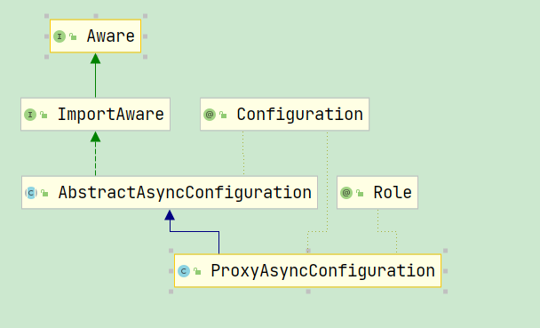

# Table of Contents

* [@Async的使用、原理及使用时可能导致的问题](#async的使用原理及使用时可能导致的问题)


# @Async的使用、原理及使用时可能导致的问题


+ 基础使用：可以让被标注的方法进行异步执行

  + 配置类需要使用@EnableAsync注解
  + 执行方法的类需要被spring管理
  + 执行方法需要添加@Async

  

+ 入口

  一般@Enable***,这种注解都是给Spring注入了某种类。

  ```java
  @Target(ElementType.TYPE)
  @Retention(RetentionPolicy.RUNTIME)
  @Documented
  // 这里是重点，导入了一个ImportSelector
  @Import(AsyncConfigurationSelector.class)
  public @interface EnableAsync {
      
      // 这个配置可以让程序员配置需要被检查的注解，默认情况下检查的就是@Async注解
   Class<? extends Annotation> annotation() default Annotation.class;
   
      // 默认使用jdk代理
   boolean proxyTargetClass() default false;
   
      // 默认使用Spring AOP
   AdviceMode mode() default AdviceMode.PROXY;
   
      // 在后续分析我们会发现，这个注解实际往容器中添加了一个
      // AsyncAnnotationBeanPostProcessor，这个后置处理器实现了Ordered接口
      // 这个配置主要代表了AsyncAnnotationBeanPostProcessor执行的顺序
   int order() default Ordered.LOWEST_PRECEDENCE;
  }
  ```

  进一步看AsyncConfigurationSelector做了什么

  ```java
  	public String[] selectImports(AdviceMode adviceMode) {
  		switch (adviceMode) {
  			case PROXY:
                  //导入了一个 ProxyAsyncConfiguration
  				return new String[] {ProxyAsyncConfiguration.class.getName()};
  			case ASPECTJ:
  				return new String[] {ASYNC_EXECUTION_ASPECT_CONFIGURATION_CLASS_NAME};
  			default:
  				return null;
  		}
  	}
  ```


  

  我们看看AbstractAsyncConfiguration做了什么事情

  ```java
     // 这里主要就是检查将其导入的类上是否有EnableAsync注解
      // 如果没有的话就报错
   @Override
   public void setImportMetadata(AnnotationMetadata importMetadata) {
    this.enableAsync = AnnotationAttributes.fromMap(
      importMetadata.getAnnotationAttributes(EnableAsync.class.getName(), false));
    if (this.enableAsync == null) {
     throw new IllegalArgumentException(
       "@EnableAsync is not present on importing class " + importMetadata.getClassName());
    }
   }
      
      // 将容器中配置的AsyncConfigurer注入
      // 异步执行嘛，所以我们可以配置使用的线程池
      // 另外也可以配置异常处理器
   @Autowired(required = false)
   void setConfigurers(Collection<AsyncConfigurer> configurers) {
    if (CollectionUtils.isEmpty(configurers)) {
     return;
    }
    if (configurers.size() > 1) {
     throw new IllegalStateException("Only one AsyncConfigurer may exist");
    }
    AsyncConfigurer configurer = configurers.iterator().next();
    this.executor = configurer::getAsyncExecutor;
    this.exceptionHandler = configurer::getAsyncUncaughtExceptionHandler;
   }
  
  }
  ```

  再回头看 ProxyAsyncConfiguration

  ```java
   @Bean(name = TaskManagementConfigUtils.ASYNC_ANNOTATION_PROCESSOR_BEAN_NAME)
   @Role(BeanDefinition.ROLE_INFRASTRUCTURE)
   public AsyncAnnotationBeanPostProcessor asyncAdvisor() {
    AsyncAnnotationBeanPostProcessor bpp = new AsyncAnnotationBeanPostProcessor();
          // 将通过AsyncConfigurer配置好的线程池跟异常处理器设置到这个后置处理器中
          bpp.configure(this.executor, this.exceptionHandler);
    Class<? extends Annotation> customAsyncAnnotation = this.enableAsync.getClass("annotation");
    if (customAsyncAnnotation != AnnotationUtils.getDefaultValue(EnableAsync.class, "annotation")) {
     bpp.setAsyncAnnotationType(customAsyncAnnotation);
    }
    bpp.setProxyTargetClass(this.enableAsync.getBoolean("proxyTargetClass"));
    bpp.setOrder(this.enableAsync.<Integer>getNumber("order"));
    return bpp;
   }
  ```

  可以看到@Async就是通过AsyncAnnotationBeanPostProcessor来实现的。
  下面关注几个问题

  1.代理对象何时生成?不出意外也是后置方法，也就是初始化后生成

  2.切点是怎么产生的？也就是拦截哪些类，(Pointcut)
  3.通知是怎么实现的，如何实现异步的？

+ 代理对象何时产生？

  我们抓住重点，`AsyncAnnotationBeanPostProcessor`是一个后置处理器器，按照我们对Spring的了解，大概率是在这个后置处理器的`postProcessAfterInitialization`方法中完成了代理，直接定位到这个方法，这个方法位于父类`AbstractAdvisingBeanPostProcessor`中，具体代码如下：

  ```java
  public Object postProcessAfterInitialization(Object bean, String beanName) {
      // 没有通知，或者是AOP的基础设施类，那么不进行代理
      if (this.advisor == null || bean instanceof AopInfrastructureBean) {
          return bean;
      }
   
      // 对已经被代理的类，不再生成代理，只是将通知添加到代理类的逻辑中
      // 这里通过beforeExistingAdvisors决定是将通知添加到所有通知之前还是添加到所有通知之后
      // 在使用@Async注解的时候，beforeExistingAdvisors被设置成了true
      // 意味着整个方法及其拦截逻辑都会异步执行
      if (bean instanceof Advised) {
          Advised advised = (Advised) bean;
          if (!advised.isFrozen() && isEligible(AopUtils.getTargetClass(bean))) {
              if (this.beforeExistingAdvisors) {
                  advised.addAdvisor(0, this.advisor);
              }
              else {
                  advised.addAdvisor(this.advisor);
              }
              return bean;
          }
      }
   
      // 判断需要对哪些Bean进行来代理
      if (isEligible(bean, beanName)) {
          ProxyFactory proxyFactory = prepareProxyFactory(bean, beanName);
          if (!proxyFactory.isProxyTargetClass()) {
              evaluateProxyInterfaces(bean.getClass(), proxyFactory);
          }
          proxyFactory.addAdvisor(this.advisor);
          customizeProxyFactory(proxyFactory);
          return proxyFactory.getProxy(getProxyClassLoader());
      }
      return bean;
  }
  ```

  

+ 切点如何产生

  ```java
  protected boolean isEligible(Class<?> targetClass) {
      Boolean eligible = this.eligibleBeans.get(targetClass);
      if (eligible != null) {
          return eligible;
      }
      if (this.advisor == null) {
          return false;
      }
      // 这里完成的判断
      eligible = AopUtils.canApply(this.advisor, targetClass);
      this.eligibleBeans.put(targetClass, eligible);
      return eligible;
  }
  ```

  实际上最后就是根据advisor来确定是否要进行代理，advisor实际就是一个绑定了切点的通知，那么`AsyncAnnotationBeanPostProcessor`这个advisor是什么时候被初始化的呢？我们直接定位到`AsyncAnnotationBeanPostProcessor`的`setBeanFactory`方法，其源码如下：

  ```java
  public void setBeanFactory(BeanFactory beanFactory) {
      super.setBeanFactory(beanFactory);
   
      // 在这里new了一个AsyncAnnotationAdvisor
      AsyncAnnotationAdvisor advisor = new AsyncAnnotationAdvisor(this.executor, this.exceptionHandler);
      if (this.asyncAnnotationType != null) {
          advisor.setAsyncAnnotationType(this.asyncAnnotationType);
      }
      advisor.setBeanFactory(beanFactory);
      // 完成了初始化
      this.advisor = advisor;
  }
  ```


  我们来看看`AsyncAnnotationAdvisor`中的切点匹配规程是怎么样的，直接定位到这个类的`buildPointcut`方法中，其源码如下：

  ```java
  protected Pointcut buildPointcut(Set<Class<? extends Annotation>> asyncAnnotationTypes) {
      ComposablePointcut result = null;
      for (Class<? extends Annotation> asyncAnnotationType : asyncAnnotationTypes) {
          // 就是根据这两个匹配器进行匹配的
          Pointcut cpc = new AnnotationMatchingPointcut(asyncAnnotationType, true);
          Pointcut mpc = new AnnotationMatchingPointcut(null, asyncAnnotationType, true);
          if (result == null) {
              result = new ComposablePointcut(cpc);
          }
          else {
              result.union(cpc);
          }
          result = result.union(mpc);
      }
      return (result != null ? result : Pointcut.TRUE);
  }
  ```

  代码很简单，就是根据cpc跟mpc两个匹配器来进行匹配的，第一个是检查类上是否有@Async注解，第二个是检查方法是是否有@Async注解。

+ 异步如何实现

  直接定位到`AsyncAnnotationAdvisor`中的`buildAdvice`方法，源码如下：

  ```java
  protected Advice buildAdvice(
      @Nullable Supplier<Executor> executor, @Nullable Supplier<AsyncUncaughtExceptionHandler> exceptionHandler) {
  	//其实就是拦截器
      AnnotationAsyncExecutionInterceptor interceptor = new AnnotationAsyncExecutionInterceptor(null);
      interceptor.configure(executor, exceptionHandler);
      return interceptor;
  }
  ```

  简单吧，加了一个拦截器而已，对于interceptor类型的对象，我们关注它的核心方法`invoke`就行了，代码如下

  ```java
  public Object invoke(final MethodInvocation invocation) throws Throwable {
      Class<?> targetClass = (invocation.getThis() != null ? AopUtils.getTargetClass(invocation.getThis()) : null);
      Method specificMethod = ClassUtils.getMostSpecificMethod(invocation.getMethod(), targetClass);
      final Method userDeclaredMethod = BridgeMethodResolver.findBridgedMethod(specificMethod);
   
      // 异步执行嘛，先获取到一个线程池
      AsyncTaskExecutor executor = determineAsyncExecutor(userDeclaredMethod);
      if (executor == null) {
          throw new IllegalStateException(
              "No executor specified and no default executor set on AsyncExecutionInterceptor either");
      }
   
      // 然后将这个方法封装成一个 Callable对象传入到线程池中执行
      Callable<Object> task = () -> {
          try {
              Object result = invocation.proceed();
              if (result instanceof Future) {
                  return ((Future<?>) result).get();
              }
          }
          catch (ExecutionException ex) {
              handleError(ex.getCause(), userDeclaredMethod, invocation.getArguments());
          }
          catch (Throwable ex) {
              handleError(ex, userDeclaredMethod, invocation.getArguments());
          }
          return null;
      };
   // 将任务提交到线程池
      return doSubmit(task, executor, invocation.getMethod().getReturnType());
  }
  ```

  现在已经知道了@Async的原理，现在我们看看使用可能会带来的问题

+ 循环依赖

  ```java
  @Service
  public class TestService1 {
  
      @Autowired
      private TestService2 testService2;
  
      @Async
      public void test1() {
      }
  }
  
  @Service
  public class TestService2 {
  
      @Autowired
      private TestService1 testService1;
  
      public void test2() {
      }
  }
  ```

  熟悉三级缓存的马上就能发现问题了，因为早期暴露的对象跟最终放入容器中的对象不是同一个，所以报错了。

  怎么解决呢？

  1.延迟加载

  2.指定加载顺序

+ 默认线程池不会复用线程

  追溯@Async源码，我们可以看到

  ```java
  protected Executor getDefaultExecutor(@Nullable BeanFactory beanFactory) {
     Executor defaultExecutor = super.getDefaultExecutor(beanFactory);
     return (defaultExecutor != null ? defaultExecutor : new SimpleAsyncTaskExecutor());
  }
  ```

  这个线程池是：每一个任务新起一个；默认线程数不做限制；不复用线程。

  这样的线程池你还敢用？OOM

  解决方案

  1.可以通过`AsyncConfigurer`来配置使用的线程池

  2.直接在@Async中指定线程池的名字
