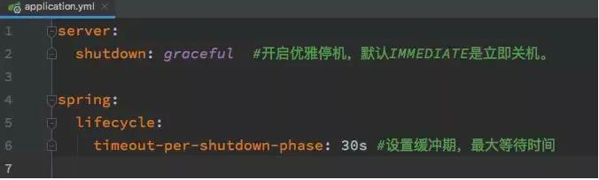

# Table of Contents

* [为什么要【优雅】停机](#为什么要优雅停机)
* [如何优雅停机？](#如何优雅停机)
* [如何实现的](#如何实现的)
* [参考资料](#参考资料)


[TOC]


# 为什么要【优雅】停机

先来一段简单的代码，如下：

```text
@RestController
public class DemoController {
 @GetMapping("/demo")
 public String demo() throws InterruptedException {
     // 模拟业务耗时处理流程
  Thread.sleep(20 * 1000L);
  return "hello";
 }
}
```

当我们流量请求到此接口执行业务逻辑的时候，若服务端此时执行关机 （kill），spring boot 默认情况会直接关闭容器（tomcat 等），导致此业务逻辑执行失败。**在一些业务场景下：会出现数据不一致的情况，事务逻辑不会回滚。**


> 所谓的优雅：实际上是留给应用一定的时间，处理当前未处理完的请求。


# 如何优雅停机？


在最新的 spring boot 2.3 版本，内置此功能，不需要再自行扩展容器线程池来处理，目前 spring boot 嵌入式支持的 web 服务器（Jetty、Reactor Netty、Tomcat 和 Undertow）以及反应式和基于 Servlet 的 web 应用程序都支持优雅停机功能。我们来看下如何使用:

当使用 server.shutdown=graceful 启用时，在 web 容器关闭时，web 服务器将不再接收新请求，**并将等待活动请求完成的缓冲期**。



> 这个时间 很考验功底


+ 默认时间为 30S, 意味着最大等待 30S，超时候无论线程任务是否执行完毕都会停机处理，一定要合理合理设置。


# 如何实现的

```java
    public void close() {
        synchronized(this.startupShutdownMonitor) {
            this.doClose();
            if (this.shutdownHook != null) {
                try {
                    Runtime.getRuntime().removeShutdownHook(this.shutdownHook);
                } catch (IllegalStateException var4) {
                }
            }

        }
    }
```

```java
protected void doClose() {
    LiveBeansView.unregisterApplicationContext(this);
    try {
        // Publish shutdown event.
        publishEvent(new ContextClosedEvent(this)); ➀
    }
    // Stop all Lifecycle beans, to avoid delays during individual destruction.
    if (this.lifecycleProcessor != null) {
        try {
            this.lifecycleProcessor.onClose(); ➁
        }
        catch (Throwable ex) {
            logger.warn("Exception thrown from LifecycleProcessor on context close", ex);
        }
    }

    // Destroy all cached singletons in the context's BeanFactory.
    destroyBeans(); ➂

    // Close the state of this context itself.
    closeBeanFactory(); ➃

    // Let subclasses do some final clean-up if they wish...
    onClose(); ➄

    // Reset local application listeners to pre-refresh state.
    if (this.earlyApplicationListeners != null) {
        this.applicationListeners.clear();
        this.applicationListeners.addAll(this.earlyApplicationListeners);
    }

    // Switch to inactive.
    this.active.set(false);
}
```

剪去那些无影响的代码部分，我们可以发现对于 Spring 来说，真正关闭的顺序是：

1. 发布一个关闭事件
2. 调用生命周期处理器
3. 销毁所有的Bean
4. 关闭Bean工厂
5. 调用子类的Close函数


# 参考资料

+ https://www.cnblogs.com/caoweixiong/p/15650333.html
