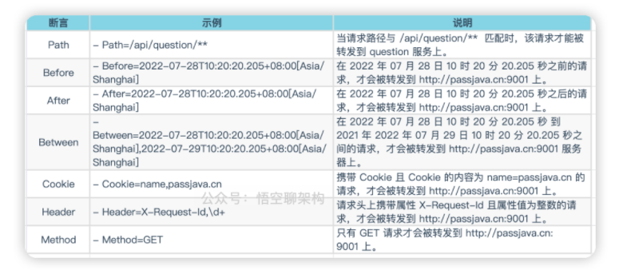

# Table of Contents

* [**为什么需要 API 网关**](#为什么需要-api-网关)
* [网关选型](#网关选型)
* [**Spring Cloud Gateway 的工作流程**](#spring-cloud-gateway-的工作流程)
* [**Spring Cloud Gateway 的断言**](#spring-cloud-gateway-的断言)
* [**Spring Cloud Gateway 动态路由**](#spring-cloud-gateway-动态路由)
* [**Spring Cloud Gateway 的过滤器**](#spring-cloud-gateway-的过滤器)
  * [过滤器 Filter 的分类](#过滤器-filter-的分类)
* [局部过滤器](#局部过滤器)
* [全局过滤器](#全局过滤器)


# **为什么需要 API 网关**

 SpringCloud 微服务架构中，往往有多个微服务，这些微服务可能部署在不同的机器上，而且一个微服务可能会扩容成多个相同的微服务，组成微服务集群。

这种情况下，会存在如下问题：

- 如果需要添加鉴权功能，则需要对每个微服务进行改造。
- 如果需要对流量进行控制，则需要对每个微服务进行改造。
- 跨域问题，需要对每个微服务进行改造。
- 存在安全问题，每个微服务需要暴露自己的 Endpoint 给客户端。Endpoint 就是服务的访问地址 + 端口。比如下面的地址：
- 灰度发布、动态路由需要对每个微服务进行改造。

这个问题的痛点是各个微服务都是一个入口，有没有办法统一入口呢？

解决这个问题的方式就是在客户端和服务器之间加个中间商就好了呀，只有中间商一个入口，这个中间商就是网关。


# 网关选型

业界比较出名的网关：Spring Cloud Gateway、Netflix Zuul、Nginx、Kong、Alibaba Tengine。

作为 Spring Cloud 全家桶中的一款组件，当然选择 Spring Cloud Gateway 了。

最开始 Spring Cloud 推荐的网关是 Netflix Zuul 1.x，但是停止维护了，后来又有 Zuul 2.0，但是因为开发延期比较严重，Spring Cloud 官方自己开发了 Spring Cloud Gateway 网关组件，用于代替 Zuul 网关。

所以本篇我们只会讲解 Spring Cloud Gateway 网关组件。


# **Spring Cloud Gateway 的工作流程**

① **路由判断**；客户端的请求到达网关后，先经过 Gateway Handler Mapping 处理，这里面会做断言（Predicate）判断，看下符合哪个路由规则，这个路由映射后端的某个服务。

② **请求过滤**：然后请求到达 Gateway Web Handler，这里面有很多过滤器，组成过滤器链（Filter Chain），这些过滤器可以对请求进行拦截和修改，比如添加请求头、参数校验等等，有点像净化污水。然后将请求转发到实际的后端服务。这些过滤器逻辑上可以称作 Pre-Filters，Pre 可以理解为“在...之前”。

③ **服务处理**：后端服务会对请求进行处理。

④ **响应过滤**：后端处理完结果后，返回给 Gateway 的过滤器再次做处理，逻辑上可以称作 Post-Filters，Post 可以理解为“在...之后”。

⑤ **响应返回**：响应经过过滤处理后，返回给客户端。

小结：客户端的请求先通过匹配规则找到合适的路由，就能映射到具体的服务。然后请求经过过滤器处理后转发给具体的服务，服务处理后，再次经过过滤器处理，最后返回给客户端。


# **Spring Cloud Gateway 的断言**

在 Gateway 中，如果客户端发送的请求满足了断言的条件，则映射到指定的路由器，就能转发到指定的服务上进行处理。

常见的 Predicate 断言配置如下所示，假设匹配路由成功后，转发到 http://localhost:9001



```java
spring:
  cloud:
    gateway:
      routes:
        - id: route_qq
          uri: http://www.qq.com
          predicates:
            - Query=url,qq
        - id: route_baidu
          uri: http://www.baidu.com
          predicates:
            - Query=url,baidu
server:
  port: 8060 
```

第一条路由规则：断言为 Query=url,qq，表示当请求路径中包含 url=qq，则跳转到http://www.qq.com

第二条路由规则：当请求路径中包含 url=baidu，则跳转到http://www.baidu.com


# **Spring Cloud Gateway 动态路由**

在微服务架构中，我们不会直接通过 IP + 端口的方式访问微服务，而是通过服务名的方式来访问。如下图所示，微服务中加入了注册中心，多个微服务将自己注册到了注册中心，这样注册中心就保存了**服务名和 IP+端口的映射关系**。

**uri: lb://passjava-question**，表示将请求转发给 passjava-question 微服务，且支持负载均衡。lb 是 loadbalance（负载均衡) 单词的缩写。

那什么叫动态路由呢？

当 passjava-question 服务添加一个微服务，或者 IP 地址更换了，Gateway 都是可以感知到的，但是配置是不需要更新的。这里的动态指的是微服务的集群个数、IP 和端口是动态可变的。

> 其实是利用了注册中心，注册表的映射关系。


# **Spring Cloud Gateway 的过滤器**

网关，顾名思义，就是网络中的一道关卡，可以统一对**请求和响应**进行一些操作。


## 过滤器 Filter 的分类

过滤器 Filter 按照请求和响应可以分为两种：`Pre` 类型和 `Post` 类型。

**Pre 类型**：在请求被转发到微服务之前，对请求进行拦截和修改，例如参数校验、权限校验、流量监控、日志输出以及协议转换等操作。

**Post 类型**：微服务处理完请求后，返回响应给网关，网关可以再次进行处理，例如修改响应内容或响应头、日志输出、流量监控等。

另外一种分类是按照过滤器 Filter 作用的范围进行划分：

**GlobalFilter**：全局过滤器，应用在所有路由上的过滤器。


# 局部过滤器

**GatewayFilter**：局部过滤器，应用在单个路由或一组路由上的过滤器。标红色表示比较常用的过滤器。

```java
filters: #过滤器
   - RewritePath=/api/(?<segment>.*),/$\{segment} # 将跳转路径中包含的 “api” 替换成空
```


# 全局过滤器

整理了一份全局过滤器的表格，具体用法可以参照官方文档。

官方文档：https://cloud.spring.io/spring-cloud-static/Greenwich.SR2/single/spring-cloud.html*#_global_filters*
