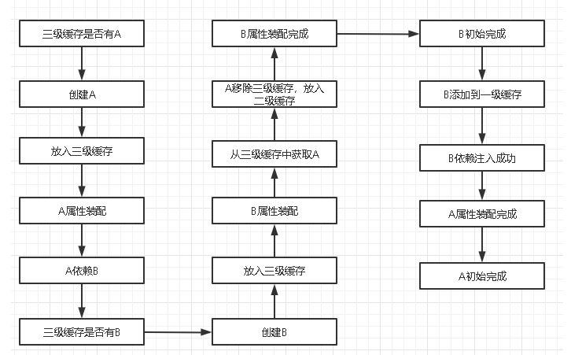

# Table of Contents

* [Spring三级缓存](#spring三级缓存)
* [相关问题](#相关问题)
  * [暂时不知道怎么描述,但是比较重要](#暂时不知道怎么描述但是比较重要)
  * [三级缓存为什么要使用工厂而不是直接使用引用？换而言之，为什么需要这个三级缓存，直接通过二级缓存暴露一个引用不行吗？](#三级缓存为什么要使用工厂而不是直接使用引用换而言之为什么需要这个三级缓存直接通过二级缓存暴露一个引用不行吗)
  * [”为什么要使用三级缓存呢？二级缓存能解决循环依赖吗？“](#为什么要使用三级缓存呢二级缓存能解决循环依赖吗)


# Spring三级缓存


循环依赖：就是多个 Bean 之间互相依赖或引用到对方，最终形成了 **闭环**。

+ Spring循环依赖场景
    + [ ] AB**构造器**循环依赖
    + [x] AB **setter**循环依赖
    + [x] AB部分构造器 部分setter循环依赖
    + [ ] 不是单列的循环依赖


由Bean的生命周期，我们可以了解到，循环依赖发生在`poplulateBean()`属性赋值阶段。


```java
//用于存放完全初始化好的 bean，从该缓存中取出的 bean 可以直接使用
private final Map<String, Object> singletonObjects = new ConcurrentHashMap<>(256); //一级缓存
//提前曝光的单例对象的cache，实例化的bean 可能为代理对象
private final Map<String, Object> earlySingletonObjects = new HashMap<>(16); // 二级缓存
//单例对象工厂的cache，存放 bean 工厂对象，用于aop解决循环依赖 没有aop就是当前对象
private final Map<String, ObjectFactory<?>> singletonFactories = new HashMap<>(16); // 三级缓存
// 它在Bean开始创建时放值，创建完成时会将其移出~
private final Set<String> singletonsCurrentlyInCreation = Collections.newSetFromMap(new ConcurrentHashMap<>(16))
// 当这个Bean被创建完成后，会标记为这个 注意：这里是set集合 不会重复// 至少被创建了一次的  都会放进这里~~~~
private final Set<String> alreadyCreated = Collections.newSetFromMap(new ConcurrentHashMap<>(256));
}
```

当Spring容器试图获得单例bean时，首先会在三个缓存中查找

```java
//先一级 在二级 在三级
protected Object getSingleton(String beanName, boolean allowEarlyReference) {
    // 查询一级缓存
    Object singletonObject = this.singletonObjects.get(beanName);
    if (singletonObject == null && isSingletonCurrentlyInCreation(beanName)) {
        synchronized (this.singletonObjects) {
            //若一级缓存内不存在，查询二级缓存
            singletonObject = this.earlySingletonObjects.get(beanName);
            if (singletonObject == null && allowEarlyReference) {
                //若二级缓存内不存在，查询三级缓存
                ObjectFactory<?> singletonFactory = this.singletonFactories.get(beanName);
                if (singletonFactory != null) {
                    //若三级缓存中的，则通过工厂获得对象，并清除三级缓存，提升至二级缓存
                    singletonObject = singletonFactory.getObject();
                    this.earlySingletonObjects.put(beanName, singletonObject);
                    this.singletonFactories.remove(beanName);
                }
            }
        }
    }
    return (singletonObject != NULL_OBJECT ? singletonObject : null);
}

```

如果返回为null,调用doCreateBean()创建对象

```java
protected Object doCreateBean(final String beanName, final RootBeanDefinition mbd, final @Nullable Object[] args) throws BeanCreationException {
		...
		// 创建Bean对象，并且将对象包裹在BeanWrapper 中
		instanceWrapper = createBeanInstance(beanName, mbd, args);
		// 再从Wrapper中把Bean原始对象（非代理~~~）  这个时候这个Bean就有地址值了，就能被引用了~~~
		// 注意：此处是原始对象，这点非常的重要
		final Object bean = instanceWrapper.getWrappedInstance();
		...
		// earlySingletonExposure 用于表示是否”提前暴露“原始对象的引用，用于解决循环依赖。
		// 对于单例Bean，该变量一般为 true   但你也可以通过属性allowCircularReferences = false来关闭循环引用
		// isSingletonCurrentlyInCreation(beanName) 表示当前bean必须在创建中才行
		boolean earlySingletonExposure = (mbd.isSingleton() && this.allowCircularReferences && isSingletonCurrentlyInCreation(beanName));
		if (earlySingletonExposure) {
			if (logger.isTraceEnabled()) {
				logger.trace("Eagerly caching bean '" + beanName + "' to allow for resolving potential circular references");
			}
			// 上面讲过调用此方法放进一个ObjectFactory，二级缓存会对应删除的
			// getEarlyBeanReference的作用：调用SmartInstantiationAwareBeanPostProcessor.getEarlyBeanReference()这个方法  否则啥都不做
			// 也就是给调用者个机会，自己去实现暴露这个bean的应用的逻辑~~~
			// 比如在getEarlyBeanReference()里可以实现AOP的逻辑~~~  参考自动代理创建器AbstractAutoProxyCreator  实现了这个方法来创建代理对象
			// 若不需要执行AOP的逻辑，直接返回Bean
			addSingletonFactory(beanName, () -> getEarlyBeanReference(beanName, mbd, bean));
		}
		Object exposedObject = bean; //exposedObject 是最终返回的对象
		...
		// 填充属于，解决@Autowired依赖~
		populateBean(beanName, mbd, instanceWrapper);
		// 执行初始化回调方法们~~~
		exposedObject = initializeBean(beanName, exposedObject, mbd);
		
		// earlySingletonExposure：如果你的bean允许被早期暴露出去 也就是说可以被循环引用  那这里就会进行检查
		// 此段代码非常重要~~~~~但大多数人都忽略了它
		if (earlySingletonExposure) {
			// 此时一级缓存肯定还没数据，但是呢此时候二级缓存earlySingletonObjects也没数据
			//注意，注意：第二参数为false  表示不会再去三级缓存里查了~~~

			// 此处非常巧妙的一点：：：因为上面各式各样的实例化、初始化的后置处理器都执行了，如果你在上面执行了这一句
			//  ((ConfigurableListableBeanFactory)this.beanFactory).registerSingleton(beanName, bean);
			// 那么此处得到的earlySingletonReference 的引用最终会是你手动放进去的Bean最终返回，完美的实现了"偷天换日" 特别适合中间件的设计
			// 我们知道，执行完此doCreateBean后执行addSingleton()  其实就是把自己再添加一次  **再一次强调，完美实现偷天换日**
			Object earlySingletonReference = getSingleton(beanName, false);
            
            // 如果没有早期暴露，是不会走下面判断的。
			if (earlySingletonReference != null) {
			
				// 这个意思是如果经过了initializeBean()后，exposedObject还是木有变，那就可以大胆放心的返回了
				// initializeBean会调用后置处理器，这个时候可以生成一个代理对象，那这个时候它哥俩就不会相等了 走else去判断吧
				if (exposedObject == bean) {
					exposedObject = earlySingletonReference;
				} 

				// allowRawInjectionDespiteWrapping这个值默认是false
				// hasDependentBean：若它有依赖的bean 那就需要继续校验了~~~(若没有依赖的 就放过它~)
				else if (!this.allowRawInjectionDespiteWrapping && hasDependentBean(beanName)) {
					// 拿到它所依赖的Bean们~~~~ 下面会遍历一个一个的去看~~
					String[] dependentBeans = getDependentBeans(beanName);
					Set<String> actualDependentBeans = new LinkedHashSet<>(dependentBeans.length);
					
					// 一个个检查它所以Bean
					// removeSingletonIfCreatedForTypeCheckOnly这个放见下面  在AbstractBeanFactory里面
					// 简单的说，它如果判断到该dependentBean并没有在创建中的了的情况下,那就把它从所有缓存中移除~~~  并且返回true
					// 否则（比如确实在创建中） 那就返回false 进入我们的if里面~  表示所谓的真正依赖
					//（解释：就是真的需要依赖它先实例化，才能实例化自己的依赖）
					for (String dependentBean : dependentBeans) {
						if (!removeSingletonIfCreatedForTypeCheckOnly(dependentBean)) {
							actualDependentBeans.add(dependentBean);
						}
					}

					// 若存在真正依赖，那就报错（不要等到内存移除你才报错，那是非常不友好的） 
					// 这个异常是BeanCurrentlyInCreationException，报错日志也稍微留意一下，方便定位错误~~~~
					if (!actualDependentBeans.isEmpty()) {
						throw new BeanCurrentlyInCreationException(beanName,
								"Bean with name '" + beanName + "' has been injected into other beans [" +
								StringUtils.collectionToCommaDelimitedString(actualDependentBeans) +
								"] in its raw version as part of a circular reference, but has eventually been " +
								"wrapped. This means that said other beans do not use the final version of the " +
								"bean. This is often the result of over-eager type matching - consider using " +
								"'getBeanNamesOfType' with the 'allowEagerInit' flag turned off, for example.");
					}
				}
			}
		}
		
		return exposedObject;
	}

	// 虽然是remove方法 但是它的返回值也非常重要
	// 该方法唯一调用的地方就是循环依赖的最后检查处~~~~~
	protected boolean removeSingletonIfCreatedForTypeCheckOnly(String beanName) {
		// 如果这个bean不在创建中  比如是ForTypeCheckOnly的  那就移除掉
		if (!this.alreadyCreated.contains(beanName)) {
			removeSingleton(beanName);
			return true;
		}
		else {
			return false;
		}
	}

}
```

+ AB循环依赖流程图



+ 这里大家可能会问，不用为什么要用二级缓存，直接用三级缓存不就可以了吗？

当某个 bean 进入到 2 级缓存的时候，说明这个 bean 的早期对象被其他 bean 注入了，也就是说，这个 bean 还是半成品，还未完全创建好的时候，已经被别人拿去使用了，所以必须要有 3 级缓存，2 级缓存中存放的是早期的被别人使用的对象，如果没有 2 级缓存，是无法判断这个对象在创建的过程中，是否被别人拿去使用了。例子：A依赖BC B依赖A C依赖A

+ AOP下的循环依赖

在普通的循环依赖下，三级缓存是没有任何作用的，三级缓存实际上是跟AOP有关。，我们再来看一看`getEarlyBeanReference`的代码：如果在开启AOP的情况下，最终调用方法

```java
	public Object getEarlyBeanReference(Object bean, String beanName) {
		Object cacheKey = getCacheKey(bean.getClass(), beanName);
		this.earlyProxyReferences.put(cacheKey, bean);
		return wrapIfNecessary(bean, beanName, cacheKey);
	}
```

我们对A进行了`AOP`代理的话，那么此时`getEarlyBeanReference`将返回一个代理后的对象，而不是实例化阶段创建的对象，这样就意味着B中注入的**A将是一个代理对象**而不是A的实例化阶段创建后的对象。


这里有一个小细节

```java
if (exposedObject == bean) {
	exposedObject = earlySingletonReference;
}
```

如果`exposedObject == bean`表示最终返回的对象就是原始对象，说明在`populateBean`和`initializeBean`没对他代理过，那就啥话都不说了`exposedObject = earlySingletonReference`，最终把二级缓存里的引用返回即可~


# 相关问题

## 暂时不知道怎么描述,但是比较重要


背景1：

```java
@Service
public class TestService1{
    @Autowired
    private TestService2 testService2;

    @Async
    public void test1() {
    }
}

@Service
public class TestService2 {

    @Autowired
    private TestService1 testService1;

    public void test2() {
    }
}
```

1. TestService1在实例化后，放入三级缓存工厂的是AOP代理对象，  在TestService2进行属性装配的时候，从三级缓存中拿出AOP代理对象，放入二级缓存的是TestService1的代理对象还是普通对象？

   放入的是普通对象，断点调试过......

   这点多看几遍。。。坑了我一天的时间

2. TestService1初始化时，是否会创建代理对象？ 是

3. ```java
   TestService1从二级缓存获取‘自己’，这个是哪个对象？代理还是AOP
   Object earlySingletonReference = getSingleton(beanName, false);
   if (earlySingletonReference != null) {
       //初始化后对象需要与原始对象比较 为什么？
       if (exposedObject == bean) {
           exposedObject = earlySingletonReference;
       } 
   ```

4. 当初始化后对象与原始对象不一样时，

   ```java
   	//如果TestService1 有依赖，这里就会报错，为什么？
   	// B已经装配了 普通对象的 A ,这个时候A初始化了代理对象，
   if (!actualDependentBeans.isEmpty()) {
   						throw new BeanCurrentlyInCreationException(beanName,
   								"Bean with name '" + beanName + "' has been injected into other beans [" +
   								StringUtils.collectionToCommaDelimitedString(actualDependentBeans) +
   								"] in its raw version as part of a circular reference, but has eventually been " +
   								"wrapped. This means that said other beans do not use the final version of the " +
   								"bean. This is often the result of over-eager type matching - consider using " +
   								"'getBeanNamesOfType' with the 'allowEagerInit' flag turned off, for example.");
   					}
   ```


背景2：

```java
@Service
public class TestService1{
    @Autowired
    private TestService2 testService2;

  
    public void test1() {
    }
}

@Service
public class TestService2 {

    @Autowired
    private TestService1 testService1;
  	@Async
    public void test2() {
    }
}
```

是没问题的，因为AOP代理对象是后加载的。


```java
//如果没有暴露早期对象
if (earlySingletonReference != null){
    
}
//注册对象

```


## 三级缓存为什么要使用工厂而不是直接使用引用？换而言之，为什么需要这个三级缓存，直接通过二级缓存暴露一个引用不行吗？

**这个工厂的目的在于延迟对实例化阶段生成的对象的代理，只有真正发生循环依赖的时候，才去提前生成代理对象，否则只会创建一个工厂并将其放入到三级缓存中，但是不会去通过这个工厂去真正创建对象**

即使没有循环依赖，也会将其添加到三级缓存中，而且是不得不添加到三级缓存中，因为到目前为止Spring也不能确定这个Bean有没有跟别的Bean出现循环依赖。


假设我们在这里直接使用二级缓存的话，那**么意味着所有的Bean在这一步都要完成`AOP`代理。这样做有必要吗？**

不仅没有必要，而且违背了Spring在结合`AOP`跟Bean的生命周期的设计！Spring结合`AOP`跟Bean的生命周期本身就是通过`AnnotationAwareAspectJAutoProxyCreator`这个后置处理器来完成的，在这个后置处理的`postProcessAfterInitialization`方法中对初始化后的Bean完成`AOP`代理。如果出现了循环依赖，那没有办法，只有给Bean先创建代理，但是没有出现循环依赖的情况下，设计之初就是让Bean在生命周期的最后一步完成代理而不是在实例化后就立马完成代理。


## ”为什么要使用三级缓存呢？二级缓存能解决循环依赖吗？“


答：如果要使用二级缓存解决循环依赖，意味着所有Bean在实例化后就要完成AOP代理，这样违背了Spring设计的原则，Spring在设计之初就是通过`AnnotationAwareAspectJAutoProxyCreator`这个后置处理器来在Bean生命周期的最后一步来完成AOP代理，而不是在实例化后就立马进行AOP代理。

```

```
