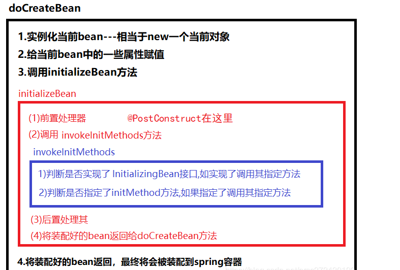

# Table of Contents

* [Java本身的加载](#java本身的加载)
  * [static代码块](#static代码块)
  * [构造方法](#构造方法)
* [Spring启动加载方式](#spring启动加载方式)
  * [Bean生命周期](#bean生命周期)
    * [**@PostConstruct**](#postconstruct)
    * [**InitializingBean**(推荐)](#initializingbean推荐)
    * [@PostConstruct和InitializingBean区别](#postconstruct和initializingbean区别)
    * [initMethod](#initmethod)
    * [小结图片](#小结图片)
  * [ApplicationRunner](#applicationrunner)
  * [CommandLineRunner](#commandlinerunner)
    * [ApplicationRunner和CommandLineRunner区别](#applicationrunner和commandlinerunner区别)
  * [**ApplicationListener**](#applicationlistener)
* [参考资料](#参考资料)


# Java本身的加载 

一般用途不多 

## static代码块

## 构造方法

```java
static{
    System.out.println("I'm A static code block");
}

public StartedTestDemo() {
    System.out.println("I'm A constructor code block");
}

I'm A static code block
I'm A constructor code block
```


# Spring启动加载方式


## Bean生命周期


### **@PostConstruct**

创建启动逻辑的另一种简单解决方案是提供一种在 bean 创建期间由 Spring 调用的初始化方法。我们要做的就只是将 `@PostConstruct` 注解添加到方法中：

原理是：

1. 处理Bean的初始化操作`initializeBean`
2. @PostConstruct注解将在applyBeanPostProcessorsBeforeInitialization这个**前置处理**
3. @PostConstruct注解的Bean将会被其中一个BeanPostProcessor处理

```java
public class MyPostConstructBean {

	@PostConstruct
	public void testPostConstruct(){
		log.info("MyPostConstructBean");
	}
}
```

```java
I'm A static code block
I'm A constructor code block
MyPostConstructBean
MyApplicationListener is started up
```


### **InitializingBean**(推荐)

与 `@PostConstruct` 解决方案非常相似，我们可以实现 `InitializingBean` 接口，并让 Spring 调用某个初始化方法:


原理：

1. createBeat()->doCreateBeat()->initializeBean()->invokeInitMethods


```java
public class MyInitializingBean implements InitializingBean {


	@Override
	public void afterPropertiesSet() throws Exception {
		log.info("MyInitializingBean.afterPropertiesSet()");
	}
}
```


```java
I'm A static code block
I'm A constructor code block
MyPostConstructBean
MyInitializingBean.afterPropertiesSet()
```


### @PostConstruct和InitializingBean区别

1. afterPropertiesSet，顾名思义「在属性设置之后」，调用该方法时，该 bean 的所有属性已经被 Spring 填充。如果我们在某些属性上使用 `@Autowired`（常规操作应该使用构造函数注入），那么 Spring 将在调用`afterPropertiesSet` 之前将 bean 注入这些属性。但 `@PostConstruct` 并没有这些属性填充限制
2. 所以 `InitializingBean.afterPropertiesSet` 解决方案比使用 `@PostConstruct` 更安全，因为如果我们依赖尚未自动注入的 `@Autowired` 字段，则 `@PostConstruct` 方法可能会遇到 NullPointerExceptions
3. 如果我们使用构造函数注入，则这两种解决方案都是等效的


### initMethod


### 小结图片




## ApplicationRunner

```java
@Slf4j
@Component
public class AccountConfigService implements ApplicationRunner {
 
  @Autowired
  private AccountService accountService;
 
  /**
   * 配置信息map
   * key：AccountEnum属性name
   * value: 明细配置对象AccountBaseConfig
   */
  private static ConcurrentHashMap<String, AccountBaseConfig> accountConfigMap = new ConcurrentHashMap<>(3);
 
  /**
   * 对外调用
   * @return
   */
  public static final AccountBaseConfig getAccountConfig(String name){
    AccountEnum accountEnum = AccountEnum.valueOf(name);
    return accountConfigMap.get(accountEnum);
  } 
 
  @Override
  public void run(ApplicationArguments args) {
    log.info("启动预加载数据(ApplicationRunner)...{},{}", args.getSourceArgs(), args.getOptionNames());
 
    AccountResponse cjbResponse = accountService.queryById(AccountEnum.CHENGJIANGBO.getId());
    ChengjiangboAccountBaseConfig chengjiangboAccountBaseConfig = new ChengjiangboAccountBaseConfig();
    BeanUtils.copyProperties(cjbResponse, chengjiangboAccountBaseConfig);
    AccountResponse hmxResponse = accountService.queryById(AccountEnum.HANGMENGXIAN.getId());
    HanmengxianAccountBaseConfig hanmengxianAccountBaseConfig = new HanmengxianAccountBaseConfig();
    BeanUtils.copyProperties(hmxResponse, hanmengxianAccountBaseConfig);
    AccountResponse cjhResponse = accountService.queryById(AccountEnum.CHENGJUNHAN.getId());
    ChengjunhanAccountBaseConfig chengjunhanAccountBaseConfig = new ChengjunhanAccountBaseConfig();
    BeanUtils.copyProperties(cjhResponse, chengjunhanAccountBaseConfig);
 
    accountConfigMap.put(AccountEnum.CHENGJIANGBO.getName(), chengjiangboAccountBaseConfig);
    accountConfigMap.put(AccountEnum.HANGMENGXIAN.getName(), hanmengxianAccountBaseConfig);
    accountConfigMap.put(AccountEnum.CHENGJUNHAN.getName(), chengjunhanAccountBaseConfig);
  }
}
```


```java
The SystemApplicationRunner start to initialize ...
The Runner start to initialize ...
MyApplicationListener is started up

```


## CommandLineRunner

注意哦。**所有 `Spring Beans`都初始化之后，`SpringApplication.run()`之前执行**

```java
@Component
public class Runner implements CommandLineRunner {
    @Override
    public void run(String... args) throws Exception {
        System.out.println("The Runner start to initialize ...");
    }
}
```


如果我们在启动容器的时候需要初始化很多资源，并且初始化资源相互之间有序，那如何保证不同的 `CommandLineRunner` 的执行顺序呢？Spring Boot 也给出了解决方案。那就是使用 `@Order` 注解。

```java
@Component
@Order(1)
public class OrderRunner1 implements CommandLineRunner {
    @Override
    public void run(String... args) throws Exception {
        System.out.println("The OrderRunner1 start to initialize ...");
    }
}
```

```java
@Component
@Order(2)
public class OrderRunner2 implements CommandLineRunner {
    @Override
    public void run(String... args) throws Exception {
        System.out.println("The OrderRunner2 start to initialize ...");
    }
}
```


添加 `@Order` 注解的实现类最先执行，并且`@Order()`里面的值越小启动越早。


### ApplicationRunner和CommandLineRunner区别 

本质没什么区别 就是传参数

https://blog.csdn.net/u010132847/article/details/108044044


## **ApplicationListener**

```text
@Component
public class MyApplicationListener implements ApplicationListener<ApplicationReadyEvent> {

	@Override
	public void onApplicationEvent(ApplicationReadyEvent applicationReadyEvent) {
		log.info("MyApplicationListener is started up");
	}
}
```

```java
//I'm A static code block
//I'm A constructor code block
2022-05-15 20:23:54.379 INFO  [] [main] o.s.scheduling.concurrent.ThreadPoolTaskExecutor - Initializing ExecutorService 'applicationTaskExecutor'
2022-05-15 20:23:54.592 INFO  [] [main] org.apache.coyote.http11.Http11NioProtocol - Starting ProtocolHandler ["http-nio-8488"]
2022-05-15 20:23:54.608 INFO  [] [main] o.s.boot.web.embedded.tomcat.TomcatWebServer - Tomcat started on port(s): 8488 (http) with context path ''
2022-05-15 20:23:54.657 INFO  [] [main] com.qm.study.Application - Started Application in 1.708 seconds (JVM running for 2.228)
//MyApplicationListener is started up
```


`ApplicationReadyEvent`**当且仅当** 在应用程序就绪之后才被触发

查看源码我们会知道，其实就是注册事件监听器，当容器初始化之后就会回调事件！。


# 参考资料


https://zhuanlan.zhihu.com/p/100118100
