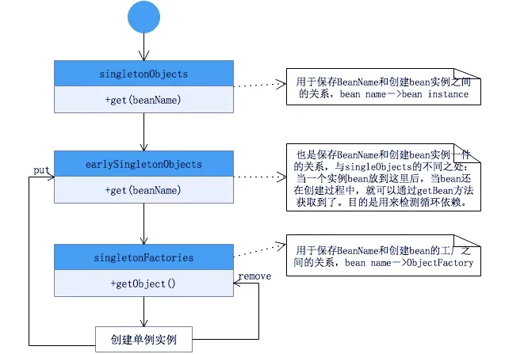

# Table of Contents

* [简单工厂](#简单工厂)
* [工厂方法](#工厂方法)
* [单例](#单例)
* [适配器模式](#适配器模式)
* [装饰器模式](#装饰器模式)
* [代理模式](#代理模式)
* [观察者模式](#观察者模式)
* [策略模式](#策略模式)
  * [策略模式如何解决传递对象过大的问题，后面的依赖前面的](#策略模式如何解决传递对象过大的问题后面的依赖前面的)
* [模板方法](#模板方法)
* [责任链模式](#责任链模式)
* [参考资料](#参考资料)


# 简单工厂

> 设计意义

- 松耦合。可以将原来硬编码的依赖，通过Spring这个beanFactory这个工厂来注入依赖，也就是说原来只有依赖方和被依赖方，现在我们引入了第三方——Spring这个beanFactory，由它来解决bean之间的依赖问题，达到了松耦合的效果。
- bean的额外处理。通过Spring接口的暴露，在实例化bean的阶段我们可以进行一些额外的处理，这些额外的处理只需要让bean实现对应的接口即可，那么spring就会在bean的生命周期调用我们实现的接口来处理该bean。


> 实现方式：BeanFactory。

Spring中的BeanFactory就是简单工厂模式的体现，根据传入一个唯一的标识**通过反射**来获得Bean对象，但是否是在传入参数后创建还是传入参数前创建这个要根据具体情况来定。

实质：由一个工厂类根据传入的参数，动态决定应该创建哪一个产品类。


> Beactory和ApplicationContext


ApplicationContext：面向开发人员


# 工厂方法


> 设计意义

+ `@Bean`注解，但比其能实现更多复杂的功能，对对象增强。
+ `FactoryBean` 通常是用来创建比较复杂的bean，一般的bean 直接用xml配置即可，但如果一个bean的创建过程中涉及到很多其他的bean 和复杂的逻辑，用xml配置比较困难，这时可以考虑用FactoryBean。

+ 当我们使用第三方框架或者库时，有时候是无法去new一个对象的， 比如静态工厂，对象是不可见的，只能通过getInstance（）之类方法获取，
   此时就需要用到FactoryBean,通过实现`FactoryBean`接口的bean重写getObject（）方法， 返回我们所需要的bean对象。


>  实现方式：FactoryBean接口。

实现原理：实现了FactoryBean接口的bean是一类叫做factory的bean。其特点是，spring会在使用getBean()调用获得该bean时，会自动调用该bean的getObject()方法，所以返回的不是factory这个bean，而是这个bean.getOjbect()方法的返回值。


> 注意！！

FactoryBean表现的是一个工厂的职责。 **即一个Bean A如果实现了FactoryBean接口，那么A就变成了一个工厂，根据A的名称获取到的实际上是工厂调用getObject()返回的对象，而不是A本身，如果要获取工厂A自身的实例，那么需要在名称前面加上'&'符号。**

```java
getObject(' name ')返回工厂中的实例
getObject(' &name ')返回工厂本身的实例
```


>  例子：


- 典型的例子有Spring与MyBatis的结合。

- 代码示例

  

- 说明：我们看上面该bean，因为实现了FactoryBean接口，所以返回的不是SqlSessionFactoryBean的实例，而是它的 SqlSessionFactoryBean.getObject()的返回值。


# 单例

> 单例模式定义：保证一个类仅有一个实例，并提供一个访问它的全局访问点。


Spring依赖注入Bean实例默认是单例的。

Spring的依赖注入（包括lazy-init方式）都是发生在AbstractBeanFactory的getBean里。getBean的doGetBean方法调用getSingleton进行bean的创建。

分析getSingleton()方法：
getSingleton()过程图（ps：Spring依赖注入时，**使用了双重判断加锁**的单例模式）：




Spring对单例的实现：Spring中的单例模式完成了后半句话，即提供了全局的访问点BeanFactory。**但没有从构造器级别去控制单例，这是因为Spring管理的是任意的Java对象。**

+ 饿汉

  ```java
  public class Singleton {
      // 首先，将 new Singleton() 堵死
      private Singleton() {};
      // 创建私有静态实例，意味着这个类第一次使用的时候就会进行创建
      private static Singleton instance = new Singleton();
  
      public static Singleton getInstance() {
          return instance;
      }
      // 瞎写一个静态方法。这里想说的是，如果我们只是要调用 Singleton.getDate(...)，
      // 本来是不想要生成 Singleton 实例的，不过没办法，已经生成了
      public static Date getDate(String mode) {return new Date();}
  }
  ```

+ 饱汉

  ```java
  public class Singleton {
      // 首先，也是先堵死 new Singleton() 这条路
      private Singleton() {}
      // 和饿汉模式相比，这边不需要先实例化出来，注意这里的 volatile，它是必须的?
      //保证其第一次判断为空的时候的可见性。
      private static volatile Singleton instance = null;
  
      public static Singleton getInstance() {
          if (instance == null) {
              // 加锁
              synchronized (Singleton.class) {
                  // 这一次判断也是必须的，不然会有并发问题
                  if (instance == null) {
                      instance = new Singleton();
                  }
              }
          }
          return instance;
      }
  }
  ```

  


# 适配器模式

实现方式：SpringMVC中的适配器HandlerAdatper。


实现原理：HandlerAdatper根据Handler规则执行不同的Handler。


实现过程：DispatcherServlet根据HandlerMapping返回的handler，向HandlerAdatper发起请求，处理Handler。HandlerAdapter根据规则找到对应的Handler并让其执行，执行完毕后Handler会向HandlerAdapter返回一个ModelAndView，最后由HandlerAdapter向DispatchServelet返回一个ModelAndView。


实现意义：HandlerAdatper使得Handler的扩展变得容易，只需要增加一个新的Handler和一个对应的HandlerAdapter即可。因此Spring定义了一个适配接口，使得每一种Controller有一种对应的适配器实现类，让适配器代替controller执行相应的方法。这样在扩展Controller时，只需要增加一个适配器类就完成了SpringMVC的扩展了。

#	装饰器模式

实现方式：

Spring中用到的包装器模式在类名上有两种表现：一种是类名中含有Wrapper，另一种是类名中含有Decorator。

实质：

动态地给一个对象添加一些额外的职责。

就增加功能来说，Decorator模式相比生成子类更为灵活。

# 代理模式

实现方式：AOP底层，就是动态代理模式的实现。

- 动态代理：在内存中构建的，不需要手动编写代理类
- 静态代理：需要手工编写代理类，代理类引用被代理对象。

实现原理：切面在应用运行的时刻被织入。一般情况下，在织入切面时，AOP容器会为目标对象创建动态的创建一个代理对象。SpringAOP就是以这种方式织入切面的。

织入：把切面应用到目标对象并创建新的代理对象的过程。

# 观察者模式

+ 事件（ApplicationEvent）

  ```java
  @Component
  public class MyEvent extends ApplicationEvent {
  
  
      public MyEvent(ApplicationContext source) {
          super(source);
          System.out.println("MyEvent 构造器执行");
      }
  
      public void echo() {
          System.out.println("模拟业务逻辑执行");
      }
  }
  ```

  

+ 事件监听（ApplicationListener）

  ```java
  @Component
  public class MyListenerA implements ApplicationListener<MyEvent> {
  
  
      @Override
      public void onApplicationEvent(MyEvent myEvent) {
          System.out.println("MyListenerA");
          myEvent.echo();
      }
  }
  ```

  

+ 事件发布（ApplicationContext）

  ```java
  @Component
  public class MyPublisher implements ApplicationContextAware {
  
      private ApplicationContext applicationContext;
  
  
      @Override
      public void setApplicationContext(ApplicationContext applicationContext) throws BeansException {
          this.applicationContext = applicationContext;
      }
  
      /**
       * 发布事件
       * 监听该事件的监听者都可以获取消息
       *
       * @param myEvent
       */
      public void publisherEvent(MyEvent myEvent) {
          System.out.println("---开始发布 myEvent 事件---");
          applicationContext.publishEvent(myEvent);
      }
  }
  ```

  

+  事件管理（ApplicationEventMulticaster）

  ```java
  public void multicastEvent(final ApplicationEvent event, @Nullable ResolvableType eventType) {
     ResolvableType type = (eventType != null ? eventType : resolveDefaultEventType(event));
     //从多播器中获取出所有的监听器
     for (final ApplicationListener<?> listener : getApplicationListeners(event, type)) {
        //判断多播器中是否支持异步多播的
        Executor executor = getTaskExecutor();
        if (executor != null) {
           //异步播发事件
           executor.execute(() -> invokeListener(listener, event));
        }
        else {//同步播发
           invokeListener(listener, event);
        }
     }
  }
  ```

  

> 可以联想到Redis的事件发布机制


# 策略模式

## 策略模式如何解决传递对象过大的问题，后面的依赖前面的

+ 精简对象
+ 放入redis
+ 设计的时候，考虑不依赖


实现方式：Spring框架的资源访问Resource接口。该接口提供了更强的资源访问能力，Spring框架本身大量使用了Resource接口来访问底层资源。


**Resource接口介绍**


source接口是具体资源访问策略的抽象，也是所有资源访问类所实现的接口。

Resource接口主要提供了如下几个方法：

- getInputStream()：定位并打开资源，返回资源对应的输入流。每次调用都返回新的输入流。调用者必须负责关闭输入流。
- exists()：返回Resource所指向的资源是否存在。
- isOpen()：返回资源文件是否打开，如果资源文件不能多次读取，每次读取结束应该显式关闭，以防止资源泄漏。
- getDescription()：返回资源的描述信息，通常用于资源处理出错时输出该信息，通常是全限定文件名或实际URL。
- getFile：返回资源对应的File对象。
- getURL：返回资源对应的URL对象。


最后两个方法通常无须使用，仅在通过简单方式访问无法实现时，Resource提供传统的资源访问的功能。

Resource接口本身没有提供访问任何底层资源的实现逻辑，针对不同的底层资源，Spring将会提供不同的Resource实现类，**不同的实现类负责不同的资源访问逻辑。**

Spring为Resource接口提供了如下实现类：

- UrlResource：访问网络资源的实现类。
- ClassPathResource：访问类加载路径里资源的实现类。
- FileSystemResource：访问文件系统里资源的实现类。
- ServletContextResource：访问相对于ServletContext路径里的资源的实现类.
- InputStreamResource：访问输入流资源的实现类。
- ByteArrayResource：访问字节数组资源的实现类。


这些Resource实现类，针对不同的的底层资源，提供了相应的资源访问逻辑，并提供便捷的包装，以利于客户端程序的资源访问。


# 模板方法

经典模板方法定义：

>  父类定义了骨架（调用哪些方法及顺序），某些特定方法由子类实现。

最大的好处：代码复用，减少重复代码。除了子类要实现的特定方法，其他方法及方法调用顺序都在父类中预先写好了。

以父类模板方法中有两类方法：

- 共同的方法：所有子类都会用到的代码

- 不同的方法：子类要覆盖的方法，分为两种：

- - 抽象方法：父类中的是抽象方法，子类必须覆盖
  - 钩子方法：父类中是一个空方法，子类继承了默认也是空的

- 注：为什么叫钩子，子类可以通过这个钩子（方法），控制父类，因为这个钩子实际是父类的方法（空方法）！

Spring模板方法模式实质：是模板方法模式和回调模式的结合，是Template Method不需要继承的另一种实现方式。Spring几乎所有的外接扩展都采用这种模式。

JUC包下的AQS也是模板方式的实现。


# 责任链模式

AOP调用拦截器调用


# 参考资料

<https://mp.weixin.qq.com/s/bOg0YyEdOmKh1c20VClnKQ>

https://mp.weixin.qq.com/s/Spp0Twqbp2_vaMXj4fmrfA

https://zhuanlan.zhihu.com/p/339484007
