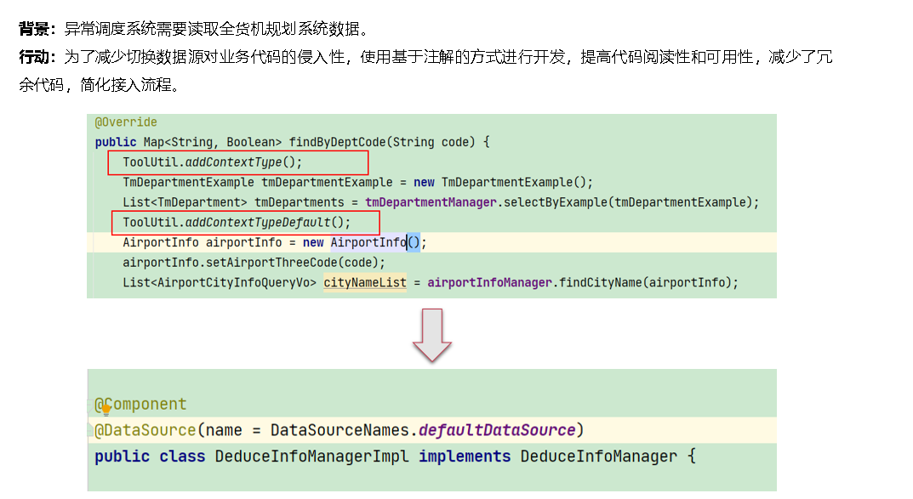
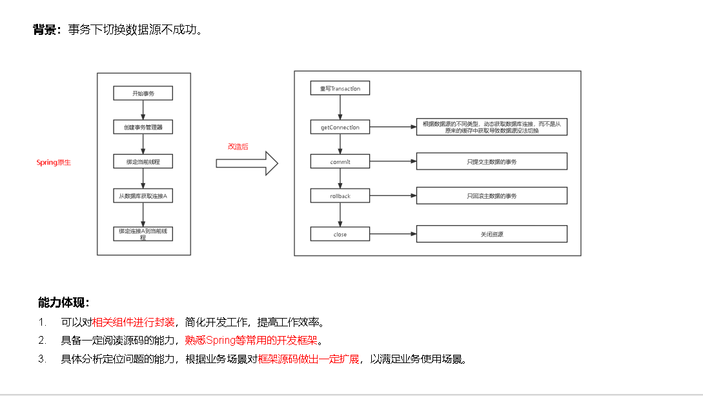
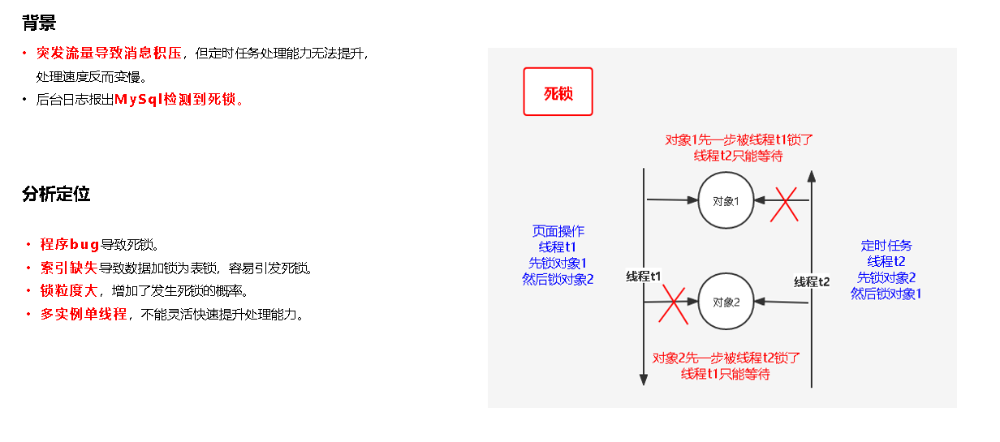
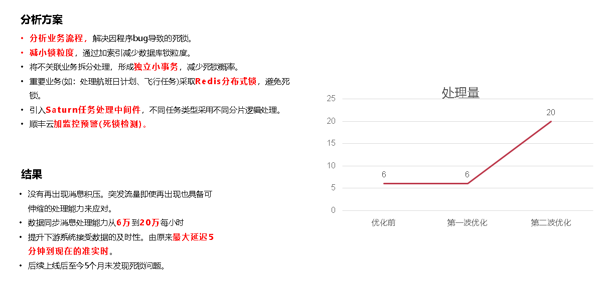

# Table of Contents

* [自我介绍](#自我介绍)
* [下面第一个介绍的是需求分析的内容](#下面第一个介绍的是需求分析的内容)
* [第二个介绍开发工具方面的内容](#第二个介绍开发工具方面的内容)
* [第三个介绍是开发语言方面的内容](#第三个介绍是开发语言方面的内容)
* [第四个介绍是数据库与中间件方面的内容](#第四个介绍是数据库与中间件方面的内容)


开发工具（必填）
开发语言（必填）
数据库与中间件
需求分析
开发框架
架构能力（必填）

现在必填是3选2 其他3 选2


# 自我介绍


各位评委老师，大家下午好！
我叫XX,来自交通运输中心全货机研发组，目前参与的项目是全货机规划系统和异常调度系统。主要负责规划系统任务、作业模块的功能维护和异常调度系统部分功能模块的研发。

以下我将从 需求分析、 开发工具、 开发语言、 数据库与中间件 的维度举证自己的专业能力。


# 下面第一个介绍的是需求分析的内容


背景 巴拉巴拉

任务 巴拉巴拉


行动主要分4个大步骤


第一个步骤是需求调研准备


了解需求背景、需求解决的问题、需求是否合理、是否有更好的解决方案。


>  在了解需求过程中，产品要求对换并填单独抽出一个作业流程，我这边基于对之前业务的理解，提出了自己的观点，目前现有的作业流程上稍微改造是可以满足换并填的业务需求的。如果单独抽取一个流程，会带来不必要的业务逻辑，事后，详细跟产品讨论了需求的业务逻辑流程图，并用现有数据证明了自己结论。


最后确定上线时间 以及验收准备。


第二个步骤是制定研发计划


确定双方系统如何对接、对接的方式、对接文档、对接人、对接时间、测试联调时间、对方上线时间。

拆分需求优先级进行排期。

对测试用例进行评审，提出自己的疑问。

根据研发计划和测试确定冒烟用例时间、提测时间。

按照计划进行开发。


第三个步骤是进行三方系统联调

按照计划进开发联调。

按照计划进测试联调。

三方产品整体流程验收。


在对杭州进行试点的过程中 发现了有部分数据不正常，最后发现是线下操作不规范导致。有力的推动了线下流程的规范性

以及在线下数据中，发现上游数据跟之前对接不一致导致。推动上游逻辑修正。


结果 就照着读 就可以了 


1. 背景？

   【换并填功能业务目标】 实现枢纽换并填作业线上化操作，助力枢纽信息共享目标的实现。

   【换并填功能效益目标】 提高板箱装载率，降低因板箱运输、拆板分捡等作业环节产生的成本。 换并填功能是板箱直转功能的延伸，可使满足条件的票件跳过分捡环节，节省分捡资源，提高板箱转运时效。 换并填功能无需增加前站操作和设备需求，同时可降低枢纽内对分捡作业设备能力的需求。

2. 如何确定技术方案选型？

   首先对业务进行分析，是单独抽出流程还是对现有流程改造。

   经过和产品经理和项目经理讨论后，在现有流程改造。


# 第二个介绍开发工具方面的内容


照着ppt 巴拉巴拉


>
>
>经过对业务仔细分析，设计表结构以及前后端数据交互格式，最终得到以下功能效果图
>
>这里比较难的一个点是在于，航班是可以上下拖动，且每次拖动都需要刷新对应航班对应信息以及对应位置信息。
>
>这里在设计前后端数据格式的时候，就确定了用机号带出对应航班信息，所以前端在拖动航班位置的时候，只需要传入当前改变的机号信息，就可以
>
>只刷新当前拖动位置的信息。


照着ppt 巴拉巴拉


# 第三个介绍是开发语言方面的内容

**背景：**异常调度系统需要读取全货机规划系统数据。

**行动****：**为了减少切换数据源对业务代码的侵入性，使用基于注解的方式进行开发，提高代码阅读性和可用性，减少了冗余代码，简化接入流程。


这是原先调用切换的方式，需要手动编写，

下图是采用注解的方式，直接在mapper上定义，使用方式时，自动切换数据源。


**背景：**事务下切换数据源不成功。

> 当事务配置在Servic层时，Spring在开启一个事务时，就预先从配置的数据源DataSource里生成一个Connection，然后存入一个ThreadLocal类型的变量里，放在 “TransactionSynchronizationManager” 的 “resources” 变量里，key就是DataSource，这样Mybatis从SqlSession在操作数据库时，如果当前操作是配置了事务，也会用当前DataSource从此ThreadLocal的变量里获取Connection具体代码可以查看SpringManagedTransaction的getConnection方法。


改造：

>  从以上流程可以分析出关键就是，SpringManagedTransaction的getConnection方法。
>
> 
>
> 


> 这里要明白一点 getConnection 其实就是拿的TCP连接

1. 是不是必须要用多数据源，你们是怎么考虑的？

   异常调度系统需要嵌入原有的全货机系统，原有全货机是基于novatar框架进行开发的，在此背景下采用了多数据源。

   也考虑过使用http的方式进行调用，但是会增加http线程，以及流量开销。还有网络延迟。

2.  注解怎么实现切换的？ 一个mapper就是一个数据源。

3. 事务是如何让多次数据库操作一起成功或一起回滚的？

**主要是事务里会绑定一个Connection，也就是数据库连接对象，多次数据库操作共用同一个Connection对象**

4. Spring事务是如何让多个数据库操作共用同一个Connection?

   当事务配置在Servic层时，Spring在开启一个事务时，就预先从配置的数据源DataSource里生成一个Connection，然后存入一个ThreadLocal类型的变量里，放在 “TransactionSynchronizationManager” 的 “resources” 变量里，key就是DataSource，这样Mybatis从SqlSession在操作数据库时，如果当前操作是配置了事务，也会用当前DataSource从此ThreadLocal的变量里获取Connection，具体代码可以查看SpringManagedTransaction的getConnection方法。
   
5. 如何实现事务下多数据源 一读一写?

​	dataSource .getConnection 重写         再从threadlocal拿标识

7. 会不会性能开销? 

   本身连接池的连接就存在，数据源切换只是告诉系统，我从哪个连接池那连接去取数据，

   开销是：数据库连接池 以及连接消亡后的新建。

   mapperA  A连接
   mapperB  B连接 
   代码切换 分别用不同连接取请求

8. 注解自由度降低了，也考虑过这方面的，数据源切换？？？？？

3. 启用事务后，`main数据源` 可以正常回滚，而 `dbx数据源` 无法回滚。原因是，**项目的默认数据源是`main`，在开启事务时，使用的是默认数据源，无论后面切换到哪个数据源，事务只有在main数据源上是开启的，事务回滚与提交也只操作main数据源**。

   

   ​	


# 第四个介绍是数据库与中间件方面的内容


•**突发流量导致消息积压**，但定时任务处理能力无法提升，处理速度反而变慢。

•后台日志报出**MySql****检测到死锁。**


> 我这边的处理是，首先根据错误日志的堆栈信息，mysql死锁日志相关信息，，首先分析出产生死锁的表，
>
> 在结合系统埋点日志,分析出前端页面和定时任务的某个任务，对可视化资源表加锁顺序不一致导致了死锁。
>
> 在排查过程种，还发现了
>
> •**索引缺失**导致数据加锁为表锁，容易引发死锁。
>
> •**锁粒度大**，增加了发生死锁的概率。
>
> •**多实例单线程**，不能灵活快速提升处理能力。


以下是我这边做出的解决方案


•**分析业务流程，**解决因程序bug导致的死锁。

•**减小****锁粒度**，通过加索引减少数据库锁粒度。

•将不关联业务拆分处理，形成**独立小事务**，减少死锁概率。

•重要业务(如：处理航班日计划、飞行任务)采取**Redis****分布式锁**，避免死锁。

•引入**Saturn****任务处理中间件**，不同任务类型采用不同分片逻辑处理。

•顺丰云**加监控预警****(****死锁检测****)****。**


死锁不能完全杜绝 但是可以减小其发生概率

锁表的问题，就看情况咯，insert，delete的锁表没办法避免，只能说让两个线程不要互相等待


1. 死锁产生的条件？

    （1） 互斥条件：一个资源每次只能被一个进程使用。

    （2） 请求与保持条件：一个进程因请求资源而阻塞时，对已获得的资源保持不放。

    （3） 不可剥夺条件:进程已获得的资源，在末使用完之前，不能强行剥夺。

    （4） 循环等待条件:若干进程之间形成一种头尾相接的循环等待资源关系。

2. 怎么定位死锁的？怎么分析死锁日志

    + 线上错误日志报警发现死锁异常

    + 查看错误日志的堆栈信息  jstack

    + 查看 MySQL 死锁相关的日志

      ​	show engine innodb status

    + 根据 binlog 查看死锁相关事务的执行内容

3. 怎么解决死锁的？

    ​	Mysql本身有死锁检测，超时时间会自动回滚。回滚事务比较小的 

    

    + 本身有一个超时时间，即当两个事务互相等待时，当一个等待时间超过设置的某一阂值时，
      其中一个事务进行回滚，另一个等待的事务就能继续进行。

      
  
    
show VARIABLES like 'innodb_rollback_on_timeout'
    
4. 怎样处理消息积压

    + 不同任务类型 分片处理。

5. 定时任务 频率是多少？

6. 怎么创建索引？

    ```
    考虑列的基数(离散性)
    只为用于搜索、排序或分组的列创建索引
    不要对索引列进行处理
    索引列的类型尽量小
    ```


我的发言完毕，欢迎评委提问。


# 图片









