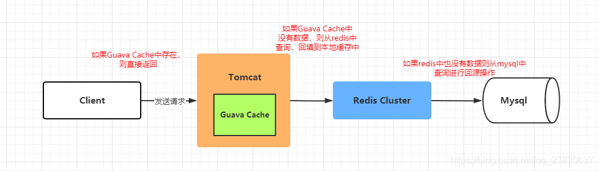

# Table of Contents

* [应用场景](#应用场景)
* [原理](#原理)
* [数据失效怎么处理？](#数据失效怎么处理)
* [实战项目](#实战项目)

# 应用场景

当缓存服务器重启或者大量缓存集中在某一个时间段失效，这样在失效的时候，也会给后端系统带来很大压力。突然间大量的key失效了或redis重启，大量访问数据库，数据库崩溃，这时候就需要设置**一个本地缓存作为二级缓存**来解决这个问题。

> 注意时本地缓存作为二级缓存。

本地缓存的应用场景：

+ 对性能有非常高的要求
+ 不经常变化
+ 占用内存不大
+ 有访问整个集合的需求
+ 数据允许不**实时**一致

# 原理

1. 客户端读取数据
2. Guava Cache存在直接返回，否则从redis读取数据，放到Guava Cache。
3. 如果Redis也没有，查数据库，放Redis,放Guava Cache

# 数据失效怎么处理？

目前采用的是直接删除redis和Guava Cache数据，读取时候在放入。

# 实战项目

https://mp.weixin.qq.com/s/4a-nIjS4Z55XzEdZQPl7tQ
