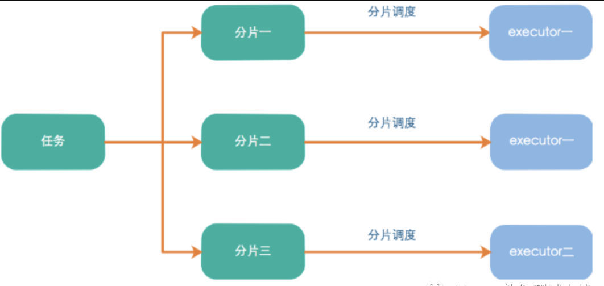
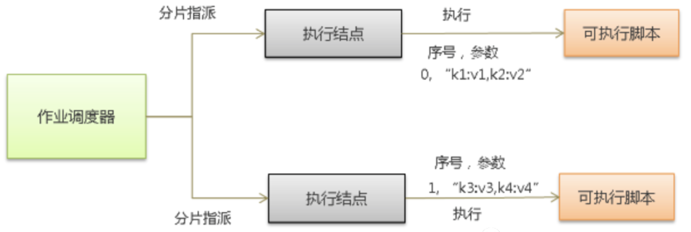
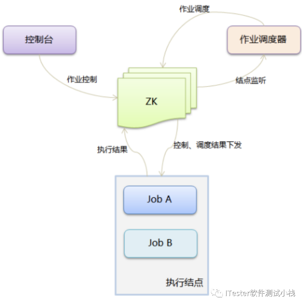
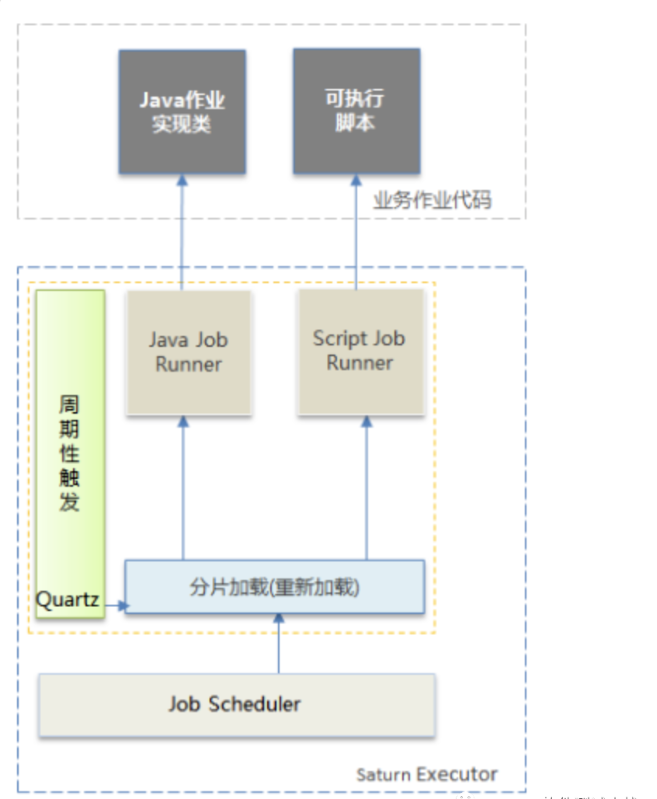

# Table of Contents

* [简介](#简介)
  * [架构](#架构)
  * [特性](#特性)
  * [专业术语](#专业术语)
* [**Saturn架构**(重点)](#saturn架构重点)
  * [原理](#原理)
  * [场景](#场景)
  * [组成](#组成)
* [疑问](#疑问)

+ 官方文档：https://github.com/vipshop/Saturn/wiki/Saturn%E6%9E%B6%E6%9E%84%E6%96%87%E6%A1%A3#33-saturn-%E4%BD%9C%E4%B8%9A%E5%88%86%E7%89%87%E8%B0%83%E5%BA%A6%E5%99%A8

# 简介

`Saturn` 任务调度系统是唯品会开源的一个分布式任务调度平台，取代传统的Linux Cron/Spring Batch Job的方式，**做到全域统一配置，统一监控，任务高可用以及分片并发处理，更重要的是其还支持容器化技术**，同时Saturn中的任务不仅支持Java，还支持Shell脚本，目前Saturn已经在Github上开源。

## 架构

Saturn定时任务调度的最小单位是分片，即任务的一个并行执行单元。Saturn的基本任务就是将**任务分成多个分片，并将每个分片通过算法调度到对应的Executor上去执行**

> 什么是任务分片？
>
> 将一个任务分成多个小任务在多个实例同时执行。
>
> 举个例子。
>
> 

## 特性

- 支持多种语言作业，语言无关(Java/Go/C++/PHP/Python/Ruby/shell)；
- 支持秒级调度；
- 支持作业分片并行执行；
- 支持依赖作业串行执行；
- 支持作业高可用和智能负载均衡；
- 支持异常检测和自动失败转移；
- 支持多个集群部署；
- 支持弹性动态扩容；
- 支持优先级和权重设置；
- 支持docker容器，容器化友好；
- 支持cron时间表达式；
- 支持多个时间段暂停执行控制；
- 支持超时告警和超时强杀控制；
- 支持灰度发布；
- 支持异常、超时和无法高可用作业监控告警和简易的故障排除；
- 支持失败率最高、最活跃和负荷最重的各域各节点TOP10的作业统计；

## 专业术语

`组织名`：每个namespace可以属于一个组织。

+ `作业`(Job)和`作业分片`：作业(Job)是可以独立运行的脚本(shell作业)或者具备某项功能的函数实现(java、消息作业)。作业可并发执行在多个执行节点(Executor)上，作业分片定义了作业并发执行的数量以及执行编号。 

+ `域`（Namespace）：代表一组特定的执行结点和作业，作业必须而且只能属于某一个特定的域。一个域下通常有若干个执行结点，执行结点必须而且只能属于某一个特定的域。域下的全部执行结点功能是对等的，域下的任何一下执行结点均有能力执行域下的全部作业，换言之，作业可以在域下任何一个执行结点执行。

+ `执行结点`(Executor)：是调用并执行作业的程序，它通过定时(quartz)驱动来触发调用事件，并最终调用作业的执行入口(shell脚本或者函数实现)，执行结点只会处理指派给它的作业分片。

+ `控制台`(Console)：统一配置界面，可以使用控制台来查看作业状态，执行结点状态和执行日志，添加、删除作业，修改作业属性。

# **Saturn架构**(重点)

## 原理

Saturn的基本原理是

1. 将作业在逻辑上划分为若干个作业分片，通过作业分片调度器将作业分片指派给特定的执行结点。
2. 执行结点通过quartz触发执行作业的具体实现（以shell为例，则为shell脚本)，
3. 在执行的时候，会将分片序号和参数作为参数传入(见图1)。
4. 作业的实现逻辑需分析分片序号和分片参数，并以此为依据来调用具体的实现（比如一个批量处理数据库的作业，可以划分0号分片处理1-10号数据库，1号分片处理11-20号数据库）。

> 并行调用多个执行器，传入参数，让不同的执行器根据不同的参数做不同的事情。最终把事情做完。

## 场景

有时候由于测试业务的需要，我们需要按照工作流的方式去调度作业：JobA调度成功后调度 JobB, JobB调度成功后调度 JobC。Saturn提供这个能力，我们称之为作业编排。作业编排将作业形成一个有向无环图，按照图的顺序依次调用。

## 组成

Saturn包括两大部分，Saturn Console和Saturn Executor。

`Saturn Console`是一个GUI，用于作业/Executor管理，统计报表展现，系统配置等功能。它是整个调度系统的大脑：将作业任务分配到各Executor。为了实现Console的高可用性。希望Console有多台服务器所组成，只需要在多台不同的服务器的环境变量中指定相同的VIP_SATURN_CONSOLE_CLUSTER即可，至于VIP_SATURN_CONSOLE_CLUSTER的值可以自行指定，只是一个集群标识而已。

`Saturn Executor`是执行任务的Worker：按照作业配置的要求去执行部署于Executor所在容器或物理机当中的作业脚本和代码。

# 疑问

1. 怎么保证同一时刻只有一个任务在执行？

   zk节点的一致性。

   
