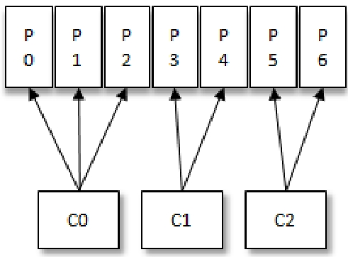
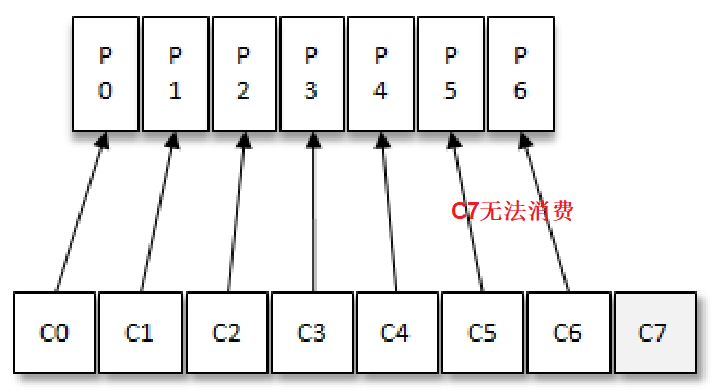

# Table of Contents

* [为什么要有消费者组](#为什么要有消费者组)
* [消费者和分区的关系](#消费者和分区的关系)
* [消费者个数变化](#消费者个数变化)
* [消息投递模式](#消息投递模式)
* [总结](#总结)

# 为什么要有消费者组

+ 提高性能
+ 消费模式灵活
+ 故障容灾

消费者（Consumer）负责订阅Kafka中的主题（Topic），并且从订阅的主题上拉取消息。

与其他一些消息中间件不同的是：

在Kafka的消费理念中还有一层消费组（Consumer Group）的概念，**每个消费者都有一个对应的消费组。**

**当消息发布到主题后，只会被投递给订阅它的*每个消费组中的一个消费者***

# 消费者和分区的关系

如图所示，某个主题中共有4个分区（Partition）：P0、P1、P2、P3。

有两个消费组A和B都订阅了这个主题，消费组A中有4个消费者（C0、C1、C2和C3），消费组B中有2个消费者

（C4和C5）。按照Kafka默认的规则，最后的分配结果是消费组A中的每一个消费者分配到1个分区，消费组B中的

每一个消费者分配到2个分区，两个消费组之间互不影响。每个消费者只能消费所分配到的分区中的消息。

>  换言之，**每一个分区只能被一个消费组中的一个消费者**所消费。多读几遍！
>
> 如果跨消费者组，可能出现消费的消息无序的情况。

> Q：当前分区的某条M消息被A消费组的消费者A1消费了，还能被B消费组的B1消费吗？
>
> A：可以的  1234会被A消费者和B消费者组都消费一遍。

# 消费者个数变化

+ 假设目前某消费组内只有一个消费者 C0，订阅了一个主题，这个主题包含 7 个分区：P0、P1、P2、P3、P4、P5、P6。也就是说，这个消费者C0订阅了7个分区。

+ 此时消费组内又加入了一个新的消费者C1，按照既定的逻辑，需要将原来消费者C0的部分分区分配给消费者C1消费

  

+ 紧接着消费组内又加入了一个新的消费者C2，消费者C0、C1和C2按照下图中的方式各自负责消费所分配到的分区。

  

+ 消费者与消费组这种模型可以让整体的消费能力**具备横向伸缩性**，我们可以增加（或减少）消费者的个数来提高（或降低）整体的消费能力。

+ 对于分区数固定的情况，一味地增加消费者并不会让消费能力一直得到提升，**如果消费者过多，出现了消费者的个数大于分区个数的情况，就会有消费者分配不到任何分区。**

以上分配逻辑都是基于**默认的分区分配策略**进行分析的，可以通过消费者客户端参`partition.assignment.strategy` 来设置消费者与订阅主题之间的分区分配策略

> Q：**消费组中的消费者个数如果超过topic的分区，那么就会有消费者消费不到数据”这句话是否正确？如果不正确，那么有没有什么hack的手段**
>
> A: 自定义分区策略。

# 消息投递模式

对于消息中间件而言，一般有两种消息投递模式：

+ 点对点（P2P，Point-to-Point）模式
+ 发布/订阅（Pub/Sub）模式。

Kafka 同时支持两种消息投递模式，而这正是得益于消费者与消费组模型的契合：

+ **如果所有的消费者都隶属于同一个消费组**，那么所有的消息都会被均衡地投递给每一个消费者，即每条消息只会被一个消费者处理，这就相当于点对点模式的应用。
+  **如果所有的消费者都隶属于不同的消费组**，那么所有的消息都会被广播给所有的消费者，即每条消息会被所有的消费者处理，这就相当于发布/订阅模式的应用。

> 这里将消费者组看作成一个人，就比较好理解了

# 总结

+ 消费组是一个逻辑上的概念，它将旗下的消费者归为一类，每一个消费者只隶属于一个消费组。每一个消费组都会有一个固定的名称，消费者在进行消费前需要指定其所属消费组的名称，这个可以通过消费者客户端参数group.id来配置，默认值为空字符串。

+ 消费者并非逻辑上的概念，它是实际的应用实例，它可以是一个线程，也可以是一个进程。同一个消费组内的消费者既可以部署在同一台机器上，也可以部署在不同的机器上。
