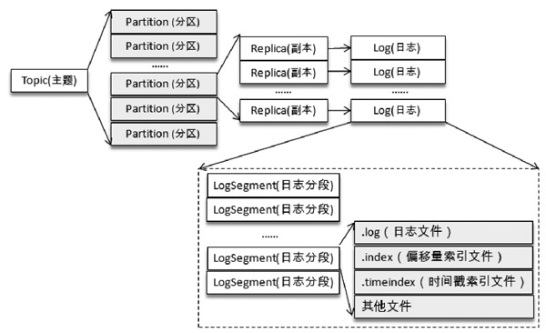
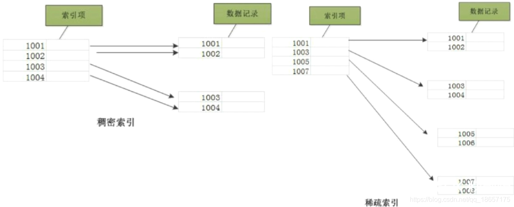
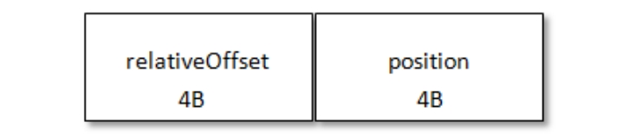
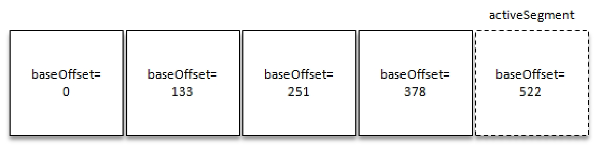
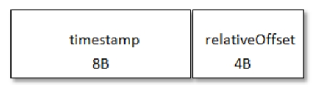

# Table of Contents

* [日志目录结构](#日志目录结构)
  * [activeSegment](#activesegment)
  * [索引文件](#索引文件)
  * [checkPoint](#checkpoint)
* [消息压缩](#消息压缩)
* [日志索引](#日志索引)
  * [稀疏索引](#稀疏索引)
  * [索引分段](#索引分段)
  * [偏移量索引](#偏移量索引)
  * [时间戳索引](#时间戳索引)

> 什么时候刷盘的额？

我们知道Kafka中的消息是存储在磁盘上的，那么为什么要使用磁盘作为存储介质？具体消息的存储格式又是什么呢？怎么样能够快速检索到指定的消息？消息不可能无限制存储，那么清理规则又是什么呢？

# 日志目录结构

##  activeSegment

向Log 中追加消息时是顺序写入的，我们将最后一个 LogSegment 称为“activeSegment”，即表示当前活跃的日志分段。随着消息的不断写入，当activeSegment满足一定的条件时，就需要创建新的activeSegment，之后追加的消息将写入新的activeSegment。

> 顺序IO

## 索引文件

每个LogSegment中的日志文件（以“.log”为文件后缀）都有对应的两个索引文件：

+ 偏移量索引文件（以“.index”为文件后缀）
+ 时间戳索引文件（以“.timeindex”为文件后缀）

**每个 LogSegment 都有一个基准偏移量 baseOffset，用来表示当前 LogSegment中第一条消息的offset**。

偏移量是一个64位的长整型数，日志文件和两个索引文件都是根据基准偏移量（baseOffset）命名的，名称固定

> 好多设计的id都是64位长整数，基本是用不完的。比如事务id、自增id等等。

为20位数字，没有达到的位数则用0填充。比如第一个LogSegment的基准偏移量为0，对应的日志文件为00000000000000000000.log。

> 因为是顺序读写的，下一个日志文件的开头肯定是上一个日志文件的结尾(开头+偏移量)
> 那么如何分割的呢？

## checkPoint

当一个Kafka服务第一次启动的时候，默认的根目录下就会创建以下5个文件：

> 这个应该是删除的时候用？

我们了解到消费者提交的位移是保存在 Kafka 内部的主题__consumer_offsets中的，**初始情况下这个主题并不存在，当第一次有消费者消费消息时会自动创建这个主题。**

> 有点懒加载的味道

每一个根目录都会包含最基本的 4个检查点文件（xxx-checkpoint）和 meta.properties 文件。

在创建主题的时候，如果当前 broker中不止配置了一个根目录，那么会挑选分区数最少的那个根目录来完成本次创建任务。

# 消息压缩

常见的压缩算法是数据量越大压缩效果越好,一条消息通常不会太大,这就导致压缩效果并不是太好。

而 Kafka实现的压缩方式是将**多条消息一起进行压缩**,这样可以保证较好的压缩效果。在一般情况下,生产者发送的压缩数据在 broker中也是保持压缩状态进行存储的,消费者从服务端获取的也是压缩的消息,消费者在处理消息之前才会解压消息,这样保持了端到端的压缩。

> **注意要点**:压缩率是压缩后的大小与压缩前的对比。例如:把100MB的文件压缩后是90MB压缩率为90/100×100%=90%,压缩率越小,压缩效果越好。

**消息压缩时是将整个消息集进行压缩作为内层消息(inner message),内层消息整体作为外层(wrapper message)的value**

# 日志索引

## 稀疏索引

每个日志分段文件对应了两个索引文件，主要用来提高查找消息的效率。

+ 偏移量索引文件用来建立消息偏移量（offset）到物理地址之间的映射关系，方便快速定位消息所在的物理文件位置；
+ 时间戳索引文件则根据指定的时间戳（timestamp）来查找对应的偏移量信息。

Kafka 中的索引文件以**稀疏索引**（sparse index）的方式构造消息的索引，它并不保证每个消息在索引文件中都有

> 稀疏索引:文件只为索引码的某些值建立索引项
>
> Mysql的二级索引树

对应的索引项。**每当写入一定量**（由 broker 端参数 log.index.interval.bytes指定，默认值为4096，即4KB）的消

息时，偏移量索引文件和时间戳索引文件分别增加一个偏移量索引项和时间戳索引项，增大或减小

log.index.interval.bytes的值，对应地可以增加或缩小索引项的密度。

稀疏索引通过 **MappedByteBuffer 将索引文件映射到内存**中，以加快索引的查询速度。

> 并不是读取到。映射和读取怎么理解。如果映射快，那Mysql为什么不用？

+ 偏移量索引文件中的偏移量是单调递增的，查询指定偏移量时，使用二分查找法来快速定位偏移量的位置，如果指定的偏移量不在索引文件中，则会返回小于指定偏移量的最大偏移量。

+ 时间戳索引文件中的时间戳也保持严格的单调递增，查询指定时间戳时，也根据二分查找法来查找不大于该时间戳的最大偏移量，至于要找到对应的物理文件位置还需要根据偏移量索引文件来进行再次定位。

**稀疏索引的方式是在磁盘空间、内存空间、查找时间等多方面之间的一个折中。**

## 索引分段

日志分段文件达到一定的条件时需要进行切分，那么其对应的索引文件也需要进行切分。

## 偏移量索引

偏移量索引项的格式如下图所示。

每个索引项占用 8 个字节，分为两个部分：

**(1) relativeOffset**: 相对偏移量，表示消息相对于 baseOffset 的偏移量，占用 4 个字节，当前索引文件的文件名即为 baseOffset 的值。

**(2) position**: 物理地址，也就是消息在日志分段文件中对应的物理位置，占用 4 个字节。

消息的偏移量(offset)占用 8 个字节，也可以称为绝对偏移量。

**索引项中没有直接使用绝对偏移量而改为只占用 4 个字节的相对偏移量(relativeOffset = offset - baseOffset)，这样可以减小索引文件占用的空间。**也可以减少索引文件的分割次数。

如果要查找偏移量为268的消息，那么应该怎么办呢？首先肯定是定位到baseOffset为251的日志分段，然后计算相对偏移量relativeOffset=268-251=17，之后再在对应的索引文件中找到不大于17的索引项，最后根据索引项中的position定位到具体的日志分段文件位置开始查找目标消息

如果握要找522呢？522之后的baseOffest呢？Kafka也是用了**跳跃表**

Kafka 的每个日志对象中使用了`ConcurrentSkipListMap`来保存各个日志分段，每个日志分段的baseOffset作为key，这样可以根据指定偏移量来快速定位到消息所在的日志分段。

> 跳跃表redis也用的了
> ConcurrentSkipListMap以看就是线程安全的了~

每个索引项固定地占用8字节的物理空间，**同时kafka强制要求索引文件必须是索引项大小的整数倍**，即8的整数倍，因此假设用户设300会是296

> 为什么？

## 时间戳索引

每个索引项占用12个字节，分为两个部分。

+ timestamp：当前日志分段最大的时间戳。
+ relativeOffset：时间戳所对应的消息的相对偏移量。

时间戳索引文件中包含若干时间戳索引项，**每个追加的时间戳索引项中的timestamp 必须大于之前追加的索引项的 timestamp，否则不予追加。**

> 如果broker 端参数 log.message.timestamp.type设置为LogAppendTime，那么消息的时间戳必定能够保持单调递增；相反，如果是 CreateTime 类型则无法保证。
>
> 生产者可以使用类似 ProducerRecord（String topic，Integer partition，Longtimestamp，K key，V value）的方法来指定时间戳的值。
>
> 即使生产者客户端采用自动插入的时间戳也无法保证时间戳能够单调递增，如果两个不同时钟的生产者同时往一个分区中插入消息，那么也会造成当前分区的时间戳乱序。

我们已经知道每当写入一定量的消息时，就会在偏移量索引文件和时间戳索引文件中分别增加一个偏移量索引项和时间戳索引项。两个文件增加索引项的操作是同时进行的，**但并不意味着偏移量索引中的relativeOffset和时间戳索引项中的relativeOffset是同一个值。**

如果要查找指定时间戳targetTimeStamp=1526384718288开始的消息，首先是找到不小于指定时间戳的日志分段。这里就无法使用跳跃表来快速定位到相应的日志分段了，需要分以下几个步骤来完成。

1. 将targetTimeStamp和每个日志分段中的最大时间戳largestTimeStamp逐一对比，直到找到不小于 targetTimeStamp 的 largestTimeStamp 所对应的日志分段。日志分段中的largestTimeStamp的计算是先查询该日志分段所对应的时间戳索引文件，找到最后一条索引项，若最后一条索引项的时间戳字段值大于0，则取其值，否则取该日志分段的最近修改时间。

2. 找到相应的日志分段之后，在时间戳索引文件中使用二分查找算法查找到不大于targetTimeStamp的最大索引项，即[1526384718283，28]，如此便找到了一个相对偏移量28。

3. 在偏移量索引文件中使用二分算法查找到不大于28的最大索引项，即[26，838]。

4. 从步骤1中找到日志分段文件中的838的物理位置开始查找不小于targetTimeStamp的消息。

> 这个时间戳索引就是mysql的二级索引 
> 
> 存的是时间戳+相对偏移量->再通过偏移量索引的查找方式查找
