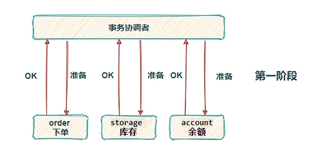
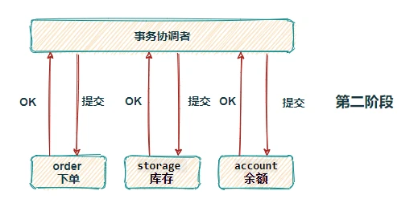
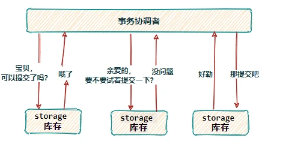
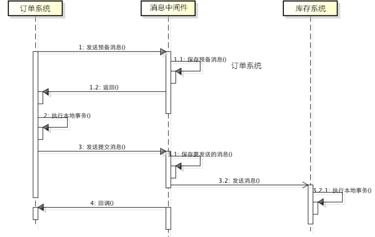

# Table of Contents

* [XA](#xa)
* [2PC](#2pc)
  * [**预提交阶段**](#预提交阶段)
  * [提交阶段](#提交阶段)
* [3PC](#3pc)
* [TCC](#tcc)
* [消息事务（最终一致性）](#消息事务最终一致性)
* [比较好的文章](#比较好的文章)

https://segmentfault.com/a/1190000038424744

# XA

XA是X/Open组织提出的一个分布式事务的规范，其定义了一个分布式事务的处理模型——DTP。在DTP中定义了三个组件：
Application Program（AP）：应用程序，即业务层，它定义了事务的边界，以及构成该事务的特定操作；
Resource Manager（RM）：资源管理器，可以理解为一个DBMS系统，或者消息服务器管理系统；
Transaction Manager（TM）：事务管理器，负责协调和管理事务；

# 2PC

基于 XA 协议实现的分布式事务，XA 协议中分为两部分：事务管理器和本地资源管理器。其中本地资源管理器往往由数据库实现，比如 Oracle、MYSQL 这些数据库都实现了 XA 接口，而事务管理器则作为一个全局的调度者。

两阶段提交（2PC），对业务侵⼊很小，它最⼤的优势就是对使⽤⽅透明，用户可以像使⽤本地事务⼀样使⽤基于 XA 协议的分布式事务，能够严格保障事务 ACID 特性。

可2PC的缺点也是显而易见，它是一个强一致性的同步阻塞协议，事务执⾏过程中需要将所需资源全部锁定，也就是俗称的刚性事务。所以它比较适⽤于执⾏时间确定的短事务，整体性能比较差。

> 2PC只有协调者有超时机制，一旦协调者挂了，参与者提交资源就会被锁住

一旦事务协调者宕机或者发生网络抖动，会让参与者一直处于锁定资源的状态或者只有一部分参与者提交成功，导致数据的不一致。因此，在⾼并发性能⾄上的场景中，基于 XA 协议的分布式事务并不是最佳选择。

## **预提交阶段**

这是两阶段提交协议的第一个阶段，分布式事务处理系统咨询各个资源管理器是否可以提交本地事务，各个资源管理器会把这个咨询过程写入日志，以便进行回滚或提交。

当一个数据库接收到咨询后，它会将需要执行的操作写入日志，禁止其他写入操作（锁定资源）。

> 锁定什么资源?

如果分布式事务中某数据库预提交失败或提交失败，那该数据库会根据日志进行自身的操作回滚，并解锁。

## 提交阶段

分布式事务处理系统对各个资源管理器下达提交/回滚的指令，使整个分布式事务结束。

当一个数据库接受到提交/回滚指令时，它将根据第一阶段的日志进行提交/回滚处理。

两阶段提交协议可以在数据库层面通过驱动支持，也可以在应用框架中按照其原理进行设计实现。

# 3PC

三段提交（3PC）是二阶段提交（2PC）的一种改进版本 ，为解决两阶段提交协议的阻塞问题，上边提到两段提交，当协调者崩溃时，参与者不能做出最后的选择，就会一直保持阻塞锁定资源。

+ 2PC中只有协调者有超时机制，3PC在协调者和参与者中都引入了超时机制，协调者出现故障后，参与者就不会一直阻塞。

+ 而且在第一阶段和第二阶段中又插入了一个准备阶段（如下图，看着有点啰嗦），保证了在最后提交阶段之前各参与节点的状态是一致的。

  > 就是多问一次。

虽然 3PC 用超时机制，解决了协调者故障后参与者的阻塞问题，但与此同时却多了一次网络通信，性能上反而变得更差，也不太推荐。

# TCC

所谓的TCC编程模式，也是两阶段提交的一个变种，不同的是TCC为在业务层编写代码实现的两阶段提交。TCC分别指Try、Confirm、Cancel，一个业务操作要对应的写这三个方法。

以下单扣库存为例，Try阶段去占库存，Confirm阶段则实际扣库存，如果库存扣减失败Cancel阶段进行回滚，释放库存。

TCC 不存在资源阻塞的问题，因为每个方法都直接进行事务的提交，一旦出现异常通过则Cancel来进行回滚补偿，这也就是常说的补偿性事务。

原本一个方法，现在却需要三个方法来支持，可以看到 TCC 对业务的侵入性很强，而且这种模式并不能很好地被复用，会导致开发量激增。还要考虑到网络波动等原因，为保证请求一定送达都会有重试机制，所以考虑到接口的幂等性。

#  消息事务（最终一致性）

> 最终一致性，主要是用“记录”和“补偿”的方式。在做所有的不确定的事情之前，先把事情记录下来，然后去做不确定的事情，结果可能是：成功、失败或是不确定，“不确定”（例如超时等）可以等价为失败。
>
> 成功就可以把记录的东西清理掉了，对于失败和不确定，可以依靠定时任务等方式把所有失败的事情重新搞一遍，直到成功为止。
>
>  回到刚才的例子，系统在A扣钱成功的情况下，**把要给B“通知”这件事记录在库里**（为了保证最高的可靠性可以把通知B系统加钱和扣钱成功这两件事维护在一个本地事务里），通知成功则删除这条记录，通知失败或不确定则依靠定时任务补偿性地通知我们，直到我们把状态更新成正确的为止。 整个这个模型依然可以基于RPC来做，但可以抽象成一个统一的模型，基于消息队列来做一个“企业总线”。 **具体来说，本地事务维护业务变化和通知消息**，一起落地（失败则一起回滚），然后RPC到达broker，在broker成功落地后，RPC返回成功，本地消息可以删除。否则本地消息一直靠定时任务轮询不断重发，这样就保证了消息可靠落地broker。 broker往consumer发送消息的过程类似，一直发送消息，直到consumer发送消费成功确认。 我们先不理会重复消息的问题，通过两次消息落地加补偿，下游是一定可以收到消息的。然后依赖状态机版本号等方式做判重，更新自己的业务，就实现了最终一致性。

消息事务其实就是基于消息中间件的两阶段提交，将本地事务和发消息放在同一个事务里，保证本地操作和发送消息同时成功>。 下单扣库存原理图：

	

1. 订单系统向MQ发送一条预备扣减库存消息，MQ保存预备消息并返回成功ACK

   > 类似2PC的预提交，根据这里的消息，进行提交或者回滚

2. 接收到预备消息执行成功ACK，订单系统执行本地下单操作，为防止消息发送成功而本地事务失败，订单系统会实现MQ的回调接口，其内不断的检查本地事务是否执行成功，如果失败则rollback回滚预备消息；成功则对消息进行最终commit提交。

3. 库存系统消费扣减库存消息，执行本地事务，如果扣减失败，消息会重新投，一旦超出重试次数，则本地表持久化失败消息，并启动定时任务做补偿。

   > 如果扣减失败，通过MQ通知到订单系统，扣减失败。

基于消息中间件的两阶段提交方案，通常用在高并发场景下使用，牺牲数据的强一致性换取性能的大幅提升，不过实现这种方式的成本和复杂度是比较高的，还要看实际业务情况。

**在仔细想想 用消息队列实现最终一致，不也是模仿了2pc的思想，用消息队列来代替2pc的协调者。**

# 比较好的文章

https://mp.weixin.qq.com/s/LqoWAT4cz4KcdaTzEP3iTA
