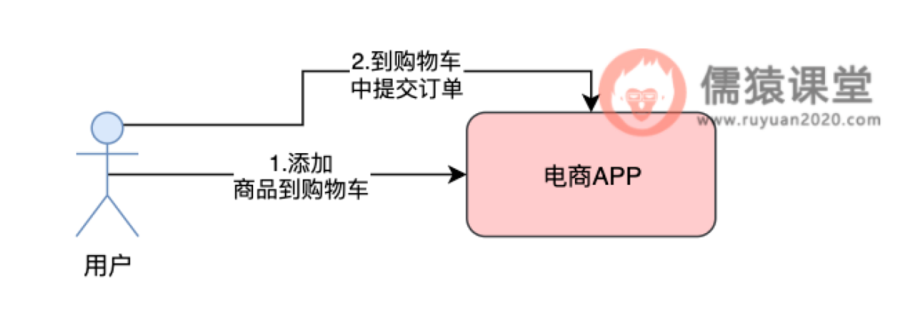
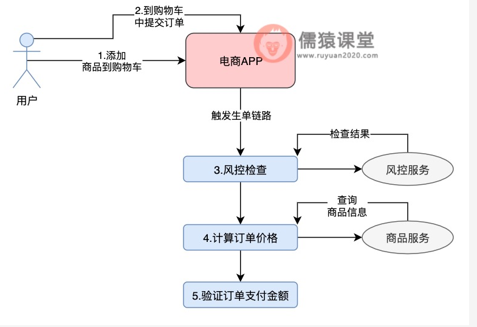
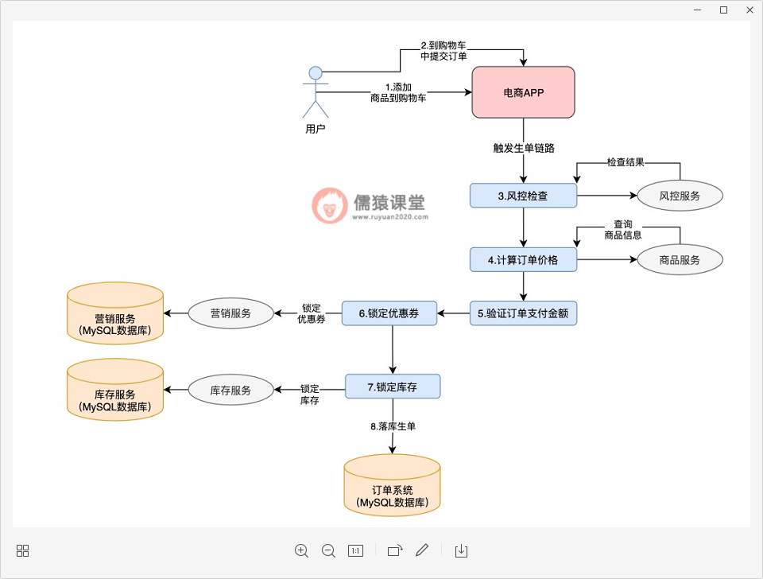
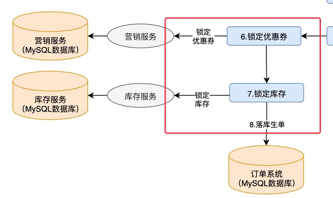
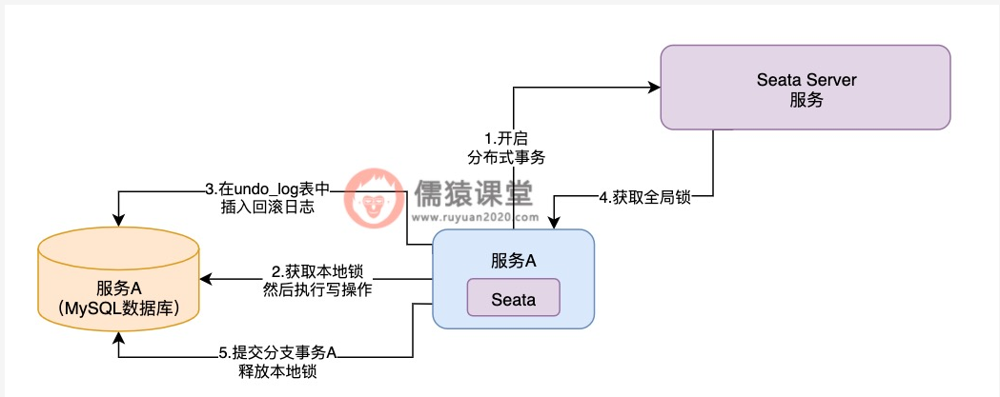
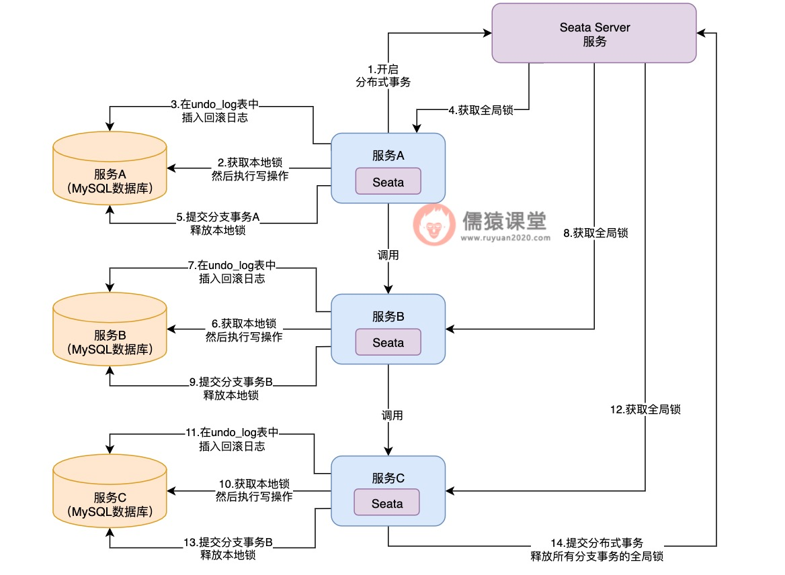

# Table of Contents

* [先来看下生单链路中的核心业务流程](#先来看下生单链路中的核心业务流程)
* [生单链路数据一致性问题](#生单链路数据一致性问题)
* [Seata分布式事务原理剖析](#seata分布式事务原理剖析)
* [小结](#小结)

2.然后再来分析下生单链路中存在的数据一致性问题
3.为了保证生单链路数据的一致性，初步了解下Seata分布式事务的原理

# 先来看下生单链路中的核心业务流程

订单系统的业务，主要分为正向链路和逆向链路这两个维度，

+ 正向链路的核心业务流程，包括订单生单链路、预支付和支付回调链路以及订单支付完成后的履约操作链路

+ 而逆向链路的核心业务流程，包括订单超时未支付的自动关单链路、手动取消订单链路、发起售后退货申请以及审核售后退货链路。

如果我们想要购买一件商品的话，可以先到电商APP中选好商品并添加到购物车中，然后，再到购物车中提交订单，这些操作想必大家都很熟悉了，如下图：

一旦用户在购物车中提交订单了，这个时候，订单系统中就会触发生单链路的一系列操作，我们来看下：

可以看到，当用户提交订单时，订单系统首先会调用风控服务的接口，对提交的订单进行一些风控检查，风控服务干的事，主要是检查一下是否存在刷单行为、当前订单是否来自于一些黑名单IP地址等，主要就是做一些风险预估方面的事情。

如图，接下来就是根据订单中，用户选购的商品信息，到具体的商品服务中查询商品的详细信息，比如商品的订单价格、所需的运费等信息，这些商品的详细信息是单独抽到商品服务中的，和我们订单系统是分离开来的，所以，在计算订单中的商品价格时，我们需要单独到商品服务中查询。

然后再进行正式生单的核心业务逻辑之前，会先验证一下我们计算出来的订单金额，和前端传过来的订单金额是否一致，一般比较大型的电商系统在用户在下单时，这些操作都是很有必要检查的。

以上这些检查操作完成之后，接下来就会进入生单链路的核心业务逻辑了，我们重点来看下：

如果用户提交订单时使用了优惠券，此时，我们得要将这个优惠券锁先锁定起来，否则同一个优惠券被用户重复使用下单，这一切就错乱了，我们可以调用营销服务的接口来锁定这个优惠券。

优惠券锁定之后，紧接着商品的库存也需要锁定，因为用户提交订单之后，后续还需要进行订单支付，如果提交订单时不及时锁定库存的话，用户后续在支付订单时，其他用户过来将该商品抢售一空，此时，用户订单刚好支付成功了，但是却没有相应的库存可以扣减，这种错误是不允许的。

最后，当优惠券和库存都锁定之后，接下来会在订单系统的数据库中落库订单，也就是在数据库的订单表和订单明细表以及其他相关的一系列表中，新增订单相关记录，订单提交成功之后，用户就可以在电商APP中看到自己下的订单了。

所以，一旦当用户提交订单，我们可以调用库存服务的接口，为这个订单预先锁定这一部分的商品库存，如果后续用户不打算支付订单，或者超过一定的时间订单都还没有支付，我们还是可以将锁定的库存给释放掉的。

# 生单链路数据一致性问题

生单链路的核心业务流程，我们已经梳理了一遍，接下来，我们来分析下这块的链路中可能会存在什么问题：

在生单的链路中，可以看到，风控检查、计算订单价格以及验证订单支付金额，这些操作的核心就是从数据库中查询一些数据，然后在内存中进行相关的校验，一般都没什么技术上的挑战。

但是，锁定优惠券、锁定库存以及落库生单这三个操作，它们本质都是要修改数据库中的数据，都是要往数据库中写东西的，一个操作中同时存在多个写库的动作，往往就会涉及到数据一致性的问题。

比如，怎样才能保证多个写操作是能够同时成功，万一说这些写操作中的其中一个步骤失败了，其他写库的操作怎样才能撤销自己执行成功的操作呢？这些写库的操作，要么一起成功要么一起失败，整个生单链路的数据一致性才能得到保障。

分析到这里，可能有些同学马上就有主意了，通过事务就可以解决这个问题啊！确实，对同一个数据库中的多个写操作，我们只需要将这些写操作囊括在一个Spring事务当中，一旦其中某个写操作失败了，其他操作就会自动回滚，数据一致性一般都是可以得到保障的。

但是，当下的问题不可同日而语，锁定优惠券、扣减库存以及落库生单涉及到了三个系统，Spring事务只能保证订单系统自己本地数据库写失败了能及时回滚事务，但是，其他系统如营销服务和库存服务的事务，他们的数据库写操作失败了，订单系统压根是管不着的，毕竟这三个系统的分别都有自己的数据库。

所以，像生单链路中这样，涉及到多个数据库写操作的数据一致性问题，就不能使用Spring事务了，而是得要使用分布式事务来保证数据的一致性。

# Seata分布式事务原理剖析

分布式事务，我们这里采用的是SpringCloudAlibaba支持Seata分布式事务，使用Seata分布式事务来解决问题之前，我们先来了解下它的原理：

首先，Seata的服务端会单独部署在一台机器上，作为一个Seata Server的服务，然后在每个单独的服务中，都需要引入Seata的依赖，比如服务A引入Seata之后，我们来看下效果是怎样的：

当服务A执行数据库的写操作时，服务A首先会向Seata Server服务发起一个请求，开启一个分布式事务。
然后在执行本地库写操作时，服务A本地还会单独再开启一个分支事务，一个分布式事务中可以开启多个分支事务，我们可以理解为，**每个分支事务可以确保操作一个数据库的数据一致性。**

在服务A对应的分支事务进行写操作时，首先得要获取一把本地锁，比如服务A要对库中id=100这条数据进行写操作，首先会在本地库中，对id=100这条数据获取一把本地锁。

本地锁获取成功之后，才能在数据库中执行写操作，写完数据之后，Seata同时还会在本地数据库中的undo_log表中，插入一条回滚日志，我们预先得要在数据库中，创建好Seata提供的回滚日志undo_log表，而回滚日志记录的，和你实际写操作是相反记录。

> 比如写操作是新增操作，那么回滚日志相应的就是一条删除操作的记录、如果写操作是删除操作，那回滚日志相应的就是新增操作的记录，回滚日志的作用其实很简单，就是在分支事务需要回滚事务时，利用回滚日志对之前修改的数据进行还原而已。

Seata规定，分支事务在提交事务之前，首先得要先从Seata Server服务中获取一把全局锁。

比如，前面我们在分支事务A中，针对id=100这条数据已经获取到本地锁了，此时还需要针对id=100这条数据，到Seata Server中获取一把全局锁，当服务A获取全局锁成功之后，接下来才可以提交分支事务A，并且释放之前获取的本地锁，而全局锁得要等到整个分布式事务提交之后才会释放。

本地锁获取成功、写操作执行成功、并且回滚日志也插入完毕之后，接下来就是提交服务A对应的分支事务了，如图：

有些同学可能有疑问了，分布式事务不是针对多个服务操作多个数据库的场景吗？没错，理解了单个服务的操作之后，接下来的理解多个服务的多个分支事务就简单多了，我们继续来看下引入服务B和服务C的场景：

可以看到，当服务A对应的分支事务提交之后，接下来会调用服务B和服务C这边的接口，服务B和服务C执行的操作和服务A其实是一样。

首先，服务B和服务C按照调用顺序依次执行，执行时都会为自己创建一个分支事务，然后在本地数据库中先获取本地锁，本地锁获取成功后，再执行写操作，并且插入相应的回滚日志，当分支事务准备提交事务时，也会到Seata Server上获取一把全局锁，然后再提交分支事务并且释放本地锁。

当服务A、服务B和服务C对应的所有分支事务都提交之后，Seata才会提交整个分布式事务，然后统一释放服务A、服务B以及服务C这三个服务之前获取的全局锁。

而在整个分布式事务中，一旦某个分支事务执行时出现问题了，Seata就会依次回滚那些已经执行成功的分支事务，比如，当执行服务C的分支事务出错了，此时不仅分支事务C的本地事务会回滚，Seata也会获取服务A和服务B执行时插入的回滚日志，还原数据库被修改过的数据，进行事务的回滚。

> 就是2PC

# 小结

这一节内容就先到这里，我们来总结一下。首先，我们分析了一下生单链路的核心业务流程，当用户在购物车提交订单之后，依次会经过风控检查、计算订单价格、验证订单支付金额、锁定优惠券、锁定库存和落库生单等操作。

然后，我们对生单链路的每个步骤进行了分析，其中，风控检查、计算订单价格、验证订单支付金额这些操作都还好，一般都不太会有什么技术上的问题，关键在于锁定优惠券、锁定库存和落库生单，这三个操作分别是在不同数据库上进行写操作的，所以是容易出现数据不一致性的问题的。

为了保证锁定优惠券、锁定库存以及落库生单操作这三个操作的数据一致性，我们可以引入Seata分布式事务来解决，并且，我们也给大家分析了一下Seata分布式事务的原理。
