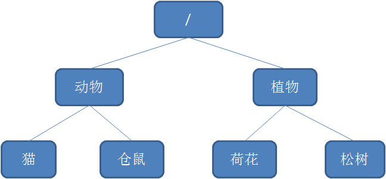
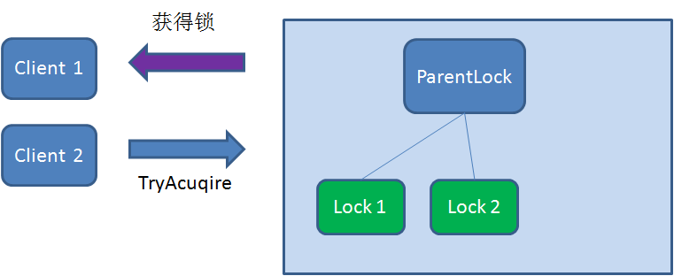
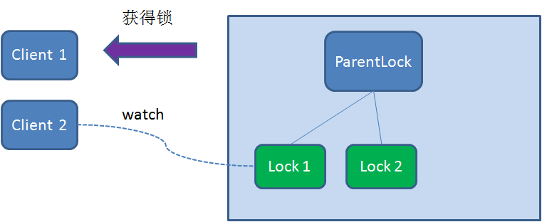
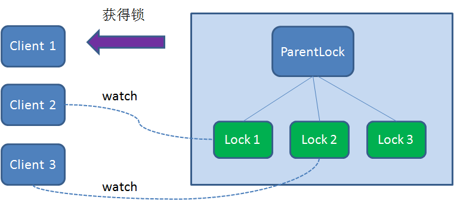
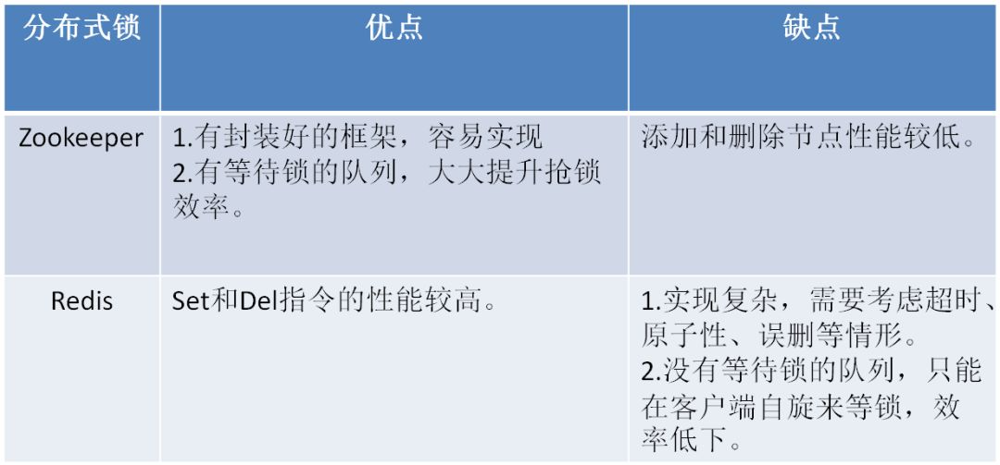

# **什么是临时顺序节点？**

Zookeeper的数据存储结构就像一棵树，这棵树由节点组成，这种节点叫做Znode。

Znode分为四种类型：

**1.持久节点 （PERSISTENT）**

默认的节点类型。创建节点的客户端与zookeeper断开连接后，该节点依旧存在 。

**2.持久节点顺节点（PERSISTENT_SEQUENTIAL）**

所谓顺序节点，就是在创建节点时，Zookeeper根据创建的时间顺序给该节点名称进行编号：

**3.临时节点（EPHEMERAL）** 

和持久节点相反，当创建节点的客户端与zookeeper断开连接后，**临时节点会被删除**：

**4.临时顺序节点（EPHEMERAL_SEQUENTIAL）** 

顾名思义，临时顺序节点结合和临时节点和顺序节点的特点：在创建节点时，Zookeeper根据创建的时间顺序给该节点名称进行编号；当创建节点的客户端与zookeeper断开连接后，临时节点会被删除。

# Zookeeper分布式锁的原理

## 获取锁

1. 首先，在Zookeeper当中创建一个**持久节点ParentLock**。当第一个客户端想要获得锁时，需要在ParentLock这个节点下面创建一个**临时顺序节点** Lock1。

2. 之后，Client1查找ParentLock下面所有的临时顺序节点并排序，判断自己所创建的节点Lock1是不是顺序最靠前的一个。如果是第一个节点，则成功获得锁。

3. 这时候，如果再有一个客户端 Client2 前来获取锁，则在ParentLock下载再创建一个临时顺序节点Lock2。

   

4. Client2查找ParentLock下面所有的临时顺序节点并排序，判断自己所创建的节点Lock2是不是顺序最靠前的一个，结果发现节点Lock2并不是最小的。

5. Client2向排序仅比它靠前的节点Lock1注册**Watcher**，用于监听Lock1节点是否存在。这意味着Client2抢锁失败，进入了等待状态。
   

6. 这时候，如果又有一个客户端Client3前来获取锁，则在ParentLock下载再创建一个临时顺序节点Lock3。

7. 同理，Client3向排序仅比它靠前的节点**Lock2**注册Watcher，用于监听Lock2节点是否存在。这意味着Client3同样抢锁失败，进入了等待状态。

   

   

8. 这样一来，Client1得到了锁，Client2监听了Lock1，Client3监听了Lock2。这恰恰形成了一个等待队列，很像是Java当中ReentrantLock所依赖的**AQS**（AbstractQueuedSynchronizer）。

## 释放锁

释放锁分为两种情况：

**1.任务完成，客户端显示释放**

当任务完成时，Client1会显示调用删除节点Lock1的指令。

**2.任务执行过程中，客户端崩溃**

获得锁的Client1在任务执行过程中，如果Duang的一声崩溃，则会断开与Zookeeper服务端的链接。根据临时节点的特性，相关联的节点Lock1会随之自动删除。

# Zookeeper和Redis分布式锁的比较

# 参考来源

https://mp.weixin.qq.com/s/LXBgNEzU7Tu1M5TiEHKXSw