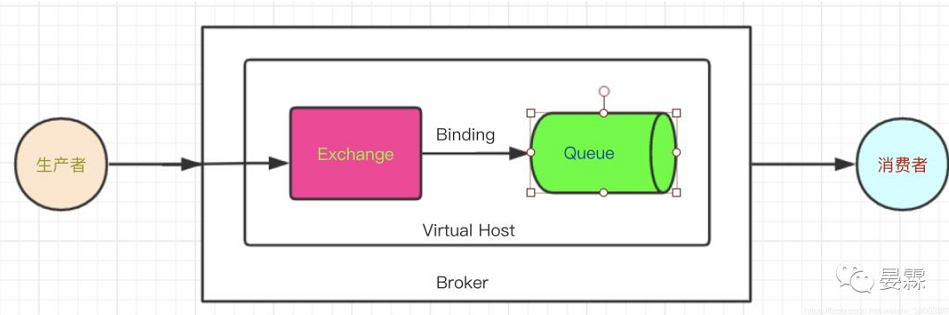

# Table of Contents

* [**消息确认种类**](#消息确认种类)
* [消息发送确认](#消息发送确认)
  * [消息达到交换器](#消息达到交换器)
  * [消息达到队列](#消息达到队列)
    * [**ReturnCallback**](#returncallback)
* [接收方确认](#接收方确认)
* [参考资料](#参考资料)


# **消息确认种类**


消息的确认做有很多法，其中包括事务机制、批量确认、异步确认等。

**事务机制：**我们在channel对象中可以看到 txSelect(),txCommit(),txrollback() 这些方法，分别对应着开启事务，提交事务，回滚。由于使用事务会造成生产者与Broker交互次数增加，造成性能资源的浪费，而且**事务机制是阻塞的**，在发送一条消息后需要等待RabbitMq回应，之后才能发送下一条，因此事务机制不提倡，大家在网上也很少看到RabbitMq使用事务进行消息确认的。

**批量确认：**批量其实是一个节约资源的操作，但是在RabbitMq中我们使用批量操作会造成消息重复消费，原因是批量操作是使客户端程序定期或者消息达到一定量，来调用方法等待Broker返回，这样其实是一个提高效率的做法，但是如果出现消息重发的情况，当前这批次的消息都需要重发，这就**造成了重复消费**，因此批量确认的操作性能没有提高反而下降。

**异步确认：**异步确认虽然编程逻辑比上两个要复杂，但是性价比最高，无论是可靠性还是效率都没得说，他是利用回调函数来达到消息可靠性传递的，笔者接触过RocketMq，这个中间件也是通过函数回调来保证是否投递成功，下面就让我们来详细讲解异步确认是怎么实现的。

**请看一下RabbitMq工作原理图**

 

每一个颜色块之间都存在着消息的确认机制，我们大概分为两大类，发送方确认和接收方确认，其中发送方确认又分为生产者到交换器到确认和交换器到队列的确认。


# 消息发送确认

## 消息达到交换器

ConfirmCallback是一个回调接口，消息发送到 Broker 后触发回调，确认消息是否到达 Broker 服务器，**也就是只确认是否正确到达 Exchange 中。**

我们需要在生产者的配置中添加下面配置，表示开启发布者确认

```java

spring.rabbitmq.publisher-confirms=true
```


然后在生产者的Java配置类实现该接口

```java

@Component
public class RabbitTemplateConfig implements RabbitTemplate.ConfirmCallback{
    @Autowired
    private RabbitTemplate rabbitTemplate;

    @PostConstruct
    public void initRabbitTemplate() {
        // 设置生产者消息确认
        rabbitTemplate.setConfirmCallback(this);
        
    }

    /**
     * 消息发送到 Broker 后触发回调，确认消息是否到达 Broker 服务器，也就是只确认是否正确到达 Exchange 中
     *
     * @param correlationData
     * @param b
     * @param s
     */
    @Override
    public void confirm(@Nullable CorrelationData correlationData, boolean b, @Nullable String s) {
        System.out.println("ack：[{}]" + b);
        if (b) {
            System.out.println("消息到达rabbitmq服务器");
        } else {
            System.out.println("消息可能未到达rabbitmq服务器");
        }
    }
```


## 消息达到队列

### **ReturnCallback**

通过实现 ReturnCallback 接口，启动消息失败返回，**此接口是在交换器路由不到队列时触发回调，该方法可以不使用，因为交换器和队列是在代码里绑定的，如果消息成功投递到Broker后几乎不存在绑定队列失败，除非你代码写错了。**

使用此接口需要在生产者配置中加入一下配置，表示发布者返回。

```
spring.rabbitmq.publisher-returns=true
```

然后基于刚才的生产者Java配置里实现接口ReturnCallback。

```java

@Component

public class RabbitTemplateConfig implements  RabbitTemplate.ReturnCallback {
    @Autowired
    private RabbitTemplate rabbitTemplate;

    @PostConstruct
    public void initRabbitTemplate() {
       
        rabbitTemplate.setReturnCallback(this);
    }

    /**
     * 启动消息失败返回，比如路由不到队列时触发回调
     *
     * @param message
     * @param i
     * @param s
     * @param s1
     * @param s2
     */
    @Override
    public void returnedMessage(Message message, int i, String s, String s1, String s2) {
        System.out.println("消息主体 message : " + message);
        System.out.println("消息主体 replyCode : " + i);
        System.out.println("描述 replyText：" + s);
        System.out.println("消息使用的交换器 exchange : " + s1);
        System.out.println("消息使用的路由键 routing : " + s2);
    }
}
```

以上两段Java配置可以写在一个类里。


到此，我们完成了生产者的异步确认，我们可以在回调函数中对当前失败的消息进行补偿，这样保证了我们没有发送成功的数据也被观察到了，比如某某条数据需要发送到消费者消费，**但是没有发送成功，这就需要你在此做一些其他操作喽，根据你具体业务来。**

# 接收方确认

消费者确认发生在监听队列的消费者处理业务失败，如，发生了异常，不符合要求的数据……，这些场景我们就需要手动处理，比如重新发送或者丢弃。

我们知道**ACK是默认是自动的**，自动确认会在消息发送给消费者后立即确认，**但存在丢失消息的可能**，如果消费端消费逻辑抛出异常，加入你用回滚了也只是保证了数据的一致性，但是消息还是丢了，也就是消费端没有处理成功这条消息，那么就相当于丢失了消息。

消息确认模式有：

- AcknowledgeMode.NONE：自动确认
- AcknowledgeMode.AUTO：根据情况确认
- AcknowledgeMode.MANUAL：手动确认

需要在消费者的配置里加手动 ack（确认）则需要修改确认模式为 manual，手动确认的方式有很多，可以在RabbitListenerContainerFactory类进行设置。

```
spring.rabbitmq.listener.direct.acknowledge-mode=MANUAL
```

消费者类

```java

@Service
public class AsyncConfirmConsumer {
    @RabbitListener(queues = "confirm_queue")
    @RabbitHandler
    public void asyncConfirm(Order order, Message message, Channel channel) throws IOException {

        try {
            System.out.println("消费消息：" + order.getName());
//            int a = 1 / 0;
            channel.basicAck(message.getMessageProperties().getDeliveryTag(), true);
            System.out.println("消费消息确认" + message.getMessageProperties().getConsumerQueue() + "，接收到了回调方法");
        } catch (Exception e) {
            //重新回到队列
//            channel.basicNack(message.getMessageProperties().getDeliveryTag(), false, true);
//            System.out.println("尝试重发：" + message.getMessageProperties().getConsumerQueue());
            //requeue =true 重回队列，false 丢弃
            channel.basicReject(message.getMessageProperties().getDeliveryTag(), false);
            // TODO 该消息已经导致异常，重发无意义，自己实现补偿机制
        }
    }
}
```

需要注意的 basicAck 方法需要传递两个参数

- **deliveryTag（唯一标识 ID）**：当一个消费者向 RabbitMQ 注册后，会建立起一个 Channel ，RabbitMQ 会用 basic.deliver 方法向消费者推送消息，这个方法携带了一个 delivery tag， **它代表了 RabbitMQ 向该 Channel 投递的这条消息的唯一标识 ID**，是一个单调递增的正整数，delivery tag 的范围仅限于 Channel
- **multiple**：为了减少网络流量，手动确认可以被批处理，**当该参数为 true 时，则可以一次性确认 delivery_tag 小于等于传入值的所有消息**


basicNack方法需要传递三个参数

- **deliveryTag（唯一标识 ID）：**上面已经解释了。
- **multiple**：上面已经解释了。
- **requeue**： true ：重回队列，false ：丢弃，我们在nack方法中必须设置 false，否则重发没有意义。


basicReject方法需要传递两个参数

- **deliveryTag（唯一标识 ID）：**上面已经解释了。
- **requeue**：上面已经解释了，在reject方法里必须设置true。


还要说明一下，建议大家不要重发，重发后基本还是失败，因为出现问题一般都是异常导致的，出现异常的话，我的观点是丢弃这个消息，然后在catch里做补偿操作。


# 参考资料

+ https://mp.weixin.qq.com/s/0JgPurZUBrCe7SDza5bbBQ
