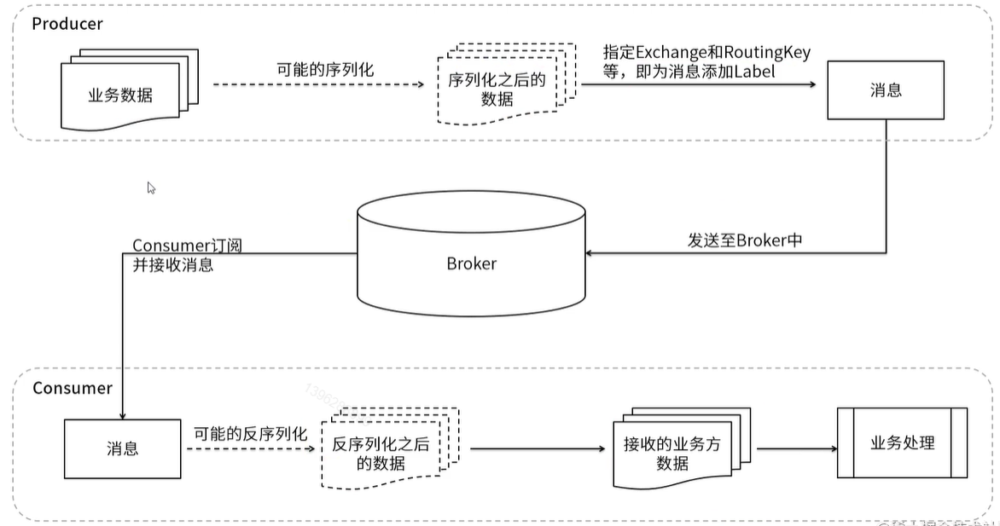

# 核心组成

## 核心组成部分

**Server**：又称Broker ,接受客户端的连接，实现AMQP实体服务。 安装rabbitmq-server

**Connection**：连接，应用程序与Broker的网络连接 TCP/IP/ 三次握手和四次挥手

**Channel**：网络信道，几乎所有的操作都在Channel中进行，Channel是进行消息读写的通道，客户端可以建立对各Channel，每个Channel代表一个会话任务。

**Message** :消息：服务与应用程序之间传送的数据，由Properties和body组成，Properties可是对消息进行修饰，比如消息的优先级，延迟等高级特性，Body则就是消息体的内容。

**Virtual Host** 虚拟地址，用于进行逻辑隔离，最上层的消息路由，一个虚拟主机理由可以有若干个Exhange和Queueu，同一个虚拟主机里面不能有相同名字的Exchange

**Exchange**：交换机，接受消息，根据路由键发送消息到绑定的队列。(==不具备消息存储的能力==)

**Bindings**：Exchange和Queue之间的虚拟连接，binding中可以保护多个routing key.

**Routing key**：是一个路由规则，虚拟机可以用它来确定如何路由一个特定消息。

**Queue**：队列：也成为Message Queue,消息队列，保存消息并将它们转发给消费者。

## RabbitMQ 整体架构

## 运行流程

- 1、生产者产生消息数据
- 2、经过序列化只会指定交换机和路由信息
- 3、将消息发送到Broker 中
- 4、消费者根据路由来消费指定队列消息

# 消息模型

##  直接发送到队列

###  基本消息队列( BasicQueue)

###  工作消息队列( workQueue)

与简单模式不同的是存在多个队列来消费这些消息。也就是存在多个消费者，同时一条消息只能被一个工作队列消费。这还是很好理解的。

那么 RabbitMQ 如何确保消息发送到哪个消费者呢？这就有两种发送策略：

- 轮询发送：一个消费者一条，按均分配； **默认**
- 公平发送：根据消费者的消费能力进行公平分发，按劳分配；

## 发布订阅(Publish、Subscribe)

发送到交换机，又根据交换机类型不同分为三种:

- Fanout Exchange:广播

  ​	

- Direct Exchange:路由

  相对比只要交换机名称即可接收到消息的[广播模式（fanout）](https://blog.csdn.net/fakerswe/article/details/81455340)，direct模式在其基础上，多加了一层密码限制（routingKey）

- Topic Exchange:主题

  相比较direct topic是模糊匹配

  

 **注意:消息一旦消费就会从队列删除，RabbitMQ没有消息回溯功能(阅后即焚）！！！！**

# 参考链接

+ https://juejin.cn/post/7025397813273952264#heading-8