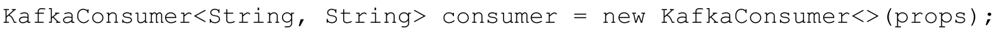
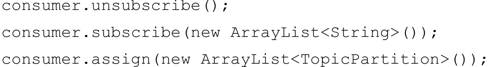
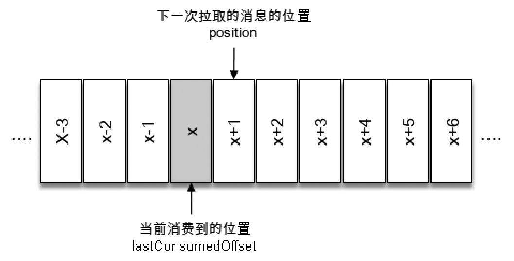
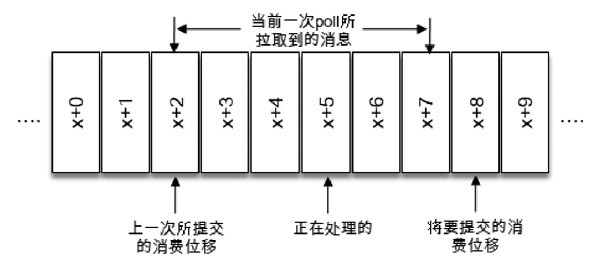
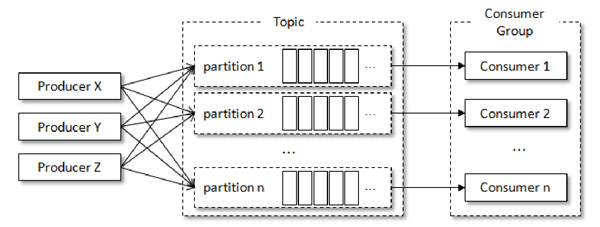
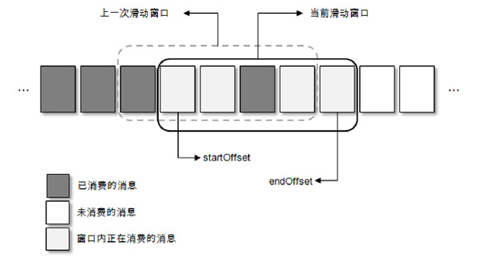

# Table of Contents

* [配置客户端参数及创建实例](#配置客户端参数及创建实例)
* [订阅主题和分区](#订阅主题和分区)
  * [主题（subscribe）](#主题subscribe)
  * [分区（assign）](#分区assign)
  * [partitionsFor](#partitionsfor)
  * [unsubscribe](#unsubscribe)
  * [总结](#总结)
* [序列化](#序列化)
* [消息消费（poll）](#消息消费poll)
  * [ConsumerRecord](#consumerrecord)
* [位移提交](#位移提交)
  * [重复消费和消息丢失](#重复消费和消息丢失)
  * [自动提交](#自动提交)
  * [手动提交](#手动提交)
    * [同步提交(commitSync)](#同步提交commitsync)
    * [异步提交(commitAsync)](#异步提交commitasync)
* [控制或关闭消费](#控制或关闭消费)
* [指定位移消费(seek)](#指定位移消费seek)
* [再均衡(重点)](#再均衡重点)
* [消费者拦截器](#消费者拦截器)
* [KafkaConsumer](#kafkaconsumer)
  * [为每个线程实例化一个KafkaConsumer对象](#为每个线程实例化一个kafkaconsumer对象)
  * [多个消费线程同时消费同一个分区(不推荐)](#多个消费线程同时消费同一个分区不推荐)
  * [多线程处理一个KafkaConsumer的消息](#多线程处理一个kafkaconsumer的消息)
  * [滑动窗口](#滑动窗口)
* [重要消费者参数](#重要消费者参数)
* [如何解决消息重复和消息丢失](#如何解决消息重复和消息丢失)


1. 配置消费者客户端参数及创建相应的消费者实例。
2. 订阅主题。
3. 拉取消息并消费。
4. 提交消费位移。
5. 关闭消费者实例。

# 配置客户端参数及创建实例

+ bootstrap.servers： 指 定 连 接 Kafka 集 群 所 需 的 broker 地 址 清 单，具 体 内 容 形 式
  为host1：port1，host2：post，可以设置一个或多个地址，中间用逗号隔开，此参数的默认值为“”。
+ group.id：**消费者隶属的消费组的名称**，默认值为“”。如果设置为空，则会报出异常。一般而言，这个参数需要设置成具有一定的业务意义的名称。
+ key.deserializer 和 value.deserializer：与生产者客户端 KafkaProducer中的key.serializer和value.serializer参数对应

+ 创建消费者实例
  

# 订阅主题和分区

## 主题（subscribe）

一个消费者可以订阅一个或多个主题

+ subscribe

  既可以以集合的形式订阅多个主题，也可以以正则表达式的形式订阅特定模式的主题。

  ```java
   void subscribe(Collection<String> topics);
  
      /**
       * @see KafkaConsumer#subscribe(Collection, ConsumerRebalanceListener)再均衡监听器
       */
      void subscribe(Collection<String> topics, ConsumerRebalanceListener callback);
      /**
      * @see KafkaConsumer#subscribe(Pattern, ConsumerRebalanceListener) 再均衡监听器
      */
      void subscribe(Pattern pattern, ConsumerRebalanceListener callback);
  
      /**
      * @see KafkaConsumer#subscribe(Pattern)
      */
      void subscribe(Pattern pattern);
  ```

    + 集合订阅

      ```java
      kafkaConsumer.subscribe(Arrays.asList("topic1"));
      kafkaConsumer.subscribe(Arrays.asList("topic2"));
      最终消费者订阅的是topic2，而不是topic1，也不是topic1和topic2的并集。
      
      那如果是
      kafkaConsumer.subscribe(Arrays.asList("topic1","topic2"));
      这个时候消费到是？  topic1 和 topic2
      ```

    + 正则订阅

      如果消费者采用的是正则表达式的方式（subscribe（Pattern））订阅，**在之后的过程中，如果有人又创建了新的主题，并且主题的名字与正则表达式相匹配，那么这个消费者就可以消费到新添加的主题中的消息。**
      如果应用程序需要消费多个主题，并且可以处理不同的类型，那么这种订阅方式就很有效

      ```java
      kafkaConsumer.subscribe(Pattern.compile("test-"));
      ```

## 分区（assign）

消费者不仅可以通过KafkaConsumer.subscribe（）方法订阅主题，还可以直接订阅某些主题的特定分区，在KafkaConsumer中还提供了**一个assign（）方法来实现这些功能**

```java
/**
 * @see KafkaConsumer#assign(Collection)
 */
void assign(Collection<TopicPartition> partitions);

public final class TopicPartition implements Serializable {
    private static final long serialVersionUID = -613627415771699627L;

    private int hash = 0;
    //分区
    private final int partition;
    //主题
    private final String topic;
}
```

那我们知道怎么我们要订阅的分区是哪个？

## partitionsFor

KafkaConsumer 中的partitionsFor（）方法可以用来查询指定主题的元数据信息

```java
/**
 * @see KafkaConsumer#partitionsFor(String)
 */
List<PartitionInfo> partitionsFor(String topic);

/**
 * @see KafkaConsumer#partitionsFor(String, Duration)
 */
        List<PartitionInfo> partitionsFor(String topic,Duration timeout);
```

其中PartitionInfo类型即为主题的分区元数据信息，此类的主要结构如下

```
public class PartitionInfo {
  //主题名称
    private final String topic;
     //分区编号
    private final int partition;
      //代表分区的leader副本所在的位置
    private final Node leader;
    //代表分区的AR集合
    private final Node[] replicas;
    //ISR
    private final Node[] inSyncReplicas;
    //OSR
    private final Node[] offlineReplicas;
 }
```

## unsubscribe

既然有订阅，那么就有取消订阅，可以使用 KafkaConsumer 中的unsubscribe（）方法来取消主题的订阅

```java
/**
 * @see KafkaConsumer#unsubscribe()
 */
void unsubscribe();
```

比较有意思的是。

如果将subscribe（Collection）或assign（Collection）中的集合参数设置为空集合，那么作用等同于unsubscribe（）方法



如果没有订阅任何主题或分区，那么再继续执行消费程序的时候会报出IllegalStateException异常：

## 总结

+ 集合订阅的方式subscribe（Collection）、正则表达式订阅的方式subscribe（Pattern）和指定分区的订阅方式
  assign（Collection）分表代表了三种不同的订阅状态：AUTO_TOPICS、AUTO_PATTERN和USER_ASSIGNED（如果没有订阅，那么订阅状态为NONE）。然而这三种状态是互斥的，在一个消费者中只能使用其中的一种，否则会报出IllegalStateException异常：
+ 通过 subscribe（）方法订阅主题具有消费者自动再均衡的功能，在多个消费者的情况下可以根据分区分配策略来自动分配各个消费者与分区的关系。当消费组内的消费者增加或减少时，分区分配关系会自动调整，以实现消费负载均衡及故障自动转移。
+
而通过assign（）方法订阅分区时，是不具备消费者自动均衡的功能的，其实这一点从assign（）方法的参数中就可以看出端倪，两种类型的subscribe（）都有ConsumerRebalanceListener类型参数的方法，而assign（）方法却没有。

> 因为assign指定了分区，是没法扩展的

# 序列化

KafkaProducer对应的序列化器，那么与此对应的KafkaConsumer就会有反序列化器

# 消息消费（poll）

Kafka中的消费是基于**拉模式**的。

消息的消费一般有两种模式：

+ 推模式：推模式是服务端主动将消息推送给消费者
+ 拉模式：而拉模式是消费者主动向服务端发起请求来拉取消息。

```java
/**
 * Fetch data for the topics or partitions specified using one of the subscribe/assign APIs. It is an error to not have
 * subscribed to any topics or partitions before polling for data.
 * <p>
 * On each poll, consumer will try to use the last consumed offset as the starting offset and fetch sequentially. The last
 * consumed offset can be manually set through {@link #seek(TopicPartition, long)} or automatically set as the last committed
 * offset for the subscribed list of partitions
 *
 * <p>
 * This method returns immediately if there are records available. Otherwise, it will await the passed timeout.
 * If the timeout expires, an empty record set will be returned. Note that this method may block beyond the
 * timeout in order to execute custom {@link ConsumerRebalanceListener} callbacks.

 */
@Override
public ConsumerRecords<K, V> poll(final Duration timeout){
        return poll(time.timer(timeout),true);
        }
```

+ 如果某些分区中没有可供消费的消息，那么此分区对应的消息拉取的结果就为空；如果订阅的所有分区中都没有可供消费的消息，那么poll（）方法返回为空的消息集合。

+ poll（）方法里还有一个超时时间参数timeout，用来控制poll（）方法的阻塞时间，在消费者的缓冲区里没有可用数据时会发生阻塞。注意这里 timeout的类型是 Duration

  > 有点类似线程池的阻塞队列，不过KafKa这个是有时间控制的，也就是说超过这个阻塞时间，还是会返回数据，只不过是空的。
  >
  > 如果应用线程唯一的工作就是从Kafka中拉取并消费消息，则可以将这个参数设置为最大值Long.MAX_VALUE。

## ConsumerRecord

```java
public class ConsumerRecord<K, V> {
    public static final long NO_TIMESTAMP = RecordBatch.NO_TIMESTAMP;
    public static final int NULL_SIZE = -1;
    public static final int NULL_CHECKSUM = -1;
    //主题
    private final String topic;
    //分区
    private final int partition;
    //分区偏移量
    private final long offset;
    //CreateTime和LogAppendTime，分别代表消息创建的时间戳和消息追加到日志的时间戳
    private final long timestamp;
    private final TimestampType timestampType;
    private final int serializedKeySize;
    private final int serializedValueSize;
    //头部
    private final Headers headers;
    private final K key;
    private final V value;

    private final Optional<Integer> leaderEpoch;
    //checksum是CRC32的校验值
    private volatile Long checksum;
```

+ poll（）方法的返回值类型是 ConsumerRecords，它用来表示一次拉取操作所获得的消息集，内部包含了若干ConsumerRecord

```java
public Iterator<ConsumerRecord<K, V>>iterator(){
        return new ConcatenatedIterable<>(records.values()).iterator();
        }
```

+ ConsumerRecords类提供了一个records（TopicPartition）方法来获取消息集中指定分区的消息

```java
    public Iterable<ConsumerRecord<K, V>>records(String topic){
        if(topic==null)
        throw new IllegalArgumentException("Topic must be non-null.");
        List<List<ConsumerRecord<K, V>>>recs=new ArrayList<>();
        for(Map.Entry<TopicPartition, List<ConsumerRecord<K, V>>>entry:records.entrySet()){
        if(entry.getKey().topic().equals(topic))
        recs.add(entry.getValue());
        }
        return new ConcatenatedIterable<>(recs);
        }
```

> 这里要注意，并不是从broker上指定分区，而是先poll在匹配分区。核心还是pool

+ count（）方法用来计算出消息集中的消息个数，返回类型是int；
+ isEmpty（）方法用来判断消息集是否为空，返回类型是boolean；
+ empty（）方法用来获取一个空的消息集

但就其内部逻辑而言并不简单，它涉及消费位移、消费者协调器、组协调器、消费者的选举、分区分配的分发、再均衡的逻辑、心跳等内容，在后面的章节中会循序渐进地介绍这些内容

后面回来补~

# 位移提交

首先确定一个前提

> **对于消息在分区中的位置，我们将offset称为“偏移量”；对于消费者消费到的位置，将 offset 称为“位移。**


因机器重启、在均衡等，可能会改变消费者关系的，需要我们**持久化保存消费者位移。**

在旧消费者客户端中，消费位移是存储在ZooKeeper中的。

而在新消费者客户端中，消费位移存储在Kafka内部的主题__consumer_offsets中。**这里把将消费位移存储起来（持久化）的动作称为“提交”**，消费者在消费完消息之后需要执行消费位移的提交。



不过需要非常明确的是，当前消费者需要提交的**消费位移并不是 x，而是 x+1，对应途中的position**

`lastConsumedOffset`： 当前消费的位置

`committed offset`： 已经提交过的消费位移

`position` ： 下一条需要拉取的消息的位置

`position`=`committedoffset`=`lastConsumedOffset`+1

## 重复消费和消息丢失



提交了x+8，那么当前消费x+5的时候遇到了异常，在故障恢复之后，我们重新拉取的消息是从x+8开始的。也就

是说，x+5至x+7之间的消息并未能被消费，如此便发生了**消息丢失**的现象


> 消费者拉取一批数据，在本地开启多线程处理数据。会出现丢失问题。


那么当消费x+5的时候遇到了异常，在故障恢复之后，我们重新拉取的消息是从x+2开始的。也就是说，x+2至x+4

之间的消息又重新消费了一遍，故而又发生了**重复消费**的现象

> 正常工作中，避免消息丢失，重复消费是可以忍受的。

## 自动提交

**默认的消费位移的提交方式是自动提交**，这个由消费者客户端参数enable.auto.commit 配置，默认值为 true。

当然这个默认的自动提交不是每消费一条消息就提交一次，而是**定期提交**，这个定期的周期时间由客户端参数auto.commit.interval.ms配置，默认值为5秒，此参数生效的前提是enable.auto.commit参数为true。

在默认的方式下，消费者每隔5秒会将拉取到的每个分区中最大的消息位移进行提交。

**自动位移提交的动作是在poll（）方法的逻辑里完成的**，在每次真正向服务端发起拉取请求之前会检查是否可以进

行位移提交，如果可以，那么就会提交上一次轮询的位移。

自动提交消费位移的方式非常简便，它免去了复杂的位移提交逻辑，让编码更简洁。但随之而来的是重复消费和消息丢失的问题。


> 如果业务场景不在乎，随便用。

## 手动提交

在Kafka中还提供了手动位移提交的方式，这样可以使得开发人员对消费位移的管理控制更加灵活。

很多时候并不是说拉取到消息就算消费完成，而是需要将消息写入数据库、写入本地缓存，或者是更加复杂的业务

处理。在这些场景下，所有的业务处理完成才能认为消息被成功消费，手动的提交方式可以让开发人员根据程序的

逻辑在合适的地方进行位移提交。开启手动提交功能的前提是消费者客户端参数enable.auto.commit配置为false

### 同步提交(commitSync)

```java

/**
 * @see KafkaConsumer#commitSync()
 */
void commitSync();

/**
 * @see KafkaConsumer#commitSync(Duration)
 */
        void commitSync(Duration timeout);

/**
 * @see KafkaConsumer#commitSync(Map)
 */
        void commitSync(Map<TopicPartition, OffsetAndMetadata> offsets);

/**
 * @see KafkaConsumer#commitSync(Map, Duration)
 */
        void commitSync(final Map<TopicPartition, OffsetAndMetadata> offsets,final Duration timeout);
```

commitSync（）方法会根据poll（）方法拉取的最新位移来进行提交（注意提交的值对应于图3-6中position的位置），只要没有发生不可恢复的错误（Unrecoverable Error），它就会阻塞消费者线程直至位移提交完成。

> 也会消息重复

### 异步提交(commitAsync)

与commitSync（）方法相反，异步提交的方式（commitAsync（））在执行的时候**消费者线程不会被阻塞**，可能

在提交消费位移的结果还未返回之前就开始了新一次的拉取操作。异步提交可以使消费者的性能得到一定的增强。

```java
void commitAsync();

/**
 * @see KafkaConsumer#commitAsync(OffsetCommitCallback)
 */
        void commitAsync(OffsetCommitCallback callback);

/**
 * @see KafkaConsumer#commitAsync(Map, OffsetCommitCallback)
 */
        void commitAsync(Map<TopicPartition, OffsetAndMetadata> offsets,OffsetCommitCallback callback);
```

**callback参数，它提供了一个异步提交的回调方法，当位移提交完成后会回调 OffsetCommitCallback 中的onComplete（）方法。**

```java
private class DefaultOffsetCommitCallback implements OffsetCommitCallback {
    @Override
    public void onComplete(Map<TopicPartition, OffsetAndMetadata> offsets, Exception exception) {
        if (exception != null)
            log.error("Offset commit with offsets {} failed", offsets, exception);
    }
}
```

如果某一次异步提交的消费位移为 x，但是提交失败了，然后下一次又异步提交了消费位移为 x+y，这次成功了。如果这里引入了重试机制，前一次的异步提交的消费位移在重试的时候提交成功了，那么此时的消费位移又变为了
x。如果此时发生异常（或者再均衡），那么恢复之后的消费者（或者新的消费者）就会从x处开始消费消息，这样就发生了重复消费的问题

> 也会消息重复

# 控制或关闭消费

KafkaConsumer 提供了对消费速度进行控制的方法，在有些应用场景下我们可能需要暂停某些分区的消费而先消

费其他分区，当达到一定条件时再恢复这些分区的消费。KafkaConsumer中使用

+ pause（）:暂停某些分区在拉取操作时返回数据给客户端

+ resume（）：恢复某些分区向客户端返回数据的操作

```java
/**
 * @see KafkaConsumer#pause(Collection)
 */
void pause(Collection<TopicPartition> partitions);

/**
 * @see KafkaConsumer#resume(Collection)
 */
        void resume(Collection<TopicPartition> partitions);
//暂停所有分区
        Set<TopicPartition> paused();
```

# 指定位移消费(seek)

当一个新的消费组建立的时候，它根本没有可以查找的消费位移。或者消费组内的一个新消费者订阅了一个新的主题，它也没有可以查找的消费位移。当__
consumer_offsets主题中有关这个消费组的位移信息过期而被删除后，它也没有可以查找的消费位移。

在 Kafka 中每当消费者查找不到所记录的消费位移时，就会根据消费者客户端参数auto.offset.reset的配置来决定从何处开始进行消费，

+ 这个参数的默认值为“latest”，表示从分区末尾开始消费消息。
+ 如果将auto.offset.reset参数配置为“earliest”，那么消费者会从起始处，也就是0开始消费。
+ 可配置的值—“none”，配置为此值就意味着出现查到不到消费位移的时候，既不从最新的消息位置处开始消费，也不从最早的消息位置处开始消费，此时会报出NoOffsetForPartitionException异常

其实都不太是我们想要的结果。

有些时候，我们需要一种更细粒度的掌控，可以让我们从特定的位移处开始拉取消息，而 KafkaConsumer 中的seek（）方法正好提供了这个功能，让我们得以追前消费或回溯消费。

```java
/**
 * @see KafkaConsumer#seek(TopicPartition, long)
 */ 分区 指定位置
        void seek(TopicPartition partition,long offset);

/**
 * @see KafkaConsumer#seek(TopicPartition, OffsetAndMetadata)
 */
        void seek(TopicPartition partition,OffsetAndMetadata offsetAndMetadata);

        /**
         * @see KafkaConsumer#seekToBeginning(Collection)
        从头开始消费
         */
        void seekToBeginning(Collection<TopicPartition> partitions);

        /**
         * @see KafkaConsumer#seekToEnd(Collection)
        从尾部开始消费
         */
        void seekToEnd(Collection<TopicPartition> partitions);

        /**
         * @see KafkaConsumer#offsetsForTimes(Map)
        而 value 为待查询的时间戳，该方法会返回时间戳大于等于待查询时间的第一条消息对应的位置和时间戳
         */
        Map<TopicPartition, OffsetAndTimestamp> offsetsForTimes(Map<TopicPartition, Long> timestampsToSearch);

```

seek（）方法只能重置消费者分配到的分区的消费位置，而分区的分配是在 poll（）方法的调用过程中实现的。

也就是说，**在执行seek（）方法之前需要先执行一次poll（）方法，等到分配到分区之后才可以重置消费位置。**

> 如果我们将`TopicPartition`、`offest`持久化到本地，就不会去找`kafka`上存储的位置了。

# 再均衡(重点)

什么是再均衡？

> 再均衡是指分区的**所属权从一个消费者转移到另一消费者的行为**，它为消费组具备高可用性和伸缩性提供保障，使我们可以既方便又安全地删除消费组内的消费者或往消费组内添加消费者。

**不过在再均衡发生期间，消费组内的消费者是无法读取消息的。**

比如消费者消费完某个分区中的一部分消息时还没有来得及提交消费位移就发生了再均衡操作，之后这个分区又被

分配给了消费组内的另一个消费者，原来被消费完的那部分消息又被重新消费一遍，也就是发生了重复消费。一般

情况下，应尽量避免不必要的再均衡的发生。

后面补充

# 消费者拦截器

```java
public interface ConsumerInterceptor<K, V> extends Configurable, AutoCloseable {

    public ConsumerRecords<K, V> onConsume(ConsumerRecords<K, V> records);

    /**
     * This is called when offsets get committed.
     * <p>
     * Any exception thrown by this method will be ignored by the caller.
     *
     * @param offsets A map of offsets by partition with associated metadata
     */
    public void onCommit(Map<TopicPartition, OffsetAndMetadata> offsets);

    /**
     * This is called when interceptor is closed
     */
    public void close();
}
```

+ onConsume

  拦截TTL的数据，不用消费

+ onCommit 可以追踪我们提交记录的位移

+ close

# KafkaConsumer

KafkaProducer是线程安全的，然而KafkaConsumer却是非线程安全的。

> 提高消费的能力

KafkaConsumer中定义了一个 acquire（）方法，用来检测当前是否只有一个线程在操作，若有其他线程正在操作则会抛出ConcurrentModifcationException异常：

```java
private void acquire(){
        long threadId=Thread.currentThread().getId();
        if(threadId!=currentThread.get()&&!currentThread.compareAndSet(NO_CURRENT_THREAD,threadId))
        throw new ConcurrentModificationException("KafkaConsumer is not safe for multi-threaded access");
        refcount.incrementAndGet();
        }
```

> 这样可以保证只有有一个线程操这条数据，开启多线程也只是分段消费数据。


如果生产者发送消息的速度大于消费者处理消息的速度，那么就会有越来越多的消息得不到及时的消费，造成了一定的延迟。

## 为每个线程实例化一个KafkaConsumer对象



一个线程对应一个KafkaConsumer实例，我们可以称之为消费线程。

> 目前工作中用到最多也是这个 TCP开销大

## 多个消费线程同时消费同一个分区(不推荐)

不同消费者组中的消费线程去消费一个分区的数据。不过这种实现方式对于位移提交和顺序控制的处理就会变得非常复杂，实际应用中使用得极少

## 多线程处理一个KafkaConsumer的消息

其实就是将一个消费者拉下的数据，分批交给多线程去消费。

可以维护一个加锁的共享变量。

会有消息丢失和消息重复的问题。如果对顺序什么没要求的话，可以用这种方式，可以快读处理积压的数据。

## 滑动窗口

总体结构上是基于滑动窗口实现的



这里的滑动窗口式的实现方式是将拉取到的消息暂存起来，多个消费线程可以拉取暂存的消息，这个用于暂存消息的缓存大小即为滑动窗口的大小，总体上而言没有太多的变化，**不同的是对于消费位移的把控。**

如图所示，每一个方格代表一个批次的消息，一个滑动窗口包含若干方格，startOffset标注的是当前滑动窗口的起始位置，endOffset标注的是末尾位置。每当startOffset指向的方格中的消息被消费完成，就可以提交这部分的位移，与此同时，窗口向前滑动一格，删除原来startOffset所指方格中对应的消息，并且拉取新的消息进入窗口。滑动窗口的大小固定，所对应的用来暂存消息的缓存大小也就固定了，这部分内存开销可控。方格大小和滑动窗口的大小同时决定了消费线程的并发数：一个方格对应一个消费线程，对于窗口大小固定的情况，方格越小并行度越高；对于方格大小固定的情况，窗口越大并行度越高。不过，若窗口设置得过大，不仅会增大内存的开销，而且在发生异常（比如Crash）的情况下也会引起大量的重复消费，同时还考虑线程切换的开销，建议根据实际情况设置一个合理的值，不管是对于方格还是窗口而言，过大或过小都不合适。

**如果一个方格内的消息无法被标记为消费完成，那么就会造成 startOffset 的悬停。**为了使窗口能够继续向前滑动，那么就需要设定一个阈值，当 startOffset
悬停一定的时间后就对这部分消息进行本地重试消费，如果重试失败就转入重试队列，如果还不奏效就转入死信队列，有关Kafka中**重试队列和死信队列**
的实现可以参考11.3节。真实应用中无法消费的情况极少，一般是由业务代码的处理逻辑引起的，比如消息中的内容格式与业务处理的内容格式不符，无法对这条消息进行决断，这种情况可以通过优化代码逻辑或采取丢弃策略来避免。如果需要消息高度可靠，也可以将无法进行业务逻辑的消息（这类消息可以称为死信）存入磁盘、数据库或Kafka，然后继续消费下一条消息以保证整体消费进度合理推进，之后可以通过一个额外的处理任务来分析死信进而找出异常的原因。


> 每次处理只处理startOffset,处理完毕才会后移一位。

# 重要消费者参数

1. fetch.min.bytes：该参数用来配置**Consumer在一次拉取请求（调用poll（）方法）中能从Kafka中拉取的最小数据量**
   ，默认值为1（B）。Kafka在收到Consumer的拉取请求时，如果返回给Consumer的数据量小于这个参数所配置的值，那么它就需要进行等待，直到数据量满足这个参数的配置大小。可以适当调大这个参数的值以提高一定的吞吐量，不过也会造成额外的延迟（latency），对于延迟敏感的应用可能就不可取了。


2. fetch.max.bytes：该参数与fetch.max.bytes参数对应，它用来配置Consumer在一次拉取请求中从Kafka中拉取的最大数据量，默认值为 52428800（B），也就是
   50MB。如果这个参数设置的值比任何一条写入Kafka中的消息要小，那么会不会造成无法消费呢？很多资料对此参数的解读认为是无法消费的，比如一条消息的大小为10B，而这个参数的值是1（B），既然此参数设定的值是一次拉取请求中所能拉取的最大数据量，那么显然
   1B＜10B，所以无法拉取。这个观点是错误的，该参数设定的不是绝对的最大值，如果在第一个非空分区中拉取的第一条消息大于该值，那么该消息将仍然返回，以确保消费者继续工作。也就是说，上面问题的答案是可以正常消费。与此相关的，Kafka中所能接收的最大消息的大小通过服务端参数message.max.bytes（对应于主题端参数max.message.bytes）来设置。

3. fetch.max.wait.ms：这个参数也和fetch.min.bytes参数有关，如果Kafka仅仅参考fetch.min.bytes参数的要求，那么有可能会一直阻塞等待而无法发送响应给
   Consumer，显然这是不合理的。fetch.max.wait.ms参数用于指定Kafka的等待时间，默认值为500（ms）。如果Kafka中没有足够多的消息而满足不了fetch.min.bytes参数的要求，那么最终会等待500ms。这个参数的设定和Consumer与Kafka之间的延迟也有关系，如果业务应用对延迟敏感，那么可以适当调小这个参数。

4. max.partition.fetch.bytes：这个参数用来配置从**每个分区里返回给Consumer的最大数据量**，默认值为1048576（B），即1MB。这个参数与 fetch.max.bytes
   参数相似，只不过前者用来限制一次拉取中每个分区的消息大小，而后者用来限制一次拉取中整体消息的大小。同样，如果这个参数设定的值比消息的大小要小，那么也不会造成无法消费，Kafka
   为了保持消费逻辑的正常运转不会对此做强硬的限制。5.max.poll.records这个参数用来配置Consumer在一次拉取请求中拉取的最大消息数，默认值为500（条）。如果消息的大小都比较小，则可以适当调大这个参数值来提升一定的消费速度

5. max.poll.records：这个参数用来配置**Consumer在一次拉取请求中拉取的最大消息数**，默认值为500（条）。如果消息的大小都比较小，则可以适当调大这个参数值来提升一定的消费速度。

6. connections.max.idle.ms：这个参数用来指定在多久之后关闭限制的连接，默认值是540000（ms），即9分钟。
7. exclude.internal.topicsKafka：中有两个内部的主题：__consumer_offsets和__
   transaction_state。exclude.internal.topics用来指定Kafka中的内部主题是否可以向消费者公开，默认值为true。如果设置为true，那么只能使用subscribe（Collection）的方式而不能使用subscribe（Pattern）的方式来订阅内部主题，设置为false则没有这个限制。

8.
receive.buffer.bytes：这个参数用来设置Socket接收消息缓冲区（SO_RECBUF）的大小，默认值为65536（B），即64KB。如果设置为-1，则使用操作系统的默认值。如果Consumer与Kafka处于不同的机房，则可以适当调大这个参数值。
9.
send.buffer.bytes：这个参数用来设置Socket发送消息缓冲区（SO_SNDBUF）的大小，默认值为131072（B），即128KB。与receive.buffer.bytes参数一样，如果设置为-1，则使用操作系统的默认值。

10. request.timeout.ms：这个参数用来配置Consumer等待请求响应的最长时间，默认值为30000（ms）。
11. metadata.max.age.ms：这个参数用来配置元数据的过期时间，默认值为300000（ms），即5分钟。如果元数据在此参数所限定的时间范围内没有进行更新，则会被强制更新，即使没有任何分区变化或有新的broker加入。
12. reconnect.backoff.ms：这个参数用来配置尝试重新连接指定主机之前的等待时间（也称为退避时间），避免频繁地连接主机，默认值为50（ms）。这种机制适用于消费者向broker发送的所有请求。

13. retry.backoff.ms：这个参数用来配置尝试重新发送失败的请求到指定的主题分区之前的等待（退避）时间，避免在某些故障情况下频繁地重复发送，默认值为100（ms）。
14.
isolation.level：这个参数用来配置消费者的事务隔离级别。字符串类型，有效值为“read_uncommitted”和“read_committed”，表示消费者所消费到的位置，如果设置为“read_committed”，那么消费者就会忽略事务未提交的消息，即只能消费到
LSO（LastStableOffset）的位置，默认情况下为“read_uncommitted”，即可以消费到HW（High Watermark）处的位置。有关事务和LSO的内容可以分别参考7.4节和10.2节。

# 如何解决消息重复和消息丢失

+ 消息重复

  + 目前业务上是有一个时间字段来控制消费的数据，晚于此时间的数据才会进来。
  + redis做前置幂等，唯一索引做最终保证

+ 消息丢失

  kafka数据先持久化到接口表，提交放在一个事务里面。

    + 先提交本地事务，在提交kafka。可能会有重复消息
    + 先提交KafKa，在提交本地事务。消息可能会丢失。

  接口表可以扩展多个主题的类型，定时任务扫描根据不同策略进行不同业务处理，删除接口表。记录历史表。


