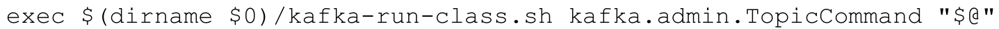
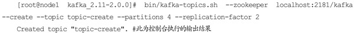
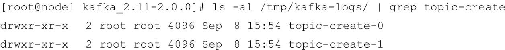
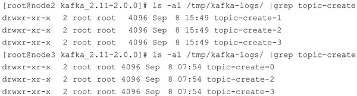
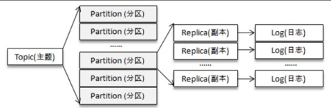
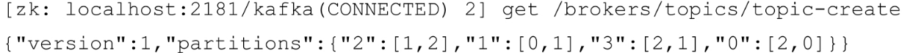
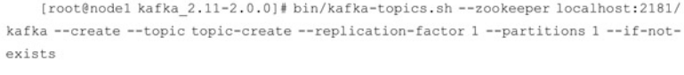
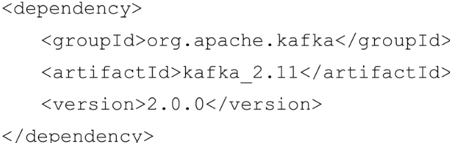
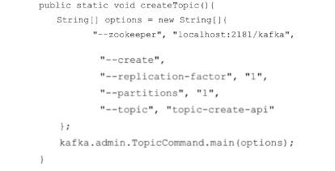
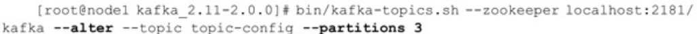

# Table of Contents

* [主题的管理](#主题的管理)
* [创建主题](#创建主题)
  * [创建方式](#创建方式)
  * [主题、分区、副本和 Log](#主题分区副本和-log)
  * [其他使用方式(kafka-topics.sh)](#其他使用方式kafka-topicssh)
  * [主题命名](#主题命名)
  * [机架](#机架)
  * [TopicCommand](#topiccommand)
  * [分区副本分配(重点)](#分区副本分配重点)
* [查看主题](#查看主题)
* [修改主题](#修改主题)
* [删除主题](#删除主题)
* [配置管理](#配置管理)
* [总结](#总结)
* [问题](#问题)


（LogSegment），每个日志分段还可以细分为索引文件、日志存储文件和快照文件等。

# 主题的管理

主题的管理包括创建主题、查看主题信息、修改主题和删除主题等操作。

+ `kafka-topics.sh`

可以通过 Kafka提供的 **kafka-topics.sh** 脚本来执行这些操作，这个脚本位于$KAFKA_HOME/bin/目录下，其核心代码仅有一行，具体如下：



可以看到其实质上是调用了`kafka.admin.TopicCommand`类来执行主题管理的操作。

+ `KafkaAdminClient`

我们还可以通过KafkaAdminClient 的方式实现（这种方式实质上是通过发送CreateTopicsRequest、DeleteTopicsRequest 等请求来实现的

+ 也可以直接修改日志文件或更改zk节点信息来实现的

> 元信息是存储在zk上的，本质都是修改zk的信息。

# 创建主题

## 创建方式

+ 默认参数配置

broker端`auto.create.topics.enable`默认值为`true`

那么当生产者向一个尚未创建的主题发送消息时，会自动创建一个分区数为num.partitions （默认值为1）、副本因子为default.replication.factor（默认值为1）的主题。 除非有特殊应用需求，**
否则不建议将auto.create.topics.enable参数设置为true**，这个参数会增加主题的管理与维护的难度。

+ `kafka-topics.sh`方式创建



使用了`kafka-topics.sh`，创建了一个分区数为4、副本因子为3的主题topic-create

```java
    node1 brokerid=0
        node2 brokerid=1
        node3 brokerid=2
```

在执行完脚本之后，Kafka会在log.dir或log.dirs参数所配置的目录下创建相应的主题分区，默认情况下这个目录为/tmp/kafka-logs/

查看node1



可以看到 node1 节点中创建了 2 个文件夹 topic-create-0 和 topic-create-1，对应主题topic-create的2个分区编号为0和1的分区，命名方式可以概括为**
＜topic＞-＜partition＞。**



三个broker节点一共创建了8个文件夹，这个数字8实质上是分区数4与副本因子2的乘积。

> 每个副本（或者更确切地说应该是日志，副本与日志一一对应）才真正对应了一个命名形式如＜topic＞-＜partition＞的文件夹。

## 主题、分区、副本和 Log



主题和分区都是提供给上层用户的抽象，而在副本层面或更加确切地说是Log层面才有实际物理上的存在。**同一个分区中的多个副本必须分布在不同的broker中，这样才能提供有效的数据冗余**

我们不仅可以通过日志文件的根目录来查看集群中各个broker的分区副本的分配情况，还可以通过ZooKeeper客户端来获取。

**当创建一个主题时会在ZooKeeper的/brokers/topics/目录下创建一个同名的实节点，该节点中记录了该主题的分区副本分配方案**。示例如下：



示例数据中的"2"：[1，2]表示分区 2 分配了 2 个副本，分别在 brokerId 为 1和 2 的 broker节点中。

## 其他使用方式(kafka-topics.sh)

kafka-topics.sh脚本中的 zookeeper、partitions、replication-factor和topic这4个参数分别代表ZooKeeper连接地址、分区数、副本因子和主题名称。另一个 create
参数表示的是创建主题的指令类型，在 kafka-topics.sh 脚本中对应的还有list、describe、alter和delete这4个同级别的指令类型，每个类型所需要的参数也不尽相同。

到目前为止，创建主题时的分区副本都是按照既定的内部逻辑来进行分配的。**kafka-topics.sh脚本中还提供了一个 replica-assignment 参数来手动指定分区副本的分配方案**

## 主题命名

创建主题时对于主题名称的命名方式也很有讲究。首先是不能与已经存在的主题同名，如果创建了同名的主题就会报错。

在kafka-topics.sh 脚本中还提供了一个 if-not-exists 参数，如果在创建主题时带上了这个参数，那么在发生命名冲突时将不做任何处理（既不创建主题，也不报错）。



kafka-topics.sh脚本在创建主题时还会检测是否**包含“.”或“_”字符**。为什么要检测这两个字符呢？因为在Kafka的内部做埋点时会根据主题的名称来命名metrics的名称，并且会将点号“.”改成下画线“_”。

注意要点：主题的命名同样不推荐（虽然可以这样做）使用双下画线“__”开头，因为以双下画线开头的主题一般看作Kafka的内部主题，比如__consumer_offsets和__
transaction_state。主题的名称必须由大小写字母、数字、点号“.”、连接线“-”、下画线“_”组成，不能为空，不能只有点号“.”，也不能只有双点号“..”，且长度不能超过249。

## 机架

Kafka从0.10.x版本开始支持指定broker的机架信息（机架的名称）。如果指定了机架信息，则在分区副本分配时会尽可能地让分区副本分配到不同的机架上。指定机架信息是通过broker端参数broker.rack来配置的，比如配置当前broker所在的机架为“RACK1”：

```java
broker.rack=RACK1
```

如果一个集群中有部分broker指定了机架信息，并且其余的broker没有指定机架信息，那么在执行kafka-topics.sh脚本创建主题时会报出的AdminOperationException的异常


> 机架要么一起配,要么一起不配

## TopicCommand

kafka-topics.sh 脚本实质上是调用了kafka.admin.TopicCommand 类，通过向 TopicCommand 类中传入一些关键参数来实现主题的管理。

我们也可以直接调用TopicCommand类中的main（）函数来直接管理主题

> 那为什么推荐topics脚本呢?

+ 先引入依赖



在调用main方法



可以看到这种方式与使用kafka-topics.sh脚本的方式并无太大差别，可以使用这种方式集成到自动化管理系统中来创建相应的主题。当然这种方式也可以适用于对主题的删、改、查等操作的实现，只需修改对应的参数即可。

> 不过更推荐`KafkaAdminClient`来代替这种实现方式。 为什么?

## 分区副本分配(重点)

在生产者和消费者中也都有分区分配的概念。

+ 生产者的分区分配是指为每条消息指定其所要发往的分区，
+ 消费者中的分区分配是指为消费者指定其可以消费消息的分区，
+ 而这里的分区分配是指为集群制定创建主题时的分区副本分配方案**，即在哪个broker中创建哪些分区的副本**。

具体分配如下

+ replica-assignment

  那么就按照指定的方案来进行分区副本的创建

+ 机架信息
    + 有

    + 无

# 查看主题

kafka-topics.sh脚本有5种指令类型：create、list、describe、alter和delete

+ 通过list指令可以查看当前所有可用的主题
+ describe 指令来查看单个主题信息的

# 修改主题

当一个主题被创建之后，依然允许我们对其做一定的修改，比如修**改分区个数、修改配置**等，这个修改的功能就是由kafka-topics.sh脚本中的alter指令提供的。

+ 修改分区个数

  

目前Kafka只支持增加分区数而不支持减少分区数。为什么?

按照Kafka现有的代码逻辑，此功能完全可以实现，不过也会使代码的复杂度急剧增大。实现此功能需要考虑的因素很多，比如删除的分区中的消息该如何处理？如果随着分区一起消失则消息的可靠性得不到保障；如果需要保留则又需要考虑如何保留。直接存储到现有分区的尾部，消息的时间戳就不会递增，如此对于Spark、Flink这类需要消息时间戳（事件时间）的组件将会受到影响；如果分散插入现有的分区，那么在消息量很大的时候，内部的数据复制会占用很大的资源，而且在复制期间，此主题的可用性又如何得到保障？与此同时，顺序性问题、事务性问题，以及分区和副本的状态机切换问题都是不得不面对的。反观这个功能的收益点却是很低的，如果真的需要实现此类功能，则完全可以重新创建一个分区数较小的主题，然后将现有主题中的消息按照既定的逻辑复制过去即可。

> 总之一句话,删除分区带来的分先以及成本太大了

# 删除主题

kafka-topics.sh脚本中的delete指令就可以用来删除主题

# 配置管理

kafka-configs.sh 脚本是专门用来对配置进行操作的，这里的操作是指在运行状态下修改原有的配置，**如此可以达到动态变更的目的。**

# 总结

1. kafka-topics.sh-help来查看相关命令

# 问题

- 当你使用 kafka-topics.sh 创建（删除）了一个 topic 之后，Kafka 背后会执行什么逻辑？

  > 1.在zk节点下创建一个topic的文件
>
>

- topic 的分区数可不可以增加？如果可以怎么增加？如果不可以，那又是为什么？

  > 可以增加 但是要小心 如果没有指定key到不影响 如果指定了key可能会导致分区消息不一致的问题

- topic 的分区数可不可以减少？如果可以怎么减少？如果不可以，那又是为什么？

  > 删除分区的代价太大，删除分区数据的处理影响稳定性，性能，相反，我们可以创建分区数少的主题，把数据复制过去，再删除旧主题

+ `Kafka`有内部的`topic`吗？如果有是什么？有什么所用？

  > __consumer_offsets：保存消费者offset
