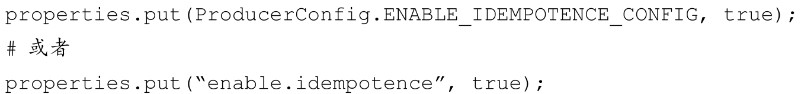

# Table of Contents

* [前提知识](#前提知识)
* [幂等](#幂等)
  * [小结](#小结)
* [事务](#事务)

# 前提知识

一般而言，消息中间件的消息传输保障有3个层级，分别如下。

+ `at most once`：至多一次。消息可能会丢失，但绝对不会重复传输。
+ `at least once`：最少一次。消息绝不会丢失，但可能会重复传输。
+ `exactly once`：恰好一次。每条消息肯定会被传输一次且仅传输一次。

> 在日常工作中，消息丢失是不能忍受的，消息重复是可以通过业务逻辑来规避，最好的选择就是`exactly once`

Kafka从0.11.0.0版本开始引入了幂等和事务这两个特性，以此来实现`EOS`（exactly once semantics，精确一次处理语义）。

# 幂等

**幂等：简单的说就是对接口的多次调用所产生的结果和调用一次是一致的。**

KafKa默认是不开启幂等的，如果需要，enable.idempotence设置为true即可

> KafKa如何实现生产者发送消息的幂等性？

+ PID： 每个实例化的生产者都会有被分配一个PID
+ seq： 对于每个PID，消息发送到的**每一个分区**都有对应的序列号，这些序列号从0开始单调递增。生产者每发送一条消息就会将＜PID，分区＞对应的序列号的值加1

broker端会在内存中为每一对＜PID，分区＞维护一个序列号。对于收到的每一条消息，只有当它的序列号的值（SN_new）比broker端中维护的对应的序列号的值（SN_old）大1（即SN_new=SN_old+1）时，broker才会接收它。如果SN_new＜SN_old+1，那么说明消息被重复写入，broker可以直接将其丢弃。如果SN_new＞SN_old+1，那么说明中间有数据尚未写入，出现了乱序，暗示可能有消息丢失

## 小结

 1. 采用了和TCP一样的 使用了Seq
 2. 只能保证消息的幂等性，不能保证消息内容的幂等性，(2个消息，相关内容，不同序列号)
  3. Kafka的幂等只能保证单个生产者会话（session）中单分区的幂等。

# 事务

幂等性并不能跨多个分区运作，而事务[1]可以弥补这个缺陷。事务可以保证对多个分区写入操作的原子性。操作的原子性是指多个操作要么全部成功，要么全部失败，不存在部分成功、部分失败的可能。

Kafka的事务总的来说是为当前操作分配一个唯一的 transactionalId，

KAFKA 引入了两个新的组件：Transaction Coordinator 和 Transaction Log

为支持事务机制，KAFKA 将底层日志文件的格式进行了扩展：

- 日志中除了普通的消息，还有一种消息专门用来标志事务的状态，它就是控制消息 control batch；
- 控制消息跟其他正常的消息一样，都被存储在日志中，但控制消息不会被返回给 consumer 客户端；
- 控制消息共有两种类型：commit 和 abort，分别用来表征事务已经成功提交或已经被成功终止；
- RecordBatch 中 attributes 字段的第5位用来标志当前消息是否处于事务中，1代表消息处于事务中，0则反之；（A record batch is a container for records. ）
- RecordBatch 中 attributes 字段的第6位用来标识当前消息是否是控制消息，1代表是控制消息，0则反之；
- 由于控制消息总是处于事务中，所以控制消息对应的RecordBatch 的 attributes 字段的第5位和第6位都被置为1；

- KAFKA 消费者消费消息时可以指定具体的读隔离级别，当指定使用 read_committed 隔离级别时，在内部会使用存储在目标 topic-partition 中的 事务控制消息，来过滤掉没有提交的消息，包括回滚的消息和尚未提交的消息;
- 需要注意的是，过滤消息时，KAFKA consumer 不需要跟 transactional coordinator 进行 rpc 交互，因为 topic 中存储的消息，包括正常的数据消息和控制消息，包含了足够的元数据信息来支持消息过滤；
- KAFKA 消费者消费消息时也可以指定使用 read_uncommitted 隔离级别，此时目标 topic-partition 中的所有消息都会被返回，不会进行过滤。
