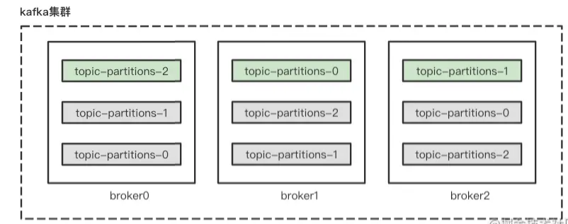
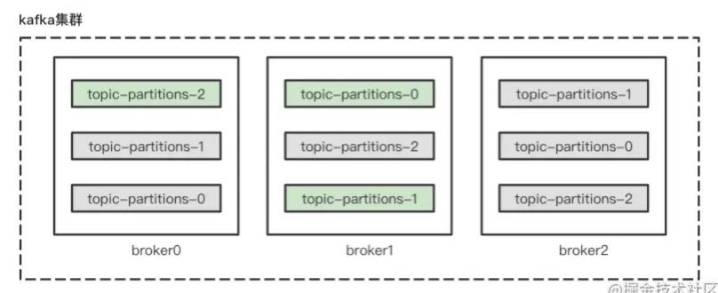
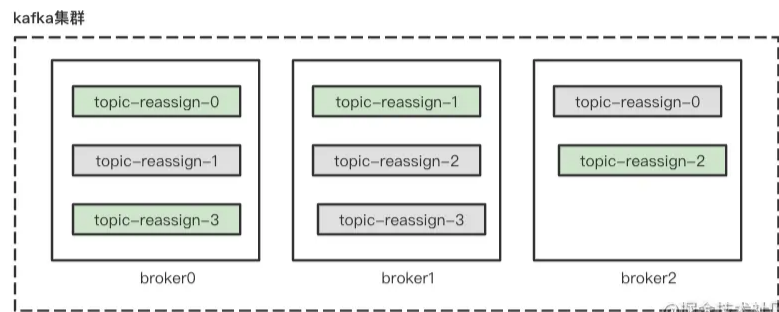
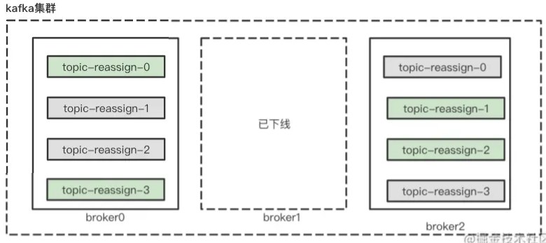

# Table of Contents

* [优先副本](#优先副本)
* [分区重分配](#分区重分配)
* [修改副本因子](#修改副本因子)
* [总结](#总结)
* [问题](#问题)


https://juejin.cn/post/7000552764119973902


# 优先副本

kafka使用多副本机制提高可靠性，但是只有leader副本对外提供读写服务，follow副本只是做消息同步。**如果一个分区的leader副本不可用，就意味着整个分区不可用，此时需要从follower副本中选举出新的leader副本提供服务**。

**在创建主题的时候，该分区的主题和副本会尽可能的均匀发布到kafka的各个broker上**。比如我们在包含3个broker节点的kafka集群上创建一个分区数为3，副本因子为3的主题`topic-partitions`时，leader副本会均匀的分布在3台broker节点上。




**针对同一个分区，在同一个broker节点上不可能出现它的多个副本**。我们可以把leader副本所在的节点叫作分区的leader节点，把follower副本所在的节点叫作follower节点。在上面的例子中，分区0的leader节点是broker1，分区1的leader节点是broker2，分区2的leader节点是broker0。

当分区leader节点发生故障时，其中的一个follower节点就会选举为新的leader节点。当原来leader的节点恢复之后，它只能成为一个follower节点，此时就导致了集群负载不均衡。比如分区1的leader节点broker2崩溃了，此时选举了在broker1上的分区1follower节点作为新的leader节点。当broker2重新恢复时，此时的kafka集群状态如下：




可以看到，此时broker1上负载更大，而broker2上没有负载。

**为了解决上述负载不均衡的情况，kafka支持了优先副本选举，优先副本指的是一个分区所在的AR集合的第一个副本**。

> 我理解的优先副本就是负载最小的。或者说leader最少的。

比如上面的分区1，它的AR集合是`[2,0,1]`，表示分区1的优先副本就是在broker2上。

理想情况下，优先副本应该就是leader副本，kafka保证了优先副本的均衡分布，而这与broker节点宕机与否没有关系。

**分区平衡并不意味着Kafka集群的负载均衡**。


**优先副本选举就是对分区leader副本进行选举的时候，尽可能让优先副本成为leader副本**，针对上述的情况，只要再触发一次”优先副本选举“就能保证分区负载均衡。


> kafka默认支持自动”优先副本选举“功能，默认每5分钟触发一次”优先副本选举“操作。但是建议生产环境将自动功能关闭，而是视情况进行手动”优先副本选举“操作。
>
>  Kafka 的控制器会启动一个定时任务，这个定时任务会轮询所有的 broker节点，
>
> 计算每个broker节点的分区不平衡率（broker中的不平衡率=非优先副本的leader个数/分区总数）是否超过leader.imbalance.per.broker.percentage参数配置的比值，默认值为 10%，如果超过设定的比值则会自动执行优先副本的选举动作以求分区平衡。


# 分区重分配

当我们要下线一个节点或者新增一个节点时，为了保证分区负载均衡，需要进行分区重分配操作。kafka提供了`kafka-reassign-partitions.sh`脚本执行分区重分配，主要包括3个步骤：

1. 创建需要重分配的主题清单的JSON文件。
2. 根据主题清单和broker节点清单生成一份重分配方案。
3. 执行重分配。

接下来，我们以下线一个节点为例进行详细说明。假设在一个包括3个节点的kafka集群创建一个分区数为4，副本因子为2的主题`topic-reassign`。



现在我们要下线broker1，并且在下线之前要将上面的分区副本迁移出去。


+  创建需要重分配的主题清单的JSON文件

```java
{
  "topics": [
    {
      "topic": "topic-reassign"
    }
  ],
  "version": 1
}

```

+  根据主题清单和broker节点清单生成一份重分配方案

```java
[root@node1 kafka_2.11-2.0.0]# bin/kafka-reassign-partitions.sh --zookeeper localhost:2181/kafka --generate --topics-to-move-json-file reassign.json --broker-list 0,2
    //当前的分区副本分配情况。
Current partition replica assignment
{"version":1,"partitions":[{"topic":"topic-reassign","partition":2,"replicas":[2,1],"log_dirs":["any","any"]},{"topic":"topic-reassign","partition":1,"replicas":[1,0],"log_dirs":["any","any"]},{"topic":"topic-reassign","partition":3,"replicas":[0,1],"log_dirs":["any","any"]},{"topic":"topic-reassign","partition":0,"replicas":[0,2],"log_dirs":["any","any"]}]}

//重分配的候选方案，注意这里只是生成一份可行性的方案，并没有真正执行重分配的动作
Proposed partition reassignment configuration
{"version":1,"partitions":[{"topic":"topic-reassign","partition":2,"replicas":[2,0],"log_dirs":["any","any"]},{"topic":"topic-reassign","partition":1,"replicas":[0,2],"log_dirs":["any","any"]},{"topic":"topic-reassign","partition":3,"replicas":[0,2],"log_dirs":["any","any"]},{"topic":"topic-reassign","partition":0,"replicas":[2,0],"log_dirs":["any","any"]}]}

```

+  执行重分配

```java
[root@node1 kafka_2.11-2.0.0]# bin/kafka-reassign-partitions.sh --zookeeper localhost:2181/kafka --execute --reassignment-json-file project.json Current partition replica assignment

```

执行重分配之后分区副本信息如下：



**分区重分配本质在于数据复制，先增加新的副本，然后进行数据同步，最后删除旧的副本来达到最终的目的**。

数据复制会占用额外的资源，如果重分配的量太大必然会严重影响整体的性能，尤其是处于业务高峰期的时候，因此kafka还支持了复制限流功能。

**所谓复制限流，就是对副本间的复制流量加以限制来保证重分配期间整体服务不会受太大的影响**。


# 修改副本因子

创建主题之后我们还可以修改分区的个数，同样可以修改副本因子（副本数）。

修改副本因子的使用场景也很多，比如在创建主题时填写了错误的副本因子数而需要修改，再比如运行一段时间之后想要通过增加副本因子数来提高容错性和可靠性。

前面主要讲述了分区重分配的相关细节，本节中修改副本因子的功能也是通过重分配所使用的 kafka-reassign-partition.sh 脚本实现的。


# 总结

1. 当broker出现问题后。leader副本的选举会带来分区不均衡，所以引入了优先副本的概念
2. 分区重分配可以重新分配副本在不同分区上，可以达到分区平衡。
3. 注意这里的分区平衡实际上指的是分区中leader副本的平衡


# 问题

1. Kafka 有哪几处地方有分区分配的概念？简述大致的过程及原理。

   >  这里要注意 当遇到“ 分区分配 ”这个字眼的时候，一定要记住有三处地方**，分别是**生产者发送消息、消费者消费消息和创建主题。  
   >
   > 1. 生产者在发送消息到主题是，分有key和无key的情况
   > 2. 消费者消费的时候，可以通过`subscribe`或者`assign`来订阅主题下的分区
   > 3. 创建主题时 通过kafka-topics.sh脚本或者kafkaAdminClient来实现主题下的分区分配

