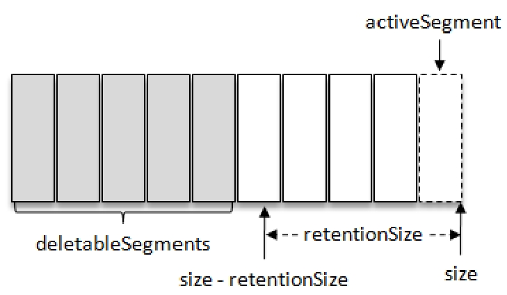
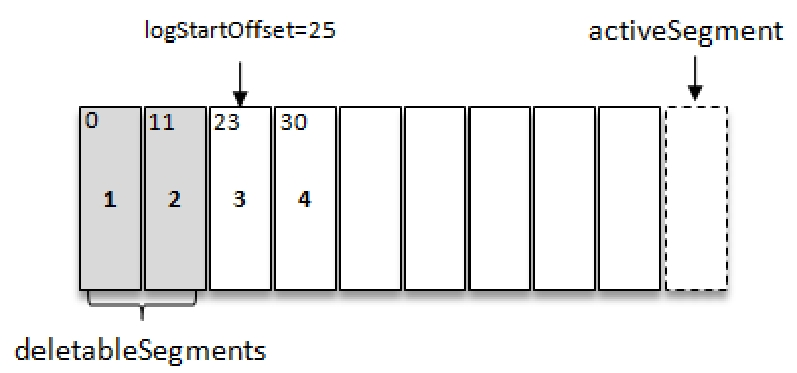
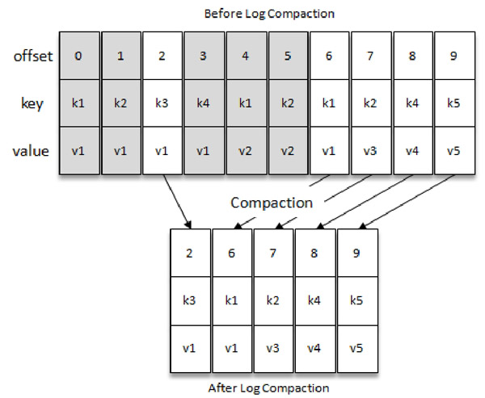
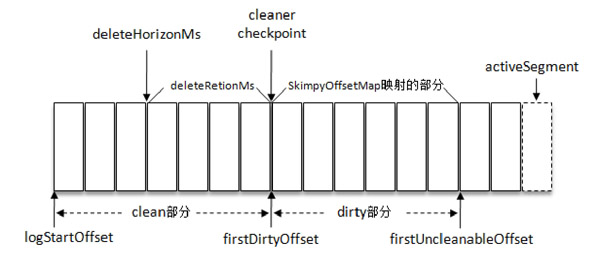

# Table of Contents

* [日志删除](#日志删除)
  * [基于时间](#基于时间)
  * [基于日志大小](#基于日志大小)
  * [基于偏移量](#基于偏移量)
  * [日志删除](#日志删除-1)
* [日志压缩](#日志压缩)
* [总结](#总结)

Kafka 将消息存储在磁盘中，为了控制磁盘占用空间的不断增加就需要对消息做一定的清理操作。

> 如果日志一直增长下去，存储空间会变得极大。
>
> Mysql的redo 和undo也是重复利用的
>
> bin log目前没了解是否会删除，应该也会删除的

Kafka提供了两种日志清理策略：

+ 日志删除（Log Retention）：按照一定的保留策略直接删除不符合条件的日志分段。

+ 日志压缩（Log Compaction）：针对每个消息的key进行整合，对于有相同key的不同value值，只保留最后一个版本。

  > 压缩也会使数据量减少，变相达到删除的目的

Kafka默认采用**日志删除（Log Retention）**，也同时支持2中模式。

# 日志删除

在Kafka的日志管理器中会有**一个专门的日志删除任务来周期性地检测和删除不符合保留条件的日志分段文件**，这个周期可以通过broker端参数log.retention.check.interval.ms来配置，默认值为300000，即5分钟。

当前日志分段的保留策略有3种：

+ **基于时间的保留策略(最常用)**

+ 基于日志大小的保留策略

+ 基于日志起始偏移量的保留策略。

  

## 基于时间

日志删除任务会检查当前日志文件中**是否有保留时间超过设定的阈值（retentionMs）**来寻找可删除的日志分段文件集合（deletableSegments）

优先级大小

+ log.retention.ms
+ log.retention.minutes
+ log.retention.minutes

> 注意者保留时间，日志分段中**最大的时间戳largestTimeStamp 来计算的**,不是日志分段的**最近修改时间(lastModifiedTime)**

若待删除的日志分段的总数等于该日志文件中所有的日志分段的数量，那么说明所有的日志分段都已过期，但该日志文件中还要有一个日志分段用于接收消息的写

入，即**必须要保证有一个活跃的日志分段 activeSegment**，在此种情况下，会先切分出一个新的日志分段作为activeSegment，然后执行删除操作。

## 基于日志大小

日志删除任务会检查当前日志的大小是**否超过设定的阈值（retentionSize）**

+ log.retention.bytes：Log中所有日志文件的总大小
+ log.segment.bytes： 单个日志分段，默认为1GB

如何删除？

查找出 deletableSegments 之后就执行删除操作，这个删除操作和基于时间的保留策略的删除操作相同

## 基于偏移量

基于日志起始偏移量的保留策略的判断依据是某日志分段的**下一个日志分段的起始偏移量baseOffset 是否小于等于logStartOffset**

## 日志删除

**删除日志分段时，首先会从Log对象中所维护日志分段的跳跃表中移除待删除的日志分段，以保证没有线程对这些日志分段进行读取操作。**然后将日志分段所对应的所有文件添加上“.deleted”的后缀（当然也包括对应的索引文件）。最后交由一个以“delete-file”命名的延迟任务来删除这些以“.deleted”为后缀的文件，这个任务的延迟执行时间可以通过file.delete.delay.ms参数来调配，此参数的默认值为60000，即1分钟。

> 时间之前，从跳跃表找节点删除

# 日志压缩

Kafka中的Log Compaction是指在默认的日志删除（Log Retention）规则之外提供的一种清理过时数据的方式。

> 注意日志压缩和消息压缩

如图所示，Log Compaction对于有相同key的不同value值，只保留最后一个版本。**如果应用只关心key对应的最新value值，则可以开启Kafka的日志压缩功能**，Kafka会定期将相同key的消息进行合并，只保留最新的value值。

> 有点类似Redis的AOF文件重写功能，也是对文件进行`瘦身`

每一个日志目录下都有一个名为“cleaner-offset-checkpoint”的文件，这个文件就是清理检查点文件，用来记录每个主题的每个分区中已清理的偏移量。

# 总结

1. 日志删除是删除日志文件，日志压缩是对相同key的清理。
