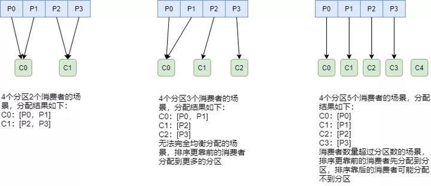
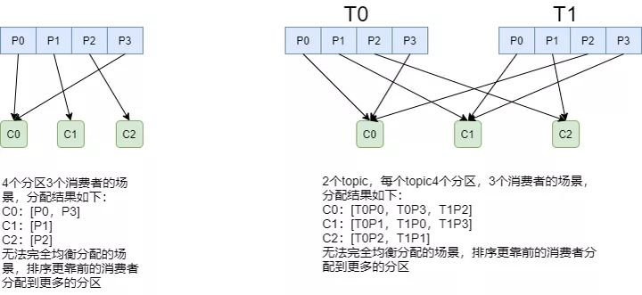
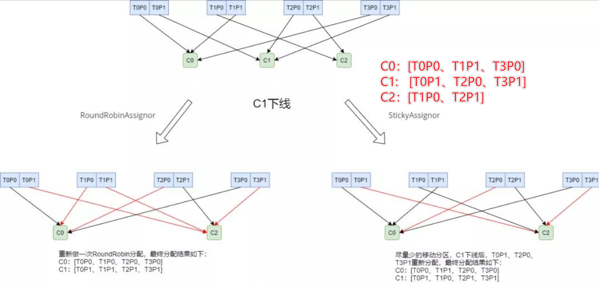
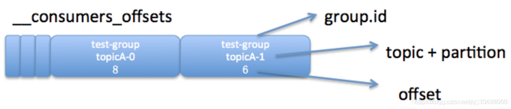

# Table of Contents

* [在均衡情景](#在均衡情景)
* [分区分配策略(消费者)](#分区分配策略消费者)
  * [基础知识](#基础知识)
  * [RangeAssigor](#rangeassigor)
  * [RoundBobinAssigor](#roundbobinassigor)
  * [StickyAssigor](#stickyassigor)
  * [自定义分区策略](#自定义分区策略)
  * [小结](#小结)
* [Kafka消费者协调器和组协调器_再均衡原理](#kafka消费者协调器和组协调器_再均衡原理)
  * [Rebalance Generation](#rebalance-generation)
  * [在均衡过程](#在均衡过程)
* [Counsume_offest](#counsume_offest)
  * [如何写入](#如何写入)
  * [如何指定位置消费](#如何指定位置消费)
  * [怎么清除](#怎么清除)


# 在均衡情景

当以下事件发生时，Kafka 将会进行一次分区分配：

- 同一个 Consumer Group 内新增消费者
- 消费者离开当前所属的Consumer Group，包括shuts down 或 crashes
- 订阅的主题新增分区
- 一句话双方数量发生了变化

**将分区的所有权从一个消费者移到另一个消费者称为重新平衡（rebalance）**


# 分区分配策略(消费者)

## 基础知识

一个consumer group中有多个consumer，一个topic有多个partition，所以必然会涉及到partition的分配问题，即确定哪个partition由哪个consumer来消费。Kafka提供了3种消费者分区分配策略：RangeAssigor、RoundRobinAssignor、StickyAssignor。

```java
Range：范围
RoundRobin:轮询调度
Sticky：粘性的
```

`PartitionAssignor`接口用于用户定义实现分区分配算法，以实现Consumer之间的分区分配。

消费组的成员订阅它们感兴趣的Topic并将这种订阅关系传递给作为订阅组协调者的`Broker`。

协调者选择其中的一个消费者来执行这个消费组的分区分配并将分配结果转发给消费组内所有的消费者。

Kafka默认采用`RangeAssignor`的分配算法。


> 有一个面试题， “消费组中的消费者个数如果超过 topic 的分区，那么就会有消费者消费不到数据”这句话是否正确？


## RangeAssigor

从字面上理解来说是范围分配。

RangeAssignor对每个Topic进行独立的分区分配。

> 注意这里是每个主题，不是所有主题，这是有区别的。


对于每一个Topic，首先对分区按照分区ID进行排序，然后订阅这个Topic的消费组的消费者再进行排序，之后尽量均衡的将分区分配给消费者。这里只能是尽量均衡，因为分区数可能无法被消费者数量整除，那么有一些消费者就会多分配到一些分区。分配示意图如下：




+ 消费分区数量一致或者整数倍，那么没有问题。
+ 消费者 数量小于分区数量，靠前的消费者会多消费到多的分区。
+ 消费者数量大于分区数量，靠后的消费者无法消费的分区。


其实这种分区策略是可以满足日常使用的，**就是要注意每个主题下，`消费者`和`分区`之间的数量关系。**


## RoundBobinAssigor

RoundRobinAssignor的分配策略是将消费组内订阅的**所有Topic的分区及所有消费者进行排序后**尽量均衡的分配

> 注意 **这里是所有Topic**

- 首先，将所有主题的分区组成`TopicAndPartition`列表。
- 然后对TopicAndPartition列表按照hashCode进行排序某个 topic。





但是也会有比较极端的情况，就是一个消费者组的只有一个消费者，但是确订阅了3个分区(**这种情况基本是不会发送**)


## StickyAssigor

StickyAssignor分区分配算法，目的是在执行一次新的分配时，能在上一次分配的结果的基础上，尽量少的调整分区分配的变动，节省因分区分配变化带来的开销。Sticky是“粘性的”，可以理解为分配结果是带“粘性的”——每一次分配变更相对上一次分配做最少的变动。其目标有两点：

- 分区的分配尽量的均衡。
- 每一次重分配的结果尽量与上一次分配结果保持一致。

当这两个目标发生冲突时，优先保证第一个目标。第一个目标是每个分配算法都尽量尝试去完成的，而第二个目标才真正体现出StickyAssignor特性的。





## 自定义分区策略

```
public interface ConsumerPartitionAssignor {

}
```


## 小结

+ 无论是哪种分区分配策略，消费者和分区的数量尽量是整数倍。
+ RangeAssigor适用于消费者组只有一个Topic的情况。
+ RoundRobinAssigor适用于消费者组有多个Topic的情况。
+ 不满足自身业务条件，是可以用自定义的分区条件，不过一般不建议自定义。


# Kafka消费者协调器和组协调器_再均衡原理

了解了Kafka 中消费者的分区分配策略之后是否会有这样的疑问：如果消费者客户端中配置了两个分配策略，那么以哪个为准呢？如果有多个消费者，彼此所配置的分配策略并不完全相同，那么以哪个为准？多个消费者之间的分区分配是需要协同的，那么这个协同的过程又是怎样的呢？

这一切都是交由消费者协调器（ConsumerCoordinator）和组协调器（GroupCoordinator）来完成的，它们之间使用一套组协调协议进行交互。

> Coordinator:协调器


## Rebalance Generation

每次Rebalance后，消费者消费的可能不是当前的分区，所以需要一个标识来区分。

每次group进行Rebalance之后，Generation号都会加1，表示消费组和分区的映射关系到了一个新版本，


## 在均衡过程

再均衡分为2步：Join和Sync 

+ Join， 加入组。所有成员都向消费组协调器发送JoinGroup请求，请求加入消费组。一旦所有成员都发送了JoinGroup请求，协调i器从中选择一个消费者担任Leader的角色，并把组成员信息以及订阅信息发给Leader。 
+ Sync，Leader开始分配消费方案，即哪个消费者负责消费哪些主题的哪些分区。一旦完成分配，Leader会将这个方案封装进SyncGroup请求中发给消费组协调器，非Leader也会发SyncGroup请求，只是内容为空。消费组协调器接收到分配方案之后会把方案塞进SyncGroup的response中发给各个消费者。


# Counsume_offest

由于Zookeeper并不适合大批量的频繁写入操作，新版Kafka已推荐将consumer的位移信息保存在Kafka内部的topic中，即`__consumer_offsets` topic，并且默认提供了`kafka_consumer_groups.sh`脚本供用户查看consumer信息。

`__consumer_offsets` 是 kafka 自行创建的，和普通的 topic 相同。

它存在的目的之一就是保存 consumer 提交的位移。 `__consumer_offsets` 的每条消息格式大致如图所示



+ key：`group.id+topic+分区号`
+ value： offest


## 如何写入

`__consumer_offsets_`的文件夹默认为50个

虑到一个 kafka 生成环境中可能有很多`consumer` 和 `consumer group`，如果这些 consumer 同时提交位移，则必将加重 __consumer_offsets 的写入负载，因此 kafka 默认为该 topic 创建了50个分区，并且对每个 `group.id`做哈希求模运算`Math.abs(groupID.hashCode()) % numPartitions`，从而将负载分散到不同的 __consumer_offsets 分区上。

> `Math.abs(groupID.hashCode()) % numPartitions`


一般情况下，当集群中第一次有消费者消费消息时会自动创建`__consumer_offsets`，它的副本因子受 `offsets.topic.replication.factor` 参数的约束，默认值为3（注意：该参数的使用限制在0.11.0.0版本发生变化），分区数可以通过 `offsets.topic.num.partitions` 参数设置，默认值为50。


## 如何指定位置消费

客户端参数 auto.offset.reset 来决定开始消费的位置


## 怎么清除

offsets.retention.minutes 来确定保留时长。offsets.retention.minutes的默认值为10080，即7天，超过这个时间后消费位移的信息就会被删除
