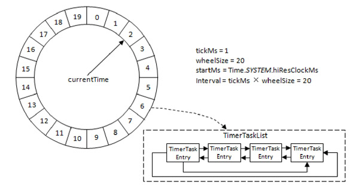
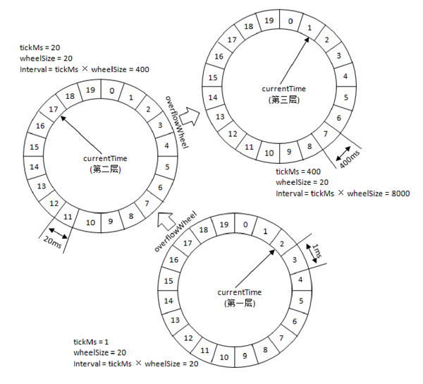
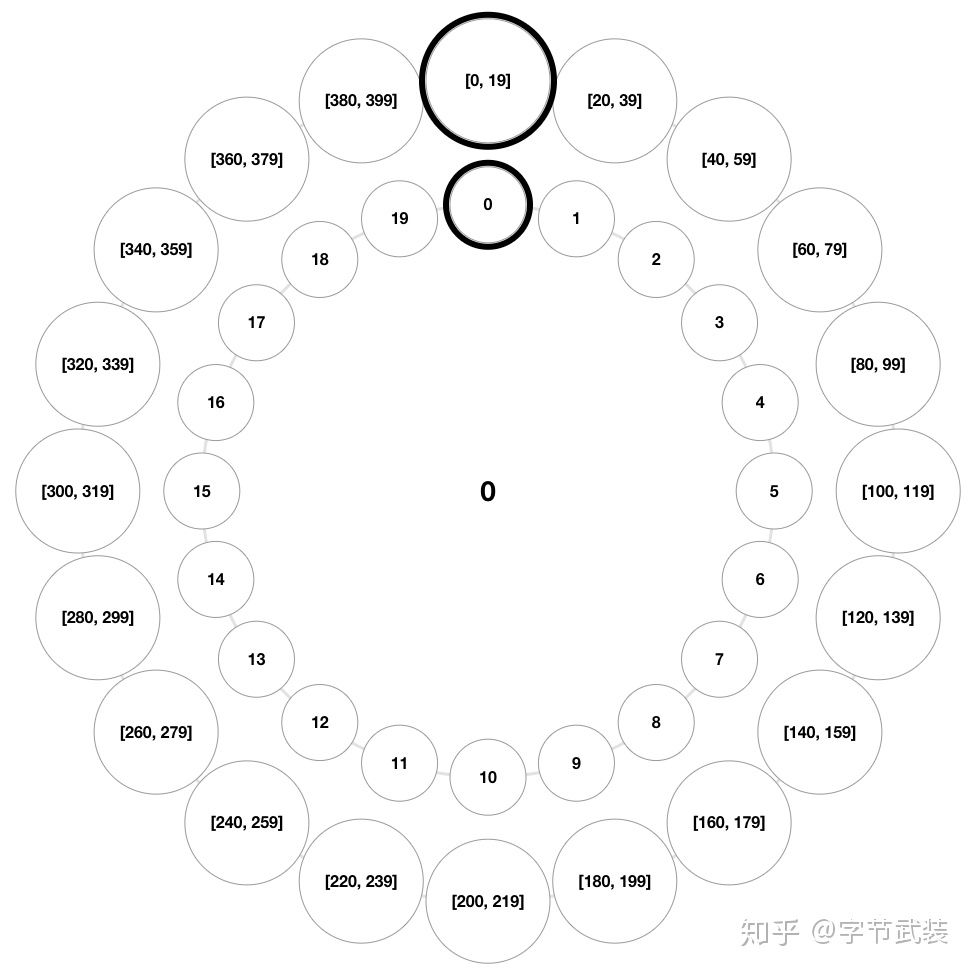
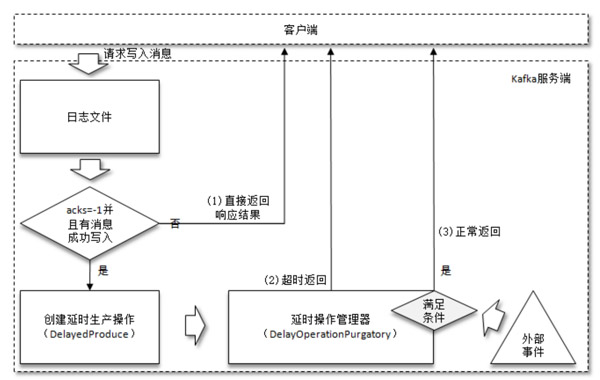
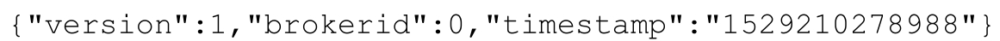

# Table of Contents

* [协议设计](#协议设计)
* [时间轮(重点)](#时间轮重点)
  * [数据结构](#数据结构)
  * [多层时间轮](#多层时间轮)
  * [动态时间轮](#动态时间轮)
  * [时间轮降级](#时间轮降级)
  * [时间轮空推进](#时间轮空推进)
* [延时操作](#延时操作)
  * [DelayedProduce](#delayedproduce)
  * [DelayedFetch](#delayedfetch)
* [控制器(重点)](#控制器重点)
  * [Kafka Controller](#kafka-controller)
  * [控制器的选举及异常恢复](#控制器的选举及异常恢复)
  * [分区Leader选举](#分区leader选举)
* [**参数解密**](#参数解密)

# 协议设计

在实际应用中，Kafka经常被用作高性能、可扩展的消息中间件。

Kafka自定义了一组基于TCP的二进制协议，只要遵守这组协议的格式，就可以向Kafka发送消息，也可以从Kafka中拉取消息，或者做一些其他的事情，

比如提交消费位移等。

# 时间轮(重点)

Kafka中存在大量的延时操作，比如延时生产、延时拉取和延时删除等。

Kafka并没有使用JDK自带的Timer或DelayQueue来实现延时的功能，而是基于时间轮的概念自定义实现了一个用于延时功能的定时器（SystemTimer）

> 为什么不用现有的，说白了就是时间复杂度高，满足不了Kafka的高性能要求

JDK中Timer和DelayQueue的插入和删除操作的平均时间复杂度为O（nlogn）并不能满足Kafka的高性能要求，而基于**时间轮可以将插入和删除操作的时间复杂度都降为O（1）。**

时间轮的应用并非Kafka独有，其应用场景还有很多，在Netty、Akka、Quartz、ZooKeeper等组件中都存在时间轮的踪影。

> 总之，这个玩意碉堡了，效率极高~

## 数据结构

Kafka中的时间轮（TimingWheel）是一个存储定时任务的环形队列，底层采用数组实现，数组中的每个元素可以存放一个定时任务列表（TimerTaskList）。TimerTaskList是一个**环形的双向链表**，链表中的每一项表示的都是定时任务项（TimerTaskEntry），其中封装了真正的定时任务（TimerTask）。

> 用数组时为了查找方便，
>
> 这里用环形链表，如果同一个槽数量足够多，怎么处理？

+ `tickMs`：每个时间格的基本时间跨度，

+ `wheelSize`：时间轮的时间格个数是固定的

+ `interval`：总体时间跨度`interval`=`tickMs`*`wheelSize`

+ `currentTime`：用来表示时间轮当前所处的时间,是`tickMs`的整数倍，将时间轮划分为到期部分和未到期部分.currentTime当前指向的时间格也属于到期部分，表示刚好到期，需要处理此时间格所对应的TimerTaskList中的所有任务。

举个例子：

1. 插入一个定时为2ms的任务，2%20=2,所以会放在时间格2

   1.5S是放哪里？放1
2. currentTime=2，会释放<=2之前的任务。
3. 插入一个8ms的任务，8%20=8+2(currentTime) ,所以会放在时间格10
4. 同时插入一个19ms的任务，19%20=19+2=21 也就是时间格1.**新来的TimerTaskEntry会复用原来的TimerTaskList**

> 总之，整个时间轮的总体跨度是不变的，随着指针currentTime的不断推进，当前时间轮所能处理的时间段也在不断后移，总体时间范围在currentTime和currentTime+interval之间。

## 多层时间轮

如果此时有一个定时为350ms的任务该如何处理？直接扩充wheelSize的大小？Kafka中不乏几万甚至几十万毫秒的定时任务，这个wheelSize的扩充没有底线，就算将所有的定时任务的到期时间都设定一个上限，比如100万毫秒，那么这个wheelSize为100万毫秒的时间轮不仅占用很大的内存空间，而且也会拉低效率。

**Kafka 为此引入了层级时间轮的概念，当任务的到期时间超过了当前时间轮所表示的时间范围时，就会尝试添加到上层时间轮中。**

+ 第一层： tickMs=1ms、wheelSize=20、interval=20ms
+ 第二层： tickMs=20ms、wheelSize=20、interval=400ms
+ 第三层： tickMs=400ms、wheelSize=20、interval=800ms

> 本层的`tickms`是上一层的`interval`,也就是说**第二层时间轮的一个时间格就可以表示第一层时间轮的所有(20个)时间格**;

## 动态时间轮

通常来说, 第二层时间轮的第0个时间格是用来表示第一层时间轮的, 这一格是存放不了任务的, 因为超时时间0-20s的任务, 第一层时间轮就可以处理了。

<iframe  height=500 width=150  src=".images/v2-50c4f9f7bbc77c84a0a1da23d86c36cf_b.gif">
从图中可以看到，当第一层时间轮的指针定格在1s时，超时时间0s的时间格就过期了。而这个时候，第二层时间轮第0个时间格的时间范围就从[0,19]分为了过期的[0],和未过期的[1,19]。而过期的[0]就会被新的过期时间[400]复用。

第二层时间轮第0个时间格的过期时间范围演变如下：

[0-19]

[400][1,19]

[400,401][2,19]

......

[400,419]

所以，如果在当前时间是2s的时候, 插入一个延时时间为399s的任务, 这个任务的过期时间就是在2s的基础上加399s，也就是401s。这个任务还是会插到第二层时间轮第0个时间格中去。

## 时间轮降级

例子：

1. 对于350ms的，会在第二层(350+2)%20=17
2. 对于450ms的，会在第三层的第一格。
3. 随着时间流逝，原本定时为450ms的任务还剩下50ms的时间，会降级到第二层【40-60】，再经历40ms之后，此时这个任务又被“察觉”，不过还剩余10ms，还是不能立即执行到期操作。会降级到第一层的【10-11】中。此时任务到期，执行任务。

## 时间轮空推进

从动画中可以注意到, 随着时间推进, 时间轮的指针循环往复地定格在每一个时间格上, 每一次都要判断当前定格的时间格里是不是有任务存在;

其中有很多时间格都是没有任务的, 指针定格在这种空的时间格中, 就是一次"空推进";

比如说, 插入一个延时时间400s的任务, 指针就要执行399次"空推进", 这是一种浪费!

Kafka中的定时器借了JDK中的DelayQueue来协助推进时间轮。

具体做法是对于每个使用到的`TimerTaskList`都加入`DelayQueue`，

>  每个用到的TimerTaskList特指非哨兵节点的定时任务项TimerTaskEntry对应的TimerTaskList。

+ `DelayQueue`会根据`TimerTaskList`对应的超时时间`expiration`来排序，最短`expiration`的`TimerTaskList`会被排在`DelayQueue`的队头。

+ Kafka中会有一个线程来获取 DelayQueue 中到期的任务列表,`ExpiredOperationReaper`=过期操作收割机

+ 当“收割机”线程获取 DelayQueue 中超时的任务列表 TimerTaskList之后,既可以根据TimerTaskList 的 

  expiration 来推进时间轮的时间，也可以就获取的TimerTaskList执行相应的操作，对里面的TimerTaskEntry该执行过期操作的就执行过期操作，该降级时间轮的就降级时间轮。

> Kafka 中的 TimingWheel 专门用来执行插入和删除TimerTaskEntry的操作，而 DelayQueue 专门负责时间推进的任务。用DelayQueue空间换时间。

# 延时操作

我们先了解下定时和延时的区别

+ 定时操作：指在特定时间之后执行的操作

+ 延时操作：有可能在延时期间提前执行某操作，也就是延时操作是支持外部事件触发的。

  > 这里和线程池的Future有什么区别？
  >
  > Future：时任务完成回调给调用方
  >
  > 延时：如果没有外界打破，即使完成，也只能到过期时间后，通知调用方
  >
  > 定时：周期性执行
  >
  > 业务场景不同，使用方式也不同。

如果在使用生产者客户端发送消息的时候将 acks 参数设置为-1，那么就意味着需要等待ISR集合中的所有副本都确认收到消息之后才能正确地收到响应的结果，或者捕获超时异常。

> 这个时候用定时是不明智的，定时只会周期的扫描，不能精准的抓住任务的完成时间点。

## DelayedProduce

Kafka是怎么处理的？在消息写入Leader副本后，会创建一个DelayProduce,用来处理消息正常写入所有副本或者超时情况，以返回相应的响应结果给客户端。

延时操作需要延时返回响应的结果，首先**它必须有一个超时时间（delayMs）**，如果在这个超时时间内没有完成既定的任务，那么就需要强制完成以返回响应结果给客户端。

就延时生产操作而言，它的**外部事件是所要写入消息的某个分区的HW（高水位）发生增长。**

也就是说，随着follower副本不断地与leader副本进行消息同步，进而促使HW进一步增长，HW 每增长一次都会检测是否能够完成此次延时生产操作，如果可以就执行以此返回响应结果给客户端；如果在超时时间内始终无法完成，则强制执行。

> 也就是说，DelayProudec的提前返回是靠另外的线程监听，来返回响应结果的。

+ 延时操作创建之后会被加入**延时操作管理器**（DelayedOperationPurgatory）
+ 每个延时操作管理器都会配备一个**定时器**（SystemTimer）来做超时管理，底层是**时间轮**
+ “**收割机”线程**就是由延时操作管理器启动的
+ 延时操作需要支持外部事件的触发，所以还要配备一个**监听池**来负责监听每个分区的外部事件—查看是否有分区的HW发生了增长。
+ ExpiredOperationReaper不仅可以推进时间轮，还会定期清理监听池中已完成的延时操作。

## DelayedFetch

> 有延时生产就有延时拉取。

两个follower副本都已经拉取到了leader副本的最新位置，此时又向leader副本发送拉取请求，而leader副本并没有新的消息写入，那么此时leader副本该如何处理呢？

Kafka在处理拉取请求时，会先读取一次日志文件：fetchMinBytes，由参数fetch.min.bytes配置，默认值为1

+ 大于日志文件：不会创建延时操作

+ 小于日志文件：会创建一个延时拉取操作,以等待拉取到足够数量的消息。

  > 说明同步程度比较高。

外部事件如何触发呢？

消息追加到了leader副本的本地日志文件中，监听器会触发拉取操作，结束延时任务

超时事件：触发第二次读取日志。

# 控制器(重点)

## Kafka Controller

在 Kafka 集群中会有一个或多个 broker，其中**只有一个 broker 会被选举为控制器（Kafka Controller)**

它负责管理整个**集群中所有分区和副本的状态**。

+ 当某个分区的leader副本出现故障时，由控制器负责为该分区选举新的leader副本。(分区平衡)
+ 当检测到某个分区的ISR集合发生变化时，由控制器负责通知所有broker更新其元数据信息。
+ 当使用kafka-topics.sh脚本为某个topic增加分区数量时，同样还是由控制器负责分区的重新分配。

## 控制器的选举及异常恢复

Broker 在启动时，会尝试去 ZooKeeper 中创建 /controller 节点。Kafka 当前选举控制器的规则是：**第一个成功创建 /controller 节点的 Broker** 会被指定为控制器。

+ version：在目前版本中固定为1
+ brokerid：表示成为控制器的broker的id编号
+ timestamp：表示竞选成为控制器时的时间戳。

> 什么是脑裂？

有时由于网络问题，可能同时有两个broker认为自己是controller，这时候其他的broker就会发生脑裂，不知道该听从谁的。

> 如何解决脑裂问题？

ZooKeeper 中还有一个与控制器有关的/controller_epoch 节点，这个节点是持久（PERSISTENT）节点，节点中存放的是一个整型的controller_epoch值。

当控制器发生变更时，每选出一个新的控制器就将该字段值加1。每个和控制器交互的请求都会携带controller_epoch这个字段。

+ 如果请求的controller_epoch值小于内存中的controller_epoch值，则认为这个请求是向已经过期的控制器所发送的请求，那么这个请求会被认定为无效的请求。
+ 如果请求的controller_epoch值大于内存中的controller_epoch值，那么说明已经有新的控制器当选了。

## 分区Leader选举

# **参数解密**

