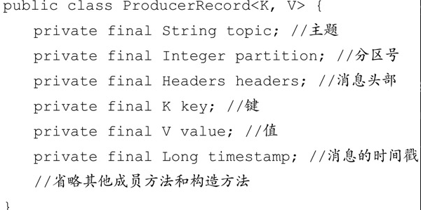
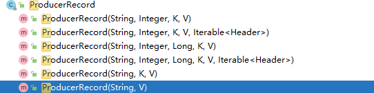
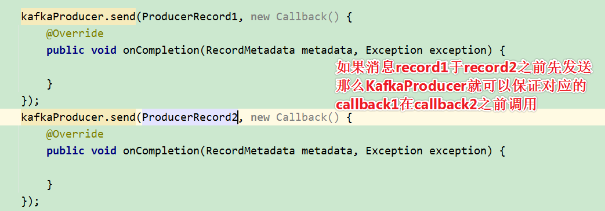

# Table of Contents

* [正常的生产者逻辑](#正常的生产者逻辑)
* [KafkaProducer](#kafkaproducer)
* [ProducerRecord](#producerrecord)
* [发送消息](#发送消息)
  * [拦截器 (不必须)](#拦截器-不必须)
  * [序列化](#序列化)
  * [分区器](#分区器)
* [疑惑](#疑惑)


# 正常的生产者逻辑

一个正常的生产逻辑需要具备以下几个步骤：

1. 配置生产者客户端参数以及创建相应的生产者实例。
2. 构建待发送的消息。
3. 发送消息。
4. 关闭实例(按需)


# KafkaProducer

在Kafka生产者客户端KafkaProducer中有3个参数是必填的。

+ `bootstrap.servers`: 该参数用来指定生产者客户端连接Kafka集群所需的broker地址清单，具体的内容格式为host1：port1，host2：port2，可以设置一个或多个地址，中间以逗号隔开，此参数的默认值为“”。

  > 注意这里并非需要所有的broker地址，因为生产者会从给定的broker里查找到其他broker的信息。不过建议至少要设置两个以上的broker 地址信息，当其中任意一个宕机时，生产者仍然可以连接到 Kafka集群上。

+ key.serializer和key.serializer：broker 端接收的消息必须以字节数组（byte[]）的形式存在。

  key.serializer和value.serializer这两个参数分别用来指定key和value序列化操作的序列化器，

  这两个参数无默认值。注意这里必须填写**序列化器的全限定名**。

+ `client.id`: 设定KafkaProducer对应的客户端id，默认值为“”。

  如果客户端不设置，则KafkaProducer会自动生成一个非空字符串，内容形式如“producer-1”“producer-2”，即字符串“producer-”与数字的拼接。


其他参数后面内容会提及到。


 **KafkaProducer是线程安全的**，可以在多个线程中共享单个KafkaProducer实例，也可以将KafkaProducer实例进行池化来供其他线程调用。

> 是因为是单例，所以是线程安全的吗？


KafkaProducer 中有多个构造方法。不过就实际应用而言，一般都选用public KafkaProducer（Properties properties）这个构造方法来创建KafkaProducer实例。


# ProducerRecord




+ `topic`：主题  <font color=red>必填</font>
+ `partition`：分区号
+ `headers`：是消息的头部，Kafka 0.11.x版本才引入这个属性，它大多用来设定一些与应用相关的信息，如无需要也可以不用设置。
+ `key` ：是用来指定消息的键，它不仅是消息的附加信息，还可以用来计算分区号进而可以让消息发往特定的分区。前面提及消息以主题为单位进行归类，而这个key可以让消息再进行二次归类，**同一个key的消息会被划分到同一个分区中**

+ `value`： 是指消息体，一般不为空，如果为空则表示特定的消息—墓碑消息  <font color=red>必填</font>

+ `timestamp`： 是指消息的时间戳，它有CreateTime和LogAppendTime两种类型，前者表示消息创建的时间，后者表示消息追加到日志文件的时间


`ProducerRecord`的构造方法也有多种




```java
    /**
     * Create a record with no key
     * 
     * @param topic The topic this record should be sent to
     * @param value The record contents
     */
    public ProducerRecord(String topic, V value) {
        this(topic, null, null, null, value, null);
    }
```


# 发送消息

发送消息主要有三种模式：发后即忘（fire-and-forget）、同步（sync）及异步（async）。


+ 发后即忘（fire-and-forget）

  ```java
   kafkaProducer.send(ProducerRecord);
  ```

  这种发送方式就是发后即忘，它只管往Kafka中发送消息而并不关心消息是否正确到达。在大多数情况下，这

  种发送方式没有什么问题，不过在某些时候（比如发生不可重试异常时）会造成消息的丢失。这种发送方式的

  **性能最高，可靠性也最差。**

+ 同步

  ```java
  Future<RecordMetadata> send = kafkaProducer.send(ProducerRecord1);
  RecordMetadata recordMetadata = send.get();
  OR
  kafkaProducer.send(ProducerRecord).get();
  ```

  要实现同步的发送方式，可以利用返回的Future对象实现。

  

  > Future 表示一个任务的生命周期，并提供了相应的方法来判断任务是否已经完成或取消，以及获取任务的结果和取消任务等。

  

  实际上send（）方法本身就是异步的，send（）方法返回的Future对象可以**使调用方稍后获得发送的结果**。示例中在执行send（）方法之后直接**链式调用了get（）方法来阻塞等待Kafka的响应，直到消息发送成功**，或者发生异常。如果发生异常，那么就需要捕获异常并交由外层逻辑处理。

+ 异步

  ```java
   kafkaProducer.send(ProducerRecord, new Callback() {
                  @Override
       public void onCompletion(RecordMetadata metadata, Exception exception) {
                      
                  }
       });
  ```

  这里为什么用Callback，不用Future.get()?

  使用Callback的方式非常简洁明了,Kafka有响应时就会回调，要么发送成功，要么抛出异常

  Future.get()，无法知道内部的细节。

+ 回掉函数保证分区有序


  


> 至于为什么？kafka发送的时候，有一个参数可以控制等待响应的请求数量。


## 拦截器 (不必须)

拦截器（Interceptor）是早在Kafka 0.10.0.0中就已经引入的一个功能，

Kafka一共有两种拦截器：生产者拦截器和消费者拦截器。

生产者拦截器既可以用来在消息发送前做一些准备工作，比如按照某个规则过滤不符合要求的消息、修改消息的内容等，也可以用来在发送回调逻辑前做一些定制化的需求，比如统计类工作。

+ 自定义实现接口`ProducerInterceptors`

+ 一般来说最好不要修改消息ProducerRecord 的 topic、key 和partition 等信息，如果要修改，则需确保对其有准确的判断，否则会与预想的效果出现偏差。比如修改key不仅会影响分区的计算，同样会影响broker端日志压缩（Log Compaction）的功能。

+ KafkaProducer 会在消息被应答（Acknowledgement）之前或消息发送失败时调用生产者拦截器的 onAcknowledgement（）方法，优先于用户设定的 Callback之前执行。这个方法运行在Producer 的 I/O 线程中，所以这个方法中实现的代码逻辑越简单越好，否则会影响消息的发送速度。

  ```java
   public void onCompletion(RecordMetadata metadata, Exception exception) {
              metadata = metadata != null ? metadata : new RecordMetadata(tp, -1, -1, RecordBatch.NO_TIMESTAMP, Long.valueOf(-1L), -1, -1);
              this.interceptors.onAcknowledgement(metadata, exception);
              if (this.userCallback != null)
                  this.userCallback.onCompletion(metadata, exception);
          }
  ```

+ KafkaProducer中不仅可以指定一个拦截器，还可以指定多个拦截器以形成拦截链。拦截链会按照 interceptor.classes 参数配置的拦截器的顺序来一一执行（配置的时候，各个拦截器之间使用逗号隔开）。
+ 

## 序列化

生产者需要用**序列化器**（Serializer）把对象转换成**字节数组**才能通过网络发送给`Kafka`。

而在对侧，消费者需要用反序列化器（Deserializer）把从 Kafka 中收到的字节数组转换成相应的对象

> 生产和消费需要有对应的**序列化器**。


+ 接口Serializer

  ```java
   /**
       * Configure this class.
       * @param configs configs in key/value pairs
       * @param isKey whether is for key or value
       */
      default void configure(Map<String, ?> configs, boolean isKey) {
          // intentionally left blank
      }
  
      /**
       * Convert {@code data} into a byte array.
       *
       * @param topic topic associated with data
       * @param data typed data
       * @return serialized bytes
       */
      byte[] serialize(String topic, T data);
  
      /**
       * Convert {@code data} into a byte array.
       *
       * @param topic topic associated with data
       * @param headers headers associated with the record
       * @param data typed data
       * @return serialized bytes
       */
      default byte[] serialize(String topic, Headers headers, T data) {
          return serialize(topic, data);
      }
  
      /**
       * Close this serializer.
       * <p>
       * This method must be idempotent as it may be called multiple times.
       */
      @Override
      default void close() {
          // intentionally left blank
      }
  ```

  

+ 一般用的多的就是`StringSerializer`和`ByteArraySerializer`

  > 转成字节数组 不用考虑数组类型。
+ 可以自定义实现`Serializer`满足自己的业务需求


## 分区器 

消息在通过send（）方法发往broker的过程中，有可能需要经过拦截器（Interceptor）、序列化器（Serializer）和分区器（Partitioner）的一系列作用之后才能被真正地发往 broker。


分区分2种情况

+ 消息经过序列化之后就需要确定它发往的分区，如果消息ProducerRecord中**指定了partition字段**，那么就不需要分区器的作用，因为partition代表的就是所要发往的分区号。

+ 如果消息ProducerRecord中**没有指定partition字段**，那么就需要依赖分区器，**根据key这个字段来计算partition的值**。分区器的作用就是为消息分配分区。

+ 对应代码

  ```java
  private int partition(ProducerRecord<K, V> record, byte[] serializedKey, byte[] serializedValue, Cluster cluster) {
      Integer partition = record.partition();
      return partition != null ? partition :
      partitioner.partition(record.topic(), record.key(), serializedKey, record.value(), serializedValue, cluster);
  }
  ```

+ 如果没有自定义实现`Partitioner`，那么就是默认的`DefaultPartitioner`

  ```java
     public int partition(String topic, Object key, byte[] keyBytes, Object value, byte[] valueBytes, Cluster cluster) {
         //key为null
          if (keyBytes == null) {
              return stickyPartitionCache.partition(topic, cluster);
          } 
          List<PartitionInfo> partitions = cluster.partitionsForTopic(topic);
          int numPartitions = partitions.size();
          // hash the keyBytes to choose a partition
          return Utils.toPositive(Utils.murmur2(keyBytes)) % numPartitions;
      }
  ```
  + 如果key为null，那么消息将会以**轮询**的方式发往主题内的**各个可用分区**。

    ```jav
        public int partition(String topic, Cluster cluster) {
        	//从cache取值 循环发送
            Integer part = indexCache.get(topic);
            if (part == null) {
                return nextPartition(topic, cluster, -1);
            }
            return part;
        }
    ```

  + 如果 key 不为 null，那么计算得到的分区号会是**所有分区中的任意一个**。

  > 也就是说，如果key不为null，可能发往的分区不一定可用！
  >
  > 一般建议不指定key，除非你确定分区可用。


### 修改分区数量

在不改变主题分区数量的情况下，key与分区之间的映射可以保持不变。

不过，**一旦主题中增加或减少了分区，那么就难以保证key与分区之间的映射关系了。**


> 分区难道不是一致性哈希？


## 生产者异常

KafkaProducer中一般会发生两种类型的异常：可重试的异常和不可重试的异常


+ **可重试异常**：不是逻辑导致的，网络等原因

  常见的可重试异常有：NetworkException、LeaderNotAvailableException、UnknownTopicOrPartitionException、NotEnoughReplicasException、NotCoordinatorException 等。比如NetworkException 表示网络异常，这个有可能是由于网络瞬时故障而导致的异常，可以通过重试解决；又比如LeaderNotAvailableException表示分区的leader副本不可用，这个异常通常发生在leader副本下线而新的 leader 副本选举完成之前，重试之后可以重新恢复。不可重试的异常

+ **不可重试的异常**：

  RecordTooLargeException异常，暗示了所发送的消息太大，KafkaProducer对此不会进行任何重试，直接抛出异常。


## 异常重试

对于**可重试的异常**，如果配置了 retries 参数，那么只要在规定的重试次数内自行恢复了，就不会抛出异常。retries参数的默认值为0，配置方式参考如下：


> 一般的作为发送方，对于不是业务代码引起的异常，一般都会设置重试。
>
> 比如`HttpClient`


# Close()

通常，一个KafkaProducer不会只负责发送单条消息，更多的是发送多条消息，在发送完这些消息之后，需要调用KafkaProducer的close（）方法来回收资源

```java
kafkaProducer.close();
```


close（）方法会阻塞等待之前所有的发送请求完成后再关闭 KafkaProducer。与此同时，KafkaProducer还提供了一个带超时时间的close（）方法，具体定义如下：

```java
public void close() {
    close(Duration.ofMillis(Long.MAX_VALUE));
}

public void close(Duration timeout) {
    close(timeout, false);
}

```

如果调用了带超时时间timeout的close（）方法，那么只会在等待timeout时间内来完成所有尚未完成的请求处理，然后强行退出。在实际应用中，一般使用的都是无参的close（）方法。


> 类似线程池的shutDown和stop()


# 疑惑 

1. 为什么`KafkaProducer`是线程安全？
2. 为什么回调函数保证分区有序？ record2回调一定比record1慢吗？

