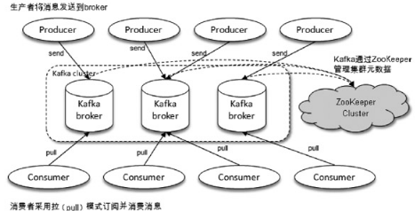
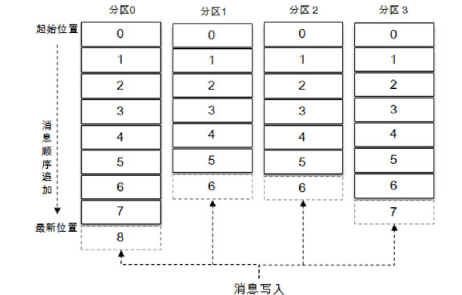
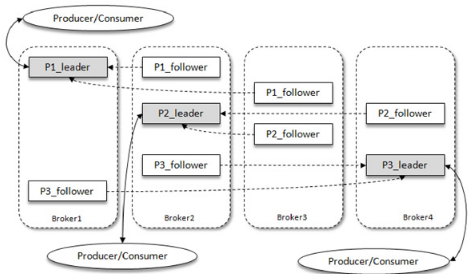
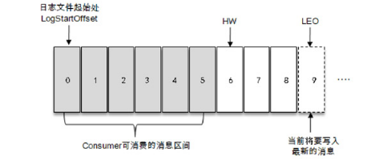
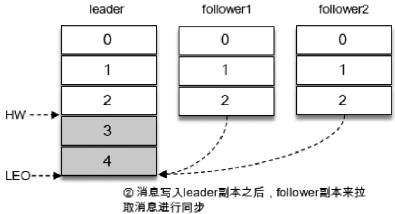
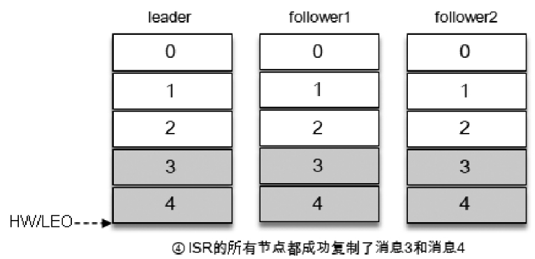

# Table of Contents

* [为什么使用kafka](#为什么使用kafka)
* [基本概念](#基本概念)
  * [Kafka体系结构](#kafka体系结构)
  * [主题（Topic）与分区（Partition）](#主题topic与分区partition)
  * [为什么要使用分区？](#为什么要使用分区)
  * [副本机制](#副本机制)
  * [AR、ISR、OSR](#arisrosr)
  * [HW 、LEO](#hw-leo)
* [总结](#总结)
* [疑惑](#疑惑)

# 为什么使用kafka

Kafka之所以受到越来越多的青睐，与它所“扮演”的三大角色是分不开的：

+ **消息系统：**

  `Kafka `和传统的消息系统（也称作消息中间件）都具备系统解耦、广播、冗余存储、流量削峰、缓冲、异步通信、扩展性、可恢复性等功能。

  > 冗余存储： 在大数据领域，冗余一般是指一模一样的数据存储多于一份的情况。

  与此同时，`Kafka `还提供了大多数消息系统难以实现的**消息顺序性保障**及**回溯消费**的功能。

  > kafka目前只能保证**分区顺序**
  >
  > 全局顺序需要**限制一个分区，一个消费者**。
  >
  > 回溯消费，可以调偏移量再次消费。对于工作中比较好用。

+ **存储系统：**

  `Kafka `把消息**持久化**到磁盘，相比于其他基于内存存储的系统而言，有效地降低了数据丢失的风险。

  也正是得益于`Kafka` 的消息持久化功能和多副本机制，我们可以把`Kafka`作为长期的数据存储系统来使用，只需要把对应的数据保留策略设置为“永久”或启用主题的日志压缩功能即可。

  > 日常工作中，一般都是持久化数据，然后发给`cunsumer`,做数据库的很少。

+ **流式处理平台：**

   Kafka 不仅为每个流行的流式处理框架提供了可靠的数据来源，还提供了一个完整的流式处理类库，比如窗口、连接、变换和聚合等各类操作。

  > 基本没用过

# 基本概念

## Kafka体系结构

一个典型的 Kafka 体系架构包括若干 Producer、若干 Broker、若干Consumer，以及一个ZooKeeper集群，

如图所示。其中ZooKeeper是Kafka用来负责**集群元数据的管理**、控制器的选举等操作的。

**Producer将消息发送到Broker，Broker负责将收到的消息存储到磁盘中，而Consumer负责从Broker订阅并消费消息。**

整个Kafka体系结构中引入了以下3个术语。

+ **Producer：**生产者，也就是发送消息的一方。生产者负责创建消息，然后将其投递到Kafka中。
+ **Consumer：**消费者，也就是接收消息的一方。消费者连接到Kafka上并接收消息，进而进行相应的业务逻辑处理。
+ **Broker：**服务代理节点。对于Kafka而言，Broker可以简单地看作一个独立的Kafka服务节点或Kafka服务实例。大多数情况下也可以将Broker看作一台Kafka服务器，前提是这台服务器上只部署了一个Kafka实例。一个或多个Broker组成了一个Kafka集群。一般而言，我们更习惯使用首字母小写的broker来表示服务代理节点。

## 主题（Topic）与分区（Partition）

在Kafka中还有两个特别重要的概念—主题（Topic）与分区（Partition）。

Kafka中的消息以**主题为单位进行归类**，生产者负责将消息发送到特定的主题（发送到Kafka集群中的每一条消息都要指定一个主题），而消费者负责订阅主题并进行消费。

**主题是一个逻辑上的概念**，它还可以细分为多个分区，一个分区只属于单个主题，很多时候也会把分区称为主题分区（Topic-Partition）。

同一主题下的不同分区包含的消息是不同的，**分区在存储层面可以看作一个可追加的日志（Log）文件**，消息在被追加到分区日志文件的时候都会分配一个特定的偏移量（offset）。

offset是消息在分区中的唯一标识，Kafka通过它来保证消息在分区内的顺序性，不过offset并不跨越分区，也就是说，**Kafka保证的是分区有序而不是主题有序**。

如图所示：主题中有 4 个分区，消息被顺序追加到每个分区日志文件的尾部。

**Kafka中的分区可以分布在不同的服务器（broker）上**，也就是说，**一个主题可以横跨多个broker，以此来提供比单个broker更强大的性能。**

> 为什么？使用分区并行化了。

每一条消息被发送到broker之前，会根据**分区规则选择存储到哪个具体的分区**。

如果分区规则设定得合理，所有的消息都可以均匀地分配到不同的分区中。

如果一个主题只对应一个文件，那么这个文件所在的机器 I/O 将会成为这个主题的性能瓶颈，而分区解决了这个问题。

在创建主题的时候可以通过指定的参数来设置分区的个数，当然也可以在主题创建完成之后去修改分区的数量，通过增加分区的数量可以实现水平扩展。

>topic是逻辑上的消息容器；
>
>partition实际承载消息，分布在不同的kafka的broke上。kafka的分区实现消息的高吞吐量的主要依托，主要是实现了写的负载均衡。可以指定各种负载均衡算法。 负载均衡算法非常重要，需要极力避免消息分区不均的情况，可能给消费者带来性能瓶颈
>
>Q:为什么消息分区不均，会带来性能瓶颈？
>
>A:分区不均匀，等于没分区。

## 为什么要使用分区？

>  不分区是串行，分区是并行。

Kafka场景：

+ 写：并行写
+ 读：并行读

主从业务场景

+ Mysql：读多写少。所以主从读写分离。
+ Kafka：写多 。使用分区可以缓解写压力。

## 副本机制

Kafka 为分区引入了多副本（Replica）机制，通过增加副本数量可以提升**容灾能力**。

同一分区的不同副本中保存的是相同的消息（在同一时刻，副本之间并非完全一样），副本之间是“一主多从”的关系，其中**leader副本负责处理读写请求**，**follower副本只负责与leader副本的消息同步**。

副本处于不同的broker中，当leader副本出现故障时，从follower副本中重新选举新的leader副本对外提供服务。Kafka通过多副本机制实现了故障的自动转移，当Kafka集群中某个broker失效时仍然能保证服务可用。

> 这个选举leader是谁控制？paxos?

如图所示:

Kafka集群中有4个broker，某个主题中有3个分区，且副本因子（即副本个数）也为3，如此每个分区便有1个leader副本和2个follower副本。

**生产者和消费者只与leader副本进行交互**，而follower副本只负责消息的同步，很多时候follower副本中的消息相对leader副本而言会有一定的滞后。

> 从图中也可以看出，分区在broker是随机分布的。

Kafka **消费端也具备一定的容灾能力**。

Consumer 使用**拉（Pull）模式**从服务端拉取消息，并且**保存消费的具体位置**，当消费者宕机后恢复上线时可以根据之前保存的消费位置重新拉取需要的消息进行

消费，这样就不会造成消息丢失。

> Q:为什么是pull？而不是push?Consumer什么时候pull？
>
> A:采用pull模式，消费者挂了，消息不会遗漏、不会重复。如果消费完了，偏移量没更新，可能会重复，不过丢失消息，比重复更严重！
>
> Q:消息具体保存在哪里？
>
> A:Broker

## AR、ISR、OSR

+ 分区中的所有副本统称为AR（Assigned Replicas）

+ 所有与leader副本**保持一定程度同步的副本**（包括leader副本在内）组成ISR（In-Sync Replicas），ISR集合是AR集合中的一个子集。

  消息会先发送到leader副本，然后**follower副本才能从leader副本中拉取消息进行同步**，同步期间内follower副本相对于leader副本而言会有一定程度的滞后。前面所说的“一定程度的同步”是指可忍受的滞后范围，这个范围可以**通过参数进行配置**。

  > Q：这里为什么是follower去主动拉?而不是leader去推
  > A: 主的压力已经够大了。 好像除了redis 其他主从都是从自己pull

+ 与leader副本同步滞后过多的副本（不包括leader副本）组成OSR（Out-of-Sync Replicas）

由此可见，**AR=ISR+OSR**。在正常情况下，所有的 follower 副本都应该与 leader 副本保持一定程度的同步，即 AR=ISR，OSR集合为空。

+ leader副本负责维护和跟踪ISR集合中所有follower副本的滞后状态。

  **当follower副本落后太多或失效时，leader副本会把它从ISR集合中剔除**。
  
  如果OSR集合中有follower副本“追上”了leader副本，那么leader副本会把它从OSR集合转移至ISR集合。默认情况下，当leader副本发生故障时，只有在**ISR**
  
  **集合中的副本才有资格被选举为新的leader**，而在OSR集合中的副本则没有任何机会（不过这个原则也可以通过修改相应的参数配置来改变）。

## HW 、LEO

>  ISR与HW和LEO也有紧密的关系。

**HW是High Watermark的缩写，俗称高水位**，它标识了一个特定的消息偏移量（offset），消费者只能拉取到**这个offset之前**的消息。

如图所示，它代表一个日志文件，这个日志文件中有 9 条消息，第一条消息的 offset（LogStartOffset）为0，最后一条消息的offset为8，offset为9的消息用虚线框表示，代表下一条待写入的消息。

日志文件的HW为6，表示消费者**只能拉取到offset在0至5之间的消息**，而offset为6的消息对消费者而言是不可见的。

LEO是Log End Offset的缩写，它标识当前日志文件中下一条待写入消息的offset，图1-4中offset为9的位置即为当前日志文件的LEO，LEO的大小相当于当前日志

分区中最后一条消息的offset值加1。

**分区ISR集合中的每个副本都会维护自身的LEO**，而ISR集合中最小的LEO即为分区的HW，对消费者而言只能**消费HW之前**的消息。

> 对于长时间没有同步的ISR,会被移到OSR中。

+ 举列说明

假设某个分区的ISR集合中有3个副本，即一个leader副本和2个follower副本，此时分区的LEO和HW都为3。消息3和消息4从生产者发出之后会被先存入leader副本

在消息写入leader副本之后，follower副本会发送拉取请求来拉取消息3和消息4以进行消息同步。

> Q：数据写入leader，follower怎么知道数据来了？
>
> A: follower是一个特殊的消费者，不停的poll()
>
> Q: 不停的poll()不会消耗性能吗？
>
> A: 基本可以忽略不计。

在同步过程中，不同的 follower 副本的同步效率也不尽相同。

如图所示，在某一时刻`follower1`完全跟上了`leader`副本而`follower2`只同步了消息3，如此leader副本的LEO为5，`follower1`的LEO为5，`follower2`的LEO为4，那么当前分区的`HW`取最小值4，此时消费者可以消费到`offset`为0至3之间的消息。

写入消息（情形4）如图所示，所有的副本都成功写入了消息3和消息4，整个分区的`HW`和`LEO`都变为5，因此消费者可以消费到`offset`为4的消息了。

由此可见，Kafka 的复制机制既不是完全的同步复制，也不是单纯的异步复制。

事实上，同步复制要求所有能工作的 `follower` 副本都复制完，这条消息才会被确认为已成功提交，这种复制方式极大地影响了性能。

而在异步复制方式下，`follower`副本异步地从`leader`副本中复制数据，数据只要被leader副本写入就被认为已经成功提交。在这种情况下，如果`follower`副本都还

没有复制完而落后于`leader`副本，突然`leader`副本宕机，则会造成数据丢失。`Kafka`使用的这种`ISR`的方式则有效地权衡了数据可靠性和性能之间的关系。

> `AR=ISR+OSR`
> 不是完全的同步复制：Kafka 的数据复制只管 ISR 而不管滞后过多的 OSR
> 不是单纯的异步复制：Kafka 的 HW 是根据 ISR 的复制程度来决定的
> 小于 HW 的消息才算是成功提交的消息

# 总结

1. `Kafka`提供了大多数消息队列都有的功能，还提供了大多数消息系统难以实现的**消息顺序性保障**及**回溯消费**的功能。
2. `Kafka`依靠分区这个特性，将串行化变为并行化
3. 顺序是有偏移量决定的，分区有序，主题无序。
4. `Kafka`副本机制保证数据冗余。

   

# 疑惑

1. 如果`ISR`集合中，小于HW的消息才被认为是提交的消息，那么生产者是否需要等待?

2. 副本的确可以保证提交的消息被同步到`ISR`,那么`broker`消息什么时候同步磁盘呢？

   

