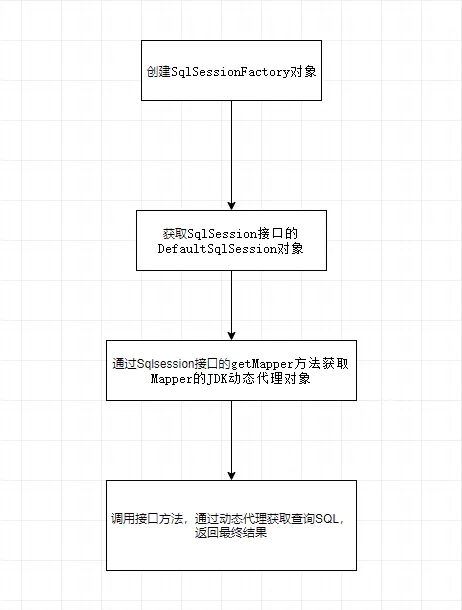
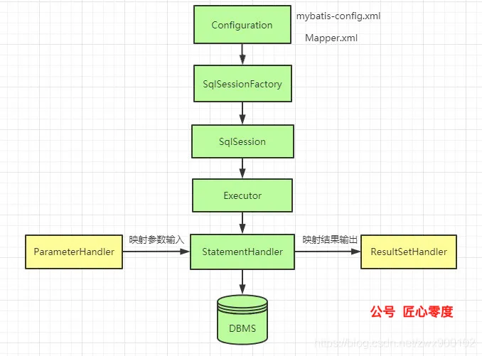
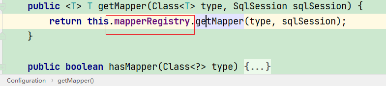
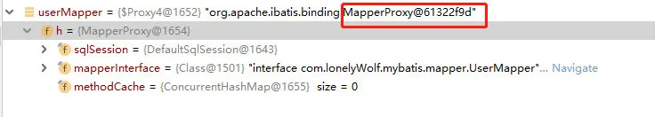
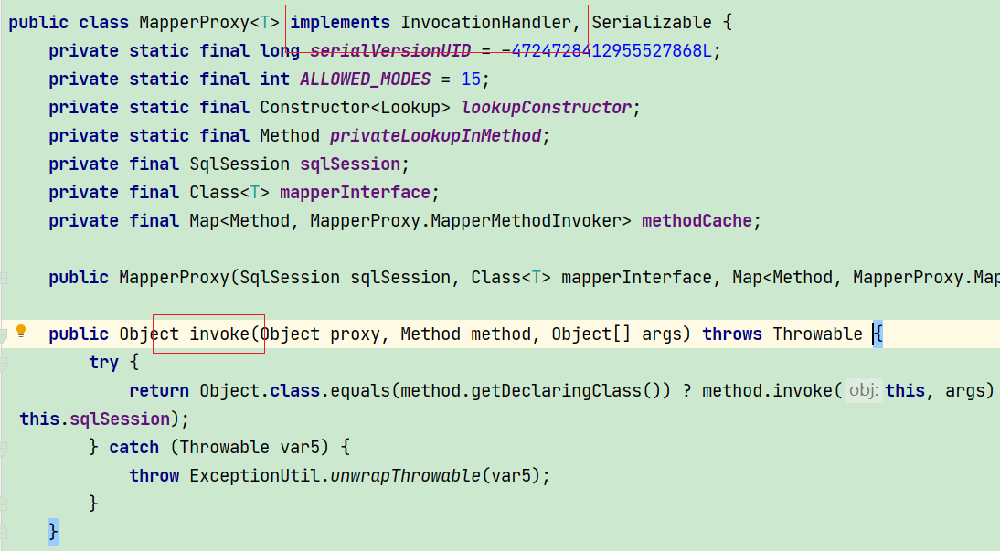
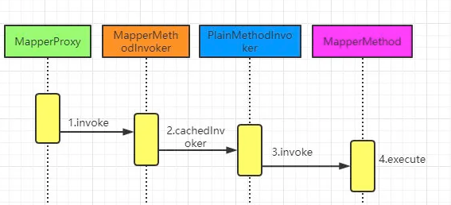
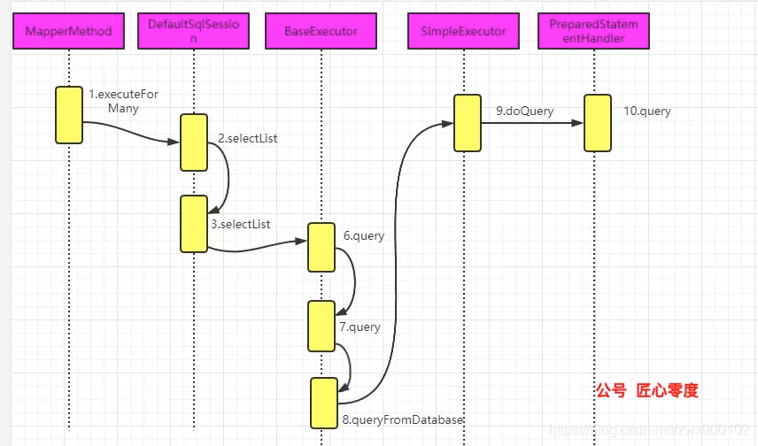
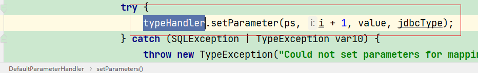
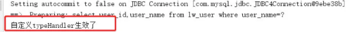
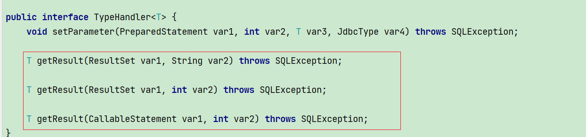

# Table of Contents

* [架构图](#架构图)
* [执行流程图](#执行流程图)


# 架构图


+ 接口层
          是MyBatis提供给开发人员的一套API，只要使用SqlSession接口，通过SqlSession接口和Mapper接口，开发人员可以通知MyBatis框架调用哪一条SQL命令以及SQL命令关联参数。

+ 数据处理层
  
  **是MyBatis框架内部的核心实现，来完成对映射文件的解析与数据处理。**
  
  + 参数解析与参数绑定
  + SQL解析
  +  结果集映射解析与结果集映射处理
  
+ 基础支撑层
          用来完成MyBatis与数据库基本连接方式以及SQL命令与配置文件对应，主要负责：
      + MyBatis与数据库连接方式管理
      + MyBatis对事务管理方式
      + 配置文件加载
      + MyBatis查询缓存管理


# 执行流程图






在**MyBatis**中，利用编程式进行数据查询，主要就是下面几行代码：

```java
//获取SqlSession
SqlSession session = sqlSessionFactory.openSession();
//获取Mapper接口
UserMapper userMapper = session.getMapper(UserMapper.class);
//调用接口方法 
List<LwUser> userList = userMapper.listUserByUserName("小杰瀚1号");
```

想什么参数解析 以及各种handle都是途中做的事情，搞清楚主流程，其他的脉络也就清楚了。


## 获取SqlSession

目前使用的都是Spring+mybatis

```java
DefaultSqlSessionFactory.openSessionFromDataSource

    private SqlSession openSessionFromDataSource(ExecutorType execType, TransactionIsolationLevel level, boolean autoCommit) {
        Transaction tx = null;

        DefaultSqlSession var8;
        try {
            Environment environment = this.configuration.getEnvironment();
            TransactionFactory transactionFactory = this.getTransactionFactoryFromEnvironment(environment);
            //多数据源切换 也是在这里搞得
            tx = transactionFactory.newTransaction(environment.getDataSource(), level, autoCommit);
            Executor executor = this.configuration.newExecutor(tx, execType);
            var8 = new DefaultSqlSession(this.configuration, executor, autoCommit);
        } catch (Exception var12) {
            this.closeTransaction(tx);
            throw ExceptionFactory.wrapException("Error opening session.  Cause: " + var12, var12);
        } finally {
            ErrorContext.instance().reset();
        }

        return var8;
    }
```


## 获取Mapper对象

1. 项目启动的时候，会将所有的Mapper接口加载并解析存储到Configuration对象

   ```java
   public <T> void addMapper(Class<T> type) {
       this.mapperRegistry.addMapper(type);
   }
   ```

2. 获取的时候，过Configuration对象中的MapperRegistry对象属性，继续调用getMapper方法

   

3. 根据type类型，从MapperRegistry对象中的knownMappers获取到当前类型对应的代理工厂类，然后通过代理工厂类生成对应Mapper的代理类。

   ```java
   MapperRegistry.java
       public <T> T getMapper(Class<T> type, SqlSession sqlSession) {
           MapperProxyFactory<T> mapperProxyFactory = (MapperProxyFactory)this.knownMappers.get(type);
           if (mapperProxyFactory == null) {
               throw new BindingException("Type " + type + " is not known to the MapperRegistry.");
           } else {
               try {
                   return mapperProxyFactory.newInstance(sqlSession);
               } catch (Exception var5) {
                   throw new BindingException("Error getting mapper instance. Cause: " + var5, var5);
               }
           }
       }
   ```

4. 最终获取到我们接口对应的代理类MapperProxy对象

   

   而`MapperProxy`可以看到实现了`InvocationHandler`，使用的就是JDK动态代理。

   


## 调用方法

调用方法分为2步

+ 获取sql
+ 执行sql

### 获取Sql



自己照着图走一下

### 执行Sql





自己照着图走一下


其中的【参数映射】和【结果集映射】也是在【***Execytor】发生的


####  参数映射

现在我们来看一下上面在执行查询之前参数是如何进行设置的，我们先进入prepareStatement方法：

```java
private Statement prepareStatement(StatementHandler handler, Log statementLog) throws SQLException {
    Connection connection = this.getConnection(statementLog);
    Statement stmt = handler.prepare(connection, this.transaction.getTimeout());
    //重点
    handler.parameterize(stmt);
    return stmt;
}
```

向下追踪




上面的BaseTypeHandler是一个抽象类，setNonNullParameter并没有实现，都是交给子类去实现，而每一个子类就是对应了数据库的一种类型。

这些子类就是系统默认提供的一些typeHandler。而这些默认的typeHandler会默认被注册并和Java对象进行绑定：


+ 自定义typeHandler

```java
public class MyTypeHandler extends BaseTypeHandler<String> {

    @Override
    public void setNonNullParameter(PreparedStatement preparedStatement, int index, String param, JdbcType jdbcType) throws SQLException {
        System.out.println("自定义typeHandler生效了");
        preparedStatement.setString(index,param);
    }
```


```xml
select user_id,user_name from lw_user where user_name=#{userName,jdbcType=VARCHAR,typeHandler=com.lonelyWolf.mybatis.typeHandler.MyTypeHandler}
```




#### 结果集映射

```java
public <E> List<E> query(Statement statement, ResultHandler resultHandler) throws SQLException {
    String sql = this.boundSql.getSql();
    statement.execute(sql);
    //结果集映射
    return this.resultSetHandler.handleResultSets(statement);
}
```


实际上解析结果集还是很复杂的，就如我们上一篇介绍的复杂查询一样，一个查询可以不断嵌套其他查询，还有延迟加载等等一些复杂的特性 的处理，所以逻辑分支是有很多，但是不管怎么处理，最后的核心还是上面的一套流程，最终还是会调用typeHandler来获取查询到的结果。

 + 自定义typeHandler结果集





# 参考资料

https://mp.weixin.qq.com/s/BHndt7zrxnrLb0sJtAeukA

