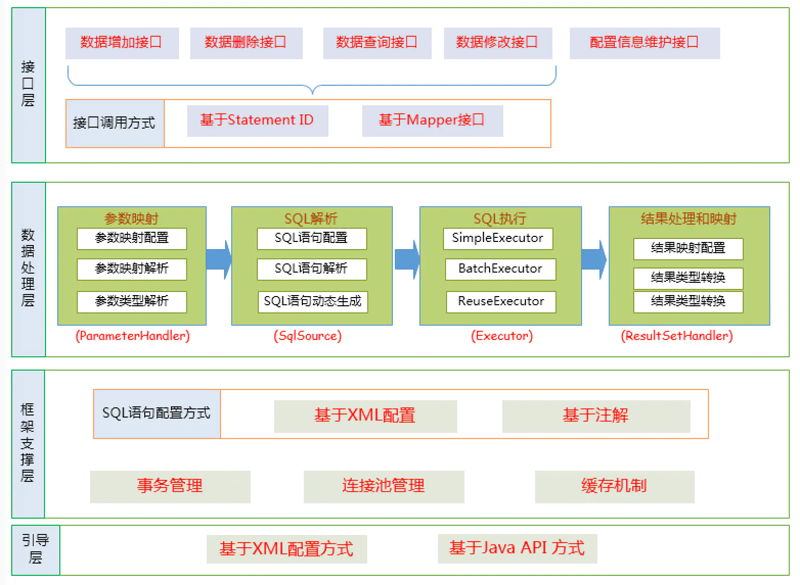

# Table of Contents

* [架构图](#架构图)
* [执行流程图](#执行流程图)

# 架构图

+ 接口层
          是MyBatis提供给开发人员的一套API，只要使用SqlSession接口，通过SqlSession接口和Mapper接口，开发人员可以通知MyBatis框架调用哪一条SQL命令以及SQL命令关联参数。

+ 数据处理层:是MyBatis框架内部的核心实现，来完成对映射文件的解析与数据处理。
  + 参数解析与参数绑定
  + SQL解析
  +  结果集映射解析与结果集映射处理
+ 基础支撑层
          用来完成MyBatis与数据库基本连接方式以及SQL命令与配置文件对应，主要负责：
      + MyBatis与数据库连接方式管理
      + MyBatis对事务管理方式
      + 配置文件加载
      + MyBatis查询缓存管理

# 执行流程图

