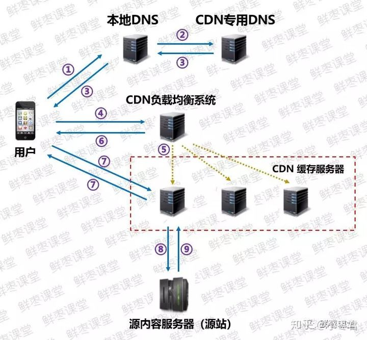

# Table of Contents

* [原理](#原理)

CDN——**Content Delivery Network，内容分发网络**。就是一项非常有效的**缩短时延**的技术。

# 原理

最初的核心理念，就是**将内容缓存在终端用户附近**。

具体来说，CDN就是采用更多的缓存服务器（CDN边缘节点），布放在用户访问相对集中的地区或网络中。当用户访问网站时，利用全局负载技术，将用户的访问指向距离最近的缓存服务器上，由缓存服务器响应用户请求。（有点像电商的本地仓吧？）

大家可能觉得，这个不就是**“镜像服务器”**嘛？其实不一样。镜像服务器是源内容服务器的完整复制。而CDN，是部分内容的缓存，智能程度更高。

确切地说，**CDN=更智能的镜像+缓存+流量导流**。

而且还需要注意的是，CDN并不是只能缓存视频内容，它还可以对网站的静态资源（例如各类型图片、html、css、js等）进行分发，对移动应用APP的静态内容（例如安装包apk文件、APP内的图片视频等）进行分发。

我们来举个例子，看看CDN的具体**工作流程**。

如果某个用户想要访问优酷的视频点播内容，那么：

具体步骤：

①、当用户点击APP上的内容，APP会根据URL地址去**本地DNS**（域名解析系统）寻求IP地址解析。

②、本地DNS系统会将域名的解析权交给**CDN专用DNS服务器**。

③、CDN专用DNS服务器，将CDN的全局负载均衡设备IP地址返回用户。

④、用户向**CDN的负载均衡设备**发起内容URL访问请求。

⑤、CDN负载均衡设备根据用户IP地址，以及用户请求的内容URL，选择一台用户所属区域的**缓存服务器**。

⑥、负载均衡设备告诉用户这台缓存服务器的IP地址，让用户向所选择的缓存服务器发起请求。

⑦、用户向缓存服务器发起请求，缓存服务器响应用户请求，将用户所需内容传送到用户终端。

⑧、如果这台缓存服务器上并没有用户想要的内容，那么这台缓存服务器就要网站的**源服务器**请求内容。

⑨、源服务器返回内容给缓存服务器，缓存服务器发给用户，并根据用户自定义的缓存策略，判断要不要把内容缓存到缓存服务器上。
