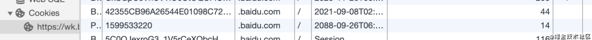
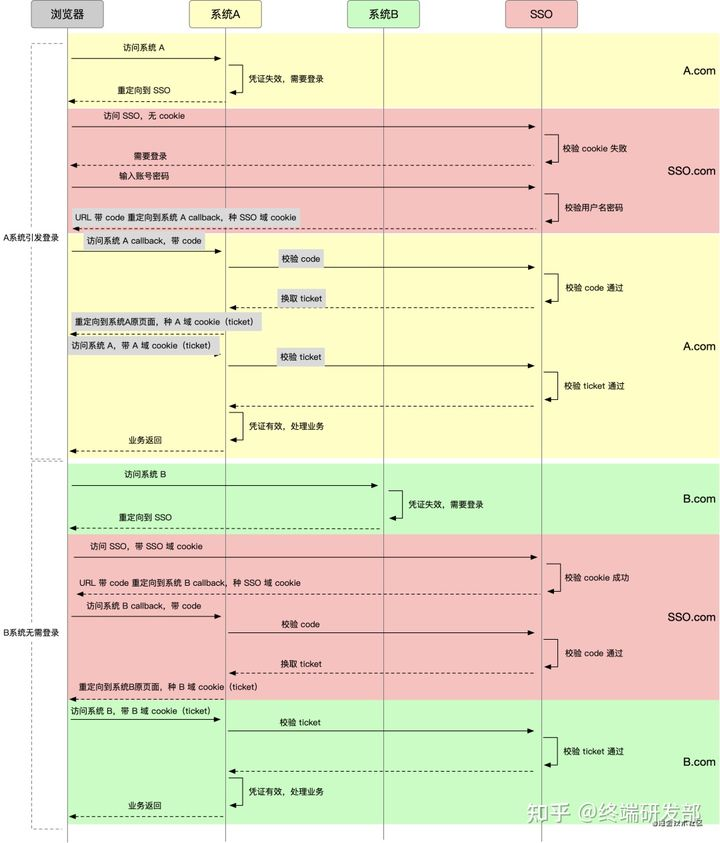

# Table of Contents

* [虚假”的单点登录（主域名相同）](#虚假的单点登录主域名相同)
* [“真实”的单点登录（主域名不同）](#真实的单点登录主域名不同)
* [总结](#总结)

>**单点登录**（Single Sign On），简称为 SSO，是目前比较流行的企业业务整合的解决方案之一。SSO的定义是在多个应用系统中，用户只需要登录一次就可以访问所有相互信任的应用系统。
>

# 虚假”的单点登录（主域名相同）

如果业务系统都在同一主域名下，比如`wenku.baidu.com` `tieba.baidu.com`，就好办了。可以直接把 cookie domain 设置为主域名 `baidu.com`，百度也就是这么干的。

# “真实”的单点登录（主域名不同）

这种场景下，我们需要独立的认证服务，通常被称为 SSO。

- 在 SSO 域下，SSO 不是通过接口把 ticket 直接返回，而是通过一个带 code 的 URL 重定向到系统 A 的接口上，这个接口通常在 A 向 SSO 注册时约定

- 浏览器被重定向到 A 域下，浏览器（Browser）中写入SSO域下的Cookie。带着 code 访问了 A 的 callback 接口，callback 接口通过 code 换取 ticket

- 这个 code 不同于 ticket，code 是一次性的，暴露在 URL 中，只为了传一下换 ticket，换完就失效

- callback 接口拿到 ticket 后，在自己的域下 set cookie 成功

- 在后续请求中，只需要把 cookie 中的 ticket 解析出来，去 SSO 验证就好

- 访问 B 系统也是一样

  

1. 为什么第一次返回时，要种下SSO的cookie，-》其他系统访问SSO用到

2. 这里为什么要先返回一个code，再用code去换ticker？->我想是为了安全吧

   

# 总结

单点登录（SSO）的所有流程都介绍完了，原理大家都清楚了。总结一下单点登录要做的事情：

- **单点登录（SSO系统）是保障各业务系统的用户资源的安全 。**
- **各个业务系统获得的信息是，这个用户能不能访问我的资源。**
- **单点登录，资源都在各个业务系统这边，不在SSO那一方。 用户在给SSO服务器提供了用户名密码后，作为业务系统并不知道这件事。 SSO随便给业务系统一个ST，那么业务系统是不能确定这个ST是用户伪造的，还是真的有效，所以要拿着这个ST去SSO服务器再问一下，这个用户给我的ST是否有效，是有效的我才能让这个用户访问。**
