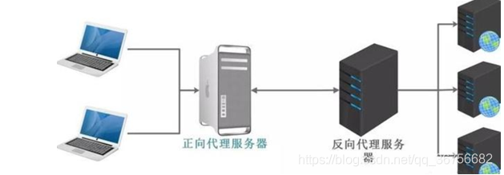
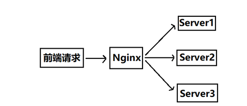
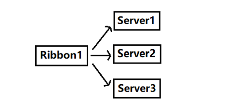
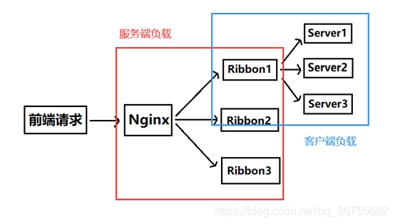

# Table of Contents

* [正向代理-隐藏了真实的请求客户端](#正向代理-隐藏了真实的请求客户端)
* [反向代理-隐藏了真实的服务端](#反向代理-隐藏了真实的服务端)
* [服务端负载均衡](#服务端负载均衡)
* [客户端负载均衡](#客户端负载均衡)

# 正向代理-隐藏了真实的请求客户端

我们常说的代理也就是只正向代理，正向代理的过程，它**隐藏了真实的请求客户端**，服务端不知道真实的客户端是谁，客户端请求的服务都被代理服务器代替来请求，某些科学上网工具扮演的就是典型的正向代理角色。用浏览器访问 http://www.google.com 时，被残忍的block，于是你可以在国外搭建一台代理服务器，让代理帮我去请求google.com，代理把请求返回的相应结构再返回给我。

# 反向代理-隐藏了真实的服务端

**反向代理隐藏了真实的服务端**，当我们请求 www.baidu.com 的时候，就像拨打10086一样，背后可能有成千上万台服务器为我们服务，但具体是哪一台，你不知道，也不需要知道，你只需要知道反向代理服务器是谁就好了，www.baidu.com 就是我们的反向代理服务器，反向代理服务器会帮我们把请求转发到真实的服务器那里去。Nginx就是性能非常好的反向代理服务器，用来做负载均衡。

# 服务端负载均衡

 服务端的负载均衡是一个网络请求先经过一个代理服务器（比如nginx），然后代理服务器通过负载算法（轮询，随机，权重等等）反向代理用户需要访问的服务，来完成负载均衡。

​       **特点：配置写在服务端，比如nginx.conf，同时应用在服务端**

​       **图示：**

# 客户端负载均衡

​      如果把上图中的Server1换成springcloud的Ribbnon组件，请求先经Ribbon转发到不同服务的话，就变成了客户端负载均衡。

​      **特点：**  **配置在客户端（@loadBlance注解写在程序里）**

​      **图示：**

   **完整图示：**

> 个人总结：靠近谁 就是那个
