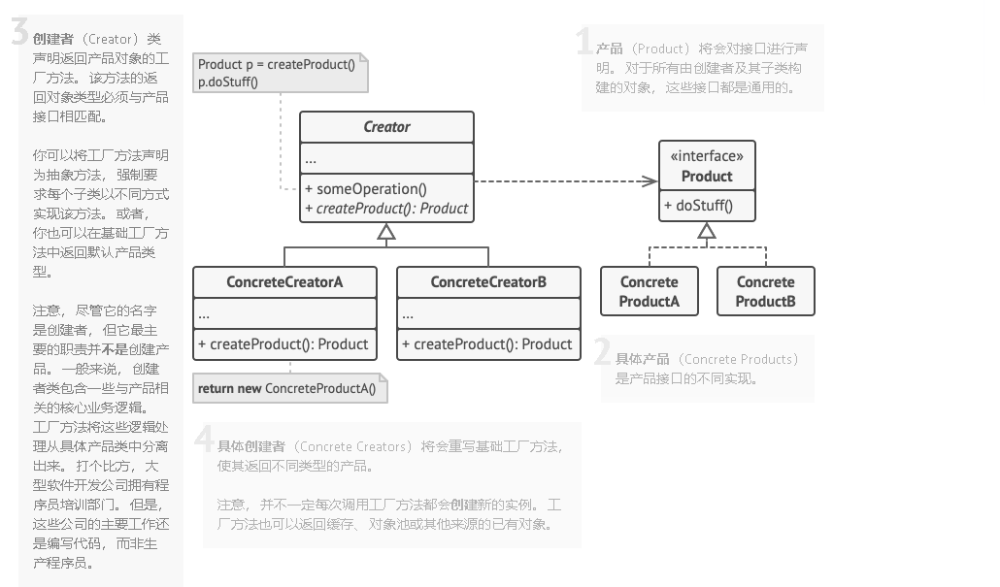

# Table of Contents

* [定义](#定义)
* [问题](#问题)
* [解决方案](#解决方案)
* [工厂方法模式结构](#工厂方法模式结构)
* [代码实现](#代码实现)
* [工厂方法模式适合应用场景](#工厂方法模式适合应用场景)
* [工厂方法模式优缺点](#工厂方法模式优缺点)

# 定义

**工厂方法模式**是一种创建型设计模式， 其在父类中提供一个创建对象的方法， **允许子类决定实例化对象的类型。**

# 问题

假设你正在开发一款物流管理应用。 最初版本只能处理卡车运输， 因此大部分代码都在位于名为 `卡车`的类中。

一段时间后， 这款应用变得极受欢迎。 你每天都能收到十几次来自海运公司的请求， 希望应用能够支持海上物流功能。

这可是个好消息。 但是代码问题该如何处理呢？ 目前， 大部分代码都与 `卡车`类相关。 在程序中添加 `轮船`类需要修改全部代码。 更糟糕的是， 如果你以后需要在程序中支持另外一种运输方式， 很可能需要再次对这些代码进行大幅修改。

最后， 你将不得不编写繁复的代码， 根据不同的运输对象类， 在应用中进行不同的处理。

# 解决方案

工厂方法模式建议使用特殊的*工厂*方法代替对于对象构造函数的直接调用 （即使用 `new`运算符）。 不用担心， 对象仍将通过 `new`运算符创建， 只是该运算符改在工厂方法中调用罢了。 工厂方法返回的对象通常被称作 “产品”。

乍看之下， 这种更改可能毫无意义： 我们只是改变了程序中调用构造函数的位置而已。 但是， 仔细想一下， **现在你可以在子类中重写工厂方法， 从而改变其创建产品的类型。**

但有一点需要注意:仅当这些产品具有共同的基类或者接口时， 子类才能返回不同类型的产品， 同时基类中的工厂方法还应将其返回类型声明为这一共有接口。

# 工厂方法模式结构

# 代码实现

.png)

详情见：`DesignPatterns.creator.beanFactory`目录下代码。

#  工厂方法模式适合应用场景

+ 如果你希望复用现有对象来节省系统资源 ,而不是每次都重新创建对象 可使用工厂方法。

# 工厂方法模式优缺点

+ [x] 你可以避免创建者和具体产品之间的紧密耦合。
+ [x] *单一职责原则*。 你可以将产品创建代码放在程序的单一位置， 从而使得代码更容易维护。
+ [x] *开闭原则*。 无需更改现有客户端代码， 你就可以在程序中引入新的产品类型。

+ [ ] 应用工厂方法模式需要引入许多新的子类， 代码可能会因此变得更复杂。 最好的情况是将该模式引入创建者类的现有层次结构中。
