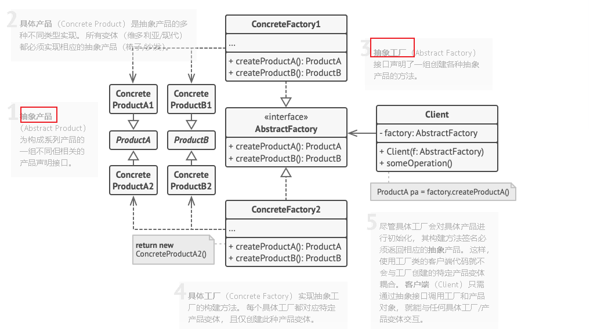

# Table of Contents

* [抽象工厂模式结构](#抽象工厂模式结构)
* [代码实现](#代码实现)
* [抽象工厂和工厂方法](#抽象工厂和工厂方法)
* [简单工厂](#简单工厂)


**抽象工厂模式**是一种创建型设计模式， 它能创建一系列相关的对象， 而**无需指定其具体类。**


# 抽象工厂模式结构



# 代码实现


> ```java
> com.qm.study.DesignPatterns.creator.abstractFactory
> ```


# 抽象工厂和工厂方法

+ 抽象  

假设有m家工厂，n种部件，如果按照抽象工厂模式去设计的话，最终将会有1个抽象工厂接口（客户端用来初始化并决定具体用哪家工厂去生产产品），n个抽象部件接口（定义每个部件的规范标准，这些标准在各个工厂下都是一样的），m个具体工厂类（每个工厂有n个方法，用来初始化n个具体部件生产类），m*n个具体部件类（这些类是真正生产产品的类）。

+ 工厂方法

假设有m家工厂，**1种部件**，如果按照抽象工厂模式去设计的话，最终将会有1个抽象工厂接口（客户端用来初始化并决定具体用哪家工厂去生产产品），1个抽象部件接口（定义每个部件的规范标准，这些标准在各个工厂下都是一样的），m个具体工厂类（每个工厂有n个方法，用来初始化n个具体部件生产类），m*n个具体部件类（这些类是真正生产产品的类）。


https://www.jianshu.com/p/4523dcb131c8


# 简单工厂

简单工厂模式并没有AbstractFactory接口，它是根据参数或者配置文件等事先定义好的变量，然后利用分支判断或者反射技术来动态的初始化具体产品类并返回。它的产品类接口和数量与其他两种工厂模式一样，不同的地方在于它没有那么多的工厂类，可以只用一个静态工厂类来生成想要的产品。

