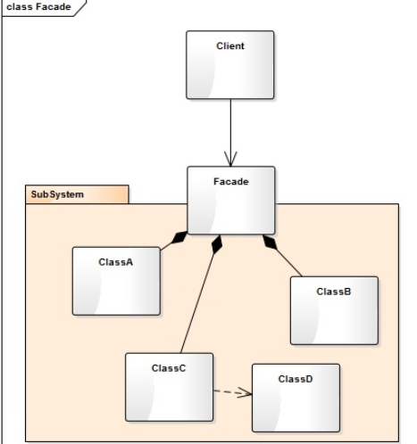

# Table of Contents

* [什么是门面模式](#什么是门面模式)
* [门面模式的结构](#门面模式的结构)
* [在什么情况下使用门面模式](#在什么情况下使用门面模式)
* [代码模板](#代码模板)


门面模式是对象的结构模式。

外部与一个子系统的通信必须通过一个统一的门面对象进行，这就是门面模式。

> 是不是有点像网关？


# 什么是门面模式

门面模式要求一个子系统的外部与其内部的通信必须通过一个统一的门面对象进行。

门面模式提供一个高层次的接口，使得子系统更易于使用。


# 门面模式的结构



在这个对象图中，出现了两个角色：

- **门面角色**（Facade）: 客户端可以调用这个角色的方法。此角色知晓相关的（一个或多个）子系统的的功能和责任。在正常情况下，本角色会将所有从客户端发来的请求委派到相应的子系统去。
- **子系统角色**（Subsystem）: 可以同时有一个或者多个子系统。每一个子系统都不是一个单独的类，而是一个类的集合。每一个子系统都可以被客户端直接调用，或者被门面角色调用。子系统并不知道门面的存在，对于子系统而言，门面仅仅是另一个客户端而已。


#  在什么情况下使用门面模式

子系统往往因为不断演化而变的越来越复杂，使用门面模式可以使得子系统更具有可复用性。


# 代码模板

+ 子系统

```java
public class Designer {

    public void design() {
        System.out.println("设计师设计");
    }
}
public class WaterElectricWorker {

    public void work() {
        System.out.println("水电工修水电");
    }
}
public class Bricklayer {

    public void work() {
        System.out.println("泥瓦匠贴瓷砖");
    }
}
```

+ 门面对象

```java
public class DecorationCompany {

    public static void decorate() {
        System.out.println("装修公司整合~");
        new Designer().design();
        new WaterElectricWorker().work();
        new Bricklayer().work();
        System.out.println("装修完毕");
    }
}
```

+ 使用

```java
public class DecorationTest {

    public static void main(String[] args) {
        // 不使用门面模式
        new Designer().design();
        new WaterElectricWorker().work();
        new Bricklayer().work();

        //  使用门面模式
        DecorationCompany.decorate();
    }
}
```

