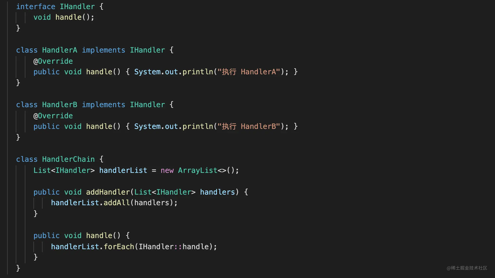
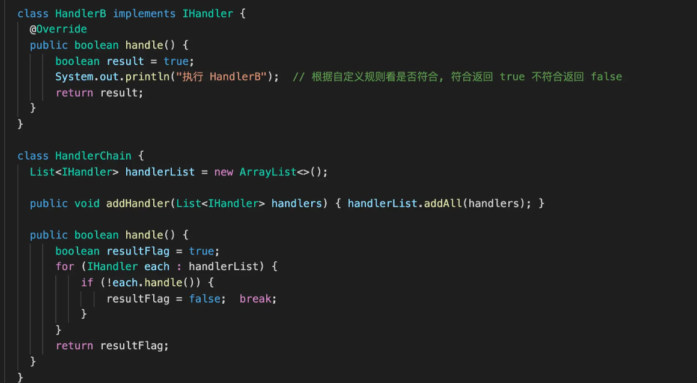

# Table of Contents

* [通用模板](#通用模板)
  * [不打断的责任链](#不打断的责任链)
  * [打断的责任链](#打断的责任链)
* [实战1：实现优先级查找数据](#实战1实现优先级查找数据)
* [与策略模式的区别](#与策略模式的区别)


责任链模式通过将所有的transmitters 放在一个链里面来解决这个问题。每一个环都在链里并且检查Message对象来决定是否承担责任。如果链里的某一个环能够处理Message对象，那么它处理。如果不能，请求传递到下一个环。这个过程一直持续到有环处理或者到了链中最后一个环。


# 通用模板

责任链的精髓在于判断是不是自己需要处理，如果是，处理返回，不是传递到下一个责任链。我们就是根据这句话写代码

那么我们分析，是不是所有处理者都需要有2个方法

1. 处理当前业务逻辑
2. 处理数据给下一个处理者
3. 判断当前执行者执行后是否需要交由下一个执行者
4. 还有就是，当前拦截器会不会打断请求，导致流程终止。


## 不打断的责任链



这种责任链执行方式会将所有的 **处理器全部执行一遍**，不会被打断。Mybatis 拦截器用的正是此类型，这种类型 **重点在对请求过程中的数据或者行为进行改变**

## 打断的责任链

在每一个 IHandler 实现类中会返回一个布尔类型的返回值，如果返回布尔值为 false，那么责任链发起类会中断流程，剩余处理器将不会被执行。




写的还是比较粗，没有考虑泛型 拦截器链的使用。


# 实战1：实现优先级查找数据


+ 定义优先级抽象类

  + 定义过滤方法

  ```java
  public abstract class Priority<T> {
  
      protected T param;
  
      public Priority(T param) {
          this.param = param;
      }
  
      /**
       * 定义过滤方法
       * @param dataList 原始数据
       * @param priorityChain 责任链
       * @return 最终结果
       */
      public abstract T doFilter(List<T> dataList, PriorityChain<T> priorityChain);
  }
  ```

  

+ 定义优先级链

  + 定义链表
  + 定义过滤方法

  ```java
  public class PriorityChain<T> extends Priority<T>{
  
      private List<Priority<T>> priorityChainList = Lists.newArrayList();
  
      private int index = 0;
  
      public PriorityChain(T param) {
          super(param);
      }
  
      public PriorityChain() {
          super(null);
      }
  
      public PriorityChain<T> addPriorityChain(Priority<T> priority){
          priorityChainList.add(priority);
          return this;
      }
  
      @Override
      public T doFilter(List<T> dataList, PriorityChain<T> priorityChain) {
          if(index==priorityChainList.size()|| CollectionUtils.isEmpty(dataList)){
              return null;
          }
          Priority<T> priority = priorityChainList.get(index);
          return priority.doFilter(dataList,priorityChain);
      }
  }
  ```

  

+ 定义优先级实现类

  ```java
  public  class Priority11 extends Priority<Test> {
  
  
      public Priority11(Test param) {
          super(param);
      }
  
      @Override
      public Test doFilter(List<Test> dataList, PriorityChain<Test> priorityChain) {
          return null;
      }
  }
  
  ```

  

+ 定义优先级上下文

  + 创建优先级链表
  + 进行链表过滤

  ```java
  public class PriorityContext {
  
  
      public static PriorityChain<Test> create(Test test){
          return new PriorityChain<Test>().addPriorityChain(new Priority11(test));
      }
  
  
      public static void main(String[] args) {
          List<Test> dataList = Lists.newArrayList();
          Test test = new Test();
          PriorityChain<Test> testPriorityChain = PriorityContext.create(test);
          testPriorityChain.doFilter(dataList,testPriorityChain);
      }
  
  }
  
  ```

  


# 与策略模式的区别

职责链模式：**解决更多的是 条件属于模糊的判断**
