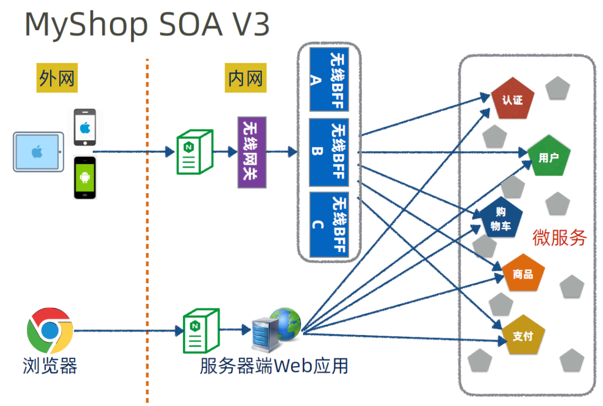

# Table of Contents

以下文章写的还是比较好的，我就不搬迁了。

+ https://www.cnblogs.com/edisonchou/p/talk_about_what_is_bff_in_microservices.html

+ https://juejin.cn/post/7008440419054780446#heading-4

  

总的来说，BFF就是在客户端和服务端加了一层【转换层】

