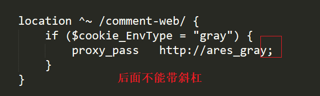

# Table of Contents

* [NG内置变量](#ng内置变量)
* [root和alias](#root和alias)
* [proxy_pass](#proxy_pass)
* [Nginx转发Host问题](#nginx转发host问题)
* [rewrite](#rewrite)
* [Nginx配置限流](#nginx配置限流)
  * [速率](#速率)
  * [并发数](#并发数)


# NG内置变量


# root和alias

https://www.jianshu.com/p/44fc4d7771e3


root与alias主要区别在于nginx如何解释location后面的uri，这会使两者分别以不同的方式将请求映射到服务器文件上。

+ root的处理结果是：`root路径＋location路径`
+ alias的处理结果是：使用alias路径`替换`location路径

```xml
server {
    listen 80;
    server_name test.html.com;
 
    location ^~ /test/html/ {
        root   /workspace/www;
	    alias   /workspace/1;
    }
}
```


# proxy_pass




对于自定义请求头，【**使用变量**】的时候，可以采取这种方式进行转发。

这个当时搞了我好久。。。。贼难忘


# Nginx转发Host问题

NG转发的时候，要注意host

参考地址： https://www.cnblogs.com/operationhome/p/14232793.html


# rewrite

+ 原始地址：api/test
+ 配置： rewrite "^/api/(.*)$" /$1 break;
+ 真实访问：/test


# Nginx配置限流

Nginx 提供了两种限流手段：一是控制速率，二是控制并发连接数。


## 速率

```xml
limit_req_zone $binary_remote_addr zone=mylimit:10m rate=2r/s;
server { 
    location / { 
        limit_req zone=mylimit burst=4;
    }
}
```

burst=4 表示每个 IP 最多允许4个突发请求

限制每个 IP 访问的速度为 2r/s，因为 Nginx 的限流统计是基于毫秒的，我们设置的速度是 2r/s，转换一下就是 500ms 内单个 IP 只允许通过 1 个请求，从 501ms 开始才允许通过第 2 个请求。

如果单个 IP 在 10ms 内发送 6 次请求的结果如下


从以上结果可以看出，有 1 个请求被立即处理了，4 个请求被放到 burst 队列里排队执行了，另外 1 个请求被拒绝了。

## 并发数

利用 `limit_conn_zone` 和 `limit_conn` 两个指令即可控制并发数，示例配置如下：

```text
limit_conn_zone $binary_remote_addr zone=perip:10m;
limit_conn_zone $server_name zone=perserver:10m;
server {
    ...
    limit_conn perip 10;
    limit_conn perserver 100;
}
```

其中 limit_conn perip 10 表示限制单个 IP 同时最多能持有 10 个连接；limit_conn perserver 100 表示 server 同时能处理并发连接的总数为 100 个。

> 小贴士：只有当 request header 被后端处理后，这个连接才进行计数。
