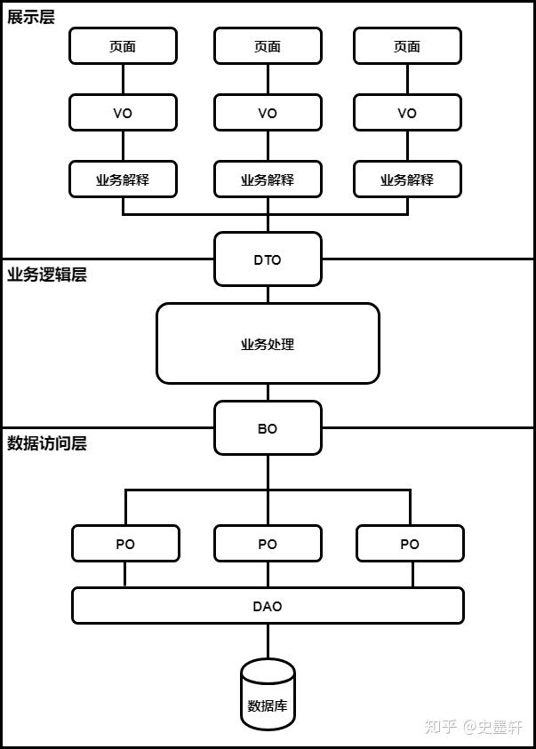

# Table of Contents

* [总结图](#总结图)
* [DTO（Data Transfer Object）数据传输对象](#dtodata-transfer-object数据传输对象)
* [VO（View Object）值对象](#voview-object值对象)
* [VO和DTO的区别](#vo和dto的区别)
* [BO（Business Object）业务对象](#bobusiness-object业务对象)
* [PO（Persistant Object）持久对象=DO（Data Object）](#popersistant-object持久对象dodata-object)
* [BO和DTO的区别](#bo和dto的区别)
* [实际运用](#实际运用)
* [参考资料](#参考资料)

# 总结图

废话不多说，先来看张图

# DTO（Data Transfer Object）数据传输对象

这个传输通常指的前后端之间的传输

DTO是一个比较特殊的对象，他有两种存在形式：

在后端，他的存在形式是java对象，也就是在controller里面定义的那个东东，通常在后端不需要关心怎么从json转成java对象的，这个都是由一些成熟的框架帮你完成啦，比如spring框架

在前端，他的存在形式通常是js里面的对象（也可以简单理解成json），也就是通过ajax请求的那个数据体

# VO（View Object）值对象

VO就是展示用的数据，不管展示方式是网页，还是客户端，还是APP，只要是这个东西是让人看到的，这就叫VO
VO主要的存在形式就是js里面的对象（也可以简单理解成json）

# VO和DTO的区别

因为两者有着本质的区别，DTO代表**服务层需要接收的数据和返回的数据**，而VO代表**展示层需要显示的数据**。

# BO（Business Object）业务对象

BO就是PO的组合，

关联查询得到一个BO.

# PO（Persistant Object）持久对象=DO（Data Object）

PO比较好理解
简单说PO就是数据库中的记录，一个PO的数据结构对应着库中表的结构，表中的一条记录就是一个PO对象
通常PO里面除了get，set之外没有别的方法
对于PO来说，数量是相对固定的，一定不会超过数据库表的数量
等同于Entity，这俩概念是一致的

# BO和DTO的区别

DTO是BO的组合。

BO对内，为了进行业务计算需要辅助数据，或者是一个业务有多个对外的接口，BO可能会含有很多接口对外所不需要的数据，因此DTO需要在BO的基础上，只要自己需要的数据，然后对外提供
在这个关系上，通常不会有数据内容的变化，内容变化要么在BO内部业务计算的时候完成，要么在解释VO的时候完成

# 实际运用

1. `VO`基本是省掉的。
2. `PO`没办法去掉，有的叫`entity`，有的叫`domain`
3. 个人理解 多个`po`汇集一个`BO`,多个`BO`汇聚一个`DTO`.

# 参考资料

https://zhuanlan.zhihu.com/p/102389552
