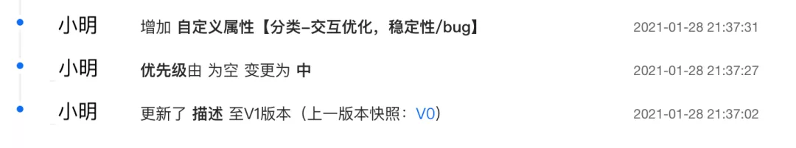

# Table of Contents

* [操作日志的使用场景](#操作日志的使用场景)
* [实现方式](#实现方式)
  * [使用 Canal 监听数据库记录操作日志](#使用-canal-监听数据库记录操作日志)
  * [通过日志文件的方式记录](#通过日志文件的方式记录)
  * [通过LogUtil 的方式记录日志](#通过logutil-的方式记录日志)
  * [使用注解实现操作日志(一般使用)](#使用注解实现操作日志一般使用)
* [优雅地支持 AOP 生成动态的操作日志](#优雅地支持-aop-生成动态的操作日志)
* [异步输出日志](#异步输出日志)
* [参考资料](#参考资料)


# 操作日志的使用场景



**系统日志和操作日志的区别**

**系统日志**：系统日志主要是为开发排查问题提供依据，一般打印在日志文件中；系统日志的可读性要求没那么高，日志中会包含代码的信息，比如在某个类的某一行打印了一个日志。

**操作日志**：主要是对某个对象进行新增操作或者修改操作后记录下这个新增或者修改，操作日志要求可读性比较强，因为它主要是给用户看的，比如订单的物流信息，用户需要知道在什么时间发生了什么事情。再比如，客服对工单的处理记录信息。

操作日志的记录格式大概分为下面几种：

- 单纯的文字记录，比如：2021-09-16 10:00 订单创建。

- 简单的动态的文本记录，比如：2021-09-16 10:00 订单创建，订单号：NO.11089999，其中涉及变量订单号“NO.11089999”。

- 修改类型的文本，包含修改前和修改后的值，比如：2021-09-16 10:00 用户小明修改了订单的配送地址：从“金灿灿小区”修改到“银盏盏小区” ，其中涉及变量配送的原地址“金灿灿小区”和新地址“银盏盏小区”。

- 修改表单，一次会修改多个字段。

  

# 实现方式

## 使用 Canal 监听数据库记录操作日志

[Canal](https://github.com/alibaba/canal) 是一款基于 MySQL 数据库增量日志解析，提供增量数据订阅和消费的开源组件，通过采用监听数据库 Binlog 的方式，这样可以从底层知道是哪些数据做了修改，然后根据更改的数据记录操作日志。


优点：这种方式的优点是和业务逻辑完全分离。

缺点： 缺点也很明显，局限性太高，只能针对数据库的更改做操作日志记录，**如果修改涉及到其他团队的 RPC 的调用**，就没办法监听数据库了。

> 举个例子：给用户发送通知，通知服务一般都是公司内部的公共组件，这时候只能在调用 RPC 的时候手工记录发送通知的操作日志了。


## 通过日志文件的方式记录

```
log.info("订单创建")
log.info("订单已经创建，订单编号:{}", orderNo)
log.info("修改了订单的配送地址：从“{}”修改到“{}”， "金灿灿小区", "银盏盏小区")
```

这种方式的操作记录需要解决三个问题。

**问题一：操作人如何记录**

借助 SLF4J 中的 MDC 工具类，把操作人放在日志中，然后在日志中统一打印出来。首先在用户的拦截器中把用户的标识 Put 到 MDC 中。

> 什么使MDC?
>
> 传送 门:https://cn.bing.com/search?q=MDC&PC=U316&FORM=CHROMN
>
> 如何将一次数据上报请求中包含的所有业务日志快速过滤出来？
>
> + 同步线程
> + 异步线程
>
> + 具体使用：LogAspect


```java
@Component
public class UserInterceptor extends HandlerInterceptorAdapter {
  @Override
  public boolean preHandle(HttpServletRequest request, HttpServletResponse response, Object handler) throws Exception {
    //获取到用户标识
    String userNo = getUserNo(request);
    //把用户 ID 放到 MDC 上下文中
    MDC.put("userId", userNo);
    return super.preHandle(request, response, handler);
  }

  private String getUserNo(HttpServletRequest request) {
    // 通过 SSO 或者Cookie 或者 Auth信息获取到 当前登陆的用户信息
    return null;
  }
}
```

其次，把 userId 格式化到日志中，使用 %X{userId} 可以取到 MDC 中用户标识。

```xml
<pattern>"%d{yyyy-MM-dd HH:mm:ss.SSS} %t %-5level %X{userId} %logger{30}.%method:%L - %msg%n"</pattern>
```

**问题二：操作日志如何和系统日志区分开**

通过配置 Log 的配置文件，把有关操作日志的 Log 单独放到一日志文件中。

```xml
//不同业务日志记录到不同的文件
<appender name="businessLogAppender" class="ch.qos.logback.core.rolling.RollingFileAppender">
    <File>logs/business.log</File>
    <append>true</append>
    <filter class="ch.qos.logback.classic.filter.LevelFilter">
        <level>INFO</level>
        <onMatch>ACCEPT</onMatch>
        <onMismatch>DENY</onMismatch>
    </filter>
    <rollingPolicy class="ch.qos.logback.core.rolling.TimeBasedRollingPolicy">
        <fileNamePattern>logs/业务A.%d.%i.log</fileNamePattern>
        <maxHistory>90</maxHistory>
        <timeBasedFileNamingAndTriggeringPolicy class="ch.qos.logback.core.rolling.SizeAndTimeBasedFNATP">
            <maxFileSize>10MB</maxFileSize>
        </timeBasedFileNamingAndTriggeringPolicy>
    </rollingPolicy>
    <encoder>
        <pattern>"%d{yyyy-MM-dd HH:mm:ss.SSS} %t %-5level %X{userId} %logger{30}.%method:%L - %msg%n"</pattern>
        <charset>UTF-8</charset>
    </encoder>
</appender>
        
<logger name="businessLog" additivity="false" level="INFO">
    <appender-ref ref="businessLogAppender"/>
</logger>
```

然后在 Java 代码中单独的记录业务日志。

```java
//记录特定日志的声明
private final Logger businessLog = LoggerFactory.getLogger("businessLog");
 
//日志存储
businessLog.info("修改了配送地址");
```

**问题三：如何生成可读懂的日志文案**

可以采用 LogUtil 的方式，也可以采用切面的方式生成日志模板，后续内容将会进行介绍。这样就可以把日志单独保存在一个文件中，然后通过日志收集可以把日志保存在 Elasticsearch 或者数据库中，接下来我们看下如何生成可读的操作日志。


## 通过LogUtil 的方式记录日志

```java
 LogUtil.log(orderNo, "订单创建", "小明")
  LogUtil.log(orderNo, "订单创建，订单号"+"NO.11089999",  "小明")
  String template = "用户%s修改了订单的配送地址：从“%s”修改到“%s”"
  LogUtil.log(orderNo, String.format(tempalte, "小明", "金灿灿小区", "银盏盏小区"),  "小明")
```


使用传统的方式记录,当后续代码变动,对于代码的可读性和可维护性来说是一个灾难。


## 使用注解实现操作日志(一般使用)

为了解决上面问题，一般采用 AOP 的方式记录日志，让操作日志和业务逻辑解耦，接下来看一个简单的 AOP 日志的例子。

```
@LogRecord(content="修改了配送地址")
public void modifyAddress(updateDeliveryRequest request){
    // 更新派送信息 电话，收件人、地址
    doUpdate(request);
}
```

我们可以在注解的操作日志上记录固定文案，这样业务逻辑和业务代码可以做到解耦，让我们的业务代码变得纯净起来。可能有同学注意到，上面的方式虽然解耦了操作日志的代码，但是记录的文案并不符合我们的预期，文案是静态的，没有包含动态的文案，因为我们需要记录的操作日志是：用户%s修改了订单的配送地址，从“%s”修改到“%s”。接下来，我们介绍一下如何优雅地使用 AOP 生成动态的操作日志。


# 优雅地支持 AOP 生成动态的操作日志


> 看完 <美团技术团队>的写作后,心中有一个疑惑,当前例子,只适合修改某一个单一属性,但是常常一个接口时修改订单的很多属性?这个时候怎么记录操作日志?


写一个反射工具类，或许可以做到通用。


# 异步输出日志

https://mp.weixin.qq.com/s/ld0a4fy7lnvxTsmYCi7x_A

原理类似：消息丢到某一个地方，如消息队列中，然后在写入。


# 参考资料

https://mp.weixin.qq.com/s/JC51S_bI02npm4CE5NEEow


