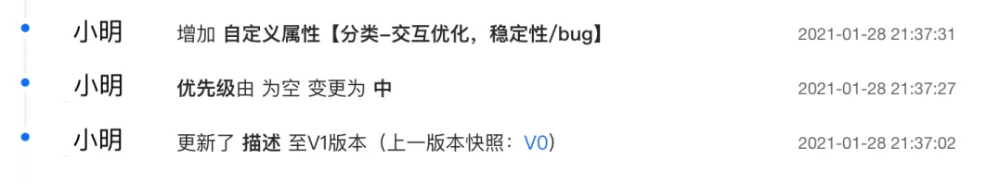

# Table of Contents

* [操作日志的使用场景](#操作日志的使用场景)
* [实现方式](#实现方式)
  * [使用 Canal 监听数据库记录操作日志](#使用-canal-监听数据库记录操作日志)
* [参考资料](#参考资料)

# 操作日志的使用场景

**系统日志和操作日志的区别**

**系统日志**：系统日志主要是为开发排查问题提供依据，一般打印在日志文件中；系统日志的可读性要求没那么高，日志中会包含代码的信息，比如在某个类的某一行打印了一个日志。

**操作日志**：主要是对某个对象进行新增操作或者修改操作后记录下这个新增或者修改，操作日志要求可读性比较强，因为它主要是给用户看的，比如订单的物流信息，用户需要知道在什么时间发生了什么事情。再比如，客服对工单的处理记录信息。

操作日志的记录格式大概分为下面几种：

- 单纯的文字记录，比如：2021-09-16 10:00 订单创建。

- 简单的动态的文本记录，比如：2021-09-16 10:00 订单创建，订单号：NO.11089999，其中涉及变量订单号“NO.11089999”。

- 修改类型的文本，包含修改前和修改后的值，比如：2021-09-16 10:00 用户小明修改了订单的配送地址：从“金灿灿小区”修改到“银盏盏小区” ，其中涉及变量配送的原地址“金灿灿小区”和新地址“银盏盏小区”。

- 修改表单，一次会修改多个字段。

  

# 实现方式

## 使用 Canal 监听数据库记录操作日志

[Canal](https://github.com/alibaba/canal) 是一款基于 MySQL 数据库增量日志解析，提供增量数据订阅和消费的开源组件，通过采用监听数据库 Binlog 的方式，这样可以从底层知道是哪些数据做了修改，然后根据更改的数据记录操作日志。

优点：这种方式的优点是和业务逻辑完全分离。

缺点： 缺点也很明显，局限性太高，只能针对数据库的更改做操作日志记录，**如果修改涉及到其他团队的 RPC 的调用**，就没办法监听数据库了。

> 举个例子：给用户发送通知，通知服务一般都是公司内部的公共组件，这时候只能在调用 RPC 的时候手工记录发送通知的操作日志了。

# 参考资料

https://mp.weixin.qq.com/s/JC51S_bI02npm4CE5NEEow

如何将一次数据上报请求中包含的所有业务日志快速过滤出来？

+ 同步线程
+ 异步线程

+ 具体使用：LogAspect

