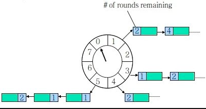

# Table of Contents

* [延迟任务实现思路分析](#延迟任务实现思路分析)
* [无限循环实现延迟任务](#无限循环实现延迟任务)
* [Java API 实现延迟任务](#java-api-实现延迟任务)
* [Netty 实现延迟任务-时间轮](#netty-实现延迟任务-时间轮)
* [[Redis实现](../G.数据库/Redis/Redis如何实现延迟队列.md)](#redis实现g数据库redisredis如何实现延迟队列md)
* [使用 Spring 定时任务](#使用-spring-定时任务)
* [Quartz 实现延迟任务](#quartz-实现延迟任务)
* [参考资料](#参考资料)


顾明思议，我们**把需要延迟执行的任务叫做延迟任务**。

延迟任务的**使用场景**有以下这些：

1. 红包 24 小时未被查收，需要延迟执退还业务；
2. 每个月账单日，需要给用户发送当月的对账单；
3. 订单下单之后 30 分钟后，用户如果没有付钱，系统需要自动取消订单。

等事件都需要使用延迟任务。


# 延迟任务实现思路分析

延迟任务**实现的关键是在某个时间节点执行某个任务**。基于这个信息我们可以想到**实现延迟任务的手段**有以下两个：

1. 自己手写一个“死循环”一直判断当前时间节点有没有要执行的任务；
2. 借助 JDK 或者第三方提供的工具类来实现延迟任务。

而通过 JDK 实现延迟任务我们能想到的关键词是：DelayQueue、ScheduledExecutorService，而第三方提供的延迟任务执行方法就有很多了，例如：Redis、Netty、MQ 等手段。

> 那么不管JDK还是第三方怎么实现的？
>
> 个人理解:本质还是一个‘死循环’，不过实现起来更巧妙。


# 无限循环实现延迟任务

```java
/**
     * 无限循环实现延迟任务
     */
    public static void loopTask() {
        Long itemLong = 0L;
        while (true) {
            Iterator it = _TaskMap.entrySet().iterator();
            while (it.hasNext()) {
                Map.Entry entry = (Map.Entry) it.next();
                itemLong = (Long) entry.getValue();
                // 有任务需要执行
                if (Instant.now().toEpochMilli() >= itemLong) {
                    // 延迟任务，业务逻辑执行
                    System.out.println("执行任务：" + entry.getKey() +
                            " ，执行时间：" + LocalDateTime.now());
                    // 删除任务
                    _TaskMap.remove(entry.getKey());
                }
            }
        }
    }
```


# Java API 实现延迟任务

Java API 提供了**两种实现延迟任务的方法：DelayQueue 和 ScheduledExecutorService。**


# Netty 实现延迟任务-时间轮

**ashedWheelTimer 是使用定时轮实现的，定时轮其实就是一种环型的数据结构**，可以把它想象成一个时钟，分成了许多格子，每个格子代表一定的时间，在这个格子上用一个链表来保存要执行的超时任务，同时有一个指针一格一格的走，走到那个格子时就执行格子对应的延迟任务，如下图所示：




以上的图片可以理解为，时间轮大小为 8，某个时间转一格（例如 1s），每格指向一个链表，保存着待执行的任务。


# [Redis实现](../G.数据库/Redis/Redis如何实现延迟队列.md)


# 使用 Spring 定时任务

如果你使用的是 Spring 或 SpringBoot 的项目的话，可以使用借助 Scheduled 来实现，本文将使用 SpringBoot 项目来演示 Scheduled 的实现，实现我们需要声明开启 Scheduled，实现代码如下：


# Quartz 实现延迟任务

Quartz 是一款功能强大的任务调度器，可以实现较为复杂的调度功能，它还支持分布式的任务调度。


# 参考资料

+ [实战：10 种实现延迟任务的方法，附代码！ (qq.com)](https://mp.weixin.qq.com/s/HEkQCC9v2l0EwJiAgfe5bg)
