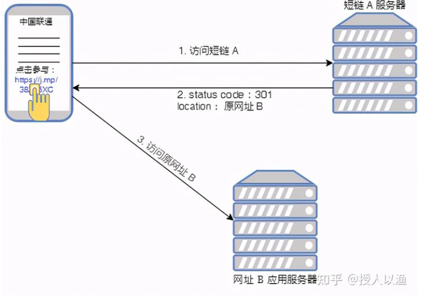

# Table of Contents

* [什么是 URL 短链](#什么是-url-短链)
* [短链跳转主要原理](#短链跳转主要原理)
* [URL 短链设计的需求](#url-短链设计的需求)
* [短链生成方法](#短链生成方法)
  * [自增id](#自增id)
  * [摘要算法=哈希算法](#摘要算法哈希算法)
  * [普通随机数](#普通随机数)
  * [**算法分析**](#算法分析)
* [**数据库存储方案**](#数据库存储方案)
* [如何解决hash冲突呢(重点)](#如何解决hash冲突呢重点)
* [算法案例](#算法案例)
  * [摘要算法：](#摘要算法)
  * [数字转为base62算法：](#数字转为base62算法)
* [参考资料](#参考资料)


# 什么是 URL 短链

URL 短链，就是把原来较长的网址，转换成比较短的网址。我们可以在短信和微博里可以经常看到短链的身影。如下图，我随便找了某一天躺在我短信收件箱里的短信。


上图所示短信中， [https://j.mp/38Zx5XC](https://link.zhihu.com/?target=https%3A//j.mp/38Zx5XC) ，就是一条短链。 用户点击蓝色的短链，就可以在浏览器中看到它对应的原网址：

那么为什么要做这样的转换呢？来看看短链带来的好处：

- 在微博， Twitter 这些限制字数的应用中，短链带来的好处不言而喻： 网址短、美观、便于发布、传播，可以写更多有意义的文字；
- 在短信中，如果含长网址的短信内容超过 70 字，就会被拆成两条发送，而用短链则可能一条短信就搞定，如果短信量大也可以省下不少钱；
- 我们平常看到的二维码，本质上也是一串 URL ，如果是长链，对应的二维码会密密麻麻，扫码的时候机器很难识别，而短链则不存在这个问题；
- 出于安全考虑，不想让有意图的人看到原始网址。

当然，以上好处也只是相对的，这不，随着微信扫码能力的提升，微信已经开始取消短链服务了。


# 短链跳转主要原理

1. 客户端（或浏览器）请求短链： [https://j.mp/38Zx5XC](https://link.zhihu.com/?target=https%3A//j.mp/38Zx5XC)

2. 短链服务器收到请求后，返回 status code: 301 或 302 ，说明需要跳转，同时也通过 location 字段告知客户端：你要访问的其实是下面这个长网址 ：
   [https://activity.icoolread.com/act7/212/duanxin/index](https://link.zhihu.com/?target=https%3A//activity.icoolread.com/act7/212/duanxin/index)

3. 客户端收到短链服务器的应答后，再去访问长网址：
   [https://activity.icoolread.com/](https://link.zhihu.com/?target=https%3A//activity.icoolread.com/act7/212/duanxin/index)



实际浏览器中的网络请求如下图：


> ```
> + 301，代表 **永久重定向**，
> 
>   也就是说第一次请求拿到长链接后，下次浏览器再去请求短链的话，不会向短网址服务器请求了，而是直接从浏览器的缓存里拿，这样在 server 层面就无法获取到短网址的点击数了，如果这个链接刚好是某个活动的链接，也就无法分析此活动的效果。所以我们一般不采用 301。
> 
> + 302，代表 **临时重定向**，
> 
>   也就是说每次去请求短链都会去请求短网址服务器（除非响应中用 Cache-Control 或 Expired 暗示浏览器缓存）,这样就便于 server 统计点击数，所以虽然用 302 会给 server 增加一点压力，但在数据异常重要的今天，这点代码是值得的，所以推荐使用 302。
> ```

#  URL 短链设计的需求

功能性需求：

- 给定原始的长 URL ，短链服务能生成比它短且唯一的 URL
- 用户点击短 URL ， 能跳转到长原始的长 URL
- 短 URL 经过一定时间后，会过期
- 接口需要设计成 REST API

非功能性需求：

- 高可用：服务不能存在单点故障
- 高性能：生成短 URL 的过程，以及从短 URL 跳转到原始 URL 要近实时
- 安全：短链不可被预测，否则简单的遍历就能把所有短链都遍历完，空耗系统资源


# 短链生成方法

短码一般是由 `[a - z, A - Z, 0 - 9]` 这**62 个字母**或数字组成，短码的长度也可以自定义，但一般不超过8位。

比较常用的都是6位，6位的短码已经能有568亿种的组合：(26+26+10)^6 = 56800235584，已满足绝大多数的使用场景。

目前比较流行的生成短码方法有：`自增id`、`摘要算法`、`普通随机数`。


## 自增id

该方法是一种无碰撞的方法，原理是，每新增一个短码，就在上次添加的短码id基础上加1，然后将这个10进制的id值，转化成一个62进制的字符串。

一般利用数据表中的自增id来完成：每次先查询数据表中的自增id最大值max，那么需要插入的长网址对应自增id值就是 max+1，将max+1转成62进制即可得到短码。

但是短码 id 是从一位长度开始递增，短码的长度不固定，不过可以用 id 从指定的数字开始递增的方式来处理，确保所有的短码长度都一致。同时，生成的短码是有序的，可能会有安全的问题，可以将生成的短码id，结合长网址等其他关键字，进行md5运算生成最后的短码。


也可以使用redis来自增


## 摘要算法=哈希算法

摘要算法又称哈希算法，它表示输入任意长度的数据，输出固定长度的数据。相同的输入数据始终得到相同的输出，不同的输入数据尽量得到不同的输出。

算法过程：

1. 将长网址md5生成32位签名串,分为4段, 每段8个字节；
2. 对这四段循环处理, 取8个字节, 将他看成16进制串与0x3fffffff(30位1)与操作, 即超过30位的忽略处理；
3. 这30位分成6段, 每5位的数字作为字母表的索引取得特定字符, 依次进行获得6位字符串；
4. 总的md5串可以获得4个6位串；取里面的任意一个就可作为这个长url的短url地址；

这种算法,虽然会生成4个,但是仍然存在重复几率。

虽然几率很小，但是该方法依然存在碰撞的可能性，解决冲突会比较麻烦。不过该方法生成的短码位数是固定的，也不存在连续生成的短码有序的情况。


能够满足这样的哈希算法有很多，这里推荐 Google 出品的 MurmurHash 算法，MurmurHash 是一种**非加密型**哈希函数，适用于一般的哈希检索操作。与其它流行的哈希函数相比，对于规律性较强的 key，MurmurHash 的随机分布特征表现更良好。


## 普通随机数

该方法是从62个字符串中随机取出一个6位短码的组合，然后去数据库中查询该短码是否已存在。如果已存在，就继续循环该方法重新获取短码，否则就直接返回。

该方法是最简单的一种实现，不过由于`Math.round()`方法生成的随机数属于伪随机数，碰撞的可能性也不小。在数据比较多的情况下，可能会循环很多次，才能生成一个不冲突的短码。

## **算法分析**

以上算法利弊我们一个一个来分析。

如果使用自增id算法，会有一个问题就是不法分子是可以穷举你的短链地址的。原理就是将10进制数字转为62进制，那么别人也可以使用相同的方式遍历你的短链获取对应的原始链接。打个比方说：[http://tinyurl.com/a3300和](http://tinyurl.com/a3300%E5%92%8C) [http://bit.ly/a3300，这两个短链网站，分别从a3300](http://bit.ly/a3300%EF%BC%8C%E8%BF%99%E4%B8%A4%E4%B8%AA%E7%9F%AD%E9%93%BE%E7%BD%91%E7%AB%99%EF%BC%8C%E5%88%86%E5%88%AB%E4%BB%8Ea3300) - a3399，能够试出来多次返回正确的url。所以这种方式生成的短链对于使用者来说其实是不安全的。

摘要算法，其实就是hash算法吧，一说hash大家可能觉得很low，但是事实上hash可能是最优解。比如：<http://www.sina.lt/> 和 <http://mrw.so/> 连续生成的url发现并没有规律，很有可能就是使用hash算法来实现。

普通随机数算法，这种算法生成的东西和摘要算法一样，但是碰撞的概率会大一些。因为摘要算法毕竟是对url进行hash生成，随机数算法就是简单的随机生成，数量一旦上来必然会导致重复。

综合以上，我选择最low的算法：摘要算法。


# **数据库存储方案**

数据库基础表如下:

| base_url                                            | suffix_url             | shot_code | total_click_count | full_url                                         | expiration_date |
| --------------------------------------------------- | ---------------------- | --------- | ----------------- | ------------------------------------------------ | --------------- |
| [http://www.aichacha.com](http://www.aichacha.com/) | /search/12345          | edfg3s    |                   | <http://www.aichacha.com//search/12345>          |                 |
| [http://www.aichacha.com](http://www.aichacha.com/) | /aiCheck/getResult/123 | Fe9dq     |                   | <http://www.aichacha.com//aiCheck/getResult/123> |                 |
| [http://www.baidu.com](http://www.baidu.com/)       | /wenku/12354           | lcfr53    |                   | <http://www.baidu.com/wenku/12354>               |                 |

字段释义：

base_url：域名

suffix_url：链接除了域名外的后缀

full_url：完整链接

shot_code：当前 suffix_url 链接的短码

expiration_date：失效日期

total_click_count：当前链接总点击次数

expiration_date：当前链接失效时间


# 如何解决hash冲突呢(重点)

1. 将长链（lurl）经过 MurmurHash 后得到短链。
2. 再根据短链去 short_url_map 表中查找看是否存在相关记录，如果不存在，将长链与短链对应关系插入数据库中，存储。
3. 如果存在，说明已经有相关记录了，此时在长串上拼接一个自定义好的字段，比如「DUPLICATE」，然后再对接接的字段串「lurl + DUPLICATE」做第一步操作，如果最后还是重复呢，再拼一个字段串啊，只要到时根据短链取出长链的时候把这些自定义好的字符串移除即是原来的长链。

> 其实就是给长链加随机字符，生成短链，在获取长链的时候，去掉随机字符。


以上步骤显然是要优化的，插入一条记录居然要经过两次 sql 查询（根据短链查记录，将长短链对应关系插入数据库中），如果在高并发下，显然会成为[瓶颈](https://www.zhihu.com/search?q=%E7%93%B6%E9%A2%88&search_source=Entity&hybrid_search_source=Entity&hybrid_search_extra=%7B%22sourceType%22%3A%22answer%22%2C%22sourceId%22%3A1679116463%7D)。

**画外音：一般数据库和应用服务（只做计算不做存储）会部署在两台不同的 server 上，执行两条 sql 就需要两次网络通信，这两次网络通信与两次 sql 执行是整个短链系统的性能瓶颈所在！**

所以该怎么优化呢

1. 首先我们需要给短链字段 surl 加上唯一索引
2. 当长链经过 MurmurHash 得到短链后，直接将长短链对应关系插入 db 中，如果 db 里不含有此短链的记录，则插入，如果包含了，说明违反了唯一性索引，此时只要给长链再加上我们上文说的自定义字段「DUPLICATE」,重新 hash 再插入即可，看起来在违反唯一性索引的情况下是多执行了步骤，但我们要知道 MurmurHash 发生冲突的概率是非常低的，基本上不太可能发生，所以这种方案是可以接受的。

当然如果在数据量很大的情况下，冲突的概率会增大，此时我们可以加布隆过滤器来进行优化。


# 算法案例

## 摘要算法：

```java

import org.apache.commons.lang3.StringUtils;

import javax.xml.bind.DatatypeConverter;
import java.security.MessageDigest;
import java.security.NoSuchAlgorithmException;
import java.util.concurrent.atomic.AtomicLong;

import static com.alibaba.fastjson.util.IOUtils.DIGITS;

/**
 * @author rickiyang
 * @date 2020-01-07
 * @Desc TODO
 */
public class ShortUrlGenerator {

    public static void main(String[] args) {
        String sLongUrl = "http://www.baidu.com/121244/ddd";
        for (String shortUrl : shortUrl(sLongUrl)) {
            System.out.println(shortUrl);
        }
    }

    public static String[] shortUrl(String url) {
        // 可以自定义生成 MD5 加密字符传前的混合 KEY
        String key = "dwz";
        // 要使用生成 URL 的字符
        String[] chars = new String[]{"a", "b", "c", "d", "e", "f", "g", "h",
                "i", "j", "k", "l", "m", "n", "o", "p", "q", "r", "s", "t",
                "u", "v", "w", "x", "y", "z", "0", "1", "2", "3", "4", "5",
                "6", "7", "8", "9", "A", "B", "C", "D", "E", "F", "G", "H",
                "I", "J", "K", "L", "M", "N", "O", "P", "Q", "R", "S", "T",
                "U", "V", "W", "X", "Y", "Z"
        };
        // 对传入网址进行 MD5 加密
        String sMD5EncryptResult = "";
        try {
            MessageDigest md = MessageDigest.getInstance("MD5");
            md.update((key + url).getBytes());
            byte[] digest = md.digest();
            sMD5EncryptResult = DatatypeConverter.printHexBinary(digest).toUpperCase();
        } catch (NoSuchAlgorithmException e) {
            e.printStackTrace();
        }

        String[] resUrl = new String[4];
        //得到 4组短链接字符串
        for (int i = 0; i < 4; i++) {
            // 把加密字符按照 8 位一组 16 进制与 0x3FFFFFFF 进行位与运算
            String sTempSubString = sMD5EncryptResult.substring(i * 8, i * 8 + 8);
            // 这里需要使用 long 型来转换，因为 Inteper .parseInt() 只能处理 31 位 , 首位为符号位 , 如果不用 long ，则会越界
            long lHexLong = 0x3FFFFFFF & Long.parseLong(sTempSubString, 16);
            String outChars = "";
            //循环获得每组6位的字符串
            for (int j = 0; j < 6; j++) {
                // 把得到的值与 0x0000003D 进行位与运算，取得字符数组 chars 索引(具体需要看chars数组的长度   以防下标溢出，注意起点为0)
                long index = 0x0000003D & lHexLong;
                // 把取得的字符相加
                outChars += chars[(int) index];
                // 每次循环按位右移 5 位
                lHexLong = lHexLong >> 5;
            }
            // 把字符串存入对应索引的输出数组
            resUrl[i] = outChars;
        }
        return resUrl;
    }

}
```

## 数字转为base62算法：

```java

/**
 * @author rickiyang
 * @date 2020-01-07
 * @Desc TODO
 * <p>
 * 进制转换工具，最大支持十进制和62进制的转换
 * 1、将十进制的数字转换为指定进制的字符串；
 * 2、将其它进制的数字（字符串形式）转换为十进制的数字
 */
public class NumericConvertUtils {

    public static void main(String[] args) {
        String str = toOtherNumberSystem(22, 62);
        System.out.println(str);
    }


    /**
     * 在进制表示中的字符集合，0-Z分别用于表示最大为62进制的符号表示
     */
    private static final char[] digits = {'0', '1', '2', '3', '4', '5', '6', '7', '8', '9',
            'a', 'b', 'c', 'd', 'e', 'f', 'g', 'h', 'i', 'j', 'k', 'l', 'm',
            'n', 'o', 'p', 'q', 'r', 's', 't', 'u', 'v', 'w', 'x', 'y', 'z',
            'A', 'B', 'C', 'D', 'E', 'F', 'G', 'H', 'I', 'J', 'K', 'L', 'M',
            'N', 'O', 'P', 'Q', 'R', 'S', 'T', 'U', 'V', 'W', 'X', 'Y', 'Z'};

    /**
     * 将十进制的数字转换为指定进制的字符串
     *
     * @param number 十进制的数字
     * @param seed   指定的进制
     * @return 指定进制的字符串
     */
    public static String toOtherNumberSystem(long number, int seed) {
        if (number < 0) {
            number = ((long) 2 * 0x7fffffff) + number + 2;
        }
        char[] buf = new char[32];
        int charPos = 32;
        while ((number / seed) > 0) {
            buf[--charPos] = digits[(int) (number % seed)];
            number /= seed;
        }
        buf[--charPos] = digits[(int) (number % seed)];
        return new String(buf, charPos, (32 - charPos));
    }

    /**
     * 将其它进制的数字（字符串形式）转换为十进制的数字
     *
     * @param number 其它进制的数字（字符串形式）
     * @param seed   指定的进制，也就是参数str的原始进制
     * @return 十进制的数字
     */
    public static long toDecimalNumber(String number, int seed) {
        char[] charBuf = number.toCharArray();
        if (seed == 10) {
            return Long.parseLong(number);
        }

        long result = 0, base = 1;

        for (int i = charBuf.length - 1; i >= 0; i--) {
            int index = 0;
            for (int j = 0, length = digits.length; j < length; j++) {
                //找到对应字符的下标，对应的下标才是具体的数值
                if (digits[j] == charBuf[i]) {
                    index = j;
                }
            }
            result += index * base;
            base *= seed;
        }
        return result;
    }
}
```


# 参考资料

+ https://zhuanlan.zhihu.com/p/370475544

+ https://www.cnblogs.com/rickiyang/p/12178644.html

+ https://zhuanlan.zhihu.com/p/113528722 (这个可以)
+ https://cloud.tencent.com/developer/article/1872330

