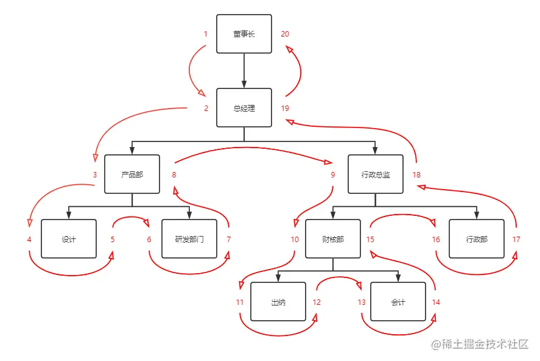
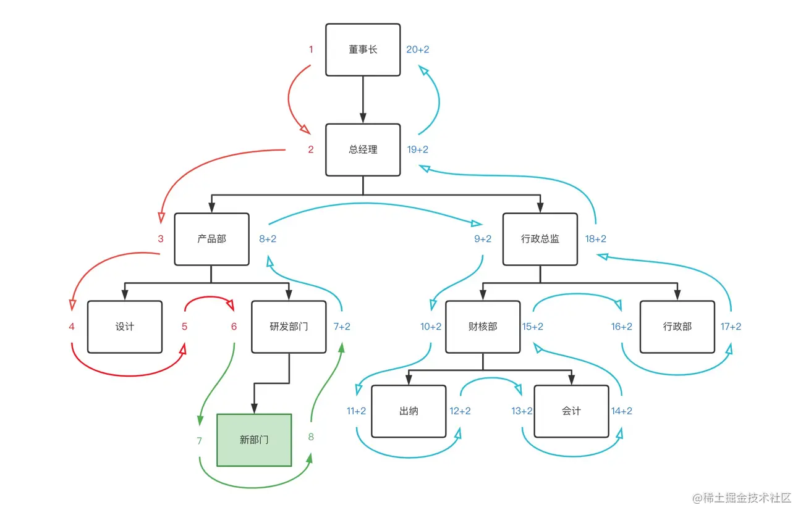
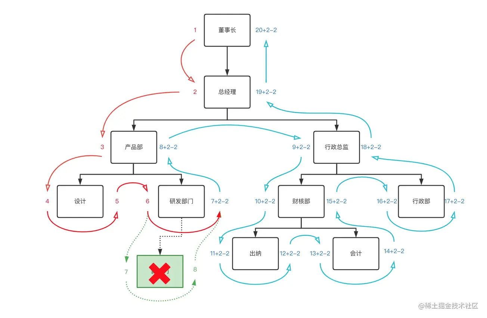

# Table of Contents

* [特殊编码](#特殊编码)
* [特殊编码-冗余信息（不建议）](#特殊编码-冗余信息不建议)
* [特殊编码-祖先路径](#特殊编码-祖先路径)
* [树状图](#树状图)
  * [查出所有子孙部门](#查出所有子孙部门)
  * [查询子孙部门总数](#查询子孙部门总数)
  * [判断是否叶子节点](#判断是否叶子节点)
  * [新增部门](#新增部门)
  * [删除部门](#删除部门)


工作中不管哪个公司都会有组织架构，那么如何设计呢？以下是几种方案的总结


# 特殊编码

| 节点code | 节点名称   | 节点层级 |
| -------- | ---------- | -------- |
| 010000   | 公司1      | 1        |
| 020000   | 公司2      | 1        |
| 010300   | 制造部     | 2        |
| 010400   | 品质部     | 2        |
| 010301   | 前工程制造 | 3        |
| 010303   | 组装制造   | 3        |


这种数据结构下，查询相关信息一般都是通过**递归**来实现。


但是当业务需求变得多了，数据量庞大了，这样的方式就不再适合用于生产。

例如：PM加了以下需求：

1. 查出指定部门下所有子孙部门。
2. 查询子孙部门总数。
3. 判断节点是否叶子节点。


> ps：一般也不会有这么大的组织？


# 特殊编码-冗余信息（不建议）

| 节点code | 节点名称   | 节点层级 | 父级节点code | 1级祖先code | 2级祖先cdoe |
| -------- | ---------- | -------- | ------------ | ----------- | ----------- |
| 010000   | 公司1      | 1        | 000000       | null        | null        |
| 020000   | 公司2      | 1        | 000000       | null        | null        |
| 010300   | 制造部     | 2        | 010000       | 010000      | null        |
| 010400   | 品质部     | 2        | 010000       | 010000      | null        |
| 010301   | 前工程制造 | 3        | 010300       | 010000      | 010300      |
| 010303   | 组装制造   | 3        | 010300       | 010000      | 010300      |

+ 优点

 这样设计的表格冗余较多,但在各种类型查询的时候效率较高.在插入,更新(含子机构,由于业务逻辑特点,机构之间的更新一般是平行转移),删除(含子机构)的时候,由于冗余信息较多,数据操作时所需进行的查询获得也较简单.根据情况,部分冗余信息也考虑删去,如父级节点code,删去一些设计必然会导致部分查询的效率或复杂度提升,这个就需要根据实际情况来取舍平衡了. 

+ 缺点
  1. 一个是当层级数量较多的时候,需要存储大量的冗余信息.当然也可以考虑节约方案:1)不存储像n级祖先code这样的字段,但这样就无法利用固定层级设计带来的高效查询特性,是不建议这么做的;2)n级存储不使用code而改用id,这样做主要是在数据迁移或者他表利用的时候不方便.
  2. 另一个缺点是,当需求方给出要求,需要对当前机构重新洗牌,变更层级数的时候,你会非常头疼.


# 特殊编码-祖先路径


| id   | 节点名称  | 父id | 祖先路径 |
| ---- | --------- | ---- | -------- |
| 1    | node1     | 0    | 0,       |
| 2    | node2     | 0    | 0,       |
| 3    | node1.1   | 1    | 0,1,     |
| 4    | node1.2   | 1    | 0,1,     |
| 5    | node2.1   | 2    | 0,2,     |
| 6    | node1.1.1 | 3    | 0,1,3,   |
| 7    | node1.1.2 | 3    | 0,1,3,   |
| 8    | node1.2.1 | 4    | 0,1,4,   |
| 9    | node2.1.1 | 5    | 0,2,5,   |


# 树状图

> 提升查询性能，但维护和更新是个麻烦的事情，且后人不太便于维护，需要慎重考虑！！


+ https://juejin.cn/post/7076079848824766494
+ https://www.sitepoint.com/hierarchical-data-database-2/


 我们从根节点开始，给`董事长`左值设为`1`，下级部门`总经理`左值设为`2`，以此类推地`沿着边缘`开始遍历，给每个节点加上`左值`，遇到叶子节点处给节点加上`右值`，再继续向上沿着边缘继续遍历，遍历结束回到根节点`右侧`,你将得到类似这样的结构。 




遍历完后每一个节点都有与之对应的`左右值`。 这个时候可以去除`parent_id`字段，添加`lft`,`rgt`，来存储左右值。

| id   | name     | lft  | rgt  | level |
| ---- | -------- | ---- | ---- | ----- |
| 1    | 董事长   | 1    | 20   | 1     |
| 2    | 总经理   | 2    | 19   | 2     |
| 3    | 产品部   | 3    | 8    | 3     |
| 4    | 设计部   | 4    | 5    | 4     |
| 4    | 研发部   | 6    | 7    | 4     |
| 6    | 行政总监 | 9    | 18   | 3     |
| 7    | 财核部   | 10   | 15   | 4     |
| 8    | 出纳     | 11   | 12   | 5     |
| 8    | 会计     | 13   | 14   | 5     |
| 10   | 行政部   | 16   | 17   | 4     |

数据和结构准备完毕，我们来试试操作解决上面的需求~


## 查出所有子孙部门

根据当前表结构的规律，可以发现，要想查出所有子孙部门，只要查左值在 `被查寻部门`的`左\右数之间`的节点，查出来都是他的子节点。 例如：查询`行政总监`的所有子部门，`行政总监`的左右数是`9`和`18`，因此只需要用`9`和`18`做`lft`字段的`between`查询，查询出的结果就是【被查部门本身数据和所有子孙部门】；

```SQL
SET @lft := 9;
SET @rgt := 18;
SELECT * FROM department WHERE lft BETWEEN @lft AND @rgt ORDER BY lft ASC;
/*例子中用BETWEEN将被查部门本身也查了出来。实际中可以用大于小于*/

```

完美~

## 查询子孙部门总数

到这里可能会说，需求1都解决了，查总数自然也就解决了，直接上`select count`就可以了，确实没有错，但是没有那个必要，因为有个简单公式可以直接计算

公式：`总数 = (右值 - 左值 - 1) / 2`

例如：

```
行政总监的子孙部门数 = (18 - 9 - 1) / 2 = 4

董事长的子孙部门数 = (20 - 1 - 1) / 2 = 9

会计的子部门数 =  (14 - 13 - 1) / 2 = 0

可以数数看，确实没错哦～

```

## 判断是否叶子节点

通过有了上述计算公式算总数的经验后，现在判断是否叶子节点，有的小伙伴已经知道了怎么做，那就是：

`右值 - 1 == 左值`那他就是叶子节点，或者`左值 + 1 == 右值`那他就是叶子节点，反之则不是叶子节点。

例如：

`设计部`，`5 - 1 == 4`，因此他是叶子节点。

`董事长`，`20 - 1 != 1`，因此他不是叶子节点。

至此已经完美的解决了上述需求问题，接下来再尝试一下业务的基本操作。

## 新增部门

当新增一个部门时，需要对新增节点位置的`后续边缘`进行`加2`操作，因为每一个节点有左右两个数值。这个操作通常需要放到`事务`中进行处理。 例如：在研发部门下添加一个`新部门`：



我们会发现，当前**插入节点后的所有节点的左右节点都要+2.**

```sql
SET @lft := 7;/*新部门的左值*/
SET @rgt := 8;/*新部门的左值*/
SET @level := 5;/*新部门的层级*/
begin;
/*将插入的后续边缘的节点左右数+2*/
UPDATE department SET lft=lft+2 WHERE lft > @lft;
UPDATE department SET rgt=rgt+2 WHERE rgt >= @lft;
/*插入数据*/
INSERT INTO department(name,lft,rgt,level) VALUES('新部门',@lft,@rgt,level);
/*新增影响行数为0时，必须回滚*/
commit;
/*rollback;*/

```

## 删除部门

删除部门与新增部门类似，不同的是需要对删除节点的`后续边缘`节点`减2`操作。 例如：删除刚刚添加的新部门



```plsql
SET @lft := 7;/*要删除的节点左值*/
SET @rgt := 8;/*要删除的节点右值*/
begin;
UPDATE department SET lft=lft-2 WHERE lft > @lft;
UPDATE department SET rgt=rgt-2 WHERE rgt > @lft;

/*删除节点*/
DELETE FROM department WHERE lft=@lft AND rgt=@rgt;
/*删除影响行数为0时，必须回滚*/
commit;
/*rollback*/

```

