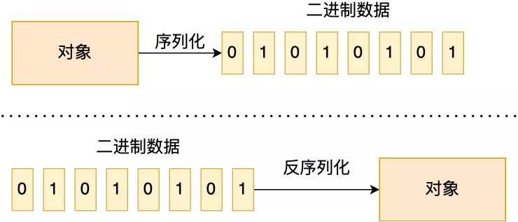
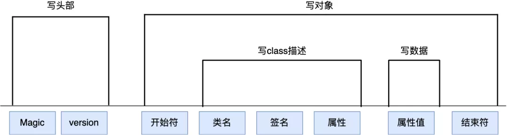

# Table of Contents

* [什么是序列化](#什么是序列化)
* [为什么要序列化](#为什么要序列化)
* [为什么 RPC 经常提到序列化呢？](#为什么-rpc-经常提到序列化呢)
* [HTTP 什么时候需要序列化呢？](#http-什么时候需要序列化呢)
* [JDK 原生序列化](#jdk-原生序列化)
* [JSON](#json)
* [ProtoBuffer](#protobuffer)
* [总结](#总结)


# 什么是序列化

序列化 `Serialization` – 将对象的状态信息**转换为可以存储或传输的形式的过程**。在序列化期间，对象将其当前状态写入到临时或持久性存储区。以后，可以通过从存储区中读取或反序列化对象的状态，重新创建该对象。

简单来说：

- 序列化：把对象转换为字节序列的过程称为对象的序列化。
- 反序列化：把字节序列恢复为对象的过程称为对象的反序列化。




总结来说，**序列化就是将对象转换成二进制数据的过程，以方便传输或存储。而反序列就是将二进制转换为对象的过程。**

> 不一定都是二进制 也可能是文件 

# 为什么要序列化

序列化的原因基本三种情况：

- 永久性保存对象，保存对象的字节序列到本地文件中；
- 对象在网络中传递；
- 对象在 `IPC` 间传递。


# 为什么 RPC 经常提到序列化呢？

因为网络传输的数据必须是二进制数据，所以在 RPC 调用中，对入参对象与返回值对象进行序列化与反序列化是一个必须的过程。


# HTTP 什么时候需要序列化呢？

举个例子。

当客户端和服务端交互的数据是 JSON，这时候发送方需要将 JSON 对象转换成二进制数据发送到网络，接收方需要将接收到的二进制数据转换成 JSON 对象。

说了，这么多概念，接下来跟大家说说有哪些常用的序列化方式？


# JDK 原生序列化


Java 语言中 JDK 就自带有序列化的方式，举个 JDK 序列化的例子。

```java

public class Student implements Serializable {
    //学号
    private int no;
    //姓名
    private String name;

    public int getNo() {
        return no;
    }

    public void setNo(int no) {
        this.no = no;
    }

    public String getName() {
        return name;
    }

    public void setName(String name) {
        this.name = name;
    }

    @Override
    public String toString() {
        return "Student{" +
                "no=" + no +
                ", name='" + name + '\'' +
                '}';
    }

    public static void main(String[] args) throws IOException, ClassNotFoundException {
       
        String basePath = "/root";
        FileOutputStream fos = new FileOutputStream(basePath + "student.dat");
        
        //初始化一个学生对象
        Student student = new Student();
        student.setNo(1);
        student.setName("xiaolin");
        
        //将学生对象序列化到文件里
        ObjectOutputStream oos = new ObjectOutputStream(fos);
        oos.writeObject(student);
        oos.flush();
        oos.close();

        //读取文件中的二进制数据，并将数据反序列化为学生对象
        FileInputStream fis = new FileInputStream(basePath + "student.dat");
        ObjectInputStream ois = new ObjectInputStream(fis);
        Student deStudent = (Student) ois.readObject();
        ois.close();

        System.out.println(deStudent);
    }
}
```

从上面的代码，我们可以知道：

- JDK 自带的序列化具体的实现是由 ObjectOutputStream 完成的；
- 而反序列化的具体实现是由 ObjectInputStream 完成的。

既然序列化是将对象转换为二进制数据，那序列化的过程的二进制数据肯定是有某种固定的格式。

比如 JDK 自带的序列化的过程如下图：




序列化过程就是在读取对象数据的时候，不断加入一些特殊分隔符，这些特殊分隔符用于在反序列化过程中截断用。

- 头部数据用来声明序列化协议、序列化版本，用于高低版本向后兼容；
- 对象数据主要包括类名、签名、属性名、属性类型及属性值，当然还有开头结尾等数据，除了属性值属于真正的对象值，其他都是为了反序列化用的元数据
- 存在对象引用、继承的情况下，就是递归遍历“写对象”逻辑

所以，从这个例子我们可以知道，任何一种序列化的方式，其核心思想就要设计一套将对象转换成某种特定格式的二进制数据，接着反序列化的时候，就能根据规则从二进制数据解析出对象。

这么看，序列化其实就是一种协议，序列化方和反序列化方都要遵循相同的规则，否则就无法得到正常的数据。

**不过，JDK 原生序列化缺陷就是不能跨语言，只能在 Java 生态里使用。**


# JSON

JSON 数据的格式相信大家都很熟悉了吧，在 Web 应用里特别常见，通常后端和前端的耦合就是 JSON 数据。

JSON 是典型的 Key-Value 方式，没有数据类型。很多语言都实现了 JSON 序列化的第三库，所以 JSON 序列化的方式可以跨语言。

比如，Java 语言中常用的 JSON 第三方类库有：

- Gson: 谷歌开发的 JSON 库，功能十分全面。
- FastJson: 阿里巴巴开发的 JSON 库，性能十分优秀。
- Jackson: 社区十分活跃且更新速度很快。


# ProtoBuffer

ProtoBuf 是由 Google 出品的，是一种轻便、高效的结构化数据存储格式，可以用于结构化数据序列化，支持 Java、Python、C++、Go 等语言。

Protobuf 使用的时候必须写一个 IDL（Interface description language）文件，在里面定义好数据结构，只有预先定义了的数据结构，才能被序列化和反序列化。

下面是一个简单的 IDl 文件格式：

```java
syntax = "proto2";  // 使用第2版
package sample;   // 定义名字空间

message Person {            // 定义消息
  required string name = 1;  // required表示必须字段
  required int32 id = 2;
  optional string email = 3;  // optional字段可以没有
}
```

写完 IDL 文件后，然后使用不同语言的 IDL 编译器，生成序列化工具类。

Protobuf 在 Github 有文档介绍了不同语言是怎么使用编译器生成序列化工具类了，我在这里就不介绍了。

**现在很多大厂都在使用 Protobuf，而且 gRPC 就是基于 Protobuf 来做的序列化。**


# 总结

将对象保存到文件，或者通过网络传输给对方，都是需要将对象转换二进制数据才能完成，那么对象转二进制数据的过程就是序列化，相反的，二进制数据转对象的过程就是反序列化的过程。

我也给你介绍了几种常见的序列化方式：

- JDK 自带的序列化方式无法跨语言使用；
- JSON 序列化大多数语言都支持，JSON 优势是使用起来简单，容易阅读，应用广泛，缺点就是不适合大数据量的场景；
- ProtoBuf 使用需要定义 IDL 文件，序列化后体积相比 JSON 小很多，现在很多大公司都在用，gRPC 框架使用 protobuf 序列化。
