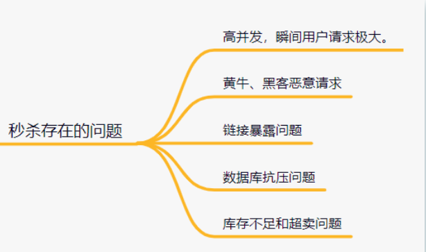

# Table of Contents

* [秒杀简介](#秒杀简介)
* [设计一个秒杀系统，需要考虑这些问题：](#设计一个秒杀系统需要考虑这些问题)
* [传统方案](#传统方案)
  * [使用内存操作替代实时的DB事务操作](#使用内存操作替代实时的db事务操作)
  * [使用乐观锁替代悲观锁。](#使用乐观锁替代悲观锁)
* [微信红包解决方案](#微信红包解决方案)

# 秒杀简介

一个“秒杀”活动，对应DB中的一条库存记录。当用户进行商品“秒杀”时，系统的主要逻辑在于DB中库存的操作上。

一般来说，对DB的操作流程有以下三步：

+ 锁库存

+ 插入“秒杀”记录

+ 更新库存

秒杀”系统的设计难点就在这个事务操作上。

1. 商品库存在DB中记为一行，大量用户同时“秒杀”同一商品时，第一个到达DB的请求锁住了这行库存记录。
2. 在第一个事务完成提交之前这个锁一直被第一个请求占用，后面的所有请求需要排队等待。
3. 同时参与“秒杀”的用户越多，并发进DB的请求越多，请求排队越严重。
4. 因此，并发请求抢锁，是典型的商品“秒杀”系统的设计难点。

# 设计一个秒杀系统，需要考虑这些问题：

如何**解决这些问题**呢？

- 页面静态化
- 按钮至灰控制
- 服务单一职责
- 秒杀链接加盐
- 限流
- 分布式锁
- MQ异步处理
- 限流&降级&熔断

**页面静态化**

秒杀活动的页面，大多数内容都是固定不变的，如商品名称，商品图片等等，可以对活动页面做静态化处理，减少访问服务端的请求。秒杀用户会分布在全国各地，有的在上海，有的在深圳，地域相差很远，网速也各不相同。为了让用户最快访问到活动页面，可以使用CDN（Content Delivery Network，内容分发网络）。CDN可以让用户就近获取所需内容。

**按钮至灰控制**

秒杀活动开始前，按钮一般需要置灰的。只有时间到了，才能变得可以点击。这是防止，秒杀用户在时间快到的前几秒，疯狂请求服务器，然后秒杀时间点还没到，服务器就自己挂了。

**服务单一职责**

我们都知道微服务设计思想，也就是把各个功能模块拆分，功能那个类似的放一起，再用分布式的部署方式。

如用户登录相关的，就设计个用户服务，订单相关的就搞个订单服务，再到礼物相关的就搞个礼物服务等等。那么，秒杀相关的业务逻辑也可以放到一起，搞个**秒杀服务**，单独给它搞个秒杀数据库。

**秒杀链接加盐**

链接如果明文暴露的话，会有人获取到请求Url，提前秒杀了。因此，需要给秒杀链接加盐。可以把URL动态化，如通过MD5加密算法加密随机的字符串去做url。

**MQ异步处理**

如果瞬间流量特别大，可以使用消息队列削峰，异步处理。用户请求过来的时候，先放到消息队列，再拿出来消费。

**限流&降级&熔断**

1. 限流

   一般有两种方式限流：nginx限流和redis限流。

- 为了防止某个用户请求过于频繁，我们可以对**同一用户限流**；
- 为了防止黄牛模拟几个用户请求，我们可以对**某个IP进行限流**；
- 为了防止有人使用代理，每次请求都更换IP请求，我们可以对**接口进行限流**。
- 为了防止瞬时过大的流量压垮系统，还可以使用阿里的Sentinel、Hystrix组件进行限流。

2. 降级，就是秒杀服务有问题了，就降级处理，不要影响别的服务；
3. 熔断，服务有问题就熔断，一般熔断降级是一起出现。

**分布式锁**

可以使用redis分布式锁解决超卖问题。

使用Redis的**SET EX PX NX + 校验唯一随机值**,再删除释放锁。

# 传统方案

普通商品“秒杀”活动系统，解决高并发问题的方案，大体有以下几种：

## 使用内存操作替代实时的DB事务操作

[Redis减库存](../G.数据库/Redis/Redis减库存.md)

## 使用乐观锁替代悲观锁。

所谓乐观锁，

1. 它假设多用户并发的事务在处理时不会彼此互相影响，各事务能够在不产生锁的情况下处理各自影响的那部分数据。
2. 在提交数据更新之前，每个事务会先检查在该事务读取数据后，有没有其他事务又修改了该数据。
3. 如果其他事务有更新的话，正在提交的事务会进行回滚。

商品“秒杀”系统中，乐观锁的具体应用方法，

- 是在DB的“库存”记录中维护一个版本号。
- 在更新“库存”的操作进行前，先去DB获取当前版本号。
- 在更新库存的事务提交时，检查该版本号是否已被其他事务修改。如果版本没被修改，则提交事务，且版本号加1；
- 如果版本号已经被其他事务修改，则回滚事务，并给上层报错。

这个方案解决了“并发请求抢锁”的问题，可以提高DB的并发处理能力。

缺点：

- 会带来大数量的无效更新请求、事务回滚，给DB造成不必要的额外压力。
- 事务回滚，带来的体验不好。

# 微信红包解决方案

- 系统垂直SET化，分而治之。
  说白点就是直接分流，将请求按照某种规则分发到不同的机器上
- 逻辑Server层将请求排队，解决DB并发问题。
  对请求进行排队，FIFO队列，就不会出现并发抢锁的问题。
- 双维度库表设计，保障系统性能稳定
  

