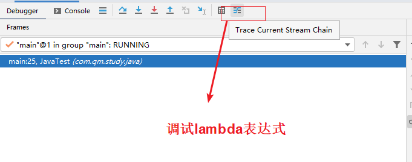
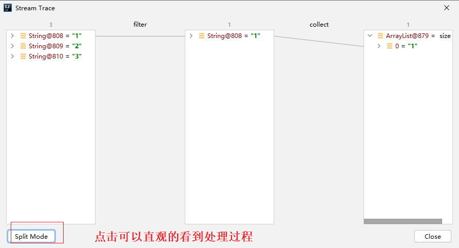
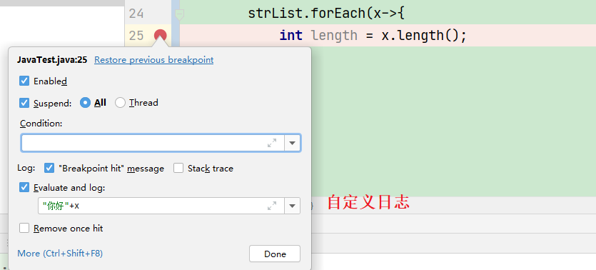
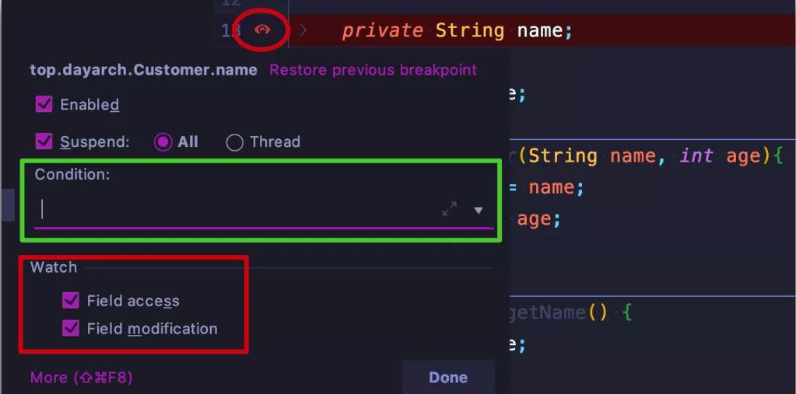
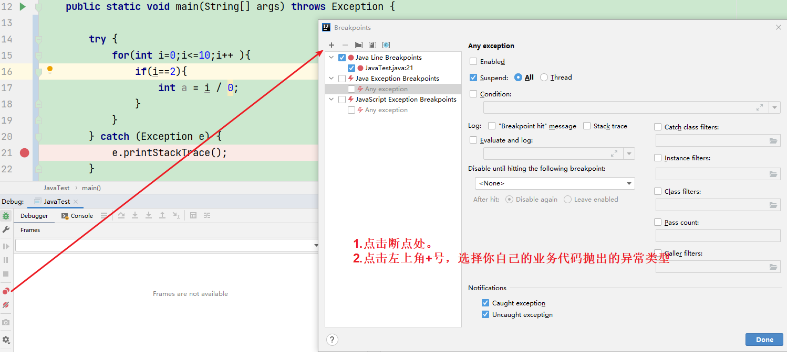
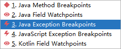
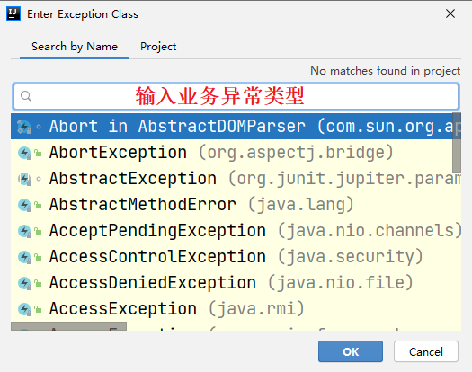
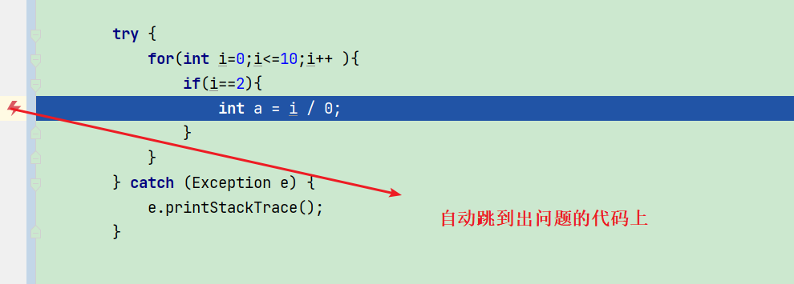
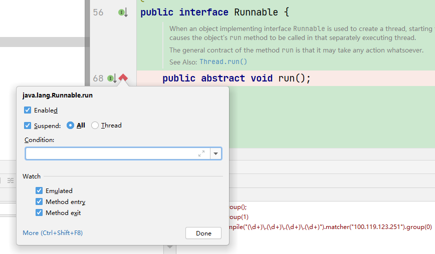

> 每一个都强烈推荐！！！！

# lambda调试技巧







# 断点处添加 log

调试代码时都喜欢 `print` 一些内容，这样看起来更直观，print 完之后又很容易忘记删除掉这些没用的内容，最终将代码提交到 `remote`，code review 时又不得不删减这些内容重新提交，不但增加不必要的工作量，还让 `log tree` 的一些节点没有任何价值




勾选上 `Evaluate and log`, 并自定义你想查看的 log/变量，比如这里的 `"你好" + x`, 这样以 Debug 模式运行程序（正常模式运行，不会打印这些 log）：

```java
Connected to the target VM, address: '127.0.0.1:60041', transport: 'socket'
你好1
Breakpoint reached at com.qm.study.java.JavaTest.lambda$main$0(JavaTest.java:25)
你好2
Breakpoint reached at com.qm.study.java.JavaTest.lambda$main$0(JavaTest.java:25)
你好3
Disconnected from the target VM, address: '127.0.0.1:60041', transport: 'socket'

```


Stack trace可以看自己的情况决定勾不勾。


# 字段断点

如果你阅读源码，你一定会有个困扰，类中的某个字段的值到底是在哪里改变的，你要一点点追踪调用栈，逐步排查，稍不留神，就可能有遗漏

> 我们可以在 IntelliJ IDEA 中为某个字段添加断点，当字段值有修改时，自动跳到相应方法位置

使用起来很简单：

1. 在字段定义处鼠标左键添加断点（会出现「眼睛」的图标）
2. 在「眼睛」图标上鼠标右键
3. 在弹框中勾选上 `Field access` 和 `Field modification` 两个选项



如果修改字段值的方法比较多，也可以在 `Condition` 的地方定义断点进入条件, 有了这个功能的加成，相信你阅读源码会顺畅许多


# 异常断点(强烈推荐)

设置异常断点后，在程序中出现需要拦截的异常时，会自动定位到出现异常的那一行。

方法：先点击 view breakpoints，之后点击 + 号添加异常断点，我们先试试添加空指针异常，ArithmeticException。











Debug启动项目，当出现空指针异常时，会自动跳到抛出空指针异常的行数，省的我们再去定位问题，非常方便。

****


#  方法断点

当阅读源码时，比如 Spring，一个接口的方法可能被多个子类实现，当运行时，需要查看调用栈逐步定位实现类，IDEA 同样支持在接口方法上添加断点（快捷键 `cmd+F8`/`ctrl+F8`）：

1. 鼠标左键在方法处点击断点（♦️形状）
2. 断点上鼠标右键

勾选上绿色框线上的内容，同样可以自定义跳转条件 Condition



当以 Debug 模式运行程序的时候，会自动进入实现类的方法


看到这你应该想到常见的 Runnable 接口中的 run 方法了，同样是有作用的，大家可以自行去尝试了