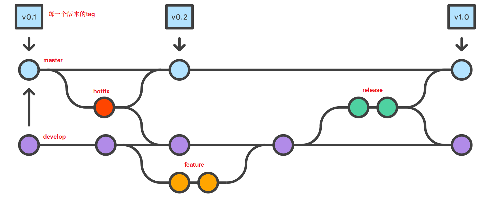
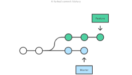
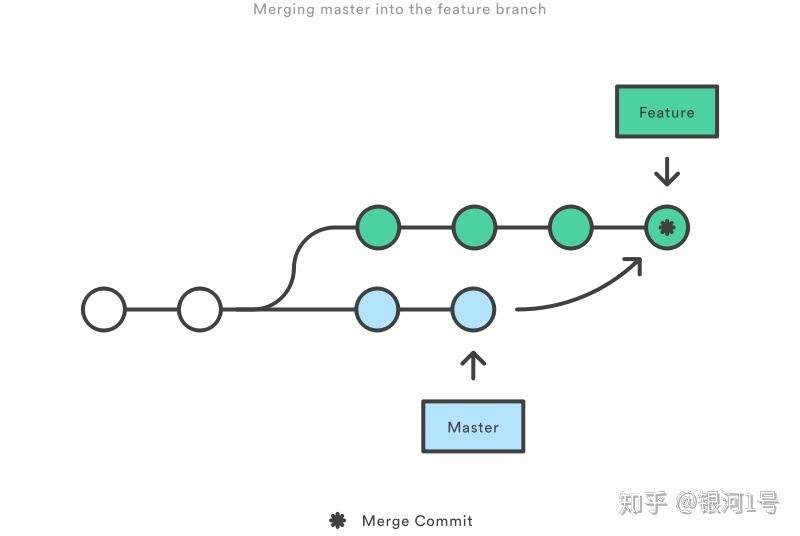
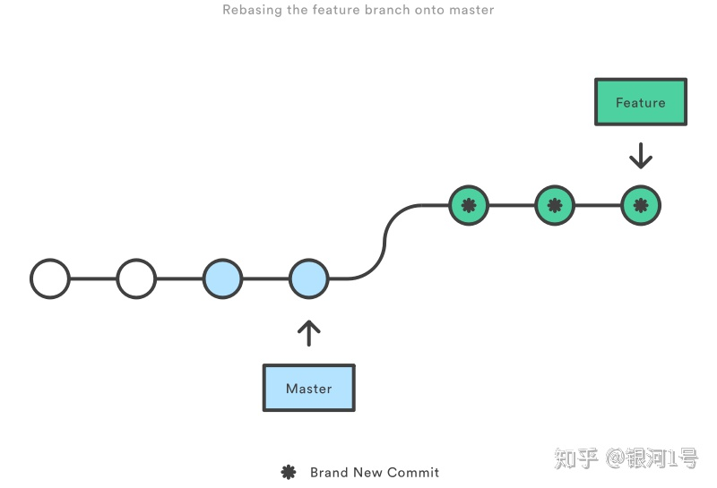
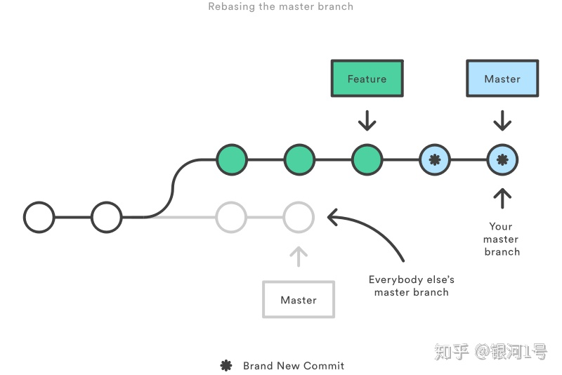
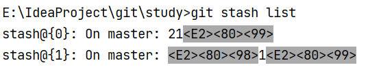
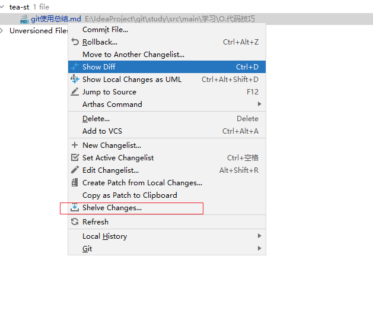
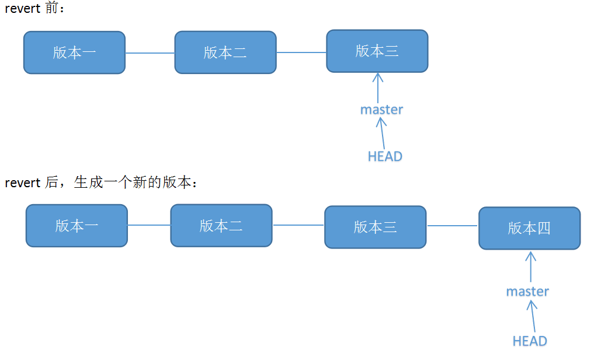

# Table of Contents

* [学习网站](#学习网站)
* [传统的GitFlow工作流程](#传统的gitflow工作流程)
* [下载大文件](#下载大文件)
* [git merge 和Rebase的区别](#git-merge-和rebase的区别)
  * [merge](#merge)
  * [rebase](#rebase)
  * [rebase的黄金法则](#rebase的黄金法则)
* [git rm —cached的作用](#git-rm-cached的作用)
* [git push --force origin](#git-push---force-origin)
* [合并多个commit的提交记录](#合并多个commit的提交记录)
* [git修改历史提交(commit)信息](#git修改历史提交commit信息)
* [取消多个 commit 中的部分提交](#取消多个-commit-中的部分提交)
* [取消commit的提交(未push远程)](#取消commit的提交未push远程)
* [合并某些特定的 commit 提交(摘樱桃)](#合并某些特定的-commit-提交摘樱桃)
* [暂存本地修改文件，切换分支](#暂存本地修改文件切换分支)
  * [idea操作](#idea操作)
* [git回滚到之前的版本](#git回滚到之前的版本)


# 学习网站
[https://learngitbranching.js.org](https://learngitbranching.js.org)

# 传统的GitFlow工作流程

- **master** 该分支上的代码随时可以部署到生产环境
- **develop** 作为每日构建的集成分支，到达稳定状态时可以发布并merge回master
- **Feature branches** 每个新特性都在独立的feature branch上进行开发，并在开发结束后merge回develop
- **Release branches** 为每次发布准备的release candidate，在这个分支上只进行bug fix，并在完成后merge回master和develop
- **Hotfix branches** 用于快速修复，在修复完成后merge回master和develop




# 下载大文件

1.

```
git config --global core.compression 0
```

2.

```
git clone --depth 1 <repo_URI>
```

3.

```
git fetch --unshallow 
```

4.

```
git fetch --depth=2147483647
```

5.

```
git pull --all
```

按照步骤操作即可，本人亲测可以。


实际操作第二步就解决问题了。


# git merge 和Rebase的区别


[原文链接](https://zhuanlan.zhihu.com/p/57872388)

我们来说说当master新提交与你正在开发的功能相关。要将新提交合并到你的feature分支中，你有两个选择：merge或rebase。




## merge

  最简单的是将master分支合并到feature分支中：
  `git checkout feature`
  `git merge master`
  或者，你可以简化为一行：
  `git merge master feature`
  这会在feature分支中创建一个新的“merge commit”，它将两个分支的历史联系在一起，为你生成如下所示的分支结构：

  !

合并很好，因为它是一种非破坏性的操作。现有分支结构不会以任何方式更改。这避免了rebase的所有潜在缺陷（下面讨论）。
另一方面，这也意味着每次上游更改时feature都需要合并，且有无关的合并提交。如果master改动非常频繁，这可能会严重污染你分支的历史记录。尽管可以使用高级git log选项减轻此问题的影响，但它可能使其他开发人员难以理解项目的历史更改记录。

## rebase

  

作为merge的替代方法，你可以使用以下命令将feature分支rebase到master分支上：
`git checkout feature`
`git rebase master`
这会将整个feature分支移动到master分支的顶端，从而有效地整合了所有master的新提交。但是，rebase不是使用merge commit，**而是通过为原始分支中的每个提交创建全新的提交来重写项目历史记录。**




rebase的主要好处是可以获得更清晰的项目历史记录。首先，它消除了不必要的git merge产生的merge commit。其次，正如在上图中所看到的，rebase也会产生完美线性的项目历史记录 - 你可以从feature分支顶端一直跟随到项目的开始而没有任何的分叉。这使得它比命令git log，git bisect和gitk更容易导航项目。
但是，对这个原始的提交历史记录有两个权衡：安全性和可追溯性。

**注意：**

+ **如果你不遵循rebase的黄金法则，重写项目历史记录可能会对你的协作工作流程造成灾难性后果。**

+ **其次rebase会丢失merge commit提供的上下文 - 你无法看到上游更改何时合并到功能中。**


## rebase的黄金法则

git rebase的黄金法则是永远不要在公共分支使用它。

想想如果你把master分支rebase到你的feature分支会发生什么：



rebase将master所有提交移动到feature顶端。问题是这只发生在你的仓库中。所有其他开发人员仍在使用原始版本master。由于rebase导致全新的提交，Git会认为你的master分支的历史与其他人的历史不同。


# git rm —cached的作用


# git push --force origin

当你分支需要回退到某个提交点的时候，使用 git reset --hard  commitid

需要push到origin  ： git push --force origin


# 合并多个commit的提交记录

1. 查看 log 记录，使用`git rebase -i`选择要合并的 commit
2. 编辑要合并的版本信息，保存提交，多条合并会出现多次（可能会出现冲突）
3. 修改注释信息后，保存提交，多条合并会出现多次
4. 推送远程仓库或合并到主干分支


# git修改历史提交(commit)信息

使用命令：git commit --amend,进入命令模式，这是按 a或者i或者o进入编辑模式，我们修改好commit信息后按Esc健退出编辑模式，然后:wq保存我们编辑的信息。
最后git push到远程仓库


# 取消多个 commit 中的部分提交

我们开发了一个功能，而在上线的时候，产品经理说这个功能的部分特性已经不需要了，即相关特性的提交记录和内容就可以忽略/删除掉了。

```jav
$ git revert 3zj5sldl
```

Git reset和git revert的区别

- git reset 是回滚到对应的commit-id，相当于是删除了commit-id以后的所有的提交，并且不会产生新的commit-id记录，如果要推送到远程服务器的话，需要强制推送-f
- git revert 是反做撤销其中的commit-id，然后重新生成一个commit-id。本身不会对其他的提交commit-id产生影响，如果要推送到远程服务器的话，就是普通的操作git push就好了


# 取消commit的提交(未push远程)

+ 软撤销 --soft
本地代码不会变化，只是 git 转改会恢复为 commit 之前的状态

不删除工作空间改动代码，撤销 commit，不撤销 git add .
```java
git reset --soft HEAD~1
```
1表示撤销最后一次的 commit ，1 可以换成其他更早的数字

+ 硬撤销
本地代码会直接变更为指定的提交版本，慎用

删除工作空间改动代码，撤销 commit，撤销 git add .

注意完成这个操作后，就恢复到了上一次的commit状态。

```java
git reset --hard HEAD~1
```

# 合并某些特定的 commit 提交(摘樱桃)

```java
## 摘樱桃
$ git cherry-pick -x z562e23d
```


# 暂存本地修改文件，切换分支

```nginx
## 存储当前的修改但不用提交commit
$ git stash

## 标识储藏记录
$ git stash save '这是测试'

## 保存当前状态包括untracked的文件
$ git stash -u

## 展示所有stashes信息
$ git stash list

## 回到最后一个stash的状态并删除这个stash信息
$ git stash pop

# 取出指定index的储藏的修改到工作区中
git stash apply stash@{index} 
# 将指定index的储藏从储藏记录列表中删除
git stash drop stash@{index}
```





## idea操作




# git回滚到之前的版本

+ git reset
  1. get reset --hard 版本号
  2. git push -f （强制推送）

+ git revert

  git revert是用于“反做”某一个版本，以达到撤销该版本的修改的目的。比如，我们[commit](https://so.csdn.net/so/search?q=commit&spm=1001.2101.3001.7020)了三个版本（版本一、版本二、 版本三），突然发现版本二不行（如：有bug），想要撤销版本二，但又不想影响撤销版本三的提交，就可以用 git revert 命令来反做版本二，生成新的版本四，这个版本四里会保留版本三的东西，但撤销了版本二的东西。如下图所示：


  


1. git revert -n 8b89621019c9adc6fc4d242cd41daeb13aeb9861    即版本2
2. git commit -m "revert add text.txt"    即 版本4
